<h2 align="center">University of Michigan Advanced Styling with Responsive Design</h2>
<br/>
<!--~~~~~~~~~~~~~~~~~~~~~~~~~~~~~~~~~~~~~~~~~~~~~~~~~~~~~~~~~~~~~~~~~~~~~~~~~~~~~~~~~~~~~~~~~~~~-->
<!--~~~~~~~~~~~~~~~~~~~~~~~~~~~~~~ readme.md of UofM-AdvStyling ~~~~~~~~~~~~~~~~~~~~~~~~~~~~~~~~-->
<!--~~~~~~~~~~~~~~~~~~~~~~~~~~~~~~~~~~~~~~~~~~~~~~~~~~~~~~~~~~~~~~~~~~~~~~~~~~~~~~~~~~~~~~~~~~~~-->
<!--~~~~~~~~~~~~~~~~~~~~~~~~~~ 01. intro to responsive design (01) ~~~~~~~~~~~~~~~~~~~~~~~~~~~~~-->
<!--~~~~~~~~~~~~~~~~~~~~~~~~~~~~~~~~~~~~~~~~~~~~~~~~~~~~~~~~~~~~~~~~~~~~~~~~~~~~~~~~~~~~~~~~~~~~-->
<p align="center">

</p>
<p align="center">

</p>

<h3 align="center">U of Michigan - Advanced Styling with Responsive Design</h3>

<h2><a href="#table-of-contents">Table of Contents</a></h2>

<ol type="I">
  <li><a href="#chb">Course Introduction and Practical Information</a></li>
  <li><a style="margin-left: 2rem;" href="#cha-1" Sub-Heading">Course syllabus</a></li>
  <li><a style="margin-left: 2rem;" href="#cha-2" Sub-Heading">Getting around the course</a></li>
  <li><a style="margin-left: 2rem;" href="#cha-3" Sub-Heading">Course tools</a></li>
</ol>

## [**Module 1: Style with Responsive Design**](#ch1)
>### 1.1 [**Introduction to Responsive Design**](#ch1-1)
>### 1.2 [**What is Responsive Design**](#ch1-2)
>### 1.3 [**Testing Existing Sites**](#ch1-3)
>### 1.4 [**Benefits of Responsive Desgin**](#ch1-4)
>### 1.5 [**Fluid Measurements**](#ch1-5)
>### 1.6 [**Code with Me: Fluid Measurements**](#ch1-6)

## [**Module 2: Basic Concepts**](#ch2)
>### 2.1 [**Media Queries**](#ch2-1)
>### 2.2 [**Code with Me: Fluid Measurements &amp; Media Queries**](#ch2-2)
>### 2.3 [**Wire Frames**](#ch2-3)
>### 2.4 [**Breakpoints**](#ch2-4)
>### 2.5 [**Media Queries - Part II**](#ch2-5)
>### 2.6 [**Code with Me: Responsive Navigation**](#ch2-6)

## [**Module 3: Using Existing Frameworks**](#ch3)
>### 3.1 [**Frameworks**](#ch3-1-1)
>### 3.2 [**Introduction to Twitter Bootstrap 3**](#ch3-2-1)
>### 3.3 [**Bootstrap Breakpoints**](#ch3-3-1)
>### 3.4 [**Bootstrap Grid System**](#ch3-4-1)
>### 3.5 [**Code with Me: Grid Example**](#ch3-5-1)
>### 3.6 [**Bootstrap Navigation**](#ch3-6-1)

## [**Module 4: Experiment**](#ch4)
>### 4.1 [**Responsive Images**](#ch4-1-1)
>### 4.2 [**Bootstrap Tables**](#ch4-2-1)
>### 4.3 [**Code with Me: Advanced Navigation**](#ch4-3-1)
>### 4.4 [**What are Templates?**](#ch4-4-1)
>### 4.5 [**Optional Interview: M W**](#ch4-5-1)
>### 4.6 [**Optional Interview: H W**](#ch4-6-1)
>### 4.7 [**Optional Interview: H N**](#ch4-7-1)
>### 4.8 [**Bootstrap 4**](#ch4-8-1)
>### 4.9 [**Conclusion**](#ch4-9-1)

<div align="right">
  <b><a href="#table-of-contents">↥ Back To Top</a></b>
</div>

This Specialization covers how to write syntactically correct HTML5 and
CSS3, and how to create interactive web experiences with JavaScript.
Mastering this range of technologies will allow you to develop high
quality web sites which work seamlessly on mobile, tablet, and large
screen browsers accessible.

During the capstone you will develop a professional-quality web
portfolio demonstrating your growth as a web developer and your
knowledge of accessible web design. This will include your ability to
design and implement a responsive site that utilizes tools to create a
site that is accessible to a wide audience, including those with visual,
audial, physical, and cognitive impairments.

<h2 id="cha-1">Syllabus</h2>

Welcome to Advanced Styling with Responsive Design, taught by Colleen
van Lent!

This course is an introduction to the theory and practice of creating
responsive websites.

What is a responsive site? The easiest answer may be to describe sites
that aren\'t responsive. Have you ever visited a site on your phone and
the content just seems crammed in? You maybe get the idea that the site
was designed for a large screen and simply shrunk down for the phone. Or
even worse, it wasn\'t shrunk at all and you have to do a lot of
side-to-side scrolling? Or maybe you have been on a website on your
tablet, but a bunch of key components are locked and you are forced to
go back when you have access to a laptop or desktop?

The following are examples of sites that do not use responsive design;

This course is meant for people who are comfortable using HTML and CSS,
but want to take the first steps to creating a single site that can
display a different layout (or \"look\") on different platforms.

There are three common approaches to responsive design.

1.  The first is to create your own site using fluid measurements and
    media queries.

2.  The second is to use an existing framework (such as Bootstrap) that
    does all of the responsive design for you.

3.  The third is to use a hybrid approach - use a framework in
    combination with your own responsive code.

Throughout the entire course there will be an emphasis on the importance
of good habits and examples of potential pitfalls. All of the example
code is provided to you as a starting place. For some learners, this
will be sufficient to get a decent base on how responsive design works.
For other learners however, there is nothing better than when they
decide they can write better versions of the code.

# Resources

## Course Site

All of the reading material you will need to pass this course is
contained within Coursera.

Additional resources may be added as optional material, but everything
will be online and free.

## CodePEN

For the coding content you may want to access my CodePEN account.
CodePEN is a website that allows you to modify copies of my code. In
real time you can see how your changes affect the website we are working
on. The one issue that some students have with CodePEN is that it
doesn\'t require you to link your files together. So, if you want to
write the code right on your machine, you will need to know how to link
the code. Don\'t worry, I do cover that in class.

Here is a link to a collection of code for each week of the course:

Week One: <http://codepen.io/collection/nmyRWM/>

Week Two: <http://codepen.io/collection/nYwVkZ/>

Week Three: <http://codepen.io/collection/DZQyBr/>

Week Four: <http://codepen.io/collection/XkkwBb/>

When you watch the videos, you can check the resources section to find a
link to any code that is used in the lectures.

On each video page, just below the video, there is a Downloads section
on the right-hand side of the screen. This contains links to mp3
downloads of videos, transcripts and any CodePEN files referenced in
that particular video. Oftentimes you will see two files, a \"starter\"
file and a \"complete\" file. This way you can start at the same place
as me, but still have access to the final product.

## Discussion Boards

The best way to get help is to utilize the discussion boards. I know
that this may be new to many of you so let me explain how the discussion
boards work. We always have one friendly \"where are you from?
/introduce\" yourself board where people tend to be social. Other than
that, we encourage people to use the discussion section that goes with
the week you are on. Notice that I said \"use\" not \"post.\" We really
want to encourage you to read before you post. You will often find your
question already there. If you don\'t find your question, make sure to
post. There are no \"stupid\" questions. Ever. (Sometimes you may just
have found a mistake on my part that I will need to fix.)

## Course Slides

The slides for all of the lectures are now posted. You can find a BIG
zip file at <http://intro-webdesign.com/ResponsiveDesignSlides.zip> that
has a pdf and powerpoint copy of all of the slides.

I have also attached the pdf and powerpoint slide for each lecture
directly in the videos themselves. Just look in the Downloads section to
view them.
<!--~~~~~~~~~~~~~~~~~~~~~~~~~~~~~~~~~~~~~~~~~~~~~~~~~~~~~~~~~~~~~~~~~~~~~~~~~~~~~~~~~~~~~~~~~~~~-->
<!--~~~~~~~~~~~~~~~~~~~~~~~~~ 04. media queries and media screen (7) ~~~~~~~~~~~~~~~~~~~~~~~~~~~-->
<!--~~~~~~~~~~~~~~~~~~~~~~~~~~~~~~~~~~~~~~~~~~~~~~~~~~~~~~~~~~~~~~~~~~~~~~~~~~~~~~~~~~~~~~~~~~~~-->
<p align="center">

</p>

## There are 4 modules in this course

It used to be the case that everyone viewed webpages on about the same
size screen. But with the explosion of the use of smartphones to access
the Internet, the landscape of design has completely changed. People
viewing your site will now expect that it will perform regardless of the
platform (smartphone, tablet, laptop, or desktop computer). This ability
to respond to any platform is called responsive design.

This course will expand upon the basic knowledge of CSS3 to include
topics such as wireframes, fluid design, media queries, and the use of
existing styling paradigms such as Bootstrap.

After the course, learners will be able to:

-   \*\* Explain the mobile-first paradigm and the importance of
    wireframes in the design phase

-   \*\* Create sites that behave across a range of platforms

-   \*\* Utilize existing design frameworks such as Bootstrap.

This is the fourth course in the Web Design For Everybody
specialization. A basic understanding of HTML and CSS is expected when
you enroll in this class. Additional courses focus on adding
interactivity with the JavaScript Programming Language and completing a
capstone project.

### Week One: Style with Responsive Design

### Module 1 details

What does it mean to have responsive design for your site? How can you
tell if your existing site is responsive? This week we will begin with
the theories behind the \"mobile-first paradigm\" - the idea that your
mobile site should provide everything needed, not a pared-down version
of a good page. We end the week by taking the first concrete step of
using fluid measurements in your CSS.

### What\'s included:

### Week 1 videos;

1.  Introduction to Responsive Design

2.  What is Responsive Design?

3.  Testing Existing Sites

4.  Benefits of Responsive Design

5.  Fluid Measurements

6.  Code With Me: Fluid Measurements

### 9 readings

1.  Syllabus

2.  Resources

3.  Frequently Asked Questions (FAQ)

4.  Help us learn more about you!

5.  Fluid Measurements background readings

6.  Notice for Auditing Learners: Assignment Submission

7.  Pixel to Em conversion tool

8.  Dynamically change the size of font with sliders

9.  Optional: CSS definitions of relative and absolute

##### 1 quiz

-   Basic Concepts in Responsive Design approaches

### 

### Week Two: Basic Concepts

### Module 2 details:

This week you will get a chance to put the theories into practice using
media queries in your CSS. These queries can automatically detect the
size of the browser being used to view the page so that you can decide
what type of look you want to achieve. There will also be a discussion
on common practices for designing your different views at various screen
sizes (\"viewports\").

### What\'s included

### Week 2 videos;

1.  Media Queries

2.  Code With Me: Fluid Measurements and Media Queries

3.  Wire Frames

4.  Breakpoints

5.  Media Queries Part Two

6.  Code With Me: Responsive Navigation

### 1 reading

1.  Good examples of responsive design

### 2 quizzes

-   Week Two Review: Media Queries and breakpoints

-   Practice Quiz \-- Challenge Problem•30 minutes

### 

### 

### Week Three: Use Existing Frameworks

### Module 3 details:

After every good programmer has put in time creating sites from scratch,
it is common to utilize existing tools out there. After all, why
recreate the wheel? The work you have done up to this point will give
you the knowledge needed to craft your own unique sites from these
frameworks. This week we will work with Bootstrap, a framework that uses
HTML5, CSS, and JavaScript (but don\'t worry if you have never used
JavaScript yourself).

### What\'s included

### Week 3 videos;

1.  Frameworks

2.  Introduction to Twitter Bootstrap 3

3.  Bootstrap Breakpoints

4.  Getting Started with Twitter Bootstrap

5.  Bootstrap Grid System

6.  Code With Me: Grid Example

7.  Bootstrap Navigation

### 1 reading •Total 

1.  Demystifying Bootstrap

### 2 quizzes •Total

-   Week Three Review: Bootstrap

-   Grid System Check

### 

### 

### Week Four: Experiment!

### Module 4 details:

This week is dedicated to solving those little issues that pop up when
you move from theory to practice. We look at more advanced framework
options and also hear from people who are using the techniques covered
in this course.

### What\'s included

### Week 4 videos;

1.  Responsive Images

2.  Bootstrap Tables

3.  Code With Me: Advanced Navigation

4.  What Are Templates?

5.  Optional Interview: M W

6.  Optional Interview: H W

7.  Optional: Interview with H N

8.  Bootstrap 4

9.  Conclusion

### 5 readings

1.  The Evolution of the Airbnb front-end development

2.  Debugging your style

3.  More resources for learning to debug/develop

4.  Post-course Survey

5.  Keep Learning with Michigan Online

### 1 quiz

-   Responsive Design Final Assessment

#### End of Syllabus

<h1 id="ch1-1">01. Introduction to Responsive Design</h1>

<!--~~~~~~~~~~~~~~~~~~~~~~~~~~~~~~~~~~~~~~~~~~~~~~~~~~~~~~~~~~~~~~~~~~~~~~~~~~~~~~~~~~~~~~~~~~~~-->
<!--~~~~~~~~~~~~~~~~~~~~~~~~ 05. the basics of responsive design (11) ~~~~~~~~~~~~~~~~~~~~~~~~~~-->
<!--~~~~~~~~~~~~~~~~~~~~~~~~~~~~~~~~~~~~~~~~~~~~~~~~~~~~~~~~~~~~~~~~~~~~~~~~~~~~~~~~~~~~~~~~~~~~-->
<p align="center">

</p>

<p>Welcome to introduction to responsive design. In this course, we&apos;re going to talk
about different ways to make your website look the best it can possibly look. 
Regardless if someone&apos;s viewing it on a phone, a laptop or a tablet.</p>
<p>We&apos;re really going to cover the basics in this course and help you develop 
a general understanding of what responsive design is and why you need to know it. 
We&apos;re going to talk about ways that you can customize your own site without 
using any special software to give it a really special look and feel.</p>

<p>However, we also want to talk about using <b><i>frameworks</i></b>.

<p>Because if other people are using software or different code to make
their site look great, why not take advantage of it and learn how to use
it yourself.</p>

<!--~~~~~~~~~~~~~~~~~~~~~~~~~~~~~~~~~~~~~~~~~~~~~~~~~~~~~~~~~~~~~~~~~~~~~~~~~~~~~~~~~~~~~~~~~~~~-->
<!--~~~~~~~~~~~~~~~~~~~~~~~ 06. what does responsive design mean? (0x) ~~~~~~~~~~~~~~~~~~~~~~~~~-->
<!--~~~~~~~~~~~~~~~~~~~~~~~~~~~~~~~~~~~~~~~~~~~~~~~~~~~~~~~~~~~~~~~~~~~~~~~~~~~~~~~~~~~~~~~~~~~~-->
<p align="center">

</p>

<!--  -->
<!-- {width="4.0in" height="2.0931627296587925in"} -->

In week **one**, we\'re really going to focus on the theory.

The idea of what is responsive design.

What do people mean when they use that term?

Those of us in technology are pretty guilty of throwing out terms and
using them even when we don\'t really know what they mean.

We\'re going to talk about what makes for good responsive design.

If you don\'t know what to aim for, it\'s really hard to know how to get
started.

Finally, we\'re going to end the week talking about something very
concrete and that\'s the role of what we call fluid measurements; these
different type of measurements that can change as the screen size
changes.

<!--~~~~~~~~~~~~~~~~~~~~~~~~~~~~~~~~~~~~~~~~~~~~~~~~~~~~~~~~~~~~~~~~~~~~~~~~~~~~~~~~~~~~~~~~~~~~-->
<!--~~~~~~~~~~~~~~~~~~~~~~~~ 07. week 2 - media queries (xx) ~~~~~~~~~~~~~~~~~~~~~~~~~~-->
<!--~~~~~~~~~~~~~~~~~~~~~~~~~~~~~~~~~~~~~~~~~~~~~~~~~~~~~~~~~~~~~~~~~~~~~~~~~~~~~~~~~~~~~~~~~~~~-->

<!-- {width="4.0in" height="2.0931627296587925in"} -->

In week **two** we\'re going to tackle media queries.

And this is the first time you\'re really going to get your hands really
dirty with some code, and get things to work.

We\'re going to talk about what they are.

And how do you plan, before you even start to code, for the best
practice?

It doesn\'t really do you any good to sit down and code without having a
plan.

In week two, we\'re going to talk about break points, how you can decide
what different screen sizes are the ones you really want to focus on.

And finally, I am going to do an example where you and I are going to
code together to make a navigation bar.

By the end of week two, you\'re going to be ready and feel like you can
really tackle this.

<!--~~~~~~~~~~~~~~~~~~~~~~~~~~~~~~~~~~~~~~~~~~~~~~~~~~~~~~~~~~~~~~~~~~~~~~~~~~~~~~~~~~~~~~~~~~~~-->
<!--~~~~~~~~~~~~~~~~~ 08. week 3 - frameworks - benefits &amp; pitfalls (xx) ~~~~~~~~~~~~~~~~~~~-->
<!--~~~~~~~~~~~~~~~~~~~~~~~~~~~~~~~~~~~~~~~~~~~~~~~~~~~~~~~~~~~~~~~~~~~~~~~~~~~~~~~~~~~~~~~~~~~~-->

<!-- {width="4.0in" height="2.0931627296587925in"} -->

In week **three**, we\'re going to shift a little bit and instead of
writing our own code.

We\'re going to start using different frameworks.

In particular, we\'re going to talk about the different benefits and
pitfalls of using other people\'s code.

Sometimes, it\'s really easy and really great to be able to use these
different software options.

But sometimes it comes at the cost of good practice and accessibility.

In particular we\'re going to talk about the Bootstrap 3 framework.

I\'ve picked this one because it\'s one of the most popular frameworks
out there.

Now for those of you who may be familiar with responsive design you\'ll
know that a Bootstrap 4 is coming out soon.

But that\'s okay. I\'m going to focus on those elements of Bootstrap 3
that you\'re going to be able to use over and over again.

The simple things such as getting started, the grid system, and also,
also again, a navigation bar.

Because these are the keys to really getting your site to have that
responsive feel.

<!--~~~~~~~~~~~~~~~~~~~~~~~~~~~~~~~~~~~~~~~~~~~~~~~~~~~~~~~~~~~~~~~~~~~~~~~~~~~~~~~~~~~~~~~~~~~~-->
<!--~~~~~~~~ 09. week 4 - more bootstrap - images, tables, adv nav - case studies (xx) ~~~~~~~~~-->
<!--~~~~~~~~~~~~~~~~~~~~~~~~~~~~~~~~~~~~~~~~~~~~~~~~~~~~~~~~~~~~~~~~~~~~~~~~~~~~~~~~~~~~~~~~~~~~-->

<!-- {width="4.0in" height="2.110255905511811in"} -->

Finally, in week **four**, we\'re going to continue with more bootstrap,
but we\'re going to talk about things such as images, tables, and maybe
some advanced navigation techniques.

These are things that are cool and kind of fun, but I don\'t really
think are core to understanding what responsive design is.

So, we leave them at the end to make them something more we can play
around with. We\'re also, I\'m hoping to get to some case studies.
We\'re going to talk to people about how they approached designing the
responsiveness their real-life sites.

<!--~~~~~~~~~~~~~~~~~~~~~~~~~~~~~~~~~~~~~~~~~~~~~~~~~~~~~~~~~~~~~~~~~~~~~~~~~~~~~~~~~~~~~~~~~~~~-->
<!--~~~~~~~~~~~~~~~~~~~~ 10. final project - create a responsive page (xx) ~~~~~~~~~~~~~~~~~~~~~-->
<!--~~~~~~~~~~~~~~~~~~~~~~~~~~~~~~~~~~~~~~~~~~~~~~~~~~~~~~~~~~~~~~~~~~~~~~~~~~~~~~~~~~~~~~~~~~~~-->

<!-- {width="4.0in" height="2.110255905511811in"} -->

We will do this with the culmination of a final project.

When you\'re done with this course, you are going to have one or more
pages that you have written yourself.

With the help of a framework that can respond to different screen sizes.

So, who is this class designed for? It\'s really someone who\'s new to
responsive design. Someone who\'d like to get started and possibly carry
on these ideas once their done with the course.

You will need a general knowledge of HTML and CSS in order to get the
most out of this course. If you don\'t understand those two concepts, I
recommend you go back and get a grasp of them and then come back to us
in the responsive class. Again, as with any coding class at all. This is
a class with people with persistence. You\'re going to run into
problems.

This isn\'t a course where you\'re going to read something, take a quiz
and you\'re done. Instead, we\'re going to be coding, probably failing a
little bit, coding, failing some more, then and then hopefully success.

So, who am I? Well, if you\'re new to one of my courses, I have a PHD in
computer science. I\'ve been teaching for about two decades, sticking
mostly with introductory programming, web design, and artificial
intelligence. What I really love to do is help students debug. Help them
to get those general basic ideas down so they can go off and really
master some of the more advanced concepts.

And I understand that it\'s not always about conveying content. It\'s
about helping you recognize those places where you might run into
trouble. If I can let you know early, it might help you get up over some
of those humps.

So, in this course, we\'re going to have a pretty consistent workload.
Every week, you\'ll have multiple videos to watch. Some of them will be
kind of traditional lecture format. However, there will be other which I
tend to call, "Code with Me". These are lectures where I really hope
you\'ll sit down and type along with me and make sure you can replicate
what I\'m doing.

There will be a few weekly readings but there\'ll always be online
articles. I like to find things that are very pertinent to what\'s going
on in web design right now.

So how do you succeed in this class?

<!--~~~~~~~~~~~~~~~~~~~~~~~~~~~~~~~~~~~~~~~~~~~~~~~~~~~~~~~~~~~~~~~~~~~~~~~~~~~~~~~~~~~~~~~~~~~~-->
<!--~~~~~~~~~~~~~~~~~ 11. succeeding in this class - use message boards (xx) ~~~~~~~~~~~~~~~~~~~-->
<!--~~~~~~~~~~~~~~~~~~~~~~~~~~~~~~~~~~~~~~~~~~~~~~~~~~~~~~~~~~~~~~~~~~~~~~~~~~~~~~~~~~~~~~~~~~~~-->

<!-- {width="4.0in" height="2.110255905511811in"} -->

I will always say that the best way to code is with a friend but that\'s
not always possible, so I hope that you\'ll use the message boards not
only to ask your questions but to answer the questions of others.

Never spend more than 20 minutes on something that doesn\'t work. I\'m
not kidding. I want you to just move on. When things are working it\'s
great, you can whip out a whole bunch of code. But when it\'s not it\'s
rarely the case that staring at it is going to make it any better.

Make sure that you feel comfortable looking things up on your own. This
is the internet; you can stick your question into a search engine and
you will probably find the answer.

You\'ll find three or four wrong answers, but eventually, the answer
will be there.

<!--~~~~~~~~~~~~~~~~~~~~~~~~~~~~~~~~~~~~~~~~~~~~~~~~~~~~~~~~~~~~~~~~~~~~~~~~~~~~~~~~~~~~~~~~~~~~-->
<!--~~~~~~~~~~~~~~~~~ 12.  -  (xx) ~~~~~~~~~~~~~~~~~~~-->
<!--~~~~~~~~~~~~~~~~~~~~~~~~~~~~~~~~~~~~~~~~~~~~~~~~~~~~~~~~~~~~~~~~~~~~~~~~~~~~~~~~~~~~~~~~~~~~-->
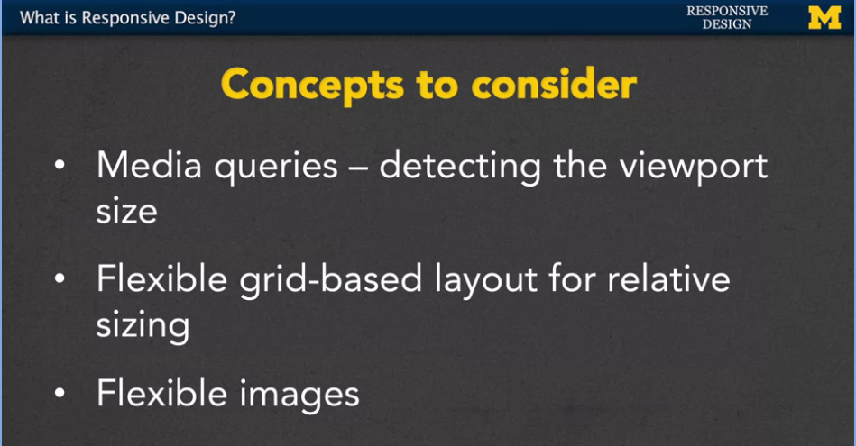
<!-- {width="4.0in" height="2.086324365704287in"} -->

Finally, make sure that you practice, practice, practice. The only way
to really learn how to code is to make sure you\'re getting as much
experience as you can.

Welcome to introduction to responsive web design. I hope that you\'ll
learn a lot. Thanks.

# 02. What is Responsive Design?

Hi, everybody, so you\'re here and I\'m here, and we\'re here to talk
about responsive design.

But one of the first questions should be, what is responsive web design?

And what it is, is it\'s designing your web site with the idea that
people will be viewing it from multiple screen sizes and different
resolutions as well.

So, we want to make sure that our side is going to, what we call work,
under any platform, any browser size or any orientation.

And by orientation, I mean whether you turn your phone up or to the
side.

And same for the tablet.

The most important lesson is that you want to make sure that the user
has the power.

Don\'t dictate to them what they can and can\'t do.

Let me give you an example.

A lot of times when you\'re looking at a site on a smaller screen such
as your phone you get a lot less content.

And while it\'s true their smaller space it\'s not that there should be
less things you can do everything should just be laid out a little bit
more intelligently.

You have to remember that people are doing more and more things on their
phone that they\'ve never done before.

We often think now about watching videos, but we also have to think
about filling out applications, or coding.

There\'s going to be a lot of things that we don\'t even know yet that
exist, so we want to be as flexible as possible.

The most important thing is, never assume that the user won\'t need
access to specific functionality.

I think we\'ve all been there when we\'re looking at a website on a
smaller device and we just can\'t find the thing that we\'re looking
for.

Or even worse, there\'s these pictures or buttons or different things we
can\'t even move them out of the way with our fingers because the site
just won\'t work for us.

So here are some of the concepts that we\'re going to be considering
throughout this entire course.

<!--~~~~~~~~~~~~~~~~~~~~~~~~~~~~~~~~~~~~~~~~~~~~~~~~~~~~~~~~~~~~~~~~~~~~~~~~~~~~~~~~~~~~~~~~~~~~-->
<!--~~~~~~~~~~~~~~~~~ 12.  -  (xx) ~~~~~~~~~~~~~~~~~~~-->
<!--~~~~~~~~~~~~~~~~~~~~~~~~~~~~~~~~~~~~~~~~~~~~~~~~~~~~~~~~~~~~~~~~~~~~~~~~~~~~~~~~~~~~~~~~~~~~-->

<!-- {width="4.0in" height="2.086324365704287in"} -->

Three concepts that I want you to keep in the back of your mind.

And I\'m hoping at the end of this course you\'ll be able to say, yeah,
I think I\'ve got that, and the first one is called **media queries**,
and what media queries do is that they can detect the view port size and
other information about the device that the browser is on.

The next thing that we\'re going to want to talk about is this idea of
**flexible grid-based layout for relative sizing**.

And relative means, depending on how large the screen is, that\'s how
big your grid is going to be as well.

And, finally we want to think about **flexible images**.

All these things add up, so that when you go to the page, the user
doesn\'t need to waste their time scrolling back and forth or trying to
resize things to be able to see everything.

We want it to happen really automatically.

<!--~~~~~~~~~~~~~~~~~~~~~~~~~~~~~~~~~~~~~~~~~~~~~~~~~~~~~~~~~~~~~~~~~~~~~~~~~~~~~~~~~~~~~~~~~~~~-->
<!--~~~~~~~~~~~~~~~~~ 13.  -  (xx) ~~~~~~~~~~~~~~~~~~~-->
<!--~~~~~~~~~~~~~~~~~~~~~~~~~~~~~~~~~~~~~~~~~~~~~~~~~~~~~~~~~~~~~~~~~~~~~~~~~~~~~~~~~~~~~~~~~~~~-->
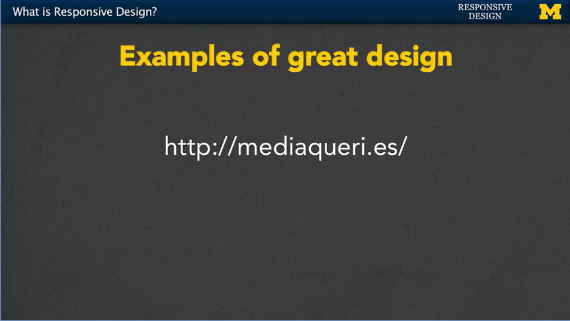
<!-- {width="3.0in" height="1.6903849518810148in"} -->

<!--~~~~~~~~~~~~~~~~~~~~~~~~~~~~~~~~~~~~~~~~~~~~~~~~~~~~~~~~~~~~~~~~~~~~~~~~~~~~~~~~~~~~~~~~~~~~-->
<!--~~~~~~~~~~~~~~~~~ 14.  -  (xx) ~~~~~~~~~~~~~~~~~~~-->
<!--~~~~~~~~~~~~~~~~~~~~~~~~~~~~~~~~~~~~~~~~~~~~~~~~~~~~~~~~~~~~~~~~~~~~~~~~~~~~~~~~~~~~~~~~~~~~-->

<!-- {width="6.5in" height="4.5993055555555555in"} -->

Let\'s take a look at some examples that have great responsive design.

The first place I\'m going to take you is a website called
***mediaqueri.es.***

<!--~~~~~~~~~~~~~~~~~~~~~~~~~~~~~~~~~~~~~~~~~~~~~~~~~~~~~~~~~~~~~~~~~~~~~~~~~~~~~~~~~~~~~~~~~~~~-->
<!--~~~~~~~~~~~~~~~~~ 15.  -  (xx) ~~~~~~~~~~~~~~~~~~~-->
<!--~~~~~~~~~~~~~~~~~~~~~~~~~~~~~~~~~~~~~~~~~~~~~~~~~~~~~~~~~~~~~~~~~~~~~~~~~~~~~~~~~~~~~~~~~~~~-->

<!-- {width="4.0in" height="2.2538462379702535in"} -->

This site has a really nice collection of different sites that it\'s
found that really kind of find that key to responsive design.

Let\'s go ahead and take a look at, I\'ll scroll down a few. How about
this one right here? CapRadio, go anyplace.

<!--~~~~~~~~~~~~~~~~~~~~~~~~~~~~~~~~~~~~~~~~~~~~~~~~~~~~~~~~~~~~~~~~~~~~~~~~~~~~~~~~~~~~~~~~~~~~-->
<!--~~~~~~~~~~~~~~~~~ 16.  -  (xx) ~~~~~~~~~~~~~~~~~~~-->
<!--~~~~~~~~~~~~~~~~~~~~~~~~~~~~~~~~~~~~~~~~~~~~~~~~~~~~~~~~~~~~~~~~~~~~~~~~~~~~~~~~~~~~~~~~~~~~-->
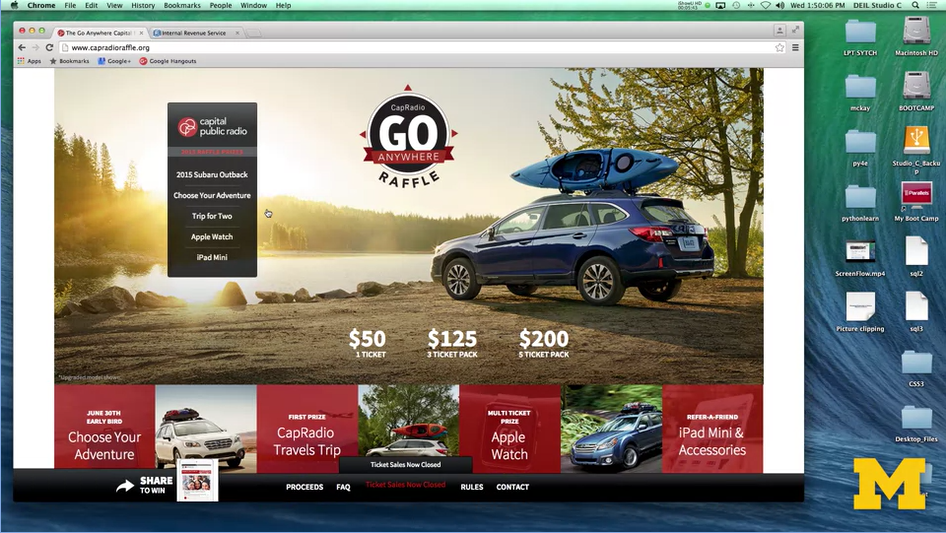
<!-- {width="4.0in" height="2.2538462379702535in"} -->

This site right now, when I\'m looking at the large screen, you can see
that there\'s a definite look to the layout.

<!--~~~~~~~~~~~~~~~~~~~~~~~~~~~~~~~~~~~~~~~~~~~~~~~~~~~~~~~~~~~~~~~~~~~~~~~~~~~~~~~~~~~~~~~~~~~~-->
<!--~~~~~~~~~~~~~~~~~ 17.  -  (xx) ~~~~~~~~~~~~~~~~~~~-->
<!--~~~~~~~~~~~~~~~~~~~~~~~~~~~~~~~~~~~~~~~~~~~~~~~~~~~~~~~~~~~~~~~~~~~~~~~~~~~~~~~~~~~~~~~~~~~~-->

<!-- {width="4.0in" height="2.2538462379702535in"} -->

As I resize the screen, as if I\'m looking perhaps on a tablet, and I
reload it you can see that things have moved over.

The navigation bar is now over to the left when it wasn\'t there before.

<!--~~~~~~~~~~~~~~~~~~~~~~~~~~~~~~~~~~~~~~~~~~~~~~~~~~~~~~~~~~~~~~~~~~~~~~~~~~~~~~~~~~~~~~~~~~~~-->
<!--~~~~~~~~~~~~~~~~~ 18.  -  (xx) ~~~~~~~~~~~~~~~~~~~-->
<!--~~~~~~~~~~~~~~~~~~~~~~~~~~~~~~~~~~~~~~~~~~~~~~~~~~~~~~~~~~~~~~~~~~~~~~~~~~~~~~~~~~~~~~~~~~~~-->
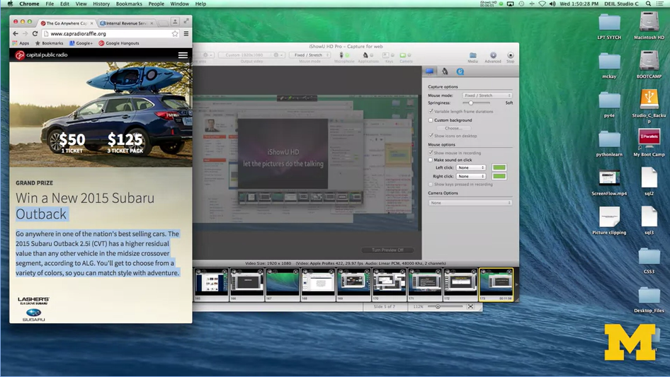
<!-- {width="4.0in" height="2.2538462379702535in"} -->

I\'m going to go ahead and make it smaller still. I don\'t even need to
refresh.

And now you might see something that looks much closer.

To that look and feel of something you would see on the phone. The
navigation bar has completely disappeared, and there\'s this little pop
up and down.

These different sites just don\'t make everything smaller, let me make
it bigger, they actually think about the best way to lay out the
content, so that you can still find everything that\'s there without
having to look too much.

Now, you can use that site to see examples of great responsive design,
but what if I also wanted to show you an example of kind of bad
responsible design.

Unfortunately, when you Google that out, or you look for that on your
search engine, nobody really wants to advertise the fact that they\'re
really bad at web design so I found one for you.

<!--~~~~~~~~~~~~~~~~~~~~~~~~~~~~~~~~~~~~~~~~~~~~~~~~~~~~~~~~~~~~~~~~~~~~~~~~~~~~~~~~~~~~~~~~~~~~-->
<!--~~~~~~~~~~~~~~~~~~~~~ 19. www.irs.gov - non-responsive website (22) ~~~~~~~~~~~~~~~~~~~~~~~~-->
<!--~~~~~~~~~~~~~~~~~~~~~~~~~~~~~~~~~~~~~~~~~~~~~~~~~~~~~~~~~~~~~~~~~~~~~~~~~~~~~~~~~~~~~~~~~~~~-->

<!-- {width="4.0in" height="2.2538462379702535in"} -->

It\'s the Internal Revenue Service.

And what we have here is a site that not only looks the same, but is
laid out the same no matter what type of screen you\'re looking at.

<!--~~~~~~~~~~~~~~~~~~~~~~~~~~~~~~~~~~~~~~~~~~~~~~~~~~~~~~~~~~~~~~~~~~~~~~~~~~~~~~~~~~~~~~~~~~~~-->
<!--~~~~~~~~~~~~~~~~~~~~~~~~~~ 20. irs website - non-responsive (22) ~~~~~~~~~~~~~~~~~~~~~~~~~~~-->
<!--~~~~~~~~~~~~~~~~~~~~~~~~~~~~~~~~~~~~~~~~~~~~~~~~~~~~~~~~~~~~~~~~~~~~~~~~~~~~~~~~~~~~~~~~~~~~-->
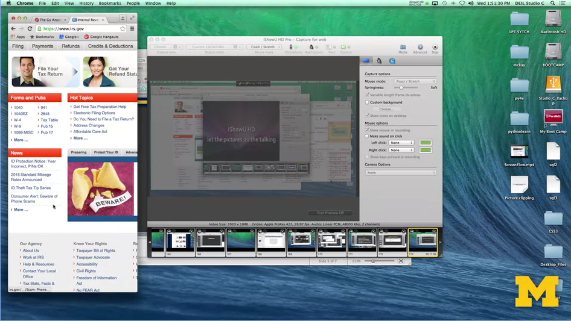
<!-- {width="4.0in" height="2.2538462379702535in"} -->

It looks okay right here, but when I make the screen much smaller, you
can see that it didn\'t really do anything.

Now I actually have to physically scroll back and forth to see things.

The navigation bar hasn\'t changed. You have the same size pictures.

This is just an example of really bad responsive design.

Let\'s work together over the next few weeks to make sure that you are
avoiding those same types of traps, and we\'re going to get started
coding right away.

# 03. Testing Existing Sites

Hi, everybody. One of the things that you\'re going to want to do is
test your site to see how it\'s doing across multiple devices and
multiple view ports.

But unless you happen to just be flux with money, you may not have
access to all these different types of platforms.

What can you do? Well, one option if you\'re using a desktop or a
laptop, that you can resize your window and refresh the site.

<!--~~~~~~~~~~~~~~~~~~~~~~~~~~~~~~~~~~~~~~~~~~~~~~~~~~~~~~~~~~~~~~~~~~~~~~~~~~~~~~~~~~~~~~~~~~~~-->
<!--~~~~~~~~~~~~~~~~ 21. intro-webdesign.com - introduction to web design (23) ~~~~~~~~~~~~~~~~~-->
<!--~~~~~~~~~~~~~~~~~~~~~~~~~~~~~~~~~~~~~~~~~~~~~~~~~~~~~~~~~~~~~~~~~~~~~~~~~~~~~~~~~~~~~~~~~~~~-->
<p align="center">

</p>

So, if I go here; <a href="https://intro-webdesign.com">Introduction to Web Design</a>, I can just use
the mouse and resize it, take a look and see how things are going to change.

<!--~~~~~~~~~~~~~~~~~~~~~~~~~~~~~~~~~~~~~~~~~~~~~~~~~~~~~~~~~~~~~~~~~~~~~~~~~~~~~~~~~~~~~~~~~~~~-->
<!--~~~~~~~~~~~~~~~~~~~~~~~~~~ 22. resizing intro-webdesign.com (24) ~~~~~~~~~~~~~~~~~~~~~~~~~~~-->
<!--~~~~~~~~~~~~~~~~~~~~~~~~~~~~~~~~~~~~~~~~~~~~~~~~~~~~~~~~~~~~~~~~~~~~~~~~~~~~~~~~~~~~~~~~~~~~-->
<p align="center">

</p>

Here, large view, tablet and mobile view. So, I can see that I have
three different break points that all work. That works great if you\'re
on a laptop or some sort of desktop, but what if you\'re on a mobile
device?

It isn\'t simple or even often possible to resize that window, so we
need to come up with another solution that will help you out.

<!--~~~~~~~~~~~~~~~~~~~~~~~~~~~~~~~~~~~~~~~~~~~~~~~~~~~~~~~~~~~~~~~~~~~~~~~~~~~~~~~~~~~~~~~~~~~~-->
<!--~~~~~~~~~~~~ 23.  http://ami.responsivedesign.is - check responsiveness (24) ~~~~~~~~~~~~~~~-->
<!--~~~~~~~~~~~~~~~~~~~~~~~~~~~~~~~~~~~~~~~~~~~~~~~~~~~~~~~~~~~~~~~~~~~~~~~~~~~~~~~~~~~~~~~~~~~~-->
<p align="center">

</p>

<p>What you can do is look for online tools to help you check for your responsiveness. 
One that you may want to look at is called; <a href="https://ui.dev/amiresponsive?url=https://ibm-web-dev.bauska.org">ami.responsivedesign.is</a>. 
I\'m going to go through and show you three different sites and how we can use this 
website to test the responsiveness of these webpages.</p>

<!--~~~~~~~~~~~~~~~~~~~~~~~~~~~~~~~~~~~~~~~~~~~~~~~~~~~~~~~~~~~~~~~~~~~~~~~~~~~~~~~~~~~~~~~~~~~~-->
<!--~~~~~~~~~~~~~~~~~ 24. theuniverse.is - sample responsive (25) ~~~~~~~~~~~~~~~~~~~-->
<!--~~~~~~~~~~~~~~~~~~~~~~~~~~~~~~~~~~~~~~~~~~~~~~~~~~~~~~~~~~~~~~~~~~~~~~~~~~~~~~~~~~~~~~~~~~~~-->
<p align="center">

</p>
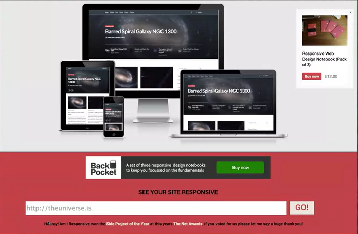
<!-- {width="4.0in" height="2.6149573490813647in"} -->

Here\'s a website that you can go to. Down at the bottom of the screen, you can fill 
in the URL of the site you want to look at.

<!--~~~~~~~~~~~~~~~~~~~~~~~~~~~~~~~~~~~~~~~~~~~~~~~~~~~~~~~~~~~~~~~~~~~~~~~~~~~~~~~~~~~~~~~~~~~~-->
<!--~~~~~~~~~~~~~~~~~ 25.  -  (25) ~~~~~~~~~~~~~~~~~~~-->
<!--~~~~~~~~~~~~~~~~~~~~~~~~~~~~~~~~~~~~~~~~~~~~~~~~~~~~~~~~~~~~~~~~~~~~~~~~~~~~~~~~~~~~~~~~~~~~-->
<p align="center">

</p>
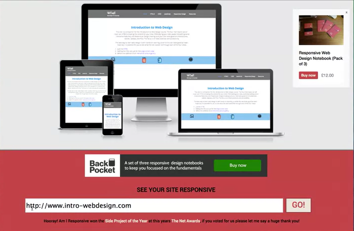
<!-- {width="5.0in" height="3.2686964129483815in"} -->

Just so you know, this is made with an HTML tag that makes it so that
you have to put in a URL. It\'s always going to be looking for at least
that www. So, let\'s go ahead and look at that Intro to Web Design
website again.

There we go. Now if you look up at the top of the screen you can see
that my website is now displayed on four different platforms. I have the
desktop, the laptop, a tablet view and a mobile view, and you can see
that each one is a little bit different depending upon the platform I\'m
using.

<!--~~~~~~~~~~~~~~~~~~~~~~~~~~~~~~~~~~~~~~~~~~~~~~~~~~~~~~~~~~~~~~~~~~~~~~~~~~~~~~~~~~~~~~~~~~~~-->
<!--~~~~~~~~~~~~~~~~~ 26. mlive.com - sample responsiveness (26) ~~~~~~~~~~~~~~~~~~~-->
<!--~~~~~~~~~~~~~~~~~~~~~~~~~~~~~~~~~~~~~~~~~~~~~~~~~~~~~~~~~~~~~~~~~~~~~~~~~~~~~~~~~~~~~~~~~~~~-->
<p align="center">

</p>

<!-- {width="5.0in" height="2.8173075240594927in"} -->

Let\'s check out another site.

<!--~~~~~~~~~~~~~~~~~~~~~~~~~~~~~~~~~~~~~~~~~~~~~~~~~~~~~~~~~~~~~~~~~~~~~~~~~~~~~~~~~~~~~~~~~~~~-->
<!--~~~~~~~~~~~~~~~~~ 27. collemc.people.si.umich.edu -  (26) ~~~~~~~~~~~~~~~~~~~-->
<!--~~~~~~~~~~~~~~~~~~~~~~~~~~~~~~~~~~~~~~~~~~~~~~~~~~~~~~~~~~~~~~~~~~~~~~~~~~~~~~~~~~~~~~~~~~~~-->
<p align="center">

</p>
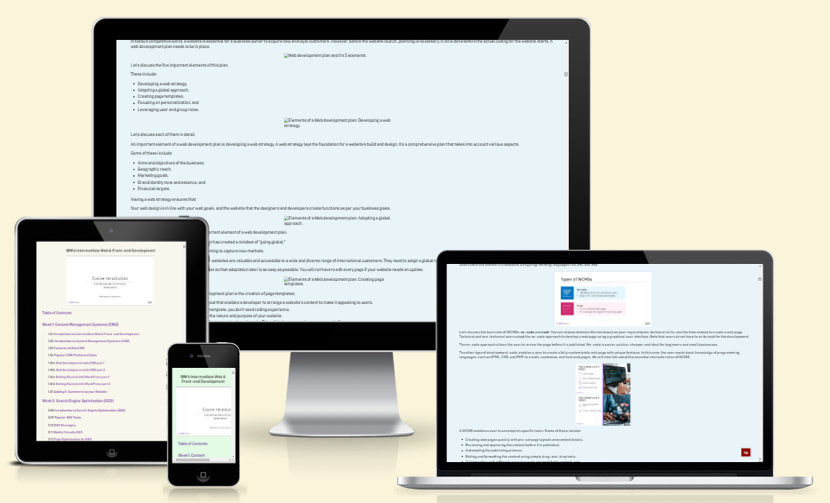
<!-- {width="5.0in" height="3.0299146981627296in"} -->

In this case, again we can see that this is a responsive setup. Now,
even though the pages may look very similar, you can see that on the
mobile view that weather map isn\'t there, that kind of brightly colored
map.

In addition, the laptop and desktop view are very similar. But you can
see that in the tablet view, we\'ve really broken it down and they use
more of a two-column grid system rather than having quite as much
content.

<!--~~~~~~~~~~~~~~~~~~~~~~~~~~~~~~~~~~~~~~~~~~~~~~~~~~~~~~~~~~~~~~~~~~~~~~~~~~~~~~~~~~~~~~~~~~~~-->
<!--~~~~~~~~~~~~~~~~~ 28.  -  (xx) ~~~~~~~~~~~~~~~~~~~-->
<!--~~~~~~~~~~~~~~~~~~~~~~~~~~~~~~~~~~~~~~~~~~~~~~~~~~~~~~~~~~~~~~~~~~~~~~~~~~~~~~~~~~~~~~~~~~~~-->
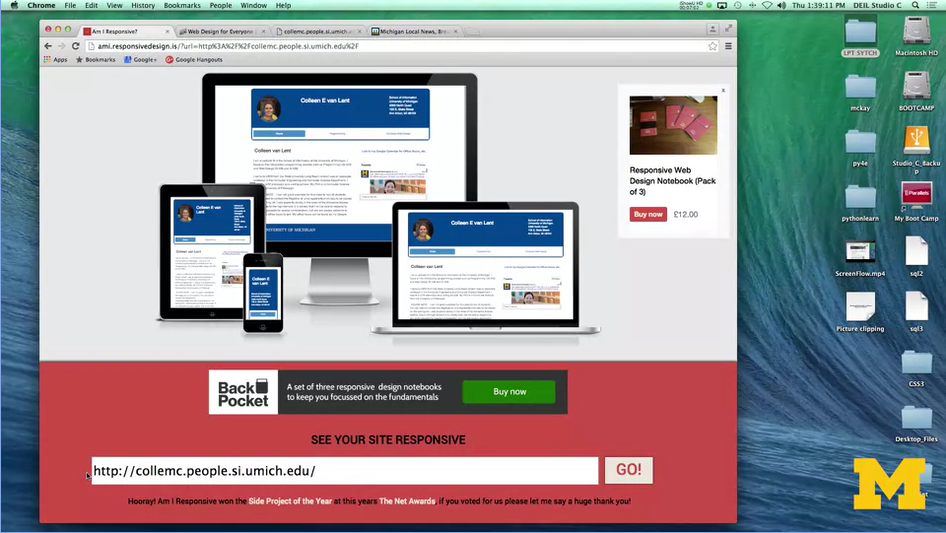
<!-- {width="5.0in" height="2.8173075240594927in"} -->

The next site I\'m going to check is one that I\'ve made from my umich
site. Going here, paste in that URL, and we can take a look. What I\'ve
tried to do here is to have a little bit more distinct look, so that you
can see that I\'ve tried to develop my site for really what the people
might want to be using.

So, in my larger view I\'ve got my picture, because you know, everybody
wants to see me. I\'ve got my name and then my contact information. On
the laptop view it\'s very similar. In the tablet, I\'ve kind of just
reduced the space. That information is still important, but I don\'t
need so much space in between them. In my phone viewer, mobile view
though, I\'ve gotten rid of the picture and I\'ve started to stack the
information to make it easier for people to see. I\'m able to look at
all four of these views on a single website, and this makes it much
easier than trying to go back and forth and resize my window.

However, there is the caveat that this site doesn\'t always work for
every different website. It may be the case that people aren\'t using
traditional responsive web design. So, on this site, the pages all look
the same. But if you were actually viewing them on a browser, they would
look different.

The next option you can try is to use tools on your Chrome or Firefox,
or whatever browser you\'re using. It\'s often the case that your
browser is going to have special tools that let you simulate looking at
things from different viewpoints.

<!--~~~~~~~~~~~~~~~~~~~~~~~~~~~~~~~~~~~~~~~~~~~~~~~~~~~~~~~~~~~~~~~~~~~~~~~~~~~~~~~~~~~~~~~~~~~~-->
<!--~~~~~~~~~~~~~~~~~ 29.  -  (xx) ~~~~~~~~~~~~~~~~~~~-->
<!--~~~~~~~~~~~~~~~~~~~~~~~~~~~~~~~~~~~~~~~~~~~~~~~~~~~~~~~~~~~~~~~~~~~~~~~~~~~~~~~~~~~~~~~~~~~~-->
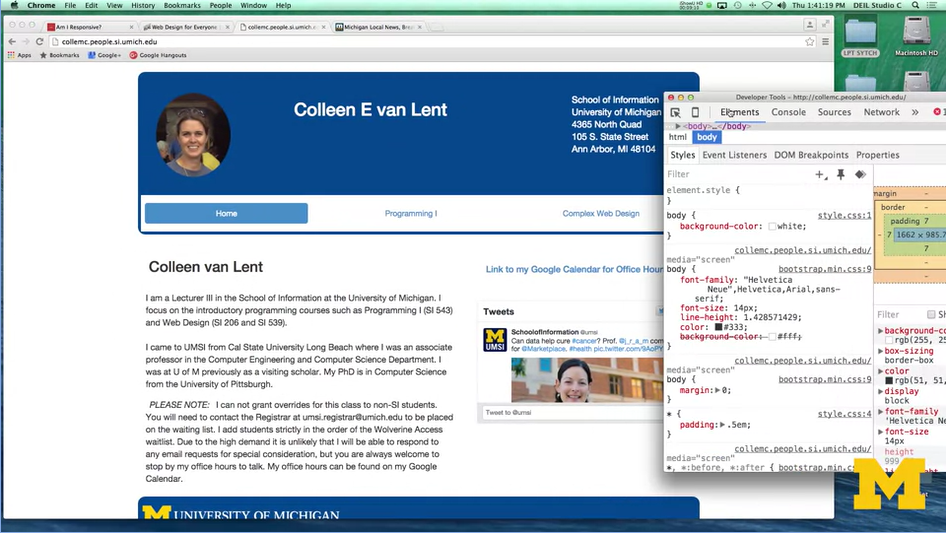
<!-- {width="5.0in" height="2.8173075240594927in"} -->

With Chrome, you can use inspect element to see the different viewpoints
in real-time. Let\'s take a look. So, I\'ve gone here to my website
looking at it in chrome and pretty much enlarge screen view. I\'m going
to drag it out a little bit here. You can see I\'ve got my large screen
I\'ve got a lot of spacing in it. So, I\'m going to go in and do inspect
element by right clicking Click over here.

<!--~~~~~~~~~~~~~~~~~~~~~~~~~~~~~~~~~~~~~~~~~~~~~~~~~~~~~~~~~~~~~~~~~~~~~~~~~~~~~~~~~~~~~~~~~~~~-->
<!--~~~~~~~~~~~~~~~~~ 30.  -  (xx) ~~~~~~~~~~~~~~~~~~~-->
<!--~~~~~~~~~~~~~~~~~~~~~~~~~~~~~~~~~~~~~~~~~~~~~~~~~~~~~~~~~~~~~~~~~~~~~~~~~~~~~~~~~~~~~~~~~~~~-->

<!-- {width="5.0in" height="2.8173075240594927in"} -->

And what I can do now is up in the upper left-hand corner, there\'s
something that looks like a small little mobile phone. It says Toggle
device mode. I\'m going to click on that. And when I do, I am now
viewing my site as if I\'m viewing it on a small mobile phone.

<!--~~~~~~~~~~~~~~~~~~~~~~~~~~~~~~~~~~~~~~~~~~~~~~~~~~~~~~~~~~~~~~~~~~~~~~~~~~~~~~~~~~~~~~~~~~~~-->
<!--~~~~~~~~~~~~~~~~~ 31.  -  (xx) ~~~~~~~~~~~~~~~~~~~-->
<!--~~~~~~~~~~~~~~~~~~~~~~~~~~~~~~~~~~~~~~~~~~~~~~~~~~~~~~~~~~~~~~~~~~~~~~~~~~~~~~~~~~~~~~~~~~~~-->

<!-- {width="5.0in" height="2.8173075240594927in"} -->

Depending upon your operating system in the browser of the addition that
you have, you can go up to the device in the upper left-hand corner
select mode, or model actually. And say what would it look like on an
iPhone 6? It is a little bit bigger, what if I look at it on a google
nexus seven. Same thing. So, you can pick a number of different options
to kind of see what the site would look like.

<!--~~~~~~~~~~~~~~~~~~~~~~~~~~~~~~~~~~~~~~~~~~~~~~~~~~~~~~~~~~~~~~~~~~~~~~~~~~~~~~~~~~~~~~~~~~~~-->
<!--~~~~~~~~~~~~~~~~~ 32.  -  (xx) ~~~~~~~~~~~~~~~~~~~-->
<!--~~~~~~~~~~~~~~~~~~~~~~~~~~~~~~~~~~~~~~~~~~~~~~~~~~~~~~~~~~~~~~~~~~~~~~~~~~~~~~~~~~~~~~~~~~~~-->

<!-- width="5.0in" height="2.8173075240594927in"} -->

Let\'s see, do one last one, a laptop. Depending on which type of
platform people are using.

So now that you know some quick and easy ways to review the
responsiveness of existing sites, it\'s a really good idea for you to go
out and get that feel for what you think looks really good, or sometimes
even more importantly, what you think you want to avoid on your site. Go
ahead and have some fun and mock your friends if their sites aren\'t
responsive. Don\'t worry, yours will be.

# 04. Benefits of Responsive Design

Hi everybody. Today, let\'s talk about some of the benefits of
responsive design.

First thing we need to realize is that responsive design means different
things to different people. We\'re going to talk about three different
options that people often use, and why the responsive web design that
we\'re going to adopt has its true benefits.

<!--~~~~~~~~~~~~~~~~~~~~~~~~~~~~~~~~~~~~~~~~~~~~~~~~~~~~~~~~~~~~~~~~~~~~~~~~~~~~~~~~~~~~~~~~~~~~-->
<!--~~~~~~~~~~~~~~~~~ 33.  -  (xx) ~~~~~~~~~~~~~~~~~~~-->
<!--~~~~~~~~~~~~~~~~~~~~~~~~~~~~~~~~~~~~~~~~~~~~~~~~~~~~~~~~~~~~~~~~~~~~~~~~~~~~~~~~~~~~~~~~~~~~-->
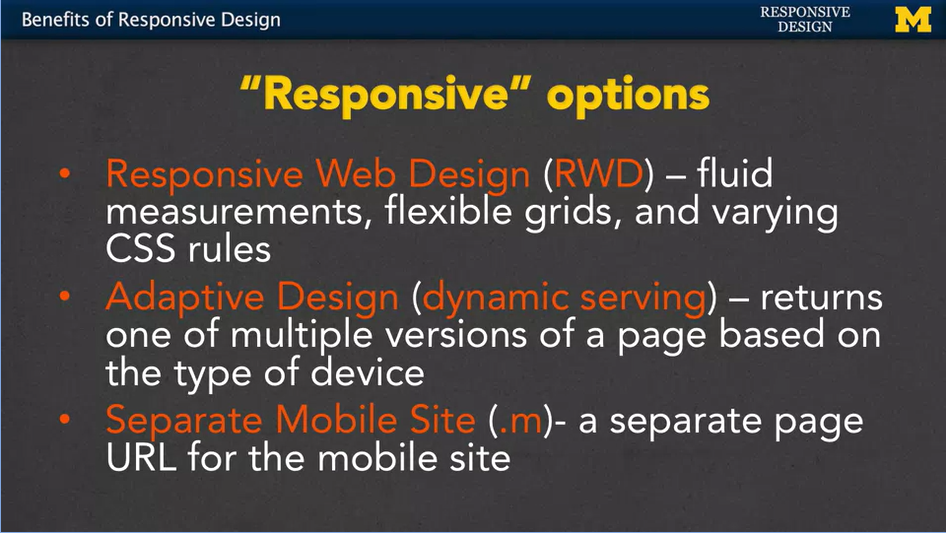
<!-- {width="5.0in" height="2.8173075240594927in"} -->

The first option, ***responsive web design or RWD***, is really dealing
with fluid measurements, flexible grids, and varying CSS rules.

We also have ***adaptive design***, or what\'s sometimes called dynamic
serving. What happens here is that you can end up returning different
versions of a page based on the type of device being used.

The third type is the ***separate mobile site***, or ***.m***. This is
when you create a completely separate page URL for the mobile site.

<!--~~~~~~~~~~~~~~~~~~~~~~~~~~~~~~~~~~~~~~~~~~~~~~~~~~~~~~~~~~~~~~~~~~~~~~~~~~~~~~~~~~~~~~~~~~~~-->
<!--~~~~~~~~~~~~~~~~~ 34.  -  (xx) ~~~~~~~~~~~~~~~~~~~-->
<!--~~~~~~~~~~~~~~~~~~~~~~~~~~~~~~~~~~~~~~~~~~~~~~~~~~~~~~~~~~~~~~~~~~~~~~~~~~~~~~~~~~~~~~~~~~~~-->
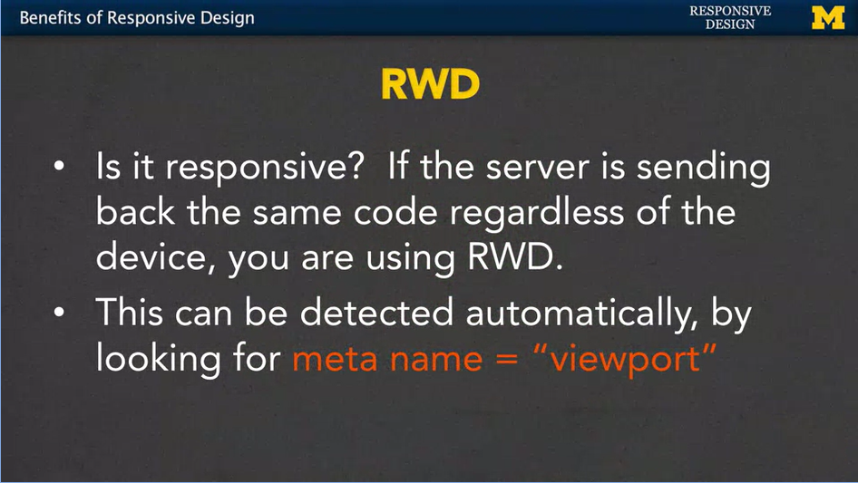
<!-- {width="5.0in" height="2.8173075240594927in"} -->

First, let\'s talk about responsive web design. With the definition that
we\'re using, the test really is, are you getting back the same code
regardless of the device that you\'re using? You know that I\'m a big
fan of inspect element and viewing the source code, so my question is,
are you going to get the same source code no matter what platform
you\'re looking at? Now, as humans we can do that by viewing the source
code or other little tricks. But sometimes when you\'re thinking about
things such as source engine optimization and getting really high
rankings on your page. A bot can also tell if you\'re using responsive
web design by looking for certain meta tag named viewport. It can be
detected automatically and would really, kind of help boost your search
engine score, is what many people think.

<!--~~~~~~~~~~~~~~~~~~~~~~~~~~~~~~~~~~~~~~~~~~~~~~~~~~~~~~~~~~~~~~~~~~~~~~~~~~~~~~~~~~~~~~~~~~~~-->
<!--~~~~~~~~~~~~~~~~~ 35.  -  (xx) ~~~~~~~~~~~~~~~~~~~-->
<!--~~~~~~~~~~~~~~~~~~~~~~~~~~~~~~~~~~~~~~~~~~~~~~~~~~~~~~~~~~~~~~~~~~~~~~~~~~~~~~~~~~~~~~~~~~~~-->

<!-- {width="5.0in" height="2.8173075240594927in"} -->

The second type, adaptive design, means that the server figures out what
kind of device you\'re running on and then returns specific HTML and CSS
for that page. So, you can get completely different code depending upon
what device you\'re using. With responsive web design, it\'s the same
code, just different styling. Here, you\'re getting different content,
the important thing you realize is that no matter where you\'re doing it
from, you\'re using the same URL. Now, there\'s a few issues with this,
in that the server might return the wrong code if the wrong device type
is detected.

<!--~~~~~~~~~~~~~~~~~~~~~~~~~~~~~~~~~~~~~~~~~~~~~~~~~~~~~~~~~~~~~~~~~~~~~~~~~~~~~~~~~~~~~~~~~~~~-->
<!--~~~~~~~~~~~~~~~~~ 36.  -  (xx) ~~~~~~~~~~~~~~~~~~~-->
<!--~~~~~~~~~~~~~~~~~~~~~~~~~~~~~~~~~~~~~~~~~~~~~~~~~~~~~~~~~~~~~~~~~~~~~~~~~~~~~~~~~~~~~~~~~~~~-->
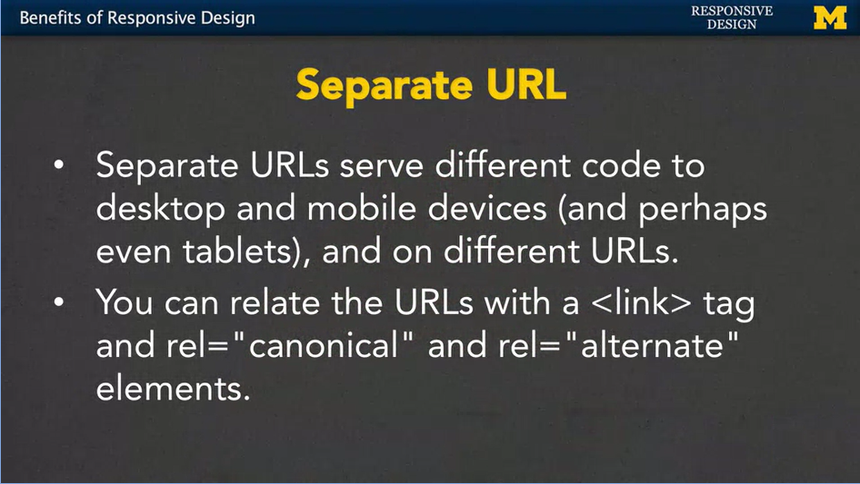
<!-- {width="5.0in" height="2.8173075240594927in"} -->

That third option of having a dedicated mobile site, or a .m URL, means
that you\'re going to get a different page completely on a completely
different URL when you\'re using this approach. it\'s incredibly popular
and you\'re going to see it very often.

When you\'re on a site, check and see if you have .m in front of your
normal URL, or sometimes even a little bit different URL depending upon
your device. It\'s possible if you\'re going to take this design step to
link the fact that pages are related by including a link tag and using
the relationships canonical and alternate. Which means, you know what?
This is my main page but I do have some alternate URLs out there. Why
would you bother doing this? Again, it\'s for search engine
optimization. It really helps if the search engines can know that this
is the same type of information just on different URLs.

<!--~~~~~~~~~~~~~~~~~~~~~~~~~~~~~~~~~~~~~~~~~~~~~~~~~~~~~~~~~~~~~~~~~~~~~~~~~~~~~~~~~~~~~~~~~~~~-->
<!--~~~~~~~~~~~~~~~~~~~~~~~~~~~~~~~~~~~~ 37. why rwd? (xx) ~~~~~~~~~~~~~~~~~~~~~~~~~~~~~~~~~~~~~-->
<!--~~~~~~~~~~~~~~~~~~~~~~~~~~~~~~~~~~~~~~~~~~~~~~~~~~~~~~~~~~~~~~~~~~~~~~~~~~~~~~~~~~~~~~~~~~~~-->
<p align="center">

</p>

<!-- {width="5.0in" height="2.8173075240594927in"} -->

So why am I stressing responsive web design? Well, number one, it\'s a
lot easier to share your data if you only have a single URL. You don\'t
want to have to have multiple versions to hand out to people if they
want to access your site. It\'s also easier for search engines such as
Google to index the page or kind of mark it to know that it seen it
before and would like to rank it.

The number one reason, again, is that fewer files means less
maintenance. If you have different HTML code for different platforms, if
you change one, that\'s not maintaining all of them. You have to go in
and update every single file. And another reason, is that if you have a
single place that you\'re going a single URL, then you\'re going to have
less redirection.

Redirection is when you go to a site, and you see that the URL is being
changed as the server tries to figure out what type of device you\'re
using and what kind of page or URL you should be redirected to. Lower
load time is always great.

Hopefully you see why responsive design is really important. It may even
be obvious to you because you\'re really into this topic. However, if
you\'re ever working a project, you may need to convince someone that
they need to pay you for that extra time to make sure their site is
responsive. And in that case, hopefully, you\'ve learned some facts here
that can help convince other people how important responsive web design
really is.

# 05. Fluid Measurements: Background readings

I like to include additional resources that align with my lectures and I
will be putting these ideas into practice in the next two videos. In
this case, I have found four really good articles that relate to my next
lecture on Fluid Measurements.

<ol>
  <li><a href="http://www.sitepoint.com/understanding-responsive-web-design-how-to-manage-fonts/" 
    target="_blank" rel="noopener noreferrer">Responsive Web Design: Using Fonts 
	Responsibly</a> by Annarita Tranfici</li>
  <li><a href="https://www.futurehosting.com/blog/web-design-basics-rem-vs-em-vs-px-sizing-elements-in-css/"
    target="_blank" rel="noopener noreferrer">Web Design Basics: Rem vs. Em vs. 
	PX - Sizing Elements in CSS</a> by Matthew Davis (\*\* Material here is used in Week Two Assessment\*\*)</li>
  <li><a href="https://codemyviews.com/blog/whats-the-deal-with-em-and-rem" 
    target="_blank" rel="noopener noreferrer">What\'s the Deal with Em and 
	Rem?</a> (\*\* Material here is used in Week Two Assessment\*\*)</li>
  <li><a href="https://css-tricks.com/rems-ems/" target="_blank" rel="noopener noreferrer">
    Font Size Idea: px at the Root, rem for Components, em for Text Elements</a> by Chris Coyier 
	(Please note, some people on Firefox get a warning when using this link. It is 
	not the case for other students.)</li>
</ol>

<h1 id="ch1-6">06. Fluid Measurements</h1>

Hi, everybody. Today we\'re going to talk about fluid measurements.
They\'re really important to responsive design. I\'ve seen some really
beautifully written and spoken presentations on how important it is to
have these fluid measurements. And how the artistry of responsive design
can make things just incredibly good. Just the fact that I use the word
good explains that I am not that eloquent. So, I\'m going to do my best
to show you the technical reasons why you want to use fluid
measurements.

The most important thing is that you really want to understand that your
content, it needs to fit in the size constraints of the viewport. Don\'t
try to make people use a certain size, it\'s your job to conform to
them. If you go to a page and you have a lot of vertical scrolling where
you have to go up and down, that\'s really about content, it\'s not
something that we\'re going to concern ourselves with. If you have a lot
of content, people are going to need to scroll. What\'s bad, what you
really don\'t want is I hate when people have to do horizontal
scrolling.

When you\'re on a page and everything doesn\'t fit in the screen so
you\'ve got to kind of look for it. We want to avoid that whenever
possible.

First, let\'s talk about absolute measurements. For many people, these
may be the only type of measurements they\'ve used when doing web
design. And they do have their place, so let\'s talk about how we use
them. For the pixel, a pixel is basically a dot on your display. 1 pixel
used to be equal to 1/96th of an inch, I\'m not sure that\'s even
necessarily true at this point. But I can tell you that screen sizes
have a lot of pixels and you want to think about that when you\'re
trying to design on pixel size.

Another option is to use mm, cm, or in. This stands for millimeter,
centimeter, or inch. And while it may seem odd to use this kind of
measurements when you\'re doing a webpage, don\'t forget, it is possible
to print out your page. And if you want something to be relative to an
8-and-a-half by 11 piece of paper, it makes total sense to use these
types of measurements. Another option you can use is point. And one
point, it\'s equivalent of 1/72 of an inch. So again, this is a very
concrete measurement.

Another option you can use is pica. And one pica is the equivalent of 12
points. Again, these are all completely valid measurements and they have
their place when you\'re designing your page. But as much as possible,
we want to move to relative measurements, where things are sized based
either on their parents or their neighbors or on the screen size,
different things like that.

So, let\'s start with percent. Percentage values are always relative to
some other value, for example, a length. If you say you want something
to be 75%, it\'s going to check the container it\'s in and make it 75%
of that. The measurement came up with its name because it wanted to be
the font size of the letter M element. It seems a little bit odd,
because when you first think about it, it\'s going to be the same size
by default. If you use one it\'s going to be that same size. 1.1 will
make it a little bit bigger, 10% bigger. 0.9 will make it smaller than
the default size.

Another thing that you can use is rem. rem is very similar to but it
helps avoid that problem of something getting smaller and smaller and
smaller. Let me show you an example. Let\'s assume we\'re going to set
something up to be 0.5em and it\'s going to be inside this element in
here. I\'m going to make up a size and I\'m going to say, it\'s this
big. Okay, well, the problem is, if I have another element inside here,
the a is going to be only half as big as that a. And if I have another a
in here, it\'s going to be even smaller. So, when you use and you have
things that are nested inside each other, the font can actually get
smaller and smaller and smaller. And that might not be how you really
want it to go. If you use rem instead, 0.5rem. Instead, it\'s always
going to be half the size based on the parent or the root element. This
a is going to be the exact same size and the exact size in here. rem
really helped people out when they were doing these kinds of complex
sites where you had a lot of things embedded inside the other.

Now, the problem with teaching and learning about relative measurements,
is that it\'s very abstract. I tried to include a little thing here to
help you make it a little clearer. 1em is basically the equivalent of 12
points, or 16 pixels, or 100%. If you don\'t style your code in any way,
you can assume that some of these defaults will fall in. I\'ve tried to
include this little chart here to make it a little bit more clear. In
general, 1em is the equivalent of 12 points, which is the same as 16
pixels, which is the same 100%. So, you could use any one of these four.
Now, the difference is, if you were to resize your screen and make it
bigger or smaller, only and percent would adjust to the size of the
screen. If you used point or pixel, as the screen gets bigger, the font
stays the exact same size. Same if the screen gets smaller. Two of the
newer relative measurements are based on the viewport. vw stands for
viewport width, so if you were to use one vw, you\'re saying, I want to
use up 1/100th of the width of the viewport. It used to be the case that
you needed to use Javascript to go off, find that width of the browser,
return it, and do some math there. Now, we can just use it with vw. In
the same way, you can use vh for viewport height. The viewport\'s height
is 1/100^th^ of the height of the viewport.

So, if you\'re on a screen, you\'ll know exactly how much real estate
you have if you want something to show up exactly in the middle. This
comes in really handy when you\'re trying to set headers and footers in
specific positions. Now, there are times that you\'re going to want to
hardcode values with those absolute measurements. But, whenever
possible, when you\'re coming up with your design, figure out, are you
going to need that font, or that image, or that section to resize
depending upon the viewport? Then, you want to use these fluid and
relative measurements. And I can\'t stress enough that you\'re not
really going to understand how they work until you take some time, play
with the code and just kind of see what you can make it do. For that
reason, our next video is going to be an example of me moving from
absolute to relative measurements.

# 07. Code With Me: Fluid Measurements

One of the things we always talk about is that there\'s a real
difference between sitting and listening to me talk about something, and
getting in there and coding it yourself, or at least following along
with me while I code it. So, let\'s do an example as we go from static
or absolute measurements to something that\'s more fluid. So, what I
have here is a site where I\'ve used absolute measurements to lay
everything out. I have a large screen, and I have three columns. I\'ll
check out the HTML quickly just so we can all follow along.

I\'ve got my header, right here. Not much in it other than H1 and H2
element. I have a nice little paragraph over here where I basically say,
I\'ve hard-coded these measurements, what\'s going to happen when I
resize the screen? And then, the last thing I have is really just a
little bit of craziness. I\'m going to pull it down here. It\'s just
three divs, each of which has an H2 header and a paragraph. They all say
the same thing, it\'s just some Latin filler, because I don\'t really
care about the actual content itself. More importantly, let\'s look over
here at the CSS.

In that main section, the main content of my page I\'ve gone in and
I\'ve hard- coded the value to 980 pixels, the margin 0 auto, just means
hey, make sure you center me, if I\'m on a bigger browser. For each
column, because I\'m going to have three, I set the width to 300. Now
300, 300, 300 that\'s only 900 pixels. But, because I leave some margin
in-between each column, it\'s important we add a little bit of extra
padding there. Everything else is fairly straightforward. I have rules
for the body and the H1 and H2. The only other real measurements I use
are the fact that I set my font size to 13 pixel, and down here for the
H1. I\'ve set my font size to 64 pixels.

All right, let\'s take a look at this page when I really bring the
content up, so it\'s something we can see. Here we go. I have it. I have
a fairly large sized screen, in fact, if I pull it around I can usually
see how big it is. And it looks okay, but as I make the screen smaller,
you\'re going to see that what happens is the content is hidden. If I
scroll, I can\'t even scroll up and down. I\'m trying. The only way for
me to see more content is to scroll horizontally. And we all know that I
absolutely hate that. In addition, this H1, the fluid measurement, the
font is so big that it kind of overshadows the rest of the content.

So, I\'m going to make this big again, and let\'s think about what we
want to do. One of the keys to responsive design typically is mapping
out what you want your page to look like before you code it, and we\'re
going to talk about that in week two. But right here, for week one,
let\'s just wing it a little bit. I\'m going to make it so I can see my
code. And the first thing I\'m going to do is I\'m going to go to the
first place I hard coded a value, which is the width of this main part.
Saying that I always want it to be 980 pixels, it\'s just a mistake.
Instead, let\'s use percent here, and say I want this to take up, let\'s
say somewhere between 95 and I\'ll pick 95% of my page. Already, you
could see that things happened in there. Not everything we wanted to
happen, but a little. I\'ll resize it again. You can see that my
paragraph down here still fits, but the columns just look at little bit
awkward. Particularly, if I\'m somewhere in that awkward range of two
columns fit, but not the third. So, while the main page is responsive,
let\'s work on those columns. Here, I\'ve set them to 300 pixels. Let\'s
change that. Since I have three columns, again, I can set it to 33, 33,
33, but I\'m probably going to end up with some overlap. So, I\'m going
to make these 30%, and I\'m going to set the margin left to, we\'ll use
2%. Now you can already see this is a huge difference in our page.
Whether I make it big, there\'s not a lot of wasted white space along
the side. And if I make it small, the columns are still together. This
is really good. The last thing I\'m going to change, I\'m going to go
ahead and change my H1, so I\'m using the percent instead. We\'re going
to make this 125%. That\'s not big enough. I\'ll make it 300%. That\'ll
be big. Okay, I\'m going to save this, I\'m going to resize, and when
you go in, it no longer will be quite as dramatic over the entire page.

All right, so this is a fairly straightforward example of how we can
take absolute measurements and change them do something that\'s relative
or responsive to make our page a little bit better. This is just the
first step, but it\'s an important step and it\'s something I want you
to play with. So, you can feel like you\'re beginning to understand
percents, ems, and other things like that. Good luck.

Starter Code:

Completed;

## **HTML:**

```
1.  <!DOCTYPE html>
2.  <html lang="en">
3.  <head>
4.  <meta charset="utf-8">
5.  <title>Fluid Measurements</title>
6.  <link href="fluidstyle.css" rel="stylesheet">
7.  <!-- <link href="staticstyle.css" rel="stylesheet">
8.  -->
9.  </head>
10. <body>
11. <header>
12. <h1>Fluid Measurements</h1>
13. <h2>Colleen van Lent</h2>
14. </header>
15. <main>
16. <!-- Content -->
17. <p>What happens when you hardcode the values of your elements?
    In this case, I have a section that is set to 940px. Each of the
    content columns is set to 300px. What could go wrong?</p>
18. <div class="column">
19. <h2>Content</h2>
20. <p>Etiam porta sem malesuada magna mollis euismod. Integer
    posuere erat a ante venenatis dapibus posuere velit aliquet. Aenean
    eu leo quam. Pellentesque ornare sem lacinia quam venenatis
    vestibulum. Duis mollis, est non commodo luctus, nisi erat porttitor
    ligula, eget lacinia odio sem nec elit.</p>
21. </div>
22. <div class="column">
23. <h2>Content</h2>
24. <p>Etiam porta sem malesuada magna mollis euismod. Integer
    posuere erat a ante venenatis dapibus posuere velit aliquet. Aenean
    eu leo quam. Pellentesque ornare sem lacinia quam venenatis
    vestibulum. Duis mollis, est non commodo luctus, nisi erat porttitor
    ligula, eget lacinia odio sem nec elit.</p>
25. </div>
26. <div class="column">
27. <h2>Content</h2>
28. <p>Etiam porta sem malesuada magna mollis euismod. Integer
    posuere erat a ante venenatis dapibus posuere velit aliquet. Aenean
    eu leo quam. Pellentesque ornare sem lacinia quam venenatis
    vestibulum. Duis mollis, est non commodo luctus, nisi erat porttitor
    ligula, eget lacinia odio sem nec elit.</p>
29. </div>
30. </main><!-- .row -->
31. </body>
32. </html>
```

## **CSS:**

```
> main {
>
> width: 95%;
>
> margin: 0 auto;
>
> }
>
> .column {
>
> width:30%;
>
> display: inline-block;
>
> float: left;
>
> margin-left: 2%;
>
> }
>
> html, body {
>
> background-color: #ffffff;
>
> }
>
> body {
>
> margin: 0;
>
> font-family: "Helvetica Neue", Helvetica, Arial, sans-serif;
>
> font-size: 13px;
>
> font-weight: normal;
>
> color: #404040;
>
> }
>
> h1 {
>
> font-size: 300%;
>
> margin: 0;
>
> padding: 0;
>
> }
>
> h1, h2{
>
> text-align: center;
>
> text-transform: uppercase;
>
> }
```

# Resources

## Pixel to Em conversion tool

Here is a link to a Pixel to Em conversion tool:

<http://pxtoem.com/>

In the third column you can enter numbers and have the conversion
calculated for you.

## Dynamically change the size of font with sliders

This CodePen by Chris Coyier will let you use sliders to dynamically
change the font size on a page

<http://codepen.io/chriscoyier/pen/tvheK>

This demo goes with one of the readings on Fluid Measurements, but I am
including it here again just in case you missed the code. You can read
it here if you want to know how to use the tool.

<https://css-tricks.com/rems-ems/>

## CSS definitions of relative and absolute

Someone provided me with a link that helped them better understand the
meaning of \"relative\" and \"absolute\" as they relate to CSS. Here is
the link:

<https://www.w3.org/TR/css3-values/#length-value>.

This is a fairly technical document and is not required reading for the
course.

# 08. Media Queries

Hi everybody. Today we are going to talk about Media queries.

Media queries are going to allow us to adjust the style of out webpages,
depending upon, the properties of the media we\'re looking at. We can
look at the browser size, width, and other things to decide the best way
to lay out our content. This all started with CSS 2.1. It allowed us to
use different media types.

So, inside your HTML you could have multiple links to different style
sheets. But it wouldn\'t apply all the style sheets just some of them so
here\'s an example. Right here the style sheet style. Is only going to
apply when the content is being displayed on a screen. And for many of
you, that\'s the only way you know of content being displayed. But for
those of us who are older or just plain old we remember a time when on
your computer you might want to print out directions someplace and so
when you printed out the directions you had the option to turn on or off
the pictures and other things like that. So, for us when it came time to
actually print out the directions, the computer would recognize that
we\'re trying to print them out, and use a completely different style
sheet. And this was a big step forward for us, because it allowed us to,
again, have different content and style depending upon the platform.
With CSS3, we have even more capabilities because the style can depend
upon many more features. We can look at the width, the height, the
orientation and even the screen resolution. In addition, we can add the
Boolean operators to increase the power. And what Boolean operators are
just simple "ands" and "ors". So, you might want to say something along
the line of, if it's a screen And Fill in some other properties there.

So, let\'s look at some examples. Every media query has two components.
The first is the media type. We often think of this as something along
the lines of, will this be a screen? Is it a print out? You might even
think about braille or if it\'s going out to a TV. We can also use the
word all to trigger every possible media type that could possibly come
up.

The second component is the actual query of the media feature and the
trigger size that we want to be looking for. For example, we might be
looking for very specific width, height, orientation or resolution.

Here\'s an example for you right here. The media type that I want to
talk about is screen, the CSS will only apply if we\'re looking at a
screen, but in addition, we also want to make sure that that screen has
a maximum width. Of four hundred and eighty (480) pixels. And, a
resolution, of one hundred and sixty-three (163), DPI. So, that\'s a lot
of circling, and that\'s a lot of new words. But that\'s what we\'re
going to talk about, for the next few slides, to help you really get
this idea, of how every query has a media type and then some sort of
trigger size and media feature.

There are three ways to implement media queries.

The first is to use the import rule. Inside your CSS, you would use
import, you\'d include the URL for the style sheet that you want to
import, as well as the different size and conditions on when you want to
import it. So in this case if my screen has a minimum width of 600
pixels we would want to use smallstyle.css.

The second approach is to put the media query directly in the style
sheet itself. We would have before any of our rules, we\'d have the
\@media screen and (min-width:500px). And then inside here, we would put
all of our usual CSS rules for the color, or the font, the size,
different things like that. So, it\'s all contained inside a single
file.

The third approach is to include the query in the actual link in the
header of your HTML. So here, instead of just saying link this style
sheet, we\'ve included the trigger and the different rules right inside
our HTML link tag. In general, I\'m going to always stick to this second
approach right here. This is the one that I personally use for doing my
responsive design, but that doesn\'t mean you shouldn\'t feel free to
play with all three of these different approaches.

Let\'s review for just a second to make sure that we\'re on the same
page with how we implement media queries.

In this case I\'ve put my media queries directly into my CSS file. And
what\'s going to happen is as always CSS start from the top and works
its way down.

We\'re going to hit that first rule right here that\'s going to check
and say, hey, I need to see if my display is an actual screen, not a
printout or something like that. If it is, and the screen width is at
least 500 pixels. Then I want to apply these specific rules right here.
But I don\'t stop. Because this is the CSS, it\'ll continue to work its
way down and check and say hey am I at least 900 pixels? If I am, I\'m
going to apply these rules too. So, it gets tricky at first when you\'re
first learning how to do responsive design. We\'re going to do one
together to get your hands wet and have you coding, just make sure that
you start small and we\'ll go ahead and we\'ll do something together.
Good luck,

# 09. Code With Me: Fluid Measurements and Media Queries

Hey everybody, welcome back. Let\'s go look at some code together. What
we\'re looking at here is an example from when we first learned about
fluid measurements. We went in and we switched our absolute measurements
of pixels and started using percents. And it works out really well,
unless you take it and you look at a small screen. Right now, the three
columns is fine. But when we get smaller, right here, it really doesn\'t
make sense to try to shove three columns worth of content into such a
small screen. This is where the idea of mobile first really comes in.
What I think would be a much better look is to have each column stacked
on top of each other and only go to three columns when you\'re on a
large screen. So, let\'s take a look at how we can make that change
together. The first thing that we need to look at is what these columns
are. And what we have is we have dibs each of type class equals column.
The nice thing about dibs is that by default, they\'re block. If we
don\'t do anything at all they\'re going to be stacked just the way we
want them to be. So, let\'s find our code. Right here. You can see that
I went in and I said I only want them to be 30% and

in line block. I floated them and all that great stuff there. The truth
is, when we think mobile first, we shouldn\'t be changing anything at
all in the column. So, I\'m going to take this code and I\'m going to
delete it. All right, I\'ve done it, their block, and on the large
screen, it looks really silly. But on the smaller screen we have success
I was looking for, we have our mobile first view. Now the question is,
how do we go from a single column to three columns as we get bigger? And
the answer is to use media queries. So, I\'m going to scroll down to the
bottom of my CSS. And I need to add some code. How do we make a media
query? Don\'t forget, it\'s all about putting in that type and that
break point. So, I\'m going to put in at media screen. And, in-width,
let\'s go ahead and pick a number. I\'m going to say 778. All right,
make this a little bigger so you can see it. So, what I\'m saying,
whoops, and dev should definitely be pixels not PS. What I\'m saying is,
hey browser, if you are this size or bigger, I want you to run some
special code. And what code is it? It\'s that code that says, never
mind, I don\'t want to be a single column, I want to be three columns.
So, I\'m going to put that back in there. Save it. And boom, it happened
already. It goes in, the browser figures out your size, and then goes in
and makes any changes. This is hopefully pretty straight forward to you,
although you might want to look at the code for a little bit, change the
numbers. I\'m going to change this to 1,200, right away it goes back.
You can play with these break points, these are the break points that we
talked about earlier, to find that perfect look for your page. As we
make more and more complicated media queries, I really want you to go
back and make sure you understand these simple ones first. Good luck.

Completed;

## **HTML:**

```
1.  <!DOCTYPE html>
2.  <html lang="en">
3.  <head>
4.  <meta charset="utf-8">
5.  <title>Fluid Measurements</title>
6.  <link href="fluidstyle.css" rel="stylesheet">
7.  <!-- <link href="staticstyle.css" rel="stylesheet">
8.  -->
9.  </head>
10. <body>
11. <header>
12. <h1>Fluid Measurements</h1>
13. <h2>Colleen van Lent</h2>
14. </header>
15. <main>
16. <!-- Content -->
17. <p>What happens when you hardcode the values of your elements? In
    this case, I have a section that is set to 940px. Each of the
    content columns is set to 300px. What could go wrong?</p>
18. <div class="column">
19. <h2>Content</h2>
20. <p>Etiam porta sem malesuada magna mollis euismod. Integer posuere
    erat a ante venenatis dapibus posuere velit aliquet. Aenean eu leo
    quam. Pellentesque ornare sem lacinia quam venenatis vestibulum.
    Duis mollis, est non commodo luctus, nisi erat porttitor ligula,
    eget lacinia odio sem nec elit.</p>
21. </div>
22. <div class="column">
23. <h2>Content</h2>
24. <p>Etiam porta sem malesuada magna mollis euismod. Integer posuere
    erat a ante venenatis dapibus posuere velit aliquet. Aenean eu leo
    quam. Pellentesque ornare sem lacinia quam venenatis vestibulum.
    Duis mollis, est non commodo luctus, nisi erat porttitor ligula,
    eget lacinia odio sem nec elit.</p>
25. </div>
26. <div class="column">
27. <h2>Content</h2>
28. <p>Etiam porta sem malesuada magna mollis euismod. Integer posuere
    erat a ante venenatis dapibus posuere velit aliquet. Aenean eu leo
    quam. Pellentesque ornare sem lacinia quam venenatis vestibulum.
    Duis mollis, est non commodo luctus, nisi erat porttitor ligula,
    eget lacinia odio sem nec elit.</p>
29. </div>
30. </main><!-- .row -->
31. </body>
32. </html>
```

# **CSS:**

```
1.  main {
2.  width: 95%;
3.  margin: 0 auto;
4.  }
5.  html, body {
6.  background-color: #ffffff;
7.  }
8.  body {
9.  margin: 0;
10. font-family: "Helvetica Neue", Helvetica, Arial, sans-serif;
11. font-size: 13px;
12. font-weight: normal;
13. color: #404040;
14. }
15. h1 {
16. font-size: 300%;
17. margin: 0;
18. padding: 0;
19. }
20. h1, h2{
21. text-align: center;
22. text-transform: uppercase;
23. }
24. @media screen and (min-width:1200px)
25. {
26. .column {
27. width:30%;
28. display: inline-block;
29. float: left;
30. margin-left: 2%;
31. }
32. }
```

# 10. Wire Frames

Hi. Today, we\'re going to talk about wireframes and as we talk about
them, I have to admit the way in which I teach web design doesn\'t
really mimic the way you should really do it in the real world, in that
I tend to talk about the coding aspects first. The things you can do to
create something real right away. But this lecture should have really
come earlier in the course, because your layout is one of the first
things you should think about.

So, if you\'re going off to be a web designer, you\'re going to need to
realize that coding comes after your design. And wireframes provide a
visual representation of your layout. This is what you\'re going to use
when you decide it\'s time to start coding.

So, what do I mean by a wireframe? Let me show you a few examples. Right
here, I\'m at a site called wireframeshowcase.com. And If you scroll
through the page, kind of up and down, you can see that you see a little
bit of a few different pages. Real pages but also you see some graphical
sketches underneath them.

So, let\'s go back up to the first one. Up here I\'m going to go ahead
and go in and kind of show you what it means when we click on the view
details. When I hover over the page you can see what the site\'s going
to look like when it\'s set out on the screen. But when I\'ve come off
just a little bit, you can see that all those visual representations are
actually based on very plain, very unstyled little documents. That\'s
what we\'re going to talk about today.

So, before you can start drawing, you need to decide what you need to
have on your page. This includes both text and graphics. If it really
needs to be there, you need to know at the beginning. What is going to
be the best layout for this material? Once you know what you need to
have, you can start thinking about different things such as, on a mobile
view, we might want a different type of navigation bar. We want all the
same material just a different layout.

When we\'re on a laptop view you might decide you want to add a little
bit of extras but first you need to figure out how you\'re going to lay
out those necessities.

Again, as always, I\'m going to remind you that the mobile view is the
most important view in web design. If you don\'t think about the mobile
view first, it\'s very simple for you to start coming up with a clear
idea, and then as you shrink it down, throwing things out. No. At the
beginning you decided this was important. So, if it is important, make
sure you design it for that mobile view.

Let's give an example. You might know that you want to have header, a
section, inside that section you\'re going to have an article and maybe
an aside, and you\'re also going to have a footer. Because you\'re on a
mobile view, things tend to go right from the top down to the bottom and
very few things side to side. We just don\'t have the space. Once
you\'ve decided on that mobile view and you\'ve sketched it out, you can
go on to what you might want it to look like on the larger view. In this
case the header and the footer are the same but we have more flexibility
with where we want to put that other content.

You also want to think about functionality when you\'re doing your
wireframes. The design should be about more than just the layout. You
can use these wireframes to test out the interaction that your page
might go through as well. Navigation, form inputs, different things like
that. If you don\'t think about that at the beginning, you run into a
lot more problems when it\'s time to code.

Did you want it to be a drop-down menu, a hover actions, we need to
think about this functionality from the beginning. Many people refer to
sketches and wireframes and kind of wonder what the difference is. I
always recommend starting with a sketch. With this idea with a sketch,
is that you\'re just kind of drawing with your hand and it\'s very
free-form. One of the reasons to do this is that I know when someone
hands me a very nicely typed paper, or some nice computer printout, I\'m
more hesitant to give back feedback. Well, if you give me a nice kind of
hand drawn piece of paper, you can really dive into it and say, no, what
if you do this. You don\'t mind marking up their stuff as much.

So, when you do a sketch, when you do it by hand, you get less, I would
say, attached to it. You\'re more likely to be willing to make changes
because you didn\'t spend five hours getting the perfect border or
putting things in just the right spot.

So, let\'s take a look at another place where I\'m not going to cover
myself, but there are places where you can figure out these kind of best
design practices as you start sketching out your page and eventually
moving on. One of the reasons I like this site is well because I agree
with many of the things they\'re talking about and they agree with me.
But as you look around, you\'re going to see that most articles talk
about best practices. These aren\'t rules, these are just ideas and
suggestions for you to think about. So, for instance, one suggestion is
don\'t use color.

Again, this goes back to the idea that wireframes and sketches are about
content. It\'s about figuring out how you want to lay it out and use it.
Once you start throwing in color, things start taking on more meaning
when maybe they weren\'t supposed to. You want to be very consistent
when you\'re doing your side. Don\'t worry about other things such as
padding and spacing and certain little elements that might be different
on a single page. Think about your over line sketch. The next one is
always a problem for people because when you\'re designing you actually
tend to get really into it. It\'s important that you use actual content
in your page because when you do this it really helps you visually look
at the page and realize, this part\'s getting lost or this section is
really too big. Maybe I should be breaking it up in to more sections.

This last one I\'m going to talk about and then you can kind of do the
page alone if you like, is this idea that you never wire a loan. This, I
hope, is an underline concept you\'re getting from all of the courses
that you\'re taking with me. It\'s never good to code a loan, design a
loan, it should really be a give and take as much as possible. As we\'re
together starting off this class, or even as you\'re ending it up, it
can be really difficult to come up with sketches, because we tend to
make really small pages because we\'re just getting started. Plus, we
don\'t have official clients who are giving us feedback. We really only
have maybe your friends and family and if you get on the message board
and show people your sketches. So don\'t be discouraged or feel like
you\'re doing something wrong if you have a hard time coming up with
sketches at the beginning.

The other challenge I find that when you\'re doing something like this
is you really want to keep things simple and changeable. Like I said,
it\'s really impressive to give somebody a print out with everything
you\'ve placed. But it\'s not always the best way to get feedback. Also,
it sometimes feels like, I can do so much more! Simple design is always
going to be the best design.

The other thing I\'d really like to just mention to you is that, if the
design is where you\'re at, this is the part you\'ve really taken this
course for, it\'s still important to understand the basics of coding.
That\'s going to help you understand how you can convey your ideas to
the programmers and let them make something really great out of your
design.

<a href="http://www.dtelepathy.com/blog/design/learning-to-wireframe-10-best-practices">Learning to Wireframe - 10 Best Practices</a>

# 11. Breakpoints

Hi everybody. Every once in a while, I like to step back and think about
some of the terms I use in this class and make sure I\'ve actually
defined them for you so we\'re all in agreement or understand what the
general meaning is.

One of those terms is breakpoint. People hear it talk about it all the
time when they\'re talking about responsive design, but what are they?
Breakpoints are sizes or positions that define a change in your site
layout or content. So, you might say, I\'m going to set a breakpoint at
500 pixels, 800 pixels and 1,000 pixels. And depending on those sizes
you\'re expecting to see some sort of change. We use these breakpoints
to provide the best possible experience for users based on the device
information we have. Now, there\'s more to it than just breakpoints. You
might also want to talk about resolution, whether using print, but
breakpoints are really a key element that you want to understand. The
other phrase I use quite a bit in conjunctions with breakpoints is this
idea that they trigger something, breakpoints trigger changes. And to be
honest, it may not be the best phrase to use. That\'s because most
people don\'t actually resize their window when they\'re on it. You open
up your screen and there it is.

As developers I encourage you to open up your browser, make it big, make
it small, kind of resize it all the time. But most people aren\'t going
to do that when they\'re viewing your page. So, when we talk about
triggering these changes, we often mean triggering rules in your style
sheet instead. That\'s why I\'m going to use breakpoints to refer to
which rules I apply in different situations. So how do you determine
what those breakpoints should be? While I\'m teaching, I\'m kind of
notorious for just randomly picking numbers and throwing them out there,
because I\'m just trying to do things on the fly.

In the real world, people tend to set their breakpoints based on one of
two things. The first is devices. They\'ll think ahead and think of all
the different devices out there, and try to figure out which breakpoints
correspond to the different machines. Other people feel strongly that
you shouldn\'t think at all about the different devices that are out
there. Because they change all the time. There\'s always a new phone, a
new tablet, and you can\'t keep up with that. Instead, you should base
your breakpoints based on the content of your page. You figure out what
it is you want there and decide when will it really look good next to
each other versus not. Let\'s talk about using devices as a breakpoint.
So, what I have here is just a quick little shot of some of the most
common devices and their screen sizes. So, with the iPhone 4, you\'d
want to think about breakpoints at 320px and maybe 480. The iPhone 5,
when that came along, all of a sudden, you\'d need to think about a
different max width because it\'s up to 568px. iPhone 6 got a little bit
bigger still, and then the iPhone 6+, well, let\'s just agree it\'s
ridiculous. The new iPhone is supposedly going to be even smaller so
you\'d need to think about new screen sizes for that. We also have the
Galaxy S3 and S4, they have very similar breakpoints. And then, the S5,
again, the same thing, just a little bit bigger on the smaller screen. I
think this is how most people come up with their breakpoints. They\'ll
look at the screen sizes, find some that are similar or find the lowest
possible number for the smallest screens and maybe the biggest possible
number for the larger screens and just build around those. In most
cases, your content\'s going to fill in just fine. And it would be
impossible for you to go in and try to have a different view for each
one of these sizes. And of course, when we talk about breakpoints, we
want to talk about mobile first. In a lot of paradigms, you\'re never
going to see a breakpoint of 320 pixels or even 360 pixels. You\'re not
going to see that because they\'re already designing as if the default
style sheet covers the smallest possible screen. The good thing about
this or the great thing about this means that your page is going to work
successfully and show all of your content even on much bigger screens,
because you don\'t have any breakpoints that you may or may not miss. So
that\'s a really great thing about designing mobile first. That also
means though, that if you\'re going to be using code that isn\'t yours,
maybe you have someone else\'s style sheet. If you see them using
max-width instead of min-width in their rules, that means they did not
design for mobile first and you might need to move things around. But as
I mentioned at the beginning of this lecture, today, I really just
wanted to talk about these key words. Breakpoints, triggering, mobile
first. You won\'t really get a good feel for them until you\'ve had the
time to write some code yourself. So don\'t worry if your not familiar
with them at first. But make sure your constantly thinking back, hey,
what does a breakpoint mean again, is this an example of triggering, and
I really hope you\'ll really understand mobile first by the time that
we\'re done with this course.

# 12. Media Queries Part Two

<a href="https://codepen.io/ColleenEMc/pen/zrjKqP/">CodePen</a>

Today\'s lecture is about media queries. And yes, I\'ve already given
you a lecture on media queries but I really want to give you another
one. Because media queries are something that it\'s much easier watching
me do it than doing it yourself. So today, three simple steps that I
want you to try at your best to follow and then, we\'ll look at an
example. The key to understanding media queries is to actually use them
in responsive design. This lecture is going to describe that process in
three steps, but you won\'t necessarily need to use all of them. So the
best I can do is give you guidelines. Step one, this is something that
will cause your page to work or not work many times on mobile phones.
It\'s a simple bit of code that you want to include in the head of your
HTML. What we have here is a meta tag. And what it\'s going to do is
it\'s going to convey this information to your browser. We\'re going to
be using different view ports. And it wants a browser to let your style
sheets know, hey, how big you are? You\'re always going to leave the
code exactly like this. You\'re simply saying, I want to know the view
port, I want to know the content width, this initial-scale equals one
that basely just kind of set what your size is going to be. Now, if you
ever been to a site where things are really small and you want to make
it bigger so you can read it a little better. And it just won\'t let you
do that. That is because somebody has put this very horrible, horrible
piece of code into their HTML. Instead of saying just initial-scale
equals one, it also has maximum-scale equals one. I mention this not
because I want you to put it into your site, but because it\'s pretty
common practice when you\'re first coding to use other people\'s code.
So if you see this happening, you want to take it out. It\'s just a
really bad experience for many people trying to use your page if they
can\'t make things bigger or smaller. So that\'s step one. It\'s not
only going to help your browser know that you\'re going to be doing
responsive design. It may actually help your search ngine optimization
as well. In step two, I really want to encourage you to use fluid
layouts. It\'s very often the case that when people use breakpoints,
they then use absolute measurements. The reason for that is if you think
about it, they know pretty much how big the screen\'s going to be. They
know that\'s going to be somewhere between here, That size and that
size. Based on the fact that they know how many pixels wide the screen
is going to be, they can hard code the width of some of their elements.
You\'re going to see this in Bootstrap all the time. But, just because
somebody else does it, doesn\'t mean the you should. I want you to use
those other things such as percentages, and ems. These are really great
fluid measurements. Percentages you tend to use more on element such as
images and dibs. Ems are a measurement of typography. So 1em is the
width of one letter M. If you\'re not sure, you don\'t remember that,
don\'t forget to go back and look at some of the fluid measurement
videos. I also hear that Bootstrap 4, one of the platforms we\'re going
to use is going switch over to ems and rems, too. The last thing I just
like to remind people is that when you use these fluid measurements for
things like padding and margin, the percents are affected by the width
not the height of your page. What does that mean? It means if you\'re
page is this big, let\'s switch to the pen there. The padding is
affected by how wide it is. So, 50% padding would pretty much give you
something like this. If you make the page wider then you would get more
padding. However, if you make the page the same but you make it taller,
the height doesn\'t effect it at all. So it doesn\'t seem like a big
deal until you\'re stuck trying to code it. Just remember paddings and
margins, when you use percent, they\'re affected by the width of the
page, not the height. That third step is really the biggest step. And
that is including those media queries. The fluid layout is triggered by
these certain break points that you want to use. Design for that smaller
screen and work bigger. Some sites like to strip out information, or
even just set it to display none when the site is small, because they
think, that\'s not really important information. Well, that\'s kind of
you deciding for other people what they might want to see. It drives me
crazy when I go to a site and I have to click on a link to go to large
size view. Or when it just won\'t let me access information at all. You
don\'t want to penalize your mobile users. You also need to realize that
just because you set something to hidden or display none, the content
might still be downloaded. And this can affect performance. They\'re
still downloading big things like pictures. And you\'re eating up their
data. So think small screen and grow bigger. When you put in these media
queries, it\'s common to have a few different sets of rules. You might
have your large screen, and then a medium screen. And then, here\'s my
default mobile view. I want you to look at this and if you need to, I
want you to pause the video and I want you to see if you can figure out
why this is bad code. All right. Did you see it? Let\'s see. I added one
additional rule here. I just added in some size. But if you notice, as I
resize this window, nothing happens. Nothing is getting triggered. Why
is that? Well, its because I haven\'t ordered things correctly. Style
sheets always start from the top and work their way down. All right, so
the first thing its going to do is its going to check and say, do I have
a minimum width of 1,024 pixels? If you do, great. It\'s going to apply
the background blue and the width of 25%. But here\'s the problem. If
you have a minimum width of 1,024 pixels right there, that means you
also have a minimum width of 780. If it\'s going to happen when it\'s
big, it\'s going to happen when it\'s smaller. So this rule overwrites
the one above it. And then down here, this one, it\'s not even inside a
rule. You\'re basically saying always apply this styling. So our rules
are syntactically correct. This is a valid piece of code. It\'s the
logic that we need to fix. Let\'s start by doing this. I\'m going to
take that default rule, and I\'m going to move it up to the top. And as
soon as I do that, let\'s see what happens. Well, one, you can see that
it\'s now yellow, so we know that it\'s at least 780 pixels. But when I
look at it, you can usually see it\'s actually 1,800 pixels, so I would
expect it to be blue. But it is working on the small view, so that\'s
good. So, we have two out of the three views. Well, that problem still
exists that the order isn\'t correct. When you\'re triggering on minimum
width, you want to make sure you\'re always testing for your smallest
sizes first. Save this and now we have, I\'m hoping it\'ll go from green
to yellow, to blue. As you can see, I still added fluid measurements
because as the size of the screen grows so does my H1, because I set it
to 25%. These are the type of things that it\'s really simple to nod
along, say yep, yep, I got it. And it isn\'t until you write your own
code that you\'re going to accidentally make these mistakes and not know
what\'s going on. My advice to you is to always add one media query at a
time, and make it something simple. Put in that media query, add a rule,
test it, build from there. Add a new media query, add a rule, test it.
It\'s the best way to make sure that your code\'s going to be clean. And
with that, I\'m pretty much going to leave you with a concept check
here. The question I\'m going to ask is, should your media queries be at
the top or the bottom of that page? Where you have your little at media.
The example I just showed you is that, well, they should go closer to
the bottom. Have all your default styling first, and then trigger media
questions. But in all honesty, it's a bit of a trick question. If
you\'re assuming min-width, if you\'re doing mobile first, put the rules
on the bottom. If you\'re using somebody else\'s code and they didn\'t
use that mobile first paradigm, and they\'re searching for max width,
then its completely the opposite you want to put those rules at the top.
It can be tricky, and that\'s why I encourage you, to get into good
habits at the beginning, and continue them as you get better and better
at coding responsive design.

# 13. Code With Me: Responsive Navigation

Hi everybody, today, with this lecture I\'m hoping you\'ll sit with me
and write up some code where we use media queries to produce responsive
navigation. In particular we want to make one page where the navigation
bar is at the top on a small screen and off to the side on larger
screens.

So, let\'s look at some code. What I have here is some HTML that
doesn\'t have any styling on the navigation bar. What you have is a nice
horizontal line of links right up here at the top of your page. What I
would like to do is design my page, so that on small screens, the
navigation bar is still on the top. But instead, when I\'m on larger
screens, we have more room to play with. So, I want to put that
navigation bar, off to the side. So, let me draw you a little picture
here. Small screen, I want the bar to be along the top here and then
you\'d have all the content. But on a larger screen, it can be this big,
well then I want my navigation bar to be along the side and we can put
all the content right off to the right. So let\'s take a look at how
we\'re going to do that. Because we want to do mobile first, that means
by default we already have it set up where the navigation bar is where
we want it, but let\'s go ahead and add a little bit of styling. I\'m
going to cheat and copy and paste this in here for just a second. What
I\'ve done, is I\'ve just added a little bit of styling to not only the
navigation, but now, we also have it so that the links themselves are
also styled. So, I\'ve put in some border radius, to make them nice and
circular. I\'ve added the margin and the padding. And, just in case you
look at it, and kind of wonder what\'s going on, I\'ve done a little
trick that I do, in order to center text inside these little
\[INAUDIBLE\]. I\'ve gone ahead and set the line height to 45 pixels.
What this does is it gives this kind of little extra padding on the top
and the bottom to help fill up the size. You should play with this, and
kind of see if you like it. Well even though we have it looking great
the way we want it on a small screen, let\'s see what happens when we
make the screen larger. Well at the moment, nothing happens when we make
the screen larger. And that makes sense because we didn\'t put in any
media queries. We do have a slight bit of responsive design simply
because I\'ve used fluid measurements. That margin and that padding,
it\'s going to adjust as I resize the screen. But I don\'t just want
things to adjust. I want a completely new layout, so let\'s get started.
The first thing that I\'m going to do is add in my media query. \@media
all and (min-width) I\'m just going to go ahead and set this to 900
pixels. It\'s a nice big size, and it\'ll give us a really clear break
point as to where we want things to change. So, I\'ve done that, and now
I can start adding new rules. Some people love to jump right in, and
start doing a whole bunch of coding. It would make sense that sense
we\'re doing navigation bars that we would want to start adjusting the
different navigation. I\'m not going to do that thought. What I always
recommend is somebody write a very simple, clear rule. The reason is,
it\'s really easy for you to figure out whether or not your rules are
triggering. So let\'s go ahead and just change the entire color of the
body of this page. So put in body, curly bracket, background, color,
I\'ll just make it blue. All right it worked. If for some reason you
typed that in and it didn\'t change anything on your screen, You want to
stop. Don\'t start doing new complicated things if you can\'t even get
this little one to get going. So, I messed up. First I can\'t make this
as slightly less obnoxious color here. See if I can get away with grey.
There we go. You can still see everything. If you run into problems, the
parts you want to check are go in did you remember to have minimum
width? If you do maximum width, then as you make it larger, it might
trigger on and off. Make sure you\'ve added the pixels at the end so it
knows what it\'s looking for. Make sure you have two sets of curly
brackets. Notice I have one set that starts my media query. And then a
second one that goes with the body selector. If that\'s going, let\'s go
ahead and move on to how we would change that navigation bar to be off
to the side instead of on the top. So one of the first steps we\'re
going to want to take is changing the styling for the nav tag. I have it
for you, right here, along with a little typo, I see. The most important
thing is that I want this to be off to the side, now. By default, nav is
block, so it takes up the entire width. Now, I only want it to take up a
small bit along the side. In fact, I said that I want it to take up 20%.
So, as the screen gets larger, it will still take up 20% of the screen.
I also have a min-width of 125 pixels because I just don\'t want it to
get too small. This now has placed the nav bar off to the side, but it
still doesn\'t look quite right. What I need, is I need to style those
individual links as well. So that they go right underneath each other.
Let\'s do that next code. So how do I do that? How do I get the links to
go underneath each other? Well that\'s not too hard if you remember some
of the more advanced CSS you\'ve learned earlier. The most important
thing is that I want to make it display block, right here. Once you do
that, well, now they have to go underneath each other. I played a little
bit with the text decoration and the padding, but other than that,
everything is just a little bit of extra styling. The important thing
for the layout was to make everything display block. So let\'s take a
look at what we have for a second. We have our navigation bar and it\'s
off to the side as we were hoping. And it only takes up some of the
space. But we really wanted the content to be next to it. We wanted it
to be over here to the side. And instead, it ended up underneath. What
do we need to do? If we were in class, in real life, I would sit there
and stare at you, until someone finally raised their hand and made a
guess. But, you\'re lucky, we\'re not there together. So I\'m just going
to tell you. The problem isn\'t with our navigation, it\'s actually with
the section that comes underneath it. I\'m going to go down here. If you
think about it, every section by default is block, so it\'s a simple
enough trick to get these things to be next to each other. I\'m going to
add the code right now. So in order to get this to work I\'ve added a
little bit more code. I went in and I said, you know what, this section
can\'t be block, it needs to be inline block. And since I made the
navigation bar about 20% I went ahead and made this 70% because I\'m not
feeling like I want to do the math of the margins and the padding right
now. I also set the height to 100 viewport height to take up the whole
screen. I did have to go back and change one thing up in my nav as well.
I had to add a float left, right down here if you look. And this is what
lets these two things be next to each other off to the side. So let\'s
take a look at what we\'ve got. On the big screen, we\'ve got the
vertical navigation bar. On the small screen, we jump back to the
horizontal navigation bar. Neither one of these things had a lot of
tricky CSS to it. But the important part was remembering to put in that
media query, that\'s what triggers everything. So if you didn\'t code
along with me right now, I hope you\'ll stop, write some code on your
own and see if you can\'t get things to move around. Try to do it in
such a way that you can see it really making sense. Where you know that
on small screen phones they really do do their navigation differently
than if you\'re on a laptop. Good luck, and make sure to post questions
if you run into trouble.

<!--~~~~~~~~~~~~~~~~~~~~~~~~~~~~~~~~~~~~~~~~~~~~~~~~~~~~~~~~~~~~~~~~~~~~~~~~~~~~~~~~~~~~~~~~~~~~-->
<!--~~~~~~~~~~~~~~~~~ xx.  -  (##) ~~~~~~~~~~~~~~~~~~~-->
<!--~~~~~~~~~~~~~~~~~~~~~~~~~~~~~~~~~~~~~~~~~~~~~~~~~~~~~~~~~~~~~~~~~~~~~~~~~~~~~~~~~~~~~~~~~~~~-->
<!--
<p align="center">

</p>
-->
