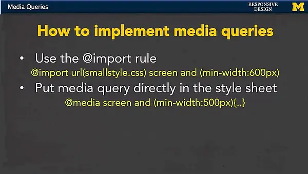

<h2 align="center">Advanced Styling with Responsive Design</h2>
<br/>
<!--~~~~~~~~~~~~~~~~~~~~~~~~~~~~~~~~~~~~~~~~~~~~~~~~~~~~~~~~~~~~~~~~~~~~~~~~~~~~~~~~~~~~~~~~~~~~-->
<!--~~~~~~~~~~~~~~~~~~~~~~~~~~~ readme.md of uofmichigan-advstyling ~~~~~~~~~~~~~~~~~~~~~~~~~~~~-->
<!--~~~~~~~~~~~~~~~~~~~~~~~~~~~~~~~~~~~~~~~~~~~~~~~~~~~~~~~~~~~~~~~~~~~~~~~~~~~~~~~~~~~~~~~~~~~~-->
<!--~~~~~~~~~~~~~~~~~~~~~~~~~~ 01. introduction to resp design (01) ~~~~~~~~~~~~~~~~~~~~~~~~~~~~-->
<p align="center" width="100%">

</p>

<h3 align="center"> </h3>
<!--~~~~~~~~~~~~~~~~~~~~~~~~~~~~~~~~~~~~~~~~~~~~~~~~~~~~~~~~~~~~~~~~~~~~~~~~~~~~~~~~~~~~~~~~~~~~-->
<!--~~~~~~~~~~~~~~~~~~~~~~~~~~ 02. university of michigan logo (01) ~~~~~~~~~~~~~~~~~~~~~~~~~~~~-->
<p align="center" width="100%">

</p>

<h2><a href="table-of-contents">Table of Contents</a></h2>

## [**About**](#cha)
>### - [**About**](#cha-1)
>### - [**Source Code for Each Week**](#cha-2)
>### - [**Course Slides**](#cha-3)

## [**Course Information**](#chb)
>### * [**Syllabus**](#chb-1)
>### * [**Resources**](#chb-2)
>### * [**Fluid Measurements background readings**](#chb-3)
>### * [**Pixel to Em conversion tool**](#chb-4)
>### * [**Dynamically change size of font with sliders**](#chb-5)
>### * [**Good Examples of Responsive Design**](#chb-6)
>### * [**Media Queries and Breakpoints**](#chb-7)
>### * [**Demystifying Bootstrap**](#chb-8)
>### * [**Grid System Check**](#chb-9)
>### * [**The Evolution of the Airbnb front-end development**](#chb-10)
>### * [**Debugging Your Style**](#chb-11)
>### * [**More Resources for Learning to Debug/Develop**](#chb-12)

## [**Week 1: Style with Responsive Design**](#ch1)
>### 1.1 [**Introduction to Responsive Design**](#ch1-1)
>### 1.2 [**What is Responsive Design?**](#ch1-2)
>### 1.3 [**Testing Existing Sites**](#ch1-3)
>### 1.4 [**Benefits of Responsive Design**](#ch1-4)
>### 1.5 [**Fluid Measurements**](#ch1-5)
>### 1.6 [**Code With Me: Fluid Measurements**](#ch1-6)

## [**Week 2: Basic Concepts**](#ch2)
>### 2.1 [**Media Queries**](#ch2-1)
>### 2.2 [**Code With Me: Fluid Measurements and Media Queries**](#ch2-2)
>### 2.3 [**Wire Frames**](#ch2-3)
>### 2.4 [**Breakpoints**](#ch2-4)
>### 2.5 [**Media Queries Part Two**](#ch2-5)
>### 2.6 [**Code With Me: Responsive Navigation**](#ch2-6)

## [**Week 3: Use Existing Frameworks**](#ch3)
>### 3.1 [**Frameworks**](#ch3-1)
>### 3.2 [**Introduction to Twitter Bootstrap 3**](#ch3-2)
>### 3.3 [**Bootstrap Breakpoints**](#ch3-3)
>### 3.4 [**Bootstrap Grid System**](#ch3-4)
>### 3.5 [**Code With Me: Grid Example**](#ch3-5)
>### 3.6 [**Bootstrap Navigation**](#ch3-6)

## [**Week 4: Experiment!**](#ch4)
>### 4.1 [**Responsive Images**](#ch4-1)
>### 4.2 [**Bootstrap Tables**](#ch4-2)
>### 4.3 [**Code With Me: Advanced Navigation**](#ch4-3)
>### 4.4 [**What Are Templates?**](#ch4-4)
>### 4.5 [**Bootstrap 4/5**](#ch4-5)
>### 4.6 [**Conclusion**](#ch4-6)

<a href="https://github.com/bbauska/UofMichigan-AdvStyling.git" target="_blank">UofM - Advanced Styling - git</a>

<h3>Course Outline:</h3>

<h2 align="center"></h2>

<h2 name="chb-1">b-1. Syllabus</h2>

This Specialization covers how to write syntactically correct HTML5 and
CSS3, and how to create interactive web experiences with JavaScript.
Mastering this range of technologies will allow you to develop high
quality web sites which work seamlessly on mobile, tablet, and large
screen browsers accessible.

During the capstone you will develop a professional-quality web
portfolio demonstrating your growth as a web developer and your
knowledge of accessible web design. This will include your ability to
design and implement a responsive site that utilizes tools to create a
site that is accessible to a wide audience, including those with visual,
audial, physical, and cognitive impairments.

<!--~~~~~~~~~~~~~~~~~~~~~~~~~~~~~~~~~~~~~~~~~~~~~~~~~~~~~~~~~~~~~~~~~~~~~~~~~~~~~~~~~~~~~~~~~~~~-->
<!--~~~~~~~~~~~~~~~~~~~~~~~~~~ 03. what is responsive design? (01) ~~~~~~~~~~~~~~~~~~~~~~~~~~~~~-->
<p align="center" width="100%">

</p>

Welcome to Advanced Styling with Responsive Design, taught by Colleen
van Lent!

This course is an introduction to the theory and practice of creating
responsive websites.

What is a responsive site? The easiest answer may be to describe sites
that aren&apos;t responsive. Have you ever visited a site on your phone and
the content just seems crammed in? You maybe get the idea that the site
was designed for a large screen and simply shrunk down for the phone. Or
even worse, it wasn&apos;t shrunk at all and you have to do a lot of
side-to-side scrolling? Or maybe you have been on a website on your
tablet, but a bunch of key components are locked and you are forced to
go back when you have access to a laptop or desktop?

The following are examples of sites that do not use responsive design;

<b>Irs.gov</b>

This course is meant for people who are comfortable using HTML and CSS,
but want to take the first steps to creating a single site that can
display a different layout (or &quot;look&quot;) on different platforms.

There are three common approaches to responsive design.

<ol type="1">
  <li>The first is to create your own site using fluid measurements and media queries,</li>
  <li>The second is to use an existing framework (such as Bootstrap) that does all of 
    the responsive design for you, and</li>
  <li>The third is to use a hybrid approach - use a framework in combination with your 
    own responsive code.</li>
</ol>

Throughout the entire course there will be an emphasis on the importance
of good habits and examples of potential pitfalls. All of the example
code is provided to you as a starting place. For some learners, this
will be sufficient to get a decent base on how responsive design works.
For other learners however, there is nothing better than when they
decide they can write better versions of the code.

<h3 id="chb-2">Resources</h3>

<h3>Course Site</h3>

All of the reading material you will need to pass this course is
contained within Coursera.

Additional resources may be added as optional material, but everything
will be online and free.

<h3>CodePEN</h3>

For the coding content you may want to access my CodePEN account.
CodePEN is a website that allows you to modify copies of my code. In
real time you can see how your changes affect the website we are working
on. The one issue that some students have with CodePEN is that it
doesn&apos;t require you to link your files together. So, if you want to
write the code right on your machine, you will need to know how to link
the code. Don&apos;t worry, I do cover that in class.

<p name="cha-2">Here is a link to a collection of code for each week of the course:</p>

<h4>Week One: <http://codepen.io/collection/nmyRWM/></h4>

<h4>Week Two: <http://codepen.io/collection/nYwVkZ/></h4>

<h4>Week Three: <http://codepen.io/collection/DZQyBr/></h4>

<h4>Week Four: <http://codepen.io/collection/XkkwBb/></h4>

When you read the modules, you can check the resources section to find a
link to any code that is used in the lectures.

At the end of many modules, there is HTML & sometimes CSS code. Use this
code in CodePEN as referenced in that particular module. Oftentimes you
will see two files, a &quot;starter&quot; file and a &quot;complete&quot; file. This way
you can start at the same place as me, but still have access to the
final product.

<h3>Discussion Boards</h3>

The best way to get help is to utilize the discussion boards. I know
that this may be new to many of you so let me explain how the discussion
boards work. We always have one friendly &quot;where are you from?
/introduce&quot; yourself board where people tend to be social. Other than
that, we encourage people to use the discussion section that goes with
the week you are on. Notice that I said &quot;use&quot; not &quot;post.&quot; We really
want to encourage you to read before you post. You will often find your
question already there. If you don&apos;t find your question, make sure to
post. There are no &quot;stupid&quot; questions. Ever. (Sometimes you may just
have found a mistake on my part that I will need to fix.)

<h2 name="cha-3">a-3. Course Slides</h2>

The slides for all of the lectures are now posted. You can find a BIG
zip file at <http://intro-webdesign.com/ResponsiveDesignSlides.zip> that
has a pdf and powerpoint copy of all of the slides.

I have also attached the pdf and powerpoint slide for each module
directly in the module text themselves. Just look in the Downloads
section to view them.
<!--~~~~~~~~~~~~~~~~~~~~~~~~~~~~~~~~~~~~~~~~~~~~~~~~~~~~~~~~~~~~~~~~~~~~~~~~~~~~~~~~~~~~~~~~~~~~-->
<!--~~~~~~~~~~~~~~~~~~~~~~~~~~~~~ 04. media queries review (04) ~~~~~~~~~~~~~~~~~~~~~~~~~~~~~~~~-->
<p align="center" width="100%">

</p>
<!-- "width:6.5in height:4.603945756780402in" -->

<h2 name="cha-1">a-1. There are 4 modules in this course</h2>

It used to be the case that everyone viewed webpages on about the same
size screen. But with the explosion of the use of smartphones to access
the Internet, the landscape of design has completely changed. People
viewing your site will now expect that it will perform regardless of the
platform (smartphone, tablet, laptop, or desktop computer). This ability
to respond to any platform is called responsive design.

This course will expand upon the basic knowledge of CSS3 to include
topics such as wireframes, fluid design, media queries, and the use of
existing styling paradigms such as Bootstrap.

After the course, learners will be able to:

-   Explain the mobile-first paradigm and the importance of wireframes
    in the design phase,

-   Create sites that behave across a range of platforms, and

-   Utilize existing design frameworks such as Bootstrap.

This is the fourth course in the Web Design for Everybody
specialization. A basic understanding of HTML and CSS is expected when
you enroll in this class. Additional courses focus on adding
interactivity with the JavaScript Programming Language and completing a
capstone project.

<h3>Media Sizes (in Pixels)</h3>

```
**@media (min-width:320px) { /* smartphones, iPhone, portrait
480x320 phones */ }**

**@media (min-width:481px) { /* portrait e-readers (Nook/Kindle),**

**smaller tablets @ 600 or @ 640 wide. */ }**

**@media (min-width:641px) { /* portrait tablets, portrait iPad,
landscape e-readers,**

**landscape 800x480 or 854x480 phones */ }**

**@media (min-width:961px) { /* tablet, landscape iPad, lo-res
  laptops and desktops */ }**
**@media (min-width:1025px) { /* big landscape tablets, laptops, and
desktops */ }**

**@media (min-width:1281px) { /* hi-res laptops and desktops */ }**
```

<h2 name="ch1">01. Style with Responsive Design</h2>

What does it mean to have responsive design for your site? How can you
tell if your existing site is responsive? This week we will begin with
the theories behind the &quot;mobile-first paradigm&quot; - the idea that your
mobile site should provide everything needed, not a pared-down version
of a good page. We end the week by taking the first concrete step of
using fluid measurements in your CSS.

<h3>What&apos;s included:</h3>

<h3>Week 1;</h3>

1.  Introduction to Responsive Design

2.  What is Responsive Design?

3.  Testing Existing Sites

4.  Benefits of Responsive Design

5.  Fluid Measurements

6.  Code With Me: Fluid Measurements

<h3>Add'l Readings:</h3>

-   Syllabus

-   Resources

-   Fluid Measurements background readings

-   Pixel to Em conversion tool

-   Dynamically change the size of font with sliders

-   CSS definitions of relative and absolute

<h2 name="ch2">2. Basic Concepts</h2>

This week you will get a chance to put the theories into practice using
media queries in your CSS. These queries can automatically detect the
size of the browser being used to view the page so that you can decide
what type of look you want to achieve. There will also be a discussion
on common practices for designing your different views at various screen
sizes (&quot;viewports&quot;).

### What&apos;s included

### Week 2;

1.  Media Queries

2.  Code With Me: Fluid Measurements and Media Queries

3.  Wire Frames

4.  Breakpoints

5.  Media Queries Part Two

6.  Code With Me: Responsive Navigation

### Add'l Readings

-   Good examples of responsive design

```{=html}
<!-- -->
```
-   Week Two Review: Media Queries and breakpoints

<h2 name="ch3">3. Use Existing Frameworks</h2>

After every good programmer has put in time creating sites from scratch,
it is common to utilize existing tools out there. After all, why
recreate the wheel? The work you have done up to this point will give
you the knowledge needed to craft your own unique sites from these
frameworks. This week we will work with Bootstrap, a framework that uses
HTML5, CSS, and JavaScript (but don&apos;t worry if you have never used
JavaScript yourself).

### What&apos;s included

### Week 3;

1.  Frameworks

2.  Introduction to Twitter Bootstrap 3

3.  Bootstrap Breakpoints

4.  Bootstrap Grid System

5.  Code With Me: Grid Example

6.  Bootstrap Navigation

### Add'l Readings

-   Demystifying Bootstrap

```{=html}
<!-- -->
```
-   Week Three Review: Bootstrap

-   Grid System Check

<h2 name="ch4">4. Experiment!</h2>

This week is dedicated to solving those little issues that pop up when
you move from theory to practice. We look at more advanced framework
options and also hear from people who are using the techniques covered
in this course.

### What&apos;s included

### Week 4;

1.  Responsive Images

2.  Bootstrap Tables

3.  Code With Me: Advanced Navigation

4.  What Are Templates?

5.  Bootstrap 4/5

6.  Conclusion

### Add'l Readings

-   The Evolution of the Airbnb front-end development

-   Debugging your style

-   More resources for learning to debug/develop

-   Keep Learning with Michigan Online

## Resources

<h2 name="chb-4">b-4. Pixel to Em conversion tool</h2>

<a href="http://pxtoem.com">Pixel to Em Conversion Tool:</a>

&lt;http://pxtoem.com/&gt;

In the third column you can enter numbers and have the conversion
calculated for you.

<h2 id="chb-5">b-5. Dynamically change the size of font with sliders</h2>

This CodePen by Chris Coyier will let you use sliders to dynamically
change the font size on a page

<http://codepen.io/chriscoyier/pen/tvheK>

This demo goes with one of the readings on Fluid Measurements, but I am
including it here again just in case you missed the code. You can read
it here if you want to know how to use the tool.

<https://css-tricks.com/rems-ems/>

<h2>CSS definitions of relative and absolute</h2>

Someone provided me with a link that helped them better understand the
meaning of &quot;relative&quot; and &quot;absolute&quot; as they relate to CSS. Here is
the link:

<https://www.w3.org/TR/css3-values/#length-value>.

This is a fairly technical document and is not required reading for the
course.

<h2 name="ch1-1">1-01. Introduction to Responsive Design</h2>

<!--~~~~~~~~~~~~~~~~~~~~~~~~~~~~~~~~~~~~~~~~~~~~~~~~~~~~~~~~~~~~~~~~~~~~~~~~~~~~~~~~~~~~~~~~~~~~-->
<!--~~~~~~~~~~~~~~~~~~~~~~~~~~ 05. what this course will cover (09) ~~~~~~~~~~~~~~~~~~~~~~~~~~~~-->
<p align="center" width="100%">


Welcome to introduction to responsive design. In this course, we&apos;re
going to talk about different ways that you can make your website look
the best it can possibly look. No matter if someone&apos;s viewing it on a
phone, a laptop or a tablet.

We&apos;re really going to cover the basics in this course and help you
develop a general understanding of what responsive design is and why you
need to know it. We&apos;re going to talk about ways that you can customize
your own site without using any special software to give it a really
special look and feel.

However, we also want to talk about using ***frameworks.***

Because if other people are using software or different code to make
their site look great, why not take advantage of it and learn how to use
it yourself.
<!--~~~~~~~~~~~~~~~~~~~~~~~~~~~~~~~~~~~~~~~~~~~~~~~~~~~~~~~~~~~~~~~~~~~~~~~~~~~~~~~~~~~~~~~~~~~~-->
<!--~~~~~~~~~~~~~~~~~~~~~~~~~~~~~~~~ 06. week 1 - theory (09) ~~~~~~~~~~~~~~~~~~~~~~~~~~~~~~~~~~-->
<p align="center" width="100%">


In week **one**, we&apos;re really going to focus on the theory.

The idea of what is responsive design.

What do people mean when they use that term?

Those of us in technology are pretty guilty of throwing out terms and
using them even when we don&apos;t really know what they mean.

We&apos;re going to talk about what makes for good responsive design.

If you don&apos;t know what to aim for, it&apos;s really hard to know how to get
started.

Finally, we&apos;re going to end the week talking about something very
concrete and that&apos;s the role of what we call fluid measurements; these
different type of measurements that can change as the screen size
changes.
<!--~~~~~~~~~~~~~~~~~~~~~~~~~~~~~~~~~~~~~~~~~~~~~~~~~~~~~~~~~~~~~~~~~~~~~~~~~~~~~~~~~~~~~~~~~~~~-->
<!--~~~~~~~~~~~~~~~~~~~~~~~~~~~~~ 07. week 2 - media queries (10) ~~~~~~~~~~~~~~~~~~~~~~~~~~~~~~-->
<p align="center" width="100%">

</p>

In week **two** we&apos;re going to tackle media queries.

And this is the first time you&apos;re really going to get your hands really
dirty with some code, and get things to work.

We&apos;re going to talk about what they are.

And how do you plan, before you even start to code, for the best
practice?

It doesn&apos;t really do you any good to sit down and code without having a
plan.

In week **two**, we&apos;re going to talk about break points, how you can
decide what different screen sizes are the ones you really want to focus
on.

And finally, I am going to do an example where you and I are going to
code together to make a navigation bar.

By the end of week two, you&apos;re going to be ready and feel like you can
really tackle this.
<!--~~~~~~~~~~~~~~~~~~~~~~~~~~~~~~~~~~~~~~~~~~~~~~~~~~~~~~~~~~~~~~~~~~~~~~~~~~~~~~~~~~~~~~~~~~~~-->
<!--~~~~~~~~~~~~~~~~~~~~~~~~~~~~~~~ 08. week 3 - frameworks (11) ~~~~~~~~~~~~~~~~~~~~~~~~~~~~~~~-->
<p align="center" width="100%">

</p>

In week **three**, we&apos;re going to shift a little bit and instead of
writing our own code.

We&apos;re going to start using different frameworks.

In particular, we&apos;re going to talk about the different benefits and
pitfalls of using other people&apos;s code.

Sometimes, it&apos;s really easy and really great to be able to use these
different software options.

But sometimes it comes at the cost of good practice and accessibility.

In particular we&apos;re going to talk about the Bootstrap 3 framework.

I&apos;ve picked this one because it&apos;s one of the most popular frameworks
out there.

Now for those of you who may be familiar with responsive design you&apos;ll
know that a Bootstrap 4 is coming out soon.

But that&apos;s okay. I&apos;m going to focus on those elements of Bootstrap 3
that you&apos;re going to be able to use over and over again.

The simple things such as getting started, the grid system, and also,
also again, a navigation bar.

Because these are the keys to really getting your site to have that
responsive feel.

<!--~~~~~~~~~~~~~~~~~~~~~~~~~~~~~~~~~~~~~~~~~~~~~~~~~~~~~~~~~~~~~~~~~~~~~~~~~~~~~~~~~~~~~~~~~~~~-->
<!--~~~~~~~~~~~~~~~~~~~~~~~~~~~~~ 09. week 4 - more bootstrap (12) ~~~~~~~~~~~~~~~~~~~~~~~~~~~~~-->
<p align="center" width="100%">

</p>

Finally, in week **four**, we&apos;re going to continue with more bootstrap,
but we&apos;re going to talk about things such as images, tables, and maybe
some advanced navigation techniques.

These are things that are cool and kind of fun, but I don&apos;t really
think are core to understanding what responsive design is.

So, we leave them at the end to make them something more we can play
around with. We&apos;re also, I&apos;m hoping to get to some case studies.
We&apos;re going to talk to people about how they approached designing the
responsiveness their real-life sites.
<!--~~~~~~~~~~~~~~~~~~~~~~~~~~~~~~~~~~~~~~~~~~~~~~~~~~~~~~~~~~~~~~~~~~~~~~~~~~~~~~~~~~~~~~~~~~~~-->
<!--~~~~~~~~~~~~~~~~~~~~~~~ 10. final project - responsive page lab (12) ~~~~~~~~~~~~~~~~~~~~~~~-->
<p align="center" width="100%">

</p>

We will do this with the culmination of a final project.

When you&apos;re done with this course, you are going to have one or more
pages that you have written yourself.

With the help of a framework that can respond to different screen sizes.

So, who is this class designed for? It&apos;s really someone who&apos;s new to
responsive design. Someone who&apos;d like to get started and possibly carry
on these ideas once their done with the course.

You will need a general knowledge of HTML and CSS in order to get the
most out of this course. If you don&apos;t understand those two concepts, I
recommend you go back and get a grasp of them and then come back to us
in the responsive class. Again, as with any coding class at all. This is
a class with people with persistence. You&apos;re going to run into
problems.

This isn&apos;t a course where you&apos;re going to read something, take a quiz
and you&apos;re done. Instead, we&apos;re going to be coding, probably failing a
little bit, coding, failing some more, then and then hopefully success.

So, who am I? Well, if you&apos;re new to one of my courses, I have a PHD in
computer science. I&apos;ve been teaching for about two decades, sticking
mostly with introductory programming, web design, and artificial
intelligence. What I really love to do is help students debug. Help them
to get those general basic ideas down so they can go off and really
master some of the more advanced concepts.

And I understand that it&apos;s not always about conveying content. It&apos;s
about helping you recognize those places where you might run into
trouble. If I can let you know early, it might help you get up over some
of those humps.

So, in this course, we&apos;re going to have a pretty consistent workload.
Every week, you&apos;ll have multiple modules to read. Some of them will be
kind of traditional lecture format. However, there will be other which I
tend to call, "Code with Me". These are lectures where I really hope
you&apos;ll sit down and type along with me and make sure you can replicate
what I&apos;m doing.

There will be a few weekly readings but there&apos;ll always be online
articles. I like to find things that are very pertinent to what&apos;s going
on in web design right now.

So how do you succeed in this class?
<!--~~~~~~~~~~~~~~~~~~~~~~~~~~~~~~~~~~~~~~~~~~~~~~~~~~~~~~~~~~~~~~~~~~~~~~~~~~~~~~~~~~~~~~~~~~~~-->
<!--~~~~~~~~~~~~~~~~~~~~~~~~~~ 11. how to succeed in this class (13) ~~~~~~~~~~~~~~~~~~~~~~~~~~~-->
<p align="center" width="100%">


I will always say that the best way to code is with a friend but that&apos;s
not always possible, so I hope that you&apos;ll use the message boards not
only to ask your questions but to answer the questions of others.

Never spend more than 20 minutes on something that doesn&apos;t work. I&apos;m
not kidding. I want you to just move on. When things are working it&apos;s
great, you can whip out a whole bunch of code. But when it&apos;s not it&apos;s
rarely the case that staring at it is going to make it any better.

Make sure that you feel comfortable looking things up on your own. This
is the internet; you can stick your question into a search engine and
you will probably find the answer.

You&apos;ll find three or four wrong answers, but eventually, the answer
will be there.

<!--~~~~~~~~~~~~~~~~~~~~~~~~~~~~~~~~~~~~~~~~~~~~~~~~~~~~~~~~~~~~~~~~~~~~~~~~~~~~~~~~~~~~~~~~~~~~-->
<!--~~~~~~~~~~~~~~~~~~~~~~~~~~~~~~ 12. concepts to consider (14) ~~~~~~~~~~~~~~~~~~~~~~~~~~~~~~~-->
<p align="center" width="100%">


Finally, make sure that you practice, practice, practice. The only way
to really learn how to code is to make sure you&apos;re getting as much
experience as you can.

Welcome to introduction to responsive web design. I hope that you&apos;ll
learn a lot. Thanks.

<h2 name="ch1-2">1-02. What is Responsive Design?</h2>

Hi, everybody, so you&apos;re here and I&apos;m here, and we&apos;re here to talk
about responsive design.

But one of the first questions should be, what is responsive web design?

And what it is, is it&apos;s designing your web site with the idea that
people will be viewing it from multiple screen sizes and different
resolutions as well.

So, we want to make sure that our side is going to, what we call work,
under any platform, any browser size or any orientation.

And by orientation, I mean whether you turn your phone up or to the
side. And same for the tablet. The most important lesson is that you
want to make sure that the user has the power. Don&apos;t dictate to them
what they can and can&apos;t do.

Let me give you an example. A lot of times when you&apos;re looking at a
site on a smaller screen such as your phone you get a lot less content.
And while it&apos;s true their smaller space it&apos;s not that there should be
less things you can do everything should just be laid out a little bit
more intelligently. You have to remember that people are doing more and
more things on their phone that they&apos;ve never done before.

We often think now about watching videos, but we also have to think
about filling out applications, or coding. There&apos;s going to be a lot of
things that we don&apos;t even know yet that exist, so we want to be as
flexible as possible. The most important thing is, never assume that the
user won&apos;t need access to specific functionality. I think we&apos;ve all
been there when we&apos;re looking at a website on a smaller device and we
just can&apos;t find the thing that we&apos;re looking for. Or even worse,
there&apos;s these pictures or buttons or different things we can&apos;t even
move them out of the way with our fingers because the site just won&apos;t
work for us.

So here are some of the concepts that we&apos;re going to be considering
throughout this entire course.

<!--~~~~~~~~~~~~~~~~~~~~~~~~~~~~~~~~~~~~~~~~~~~~~~~~~~~~~~~~~~~~~~~~~~~~~~~~~~~~~~~~~~~~~~~~~~~~-->
<!--~~~~~~~~~~~~~~~~~~~~~~~~~~~~~~ 12. concepts to consider (15) ~~~~~~~~~~~~~~~~~~~~~~~~~~~~~~~-->
<p align="center" width="100%">


Three concepts that I want you to keep in the back of your mind.

And I&apos;m hoping at the end of this course you&apos;ll be able to say, yeah,
I think I&apos;ve got that, and the first one is called **media queries**,
and what media queries do is that they can detect the view port size and
other information about the device that the browser is on.

The next thing that we&apos;re going to want to talk about is this idea of
**flexible grid-based layout for relative sizing**.

And relative means, depending on how large the screen is, that&apos;s how
big your grid is going to be as well.

And, finally we want to think about **flexible images**.

All these things add up, so that when you go to the page, the user
doesn&apos;t need to waste their time scrolling back and forth or trying to
resize things to be able to see everything.

We want it to happen really automatically.
<!--~~~~~~~~~~~~~~~~~~~~~~~~~~~~~~~~~~~~~~~~~~~~~~~~~~~~~~~~~~~~~~~~~~~~~~~~~~~~~~~~~~~~~~~~~~~~-->
<!--~~~~~~~~~~~~~~~~~~~~ 13. media queries; media screen and min-width (16) ~~~~~~~~~~~~~~~~~~~~-->
<p align="center" width="100%">

<!-- {width="6.0in" height="4.245512904636921in"} -->

Let&apos;s take a look at some examples that have great responsive design.

The first place I&apos;m going to take you is a website called
***mediaqueri.es.***

<!--~~~~~~~~~~~~~~~~~~~~~~~~~~~~~~~~~~~~~~~~~~~~~~~~~~~~~~~~~~~~~~~~~~~~~~~~~~~~~~~~~~~~~~~~~~~~-->
<!--~~~~~~~~~~~~~~~~~~~~ 14. mediaqueri.es; media screen and min-width (16) ~~~~~~~~~~~~~~~~~~~~-->
<p align="center" width="100%">

<!-- {width="6.0in" height="3.3807699037620296in"} -->

This site has a really nice collection of different sites that it&apos;s
found that really kind of find that key to responsive design. Let&apos;s go
ahead and take a look at, I&apos;ll scroll down a few.

<!--~~~~~~~~~~~~~~~~~~~~~~~~~~~~~~~~~~~~~~~~~~~~~~~~~~~~~~~~~~~~~~~~~~~~~~~~~~~~~~~~~~~~~~~~~~~~-->
<!--~~~~~~~~~~~~~~~~~~~~~~~~~~~~~~ 15. capital public radio (17) ~~~~~~~~~~~~~~~~~~~~~~~~~~~~~~~-->
<p align="center" width="100%">

<!-- {width="6.0in" height="3.3807699037620296in"} -->

How about this one right here? CapRadio, go anyplace.

This site right now, when I&apos;m looking at the large screen, you can see
that there&apos;s a definite look to the layout.

<!--~~~~~~~~~~~~~~~~~~~~~~~~~~~~~~~~~~~~~~~~~~~~~~~~~~~~~~~~~~~~~~~~~~~~~~~~~~~~~~~~~~~~~~~~~~~~-->
<!--~~~~~~~~~~~~~~~~~~~~~~~~~~~~~~ 16. capital public radio (17) ~~~~~~~~~~~~~~~~~~~~~~~~~~~~~~~-->
<p align="center" width="100%">

<!-- {width="6.0in" height="3.3807699037620296in"} -->

As I resize the screen, as if I&apos;m looking perhaps on a tablet, and I
reload it you can see that things have moved over.

The navigation bar is now over to the left when it wasn&apos;t there before.

<!--~~~~~~~~~~~~~~~~~~~~~~~~~~~~~~~~~~~~~~~~~~~~~~~~~~~~~~~~~~~~~~~~~~~~~~~~~~~~~~~~~~~~~~~~~~~~-->
<!--~~~~~~~~~~~~~~~~~~~~~~~~~~~~~~ 17. capital public radio (18) ~~~~~~~~~~~~~~~~~~~~~~~~~~~~~~~-->
<p align="center" width="100%">

<!-- {width="6.0in" height="3.3807699037620296in"} -->

I&apos;m going to go ahead and make it smaller still. I don&apos;t even need to
refresh.

And now you might see something that looks much closer.

To that look and feel of something you would see on the phone. The
navigation bar has completely disappeared, and there&apos;s this little pop
up and down.

These different sites just don&apos;t make everything smaller, let me make
it bigger, they actually think about the best way to lay out the
content, so that you can still find everything that&apos;s there without
having to look too much.

Now, you can use that site to see examples of great responsive design,
but what if I also wanted to show you an example of kind of bad
responsible design.

Unfortunately, when you Google that out, or you look for that on your
search engine, nobody really wants to advertise the fact that they&apos;re
really bad at web design so I found one for you.

<!--~~~~~~~~~~~~~~~~~~~~~~~~~~~~~~~~~~~~~~~~~~~~~~~~~~~~~~~~~~~~~~~~~~~~~~~~~~~~~~~~~~~~~~~~~~~~-->
<!--~~~~~~~~~~~~~~~~~~~~~~~~~~ 18. irs.gov - poorly responsive (19) ~~~~~~~~~~~~~~~~~~~~~~~~~~~~-->
<p align="center" width="100%">

<!-- {width="6.0in" height="3.3807699037620296in"} -->

It&apos;s the Internal Revenue Service. And what we have here is a site that
not only looks the same, but is laid out the same no matter what type of
screen you&apos;re looking at.

<!--~~~~~~~~~~~~~~~~~~~~~~~~~~~~~~~~~~~~~~~~~~~~~~~~~~~~~~~~~~~~~~~~~~~~~~~~~~~~~~~~~~~~~~~~~~~~-->
<!--~~~~~~~~~~~~~~~~~~~~~~~~~~~ 19. irs.gov, again - no change (19) ~~~~~~~~~~~~~~~~~~~~~~~~~~~~-->
<p align="center" width="100%">

<!-- width="6.0in" height="3.3807699037620296in"} -->

It looks okay right here, but when I make the screen much smaller, you
can see that it didn&apos;t really do anything. Now I actually have to
physically scroll back and forth to see things. The navigation bar
hasn&apos;t changed. You have the same size pictures.

This is just an example of really bad responsive design.

Let&apos;s work together over the next few weeks to make sure that you are
avoiding those same types of traps, and we&apos;re going to get started
coding right away.

<h2 name="ch1-3">1-03. Testing Existing Sites</h2>

Hi, everybody. One of the things that you&apos;re going to want to do is
test your site to see how it&apos;s doing across multiple devices and
multiple view ports.

But unless you happen to just be flux with money, you may not have
access to all these different types of platforms.

What can you do? Well, one option if you&apos;re using a desktop or a
laptop, that you can resize your window and refresh the site.

<!--~~~~~~~~~~~~~~~~~~~~~~~~~~~~~~~~~~~~~~~~~~~~~~~~~~~~~~~~~~~~~~~~~~~~~~~~~~~~~~~~~~~~~~~~~~~~-->
<!--~~~~~~~~~~~~~~~~ 20. sample web site using responsive - 3 breakpoints (20) ~~~~~~~~~~~~~~~~~-->
<p align="center" width="100%">

<!-- width="6.0in" height="3.3807688101487314in"} -->

So, if I go here;
&lt;<https://ui.dev/amiresponsive?url=https://ibm-web-dev.bauska.org>&gt;.
The Introduction to Wed Design for everybody, of course. I can just use
my mouse and resize it, take a look and see how things are going to
change.

<!--~~~~~~~~~~~~~~~~~~~~~~~~~~~~~~~~~~~~~~~~~~~~~~~~~~~~~~~~~~~~~~~~~~~~~~~~~~~~~~~~~~~~~~~~~~~~-->
<!--~~~~~~~~~~~~~~~~~ 21. intro-webdesign.com - 3 different breakpoints (21) ~~~~~~~~~~~~~~~~~~~-->
<p align="center" width="100%">

<!-- {width="6.0in" height="3.3807699037620296in"} -->

Here, large view, tablet and mobile view. So, I can see that I have
three different break points that all work. That works great if you&apos;re
on a laptop or some sort of desktop, but what if you&apos;re on a mobile
device?

It isn&apos;t simple or even often possible to resize that window, so we
need to come up with another solution that will help you out.

What you can do is look for online tools to help you check for your
responsiveness. One that you may want to look at is called
ami.responsivedesign.is.
<https://ui.dev/amiresponsive?url=https://ibm-web-dev.bauska.org>.

I&apos;m going to go through and I&apos;m going to show you three different
sites and how we can use this website to test the responsiveness of
these webpages.

Here we go.

<!--~~~~~~~~~~~~~~~~~~~~~~~~~~~~~~~~~~~~~~~~~~~~~~~~~~~~~~~~~~~~~~~~~~~~~~~~~~~~~~~~~~~~~~~~~~~~-->
<!--~~~~~~~~~~~~ 22. https://ui.dev/amiresponsive - 3 different breakpoints (22) ~~~~~~~~~~~~~~~-->
<p align="center" width="100%">

<!-- {width="6.0in" height="3.922435476815398in"} -->

Here&apos;s a website that you can go to. Down at the bottom of the screen,
you can fill in the URL of the site you want to look at.

<!--~~~~~~~~~~~~~~~~~~~~~~~~~~~~~~~~~~~~~~~~~~~~~~~~~~~~~~~~~~~~~~~~~~~~~~~~~~~~~~~~~~~~~~~~~~~~-->
<!--~~~~~~~~~~~~~~~~~ 23. intro-webdesign.com - 3 different breakpoints (22) ~~~~~~~~~~~~~~~~~~~-->
<p align="center" width="100%">

<!-- {width="6.0in" height="3.922435476815398in"} -->

Just so you know, this is made with an HTML tag that makes it so that
you have to put in a URL. It&apos;s always going to be looking for at least
that www. So, let&apos;s go ahead and look at that Intro to Web Design
website again.

There we go. Now if you look up at the top of the screen you can see
that my website is now displayed on four different platforms. I have the
desktop, the laptop, a tablet view and a mobile view, and you can see
that each one is a little bit different depending upon the platform I&apos;m
using.

<!--~~~~~~~~~~~~~~~~~~~~~~~~~~~~~~~~~~~~~~~~~~~~~~~~~~~~~~~~~~~~~~~~~~~~~~~~~~~~~~~~~~~~~~~~~~~~-->
<!--~~~~~~~~~~~~~~~~~~~~~~~~~ 24. sample responsive - mlive.com (23) ~~~~~~~~~~~~~~~~~~~~~~~~~~~-->
<p align="center" width="100%">

<!-- {width="6.0in" height="3.3807688101487314in"} -->

Let&apos;s check out another site.

<!--~~~~~~~~~~~~~~~~~~~~~~~~~~~~~~~~~~~~~~~~~~~~~~~~~~~~~~~~~~~~~~~~~~~~~~~~~~~~~~~~~~~~~~~~~~~~-->
<!--~~~~~~~~~~~~~~~~~~~~~~~~~ 25. sample responsive - umich.edu (24) ~~~~~~~~~~~~~~~~~~~~~~~~~~~-->
<p align="center" width="100%">

<!-- {width="6.0in" height="3.635897856517935in"} -->

In this case, again we can see that this is a responsive setup. Now,
even though the pages may look very similar, you can see that on the
mobile view that weather map isn&apos;t there (2 images back), that kind of
brightly colored map.

In addition, the laptop and desktop view are very similar. But you can
see that in the tablet view, we&apos;ve really broken it down and they use
more of a two-column grid system rather than having quite as much
content.

<!--~~~~~~~~~~~~~~~~~~~~~~~~~~~~~~~~~~~~~~~~~~~~~~~~~~~~~~~~~~~~~~~~~~~~~~~~~~~~~~~~~~~~~~~~~~~~-->
<!--~~~~~~~~~~~~~~~~~~~~~~~~~ 26. sample responsive - umich.edu (24) ~~~~~~~~~~~~~~~~~~~~~~~~~~~-->
<p align="center" width="100%">

<!-- {width="6.0in" height="3.3807688101487314in"} -->

The next site I&apos;m going to check is one that I&apos;ve made from my umich
site. Going here, paste in that URL, and we can take a look. What I&apos;ve
tried to do here is to have a little bit more distinct look, so that you
can see that I&apos;ve tried to develop my site for really what the people
might want to be using.

So, in my larger view I&apos;ve got my picture, because you know, everybody
wants to see me. I&apos;ve got my name and then my contact information. On
the laptop view it&apos;s very similar. In the tablet, I&apos;ve kind of just
reduced the space. That information is still important, but I don&apos;t
need so much space in between them. In my phone viewer, mobile view
though, I&apos;ve gotten rid of the picture and I&apos;ve started to stack the
information to make it easier for people to see. I&apos;m able to look at
all four of these views on a single website, and this makes it much
easier than trying to go back and forth and resize my window.

However, there is the caveat that this site doesn&apos;t always work for
every different website. It may be the case that people aren&apos;t using
traditional responsive web design. So, on this site, the pages all look
the same. But if you were actually viewing them on a browser, they would
look different.

The next option you can try is to use tools on your Chrome or Firefox,
or whatever browser you&apos;re using. It&apos;s often the case that your
browser is going to have special tools that let you simulate looking at
things from different viewpoints.
<!--~~~~~~~~~~~~~~~~~~~~~~~~~~~~~~~~~~~~~~~~~~~~~~~~~~~~~~~~~~~~~~~~~~~~~~~~~~~~~~~~~~~~~~~~~~~~-->
<!--~~~~~~~~~~~~~~~~~~~~~~~~~ 27. colleen e van lent's website (25) ~~~~~~~~~~~~~~~~~~~~~~~~~~~~-->
<p align="center" width="100%">

<!-- {width="6.0in" height="3.3807688101487314in"} -->

With Chrome, you can use inspect element to see the different viewpoints
in real-time. Let&apos;s take a look. So, I&apos;ve gone here to my website
looking at it in chrome and pretty much enlarge screen view. I&apos;m going
to drag it out a little bit here. You can see I&apos;ve got my large screen
I&apos;ve got a lot of spacing in it. So, I&apos;m going to go in and do inspect
element by right clicking Click over here.

<!--~~~~~~~~~~~~~~~~~~~~~~~~~~~~~~~~~~~~~~~~~~~~~~~~~~~~~~~~~~~~~~~~~~~~~~~~~~~~~~~~~~~~~~~~~~~~-->
<!--~~~~~~~~~~~~~~~~~~~~~ 28. colleen e van lent's smartphone view (26) ~~~~~~~~~~~~~~~~~~~~~~~~-->
<p align="center" width="100%">

<!-- {width="6.0in" height="3.3807688101487314in"} -->

And what I can do now is up in the upper left-hand corner, there&apos;s
something that looks like a small little mobile phone. It says Toggle
device mode. I&apos;m going to click on that. And when I do, I am now
viewing my site as if I&apos;m viewing it on a small mobile phone.

<!--~~~~~~~~~~~~~~~~~~~~~~~~~~~~~~~~~~~~~~~~~~~~~~~~~~~~~~~~~~~~~~~~~~~~~~~~~~~~~~~~~~~~~~~~~~~~-->
<!--~~~~~~~~~~~~~~~~~~~~~~~~~ 29. colleen e van lent's website (26) ~~~~~~~~~~~~~~~~~~~~~~~~~~~~-->
<p align="center" width="100%">

<!-- {width="6.0in" height="3.3807688101487314in"} -->

Depending upon your operating system in the browser of the addition that
you have, you can go up to the device in the upper left-hand corner
select mode, or model actually. And say what would it look like on an
iPhone 6? It is a little bit bigger, what if I look at it on a google
nexus seven. Same thing. So, you can pick a number of different options
to kind of see what the site would look like.

<!--~~~~~~~~~~~~~~~~~~~~~~~~~~~~~~~~~~~~~~~~~~~~~~~~~~~~~~~~~~~~~~~~~~~~~~~~~~~~~~~~~~~~~~~~~~~~-->
<!--~~~~~~~~~~~~~~~~~~~~~~~~~ 30.  (xx) ~~~~~~~~~~~~~~~~~~~~~~~~~~~-->
<p align="center" width="100%">

<!-- {width="6.0in" height="3.3807688101487314in"} -->

Let&apos;s see, do one last one, a laptop. Depending on which type of
platform people are using.

So now that you know some quick and easy ways to review the
responsiveness of existing sites, it&apos;s a really good idea for you to go
out and get that feel for what you think looks really good, or sometimes
even more importantly, what you think you want to avoid on your site. Go
ahead and have some fun and mock your friends if their sites aren&apos;t
responsive. Don&apos;t worry, yours will be.

<h2 name="ch1-4">1-04. Benefits of Responsive Design</h2>

Hi everybody. Today, let&apos;s talk about some of the benefits of
responsive design.

First thing we need to realize is that responsive design means different
things to different people. We&apos;re going to talk about three different
options that people often use, and why the responsive web design that
we&apos;re going to adopt has its true benefits.

<!--~~~~~~~~~~~~~~~~~~~~~~~~~~~~~~~~~~~~~~~~~~~~~~~~~~~~~~~~~~~~~~~~~~~~~~~~~~~~~~~~~~~~~~~~~~~~-->
<!--~~~~~~~~~~~~~~~~~~~~~~~~~ 31.  (xx) ~~~~~~~~~~~~~~~~~~~~~~~~~~~-->
<p align="center" width="100%">


The first option, ***responsive web design or RWD***, is really dealing
with fluid measurements, flexible grids, and varying CSS rules.

We also have ***adaptive design***, or what&apos;s sometimes called
***dynamic serving***. What happens here is that you can end up
returning different versions of a page based on the type of device being
used.

The third type is the ***separate mobile site***, or ***.m***. This is
when you create a completely separate page URL for the mobile site.

<!--~~~~~~~~~~~~~~~~~~~~~~~~~~~~~~~~~~~~~~~~~~~~~~~~~~~~~~~~~~~~~~~~~~~~~~~~~~~~~~~~~~~~~~~~~~~~-->
<!--~~~~~~~~~~~~~~~~~~~~~~~~~ 32. rwd - responsive web design  (32) ~~~~~~~~~~~~~~~~~~~~~~~~~~~~-->
<p align="center" width="100%">


First, let&apos;s talk about **responsive web design**. With the definition
that we&apos;re using, the test really is, are you getting back the same
code regardless of the device that you&apos;re using?

You know that I&apos;m a big fan of inspect element and viewing the source
code, so my question is, are you going to get the same source code no
matter what platform you&apos;re looking at?

Now, as humans we can do that by viewing the source code or other little
tricks. But sometimes when you&apos;re thinking about things such as source
engine optimization and getting really high rankings on your page.

A bot can also tell if you&apos;re using responsive web design by looking
for certain meta tag named viewport. It can be detected automatically
and would really, kind of help boost your search engine score, is what
many people think.

<!--~~~~~~~~~~~~~~~~~~~~~~~~~~~~~~~~~~~~~~~~~~~~~~~~~~~~~~~~~~~~~~~~~~~~~~~~~~~~~~~~~~~~~~~~~~~~-->
<!--~~~~~~~~~~~~~~~~~~~~~~~~~~~~~~~~ 33. adaptive design (33) ~~~~~~~~~~~~~~~~~~~~~~~~~~~~~~~~~~-->
<p align="center" width="100%">


The second type, **adaptive design**, means that the server figures out
what kind of device you&apos;re running on and then returns specific HTML
and CSS for that page. So, you can get completely different code
depending upon what device you&apos;re using.

With responsive web design, it&apos;s the same code, just different styling.
Here, you&apos;re getting different content, the important thing you realize
is that no matter where you&apos;re doing it from, you&apos;re using the same
URL. Now, there&apos;s a few issues with this, in that the server might
return the wrong code if the wrong device type is detected.

<!--~~~~~~~~~~~~~~~~~~~~~~~~~~~~~~~~~~~~~~~~~~~~~~~~~~~~~~~~~~~~~~~~~~~~~~~~~~~~~~~~~~~~~~~~~~~~-->
<!--~~~~~~~~~~~~~~~~~~~~~~~~~~~~~~~~~~ 34. separate url (34) ~~~~~~~~~~~~~~~~~~~~~~~~~~~~~~~~~~~-->
<p align="center" width="100%">


That third option of having a **dedicated mobile site**, or **a .m
URL**, means that you&apos;re going to get a different page completely on a
completely different URL when you&apos;re using this approach. It&apos;s
incredibly popular and you&apos;re going to see it very often.

When you&apos;re on a site, check and see if you have .m in front of your
normal URL, or sometimes even a little bit different URL depending upon
your device. It&apos;s possible if you&apos;re going to take this design step to
link the fact that pages are related by including a link tag and using
the relationships canonical and alternate. Which means, you know what?
This is my main page but I do have some alternate URLs out there. Why
would you bother doing this? Again, it&apos;s for search engine
optimization. It really helps if the search engines can know that this
is the same type of information just on different URLs.

<!--~~~~~~~~~~~~~~~~~~~~~~~~~~~~~~~~~~~~~~~~~~~~~~~~~~~~~~~~~~~~~~~~~~~~~~~~~~~~~~~~~~~~~~~~~~~~-->
<!--~~~~~~~~~~~~~~~~~~~~~~~~~~~~~~~~~~~~ 35. why rwd? (34) ~~~~~~~~~~~~~~~~~~~~~~~~~~~~~~~~~~~~~-->
<p align="center" width="100%">


So why am I stressing responsive web design?

-   Well, number one, it&apos;s a lot easier to share your data if you only
    have a single URL. You don&apos;t want to have to have multiple versions
    to hand out to people if they want to access your site.

-   It&apos;s also easier for search engines such as Google to index the
    page or kind of mark it to know that it seen it before and would
    like to rank it.

-   The number one reason, again, is that fewer files means less
    maintenance. If you have different HTML code for different
    platforms, if you change one, that&apos;s not maintaining all of them.
    You have to go in and update every single file.

-   And another reason, is that if you have a single place that you&apos;re
    going a single URL, then you&apos;re going to have less redirection.

Redirection is when you go to a site, and you see that the URL is being
changed as the server tries to figure out what type of device you&apos;re
using and what kind of page or URL you should be redirected to. Lower
load time is always great.

Hopefully you see why responsive design is really important. It may even
be obvious to you because you&apos;re really into this topic. However, if
you&apos;re ever working a project, you may need to convince someone that
they need to pay you for that extra time to make sure their site is
responsive. And in that case, hopefully, you&apos;ve learned some facts here
that can help convince other people how important responsive web design
really is.

In-Depth discussion of using separate URLs;

<https://developers.google.com/search/docs/crawling-indexing/mobile/mobile-sites-mobile-first-indexing#supported-redirection-techniques>

Additional best practices for separate URLs;

<https://developers.google.com/search/docs/crawling-indexing/mobile/mobile-sites-mobile-first-indexing#supported-redirection-techniques>

<!--~~~~~~~~~~~~~~~~~~~~~~~~~~~~~~~~~~~~~~~~~~~~~~~~~~~~~~~~~~~~~~~~~~~~~~~~~~~~~~~~~~~~~~~~~~~~-->
<!--~~~~~~~~~~~~~~~~~~~~~~~~~~~ 36. additional best practices (36) ~~~~~~~~~~~~~~~~~~~~~~~~~~~~~-->
<p align="center" width="100%">

<!-- {width="7.5in" height="4.358975284339458in"} -->

<h2 name="chb-3">b-3. Fluid Measurements: Background readings</h2>

I like to include additional resources that align with my lectures and I
will be putting these ideas into practice in the next two modules. In
this case, I have found four really good articles that relate to my next
lecture on Fluid Measurements.

1.  Responsive Web Design: Using Fonts Responsibly by Annarita Tranfici
    <http://www.sitepoint.com/understanding-responsive-web-design-how-to-manage-fonts/>

2.  Web Design Basics: Rem vs. Em vs. PX - Sizing Elements in CSS by
    Matthew Davis (<b>Material here is used in Week Two
    Assessment</b>)
    <https://www.futurehosting.com/blog/web-design-basics-rem-vs-em-vs-px-sizing-elements-in-css/>

3.  What&apos;s the Deal with Em and Rem? (<b>Material here is used in
    Week Two Assessment&ast;</b>)
    <https://codemyviews.com/blog/whats-the-deal-with-em-and-rem>

4.  Font Size Idea: px at the Root, rem for Components, em for Text
    Elements by Chris Coyier <https://css-tricks.com/rems-ems/> (Please
    note, some people on Firefox get a warning when using this link. It
    is not the case for other students.)

<h2 name="ch1-5">1-05. Fluid Measurements</h2>

<!--~~~~~~~~~~~~~~~~~~~~~~~~~~~~~~~~~~~~~~~~~~~~~~~~~~~~~~~~~~~~~~~~~~~~~~~~~~~~~~~~~~~~~~~~~~~~-->
<!--~~~~~~~~~~~~~~~~~~~~~~~~~~~~~~~ 37. fluid measurements (37) ~~~~~~~~~~~~~~~~~~~~~~~~~~~~~~~~-->
<p align="center" width="100%">


Hi, everybody. Today we&apos;re going to talk about fluid measurements.
They&apos;re really important to responsive design. I&apos;ve seen some really
beautifully written and spoken presentations on how important it is to
have these fluid measurements. And how the artistry of responsive design
can make things just incredibly good. Just the fact that I use the word
good explains that I am not that eloquent. So, I&apos;m going to do my best
to show you the technical reasons why you want to use fluid
measurements.

The most important thing is that you really want to understand that your
content, it needs to fit in the size constraints of the viewport. Don&apos;t
try to make people use a certain size, it&apos;s your job to conform to
them. If you go to a page and you have a lot of vertical scrolling where
you have to go up and down, that&apos;s really about content, it&apos;s not
something that we&apos;re going to concern ourselves with. If you have a lot
of content, people are going to need to scroll. What&apos;s bad, what you
really don&apos;t want is I hate when people have to do horizontal
scrolling.

When you&apos;re on a page and everything doesn&apos;t fit in the screen so
you&apos;ve got to kind of look for it. We want to avoid that whenever
possible.
<!--~~~~~~~~~~~~~~~~~~~~~~~~~~~~~~~~~~~~~~~~~~~~~~~~~~~~~~~~~~~~~~~~~~~~~~~~~~~~~~~~~~~~~~~~~~~~-->
<!--~~~~~~~~~~~~~~~~~~~~~~~~~~~~~ 38. absolute measurements (38) ~~~~~~~~~~~~~~~~~~~~~~~~~~~~~~~-->
<p align="center" width="100%">


First, let&apos;s talk about absolute measurements. For many people, these
may be the only type of measurements they&apos;ve used when doing web
design. And they do have their place, so let&apos;s talk about how we use
them.

-   For the pixel, a pixel is basically a dot on your display. 1 pixel
    used to be equal to 1/96th of an inch, I&apos;m not sure that&apos;s even
    necessarily true at this point. But I can tell you that screen sizes
    have a lot of pixels and you want to think about that when you&apos;re
    trying to design on pixel size.

-   Another option is to use mm, cm, or in. This stands for millimeter,
    centimeter, or inch. And while it may seem odd to use this kind of
    measurements when you&apos;re doing a webpage, don&apos;t forget, it is
    possible to print out your page. And if you want something to be
    relative to an 8-and-a-half by 11 pieces of paper, it makes total
    sense to use these types of measurements.

-   Another option you can use is point. And one point, it&apos;s equivalent
    of 1/72 of an inch. So again, this is a very concrete measurement.

-   Another option you can use is pica. And one pica is the equivalent
    of 12 points. Again, these are all completely valid measurements and
    they have their place when you&apos;re designing your page. But as much
    as possible, we want to move to relative measurements, where things
    are sized based either on their parents or their neighbors or on the
    screen size, different things like that.

<!--~~~~~~~~~~~~~~~~~~~~~~~~~~~~~~~~~~~~~~~~~~~~~~~~~~~~~~~~~~~~~~~~~~~~~~~~~~~~~~~~~~~~~~~~~~~~-->
<!--~~~~~~~~~~~~~~~~~~~~~~~~~~~~~ 39. relative measurements (39) ~~~~~~~~~~~~~~~~~~~~~~~~~~~~~~~-->
<p align="center" width="100%">

<!-- {width="4.0in" height="2.2376071741032373in"} -->

So, let&apos;s start with percent. Percentage values are always relative to
some other value, for example, a length. If you say you want something
to be 75%, it&apos;s going to check the container it&apos;s in and make it 75%
of that. The measurement came up with its name because it wanted to be
the font size of the letter M element. It seems a little bit odd,
because when you first think about it, it&apos;s going to be the same size
by default. If you use one it&apos;s going to be that same size. 1.1 will
make it a little bit bigger, 10% bigger. 0.9 will make it smaller than
the default size.

Another thing that you can use is rem. rem is very similar to but it
helps avoid that problem of something getting smaller and smaller and
smaller. Let me show you an example.

<!--~~~~~~~~~~~~~~~~~~~~~~~~~~~~~~~~~~~~~~~~~~~~~~~~~~~~~~~~~~~~~~~~~~~~~~~~~~~~~~~~~~~~~~~~~~~~-->
<!--~~~~~~~~~~~~~~~~~~~~~~~~~~~ 40. relative measurements, #2 (39) ~~~~~~~~~~~~~~~~~~~~~~~~~~~~~-->
<p align="center" width="100%">

<!-- {width="4.0in" height="2.252564523184602in"} -->

Let&apos;s assume we&apos;re going to set something up to be 0.5em and it&apos;s
going to be inside this element in here. I&apos;m going to make up a size
and I&apos;m going to say, it&apos;s this big. Okay, well, the problem is, if I
have another element inside here, the a is going to be only half as big
as that a. And if I have another a in here, it&apos;s going to be even
smaller. So, when you use and you have things that are nested inside
each other, the font can actually get smaller and smaller and smaller.
And that might not be how you really want it to go.

If you use rem instead, 0.5rem. Instead, it&apos;s always going to be half
the size based on the parent or the root element. This a is going to be
the exact same size and the exact size in here. rem really helped people
out when they were doing these kinds of complex sites where you had a
lot of things embedded inside the other.

<!--~~~~~~~~~~~~~~~~~~~~~~~~~~~~~~~~~~~~~~~~~~~~~~~~~~~~~~~~~~~~~~~~~~~~~~~~~~~~~~~~~~~~~~~~~~~~-->
<!--~~~~~~~~~~~~~~~~~~~~~~~~ 39. relative measurements, #3 again (40) ~~~~~~~~~~~~~~~~~~~~~~~~~~-->
<p align="center" width="100%">

<!-- {width="4.0in" height="2.2376071741032373in"} -->

Now, the problem with teaching and learning about relative measurements,
is that it&apos;s very abstract. I tried to include a little thing here to
help you make it a little clearer. 1em is basically the equivalent of 12
points, or 16 pixels, or 100%. If you don&apos;t style your code in any way,
you can assume that some of these defaults will fall in. I&apos;ve tried to
include this little chart here to make it a little bit more clear. In
general, 1em is the equivalent of 12 points, which is the same as 16
pixels, which is the same 100%. So, you could use any one of these four.
Now, the difference is, if you were to resize your screen and make it
bigger or smaller, only the em and percent would adjust to the size of
the screen. If you used point or pixel, as the screen gets bigger, the
font stays the exact same size. Same if the screen gets smaller.

<!--~~~~~~~~~~~~~~~~~~~~~~~~~~~~~~~~~~~~~~~~~~~~~~~~~~~~~~~~~~~~~~~~~~~~~~~~~~~~~~~~~~~~~~~~~~~~-->
<!--~~~~~~~~~~~~~~~~~~~~~~~~~~~ 41. relative measurements, #4 (40) ~~~~~~~~~~~~~~~~~~~~~~~~~~~~~-->
<p align="center" width="100%">

<!-- {width="4.0in" height="2.2376071741032373in"} -->

Two of the newer relative measurements are based on the viewport. vw
stands for viewport width, so if you were to use one vw, you&apos;re saying,
I want to use up 1/100th of the width of the viewport. It used to be the
case that you needed to use Javascript to go off, find that width of the
browser, return it, and do some math there. Now, we can just use it with
vw. In the same way, you can use vh for viewport height.

The viewport&apos;s height is 1/100^th^ of the height of the viewport. So,
if you&apos;re on a screen, you&apos;ll know exactly how much real estate you
have if you want something to show up exactly in the middle. This comes
in really handy when you&apos;re trying to set headers and footers in
specific positions.

<!--~~~~~~~~~~~~~~~~~~~~~~~~~~~~~~~~~~~~~~~~~~~~~~~~~~~~~~~~~~~~~~~~~~~~~~~~~~~~~~~~~~~~~~~~~~~~-->
<!--~~~~~~~~~~~~~~~~~~~~~~~~~~~~~~~~~~~~~ 42. review (41) ~~~~~~~~~~~~~~~~~~~~~~~~~~~~~~~~~~~~~~-->
<p align="center" width="100%">

<!-- {width="4.0in" height="2.241025809273841in"} -->

Now, there are times that you&apos;re going to want to hardcode values with
those absolute measurements. But, whenever possible, when you&apos;re coming
up with your design, figure out, are you going to need that font, or
that image, or that section to resize depending upon the viewport? Then,
you want to use these fluid and relative measurements.

And I can&apos;t stress enough that you&apos;re not really going to understand
how they work until you take some time, play with the code and just kind
of see what you can make it do. For that reason, our next module is
going to be an example of me moving from absolute to relative
measurements.

<h2 name="ch1-6">1-06. Code With Me: Fluid Measurements</h2>

One of the things we always talk about is that there&apos;s a real
difference between sitting and listening to me talk about something, and
getting in there and coding it yourself, or at least following along
with me while I code it.

<!--~~~~~~~~~~~~~~~~~~~~~~~~~~~~~~~~~~~~~~~~~~~~~~~~~~~~~~~~~~~~~~~~~~~~~~~~~~~~~~~~~~~~~~~~~~~~-->
<!--~~~~~~~~~~~~~~~~~~~~~~~~~~~~~ 43. fluid measurements, #1 (42) ~~~~~~~~~~~~~~~~~~~~~~~~~~~~~~-->
<p align="center" width="100%">

<!-- {width="6.0in" height="2.3493591426071743in"} -->

So, let&apos;s do an example as we go from static or absolute measurements
to something that&apos;s more fluid. So, what I have here is a site where
I&apos;ve used absolute measurements to lay everything out. I have a large
screen, and I have three columns. I&apos;ll check out the HTML quickly just
so we can all follow along.

I&apos;ve got my header, right here. Not much in it other than H1 and H2
element. I have a nice little paragraph over here where I basically say,
I&apos;ve hard-coded these measurements, what&apos;s going to happen when I
resize the screen? And then, the last thing I have is really just a
little bit of craziness. I&apos;m going to pull it down here. It&apos;s just
three divs, each of which has an H2 header and a paragraph. They all say
the same thing, it&apos;s just some Latin filler, because I don&apos;t really
care about the actual content itself. More importantly, let&apos;s look over
here at the CSS.

In that main section, the main content of my page I&apos;ve gone in and
I&apos;ve hard- coded the value to 980 pixels, the margin 0 auto, just means
hey, make sure you center me, if I&apos;m on a bigger browser. For each
column, because I&apos;m going to have three, I set the width to 300. Now
300, 300, 300 that&apos;s only 900 pixels. But, because I leave some margin
in-between each column, it&apos;s important we add a little bit of extra
padding there. Everything else is fairly straightforward. I have rules
for the body and the H1 and H2. The only other real measurements I use
are the fact that I set my font size to 13 pixels, and down here for the
H1. I&apos;ve set my font size to 64 pixels.

All right, let&apos;s take a look at this page when I really bring the
content up, so it&apos;s something we can see. Here we go. I have it. I have
a fairly large sized screen, in fact, if I maximize it, I can usually
see how big it is. And it looks okay, but as I make the screen smaller,
you&apos;re going to see that what happens is the content is hidden. If I
scroll, I can&apos;t even scroll up and down. I&apos;m trying. The only way for
me to see more content is to scroll horizontally. And we all know that I
absolutely hate that. In addition, this H1, the fluid measurement, the
font is so big that it kind of overshadows the rest of the content.

So, I&apos;m going to make this big again, and let&apos;s think about what we
want to do. One of the keys to responsive design typically is mapping
out what you want your page to look like before you code it, and we&apos;re
going to talk about that in week two. But right here, for week one,
let&apos;s just wing it a little bit.

<!--~~~~~~~~~~~~~~~~~~~~~~~~~~~~~~~~~~~~~~~~~~~~~~~~~~~~~~~~~~~~~~~~~~~~~~~~~~~~~~~~~~~~~~~~~~~~-->
<!--~~~~~~~~~~~~~~~~~~~~~~~~~~~~~ 44. fluid measurements, #2 (43) ~~~~~~~~~~~~~~~~~~~~~~~~~~~~~~-->
<p align="center" width="100%">

<!-- {width="6.0in" height="3.1044870953630794in"} -->

I&apos;m going to make it so I can see my code. And the first thing I&apos;m
going to do is I&apos;m going to go to the first place I hard coded a value,
which is the width of this main part. Saying that I always want it to be
980 pixels, it&apos;s just a mistake.

<!--~~~~~~~~~~~~~~~~~~~~~~~~~~~~~~~~~~~~~~~~~~~~~~~~~~~~~~~~~~~~~~~~~~~~~~~~~~~~~~~~~~~~~~~~~~~~-->
<!--~~~~~~~~~~~~~~~~~~~~~~~~~~~~ 45. fluid measurements, #3 (43) ~~~~~~~~~~~~~~~~~~~~~~~~~~~~~~~-->
<p align="center" width="100%">

<!-- {width="6.0in" height="3.1044870953630794in"} -->

Instead, let&apos;s use percent here, and say I want this to take up, let&apos;s
say somewhere between 95 and I&apos;ll pick 95% of my page. Already, you
could see that things happened in there. Not everything we wanted to
happen, but a little. I&apos;ll resize it again.

<!--~~~~~~~~~~~~~~~~~~~~~~~~~~~~~~~~~~~~~~~~~~~~~~~~~~~~~~~~~~~~~~~~~~~~~~~~~~~~~~~~~~~~~~~~~~~~-->
<!--~~~~~~~~~~~~~~~~~~~~~~~~~~~~~~~~ 46. measurements, #4 (44) ~~~~~~~~~~~~~~~~~~~~~~~~~~~~~~~~~-->
<p align="center" width="100%">

<!-- {width="6.0in" height="3.1044870953630794in"} -->

You can see that my paragraph down here still fits, but the columns just
look at little bit awkward. Particularly, if I&apos;m somewhere in that
awkward range of two columns fit, but not the third. So, while the main
page is responsive, let&apos;s work on those columns.

<!--~~~~~~~~~~~~~~~~~~~~~~~~~~~~~~~~~~~~~~~~~~~~~~~~~~~~~~~~~~~~~~~~~~~~~~~~~~~~~~~~~~~~~~~~~~~~-->
<!--~~~~~~~~~~~~~~~~~~~~~~~~~~~~~~~ 47. fluid measurements (44) ~~~~~~~~~~~~~~~~~~~~~~~~~~~~~~~~-->
<p align="center" width="100%">

<!-- {width="6.0in" height="3.1044870953630794in"} -->

Here, I&apos;ve set them to 300 pixels. Let&apos;s change that. Since I have
three columns, again, I can set it to 33, 33, 33, but I&apos;m probably
going to end up with some overlap. So, I&apos;m going to make these 30%, and
I&apos;m going to set the margin left to, we&apos;ll use 2%. Now you can already
see this is a huge difference in our page. Whether I make it big,
there&apos;s not a lot of wasted white space along the side. And if I make
it small, the columns are still together. This is really good.

<!--~~~~~~~~~~~~~~~~~~~~~~~~~~~~~~~~~~~~~~~~~~~~~~~~~~~~~~~~~~~~~~~~~~~~~~~~~~~~~~~~~~~~~~~~~~~~-->
<!--~~~~~~~~~~~~~~~~~~~~~~~~~~~~~~~ 48. fluid measurements (45) ~~~~~~~~~~~~~~~~~~~~~~~~~~~~~~~~-->
<p align="center" width="100%">

<!-- {width="6.0in" height="3.1044870953630794in"} -->

The last thing I&apos;m going to change, I&apos;m going to go ahead and change
my H1, so I&apos;m using the percent instead. I&apos;ll make it 300%. That&apos;ll
be big. Okay, I&apos;m going to save this, I&apos;m going to resize, and when
you go in, it will no longer be quite as dramatic over the entire page.

All right, so this is a fairly straightforward example of how we can
take absolute measurements and change them do something that&apos;s relative
or responsive to make our page a little bit better. This is just the
first step, but it&apos;s an important step and it&apos;s something I want you
to play with. So, you can feel like you&apos;re beginning to understand
percents, ems, and other things like that. Good luck.

Completed;

<h4>[HTML:]</h4>

```
1.  <!DOCTYPE html>
2.  <html lang="en">
3.  <head>
4.  <meta charset="utf-8">
5.  <title>Fluid Measurements</title>
6.  <link href="fluidstyle.css" rel="stylesheet">
7.  <!-- <link href="staticstyle.css" rel="stylesheet">
8.  -->
9.  </head>
10. <body>
11. <header>
12. <h1>Fluid Measurements</h1>
13. <h2>Colleen van Lent</h2>
14. </header>
15. <main>
16. <!-- content -->
17. <p>What happens when you hardcode the values of your elements? In
      this case, I have a section that is set to 940px. Each of the
      content columns is set to 300px. What could go wrong?</p>
18. <div class="column">
19. <h2>Content</h2>
20. <p>Etiam porta sem malesuada magna mollis euismod. Integer posuere
      erat a ante venenatis dapibus posuere velit aliquet. Aenean eu leo
      quam. Pellentesque ornare sem lacinia quam venenatis vestibulum.
      Duis mollis, est non commodo luctus, nisi erat porttitor ligula,
      eget lacinia odio sem nec elit.</p>
21. </div>
22. <div class="column">
23. <h2>Content</h2>
24. <p>Etiam porta sem malesuada magna mollis euismod. Integer posuere
      erat a ante venenatis dapibus posuere velit aliquet. Aenean eu leo
      quam. Pellentesque ornare sem lacinia quam venenatis vestibulum.
      Duis mollis, est non commodo luctus, nisi erat porttitor ligula,
      eget lacinia odio sem nec elit.</p>
25. </div>
26. <div class="column">
27. <h2>Content</h2>
28. <p>Etiam porta sem malesuada magna mollis euismod. Integer posuere
      erat a ante venenatis dapibus posuere velit aliquet. Aenean eu leo
      quam. Pellentesque ornare sem lacinia quam venenatis vestibulum.
     Duis mollis, est non commodo luctus, nisi erat porttitor ligula,
     eget lacinia odio sem nec elit.</p>
29. </div>
30. </main>  <!-- .row -->
31. </body>
32. </html>
```

<h4>[CSS:]</h4>

```
1.  main {
2.  width: 95%;
3.  margin: 0 auto;
4.  }
5.  .column {
6.  width:30%;
7.  display: inline-block;
8.  float: left;
9.  margin-left: 2%;
10. }
11. html, body {
12. background-color: #ffffff;
13. }
14. body {
15. margin: 0;
16. font-family: "Helvetica Neue", Helvetica, Arial, sans-serif;
17. font-size: 13px;
18. font-weight: normal;
19. color: #404040;
20. }
21. h1 {
22. font-size: 300%;
23. margin: 0;
24. padding: 0;
25. }
26. h1, h2{
27. text-align: center;
28. text-transform: uppercase;
29. }
```

<h2 name="ch2-1">2-01. Media Queries</h2>

Hi everybody. Today we are going to talk about Media queries.

<!--~~~~~~~~~~~~~~~~~~~~~~~~~~~~~~~~~~~~~~~~~~~~~~~~~~~~~~~~~~~~~~~~~~~~~~~~~~~~~~~~~~~~~~~~~~~~-->
<!--~~~~~~~~~~~~~~~~~~~~~~~~~~~~~~~~~ 49. media queries (47) ~~~~~~~~~~~~~~~~~~~~~~~~~~~~~~~~~~~-->
<p align="center" width="100%">

<!-- {width="4.0in" height="2.0952996500437444in"} -->

Media queries are going to allow us to adjust the style of out webpages,
depending upon, the properties of the media we&apos;re looking at. We can
look at the browser size, width, and other things to decide the best way
to lay out our content. This all started with CSS 2.1. It allowed us to
use different media types.

So, inside your HTML you could have multiple links to different style
sheets. But it wouldn&apos;t apply all the style sheets just some of them so
here&apos;s an example.

<!--~~~~~~~~~~~~~~~~~~~~~~~~~~~~~~~~~~~~~~~~~~~~~~~~~~~~~~~~~~~~~~~~~~~~~~~~~~~~~~~~~~~~~~~~~~~~-->
<!--~~~~~~~~~~~~~~~~~~~~~~~~~~~~~~ 50. media queries, again (48) ~~~~~~~~~~~~~~~~~~~~~~~~~~~~~~~~-->
<p align="center" width="100%">

<!-- {width="4.0in" height="2.0952996500437444in"} -->

Right here the style sheet style is only going to apply when the content
is being displayed on a screen. And for many of you, that&apos;s the only
way you know of content being displayed. But for those of us who are
older or just plain old we remember a time when on your computer you
might want to print out directions someplace and so when you printed out
the directions you had the option to turn on or off the pictures and
other things like that.

So, for us when it came time to actually print out the directions, the
computer would recognize that we&apos;re trying to print them out, and use a
completely different style sheet. And this was a big step forward for
us, because it allowed us to, again, have different content and style
depending upon the platform.

<!--~~~~~~~~~~~~~~~~~~~~~~~~~~~~~~~~~~~~~~~~~~~~~~~~~~~~~~~~~~~~~~~~~~~~~~~~~~~~~~~~~~~~~~~~~~~~-->
<!--~~~~~~~~~~~~~~~~~~~~~~~~~~~~~~~~~~~~~ 51. css3 (48) ~~~~~~~~~~~~~~~~~~~~~~~~~~~~~~~~~~~~~~~~-->
<p align="center" width="100%">

<!-- {width="4.0in" height="2.0952996500437444in"} -->

With CSS3, we have even more capabilities because the style can depend
upon many more features. We can look at the width, the height, the
orientation and even the screen resolution. In addition, we can add the
Boolean operators to increase the power. And what Boolean operators are
just simple "ands" and "ors". So, you might want to say something along
the line of, if it's a screen and fill in some other properties there.

<!--~~~~~~~~~~~~~~~~~~~~~~~~~~~~~~~~~~~~~~~~~~~~~~~~~~~~~~~~~~~~~~~~~~~~~~~~~~~~~~~~~~~~~~~~~~~~-->
<!--~~~~~~~~~~~~~~~~~~~~~~~~~~~ 52. the two query components (49) ~~~~~~~~~~~~~~~~~~~~~~~~~~~~~~-->
<p align="center" width="100%">

<!-- {width="4.0in" height="2.0952996500437444in"} -->

So, let&apos;s look at some examples. Every media query has two components.
The first is the media type. We often think of this as something along
the lines of, will this be a screen? Is it a print out? You might even
think about braille or if it&apos;s going out to a TV. We can also use the
word all to trigger every possible media type that could possibly come
up.

The second component is the actual query of the media feature and the
trigger size that we want to be looking for. For example, we might be
looking for very specific width, height, orientation or resolution.

<!--~~~~~~~~~~~~~~~~~~~~~~~~~~~~~~~~~~~~~~~~~~~~~~~~~~~~~~~~~~~~~~~~~~~~~~~~~~~~~~~~~~~~~~~~~~~~-->
<!--~~~~~~~~~~~~~~~~~~~~~~~~~~~ 52. the two query components (49) ~~~~~~~~~~~~~~~~~~~~~~~~~~~~~~-->
<p align="center" width="100%">

<!-- {width="4.0in" height="2.0952996500437444in"} -->

Here&apos;s an example for you right here.

The media type that I want to talk about is screen, the CSS will only
apply if we&apos;re looking at a screen, but in addition, we also want to
make sure that that screen has a maximum width of four hundred and
eighty (480) pixels. And, a resolution, of one hundred and sixty-three
(163), DPI. So, that&apos;s a lot of circling, and that&apos;s a lot of new
words. But that&apos;s what we&apos;re going to talk about, for the next few
slides, to help you really get this idea, of how every query has a media
type and then some sort of trigger size and media feature.

There are three ways to implement media queries.

<!--~~~~~~~~~~~~~~~~~~~~~~~~~~~~~~~~~~~~~~~~~~~~~~~~~~~~~~~~~~~~~~~~~~~~~~~~~~~~~~~~~~~~~~~~~~~~-->
<!--~~~~~~~~~~~~~~~~~~~~~~ 53. how to implement media queries, #1 (50) ~~~~~~~~~~~~~~~~~~~~~~~~~-->
<p align="center" width="100%">

<!-- {width="4.0in" height="2.260255905511811in"} -->

The first is to use the import rule. Inside your CSS, you would use
import, you&apos;d include the URL for the style sheet that you want to
import, as well as the different size and conditions on when you want to
import it. In this case if my screen has a minimum width of 600 pixels,
we would want to use smallstyle.css.

<!--~~~~~~~~~~~~~~~~~~~~~~~~~~~~~~~~~~~~~~~~~~~~~~~~~~~~~~~~~~~~~~~~~~~~~~~~~~~~~~~~~~~~~~~~~~~~-->
<!--~~~~~~~~~~~~~~~~~~~~~~ 54. how to implement media queries, #2 (50) ~~~~~~~~~~~~~~~~~~~~~~~~~-->
<p align="center" width="100%">

<!-- {width="4.0in" height="2.260255905511811in"} -->

The second approach is to put the media query directly in the style
sheet itself. We would have before any of our rules, we&apos;d have the
&commat;media screen and (min-width:500px). And then inside here, we would put
all of our usual CSS rules for the color, or the font, the size,
different things like that. So, it&apos;s all contained inside a single
file.

<!--~~~~~~~~~~~~~~~~~~~~~~~~~~~~~~~~~~~~~~~~~~~~~~~~~~~~~~~~~~~~~~~~~~~~~~~~~~~~~~~~~~~~~~~~~~~~-->
<!--~~~~~~~~~~~~~~~~~~~~~~ 55. how to implement media queries, #3 (51) ~~~~~~~~~~~~~~~~~~~~~~~~~-->
<p align="center" width="100%">

<!-- {width="4.0in" height="2.260255905511811in"} -->

The third approach is to include the query in the actual link in the
header of your HTML. So here, instead of just saying link this style
sheet, we&apos;ve included the trigger and the different rules right inside
our HTML link tag.

<!--~~~~~~~~~~~~~~~~~~~~~~~~~~~~~~~~~~~~~~~~~~~~~~~~~~~~~~~~~~~~~~~~~~~~~~~~~~~~~~~~~~~~~~~~~~~~-->
<!--~~~~~~~~~~~~~~~~~~~~~~ 56. how to implement media queries, #4 (51) ~~~~~~~~~~~~~~~~~~~~~~~~~-->
<p align="center" width="100%">

<!-- {width="4.0in" height="2.260255905511811in"} -->

In general, I&apos;m going to always stick to the second approach; Put media
query directly in the style sheet. This is the one that I personally use
for doing my responsive design, but that doesn&apos;t mean you shouldn&apos;t
feel free to play with all three of these different approaches.

<!--~~~~~~~~~~~~~~~~~~~~~~~~~~~~~~~~~~~~~~~~~~~~~~~~~~~~~~~~~~~~~~~~~~~~~~~~~~~~~~~~~~~~~~~~~~~~-->
<!--~~~~~~~~~~~~~~~~~~~~~~~~~~~~~~~~~~~~ 57. review (51) ~~~~~~~~~~~~~~~~~~~~~~~~~~~~~~~~~~~~~~~-->
<p align="center" width="100%">

<!-- {width="4.0in" height="2.260255905511811in"} -->

Let&apos;s review for just a second to make sure that we&apos;re on the same
page with how we implement media queries.

In this case I&apos;ve put my media queries directly into my CSS file. And
what&apos;s going to happen is as always CSS start from the top and works
its way down.

We&apos;re going to hit that first rule right here that&apos;s going to check
and say, hey, I need to see if my display is an actual screen, not a
printout or something like that. If it is, and the screen width is at
least 500 pixels. Then I want to apply these specific rules right here.
But I don&apos;t stop. Because this is the CSS, it&apos;ll continue to work its
way down and check and say hey am I at least 900 pixels? If I am, I&apos;m
going to apply these rules too. So, it gets tricky at first when you&apos;re
first learning how to do responsive design. We&apos;re going to do one
together to get your hands wet and have you coding, just make sure that
you start small and we&apos;ll go ahead and we&apos;ll do something together.
Good luck,

<h2 name="ch2-2">2-02. Code With Me: Fluid Measurements and Media Queries</h2>

Hey everybody, welcome back. Let&apos;s go look at some code together.

<https://codepen.io/ColleenEMc/pen/pgrYpK/>

<!--~~~~~~~~~~~~~~~~~~~~~~~~~~~~~~~~~~~~~~~~~~~~~~~~~~~~~~~~~~~~~~~~~~~~~~~~~~~~~~~~~~~~~~~~~~~~-->
<!--~~~~~~~~~~~~~~~~~~~~~~~~~~~~ 58. fluid measurements, #1 (52) ~~~~~~~~~~~~~~~~~~~~~~~~~~~~~~~-->
<p align="center" width="100%">

<!-- {width="6.0in" height="3.362179571303587in"} -->

What we&apos;re looking at here is an example from when we first learned
about fluid measurements. We went in and we switched our absolute
measurements of pixels and started using percents. And it works out
really well, unless you take it and you look at a small screen. Right
now, the three columns are fine.

<!--~~~~~~~~~~~~~~~~~~~~~~~~~~~~~~~~~~~~~~~~~~~~~~~~~~~~~~~~~~~~~~~~~~~~~~~~~~~~~~~~~~~~~~~~~~~~-->
<!--~~~~~~~~~~~~~~~~~~~~~~~~~~~~~ 59. code with me, narrow (53) ~~~~~~~~~~~~~~~~~~~~~~~~~~~~~~~~-->
<p align="center" width="100%">

<!-- {width="6.0in" height="3.362179571303587in"} -->

But when we get smaller, right here, it really doesn&apos;t make sense to
try to shove three columns worth of content into such a small screen.
This is where the idea of mobile first really comes in. What I think
would be a much better look is to have each column stacked on top of
each other and only go to three columns when you&apos;re on a large screen.
So, let&apos;s take a look at how we can make that change together.

<!--~~~~~~~~~~~~~~~~~~~~~~~~~~~~~~~~~~~~~~~~~~~~~~~~~~~~~~~~~~~~~~~~~~~~~~~~~~~~~~~~~~~~~~~~~~~~-->
<!--~~~~~~~~~~~~~~~~~~~~~~~~~~~~~~~ 60. fluid measurements (53) ~~~~~~~~~~~~~~~~~~~~~~~~~~~~~~~~-->
<p align="center" width="100%">

<!-- {width="6.0in" height="3.0724365704286964in"} -->

The first thing that we need to look at is what these columns are. And
what we have is we have dibs each of type class equals column. The nice
thing about divs is that by default, they&apos;re block. If we don&apos;t do
anything at all they&apos;re going to be stacked just the way we want them
to be. So, let&apos;s find our code. Right here. You can see that I went in
and I said I only want them to be 30% and in line block. I floated them
and all that great stuff there. The truth is, when we think mobile
first, we shouldn&apos;t be changing anything at all in the column.

So, I&apos;m going to take this code and I&apos;m going to delete it. All right,
I&apos;ve done it, their block, and on the large screen, it looks really
silly. But on the smaller screen we have success I was looking for. Now
the question is, how do we go from a single column to three columns as
we get bigger? And the answer is to use media queries.

So, I&apos;m going to scroll down to the bottom of my CSS. And I need to add
some code. How do we make a media query? Don&apos;t forget, it&apos;s all about
putting in that type and that break point.

```
1.  @media screen and (min-width:778px)
2.  {
3.  .column {
4.  width:30%;
5.  display: inline-block;
6.  float: left;
7.  margin-left: 2%;
8.  }
9.  }
```

So, I&apos;m going to put in at media screen. And, min-width, let&apos;s go
ahead and pick a number. I&apos;m going to say 778. All right, make this a
little bigger so you can see it. What I&apos;m saying is, hey browser, if
you are this size or bigger, I want you to run some special code. And
what code is it? It&apos;s that code that says, never mind, I don&apos;t want to
be a single column, I want to be three columns. So, I&apos;m going to put
that back in there. Save it. And boom, it happened already.

It goes in, the browser figures out your size, and then goes in and
makes any changes. This is hopefully pretty straight forward to you,
although you might want to look at the code for a little bit, change the
numbers. I&apos;m going to change this to 1,200, right away it goes back.
You can play with these break points, these are the break points that we
talked about earlier, to find that perfect look for your page. As we
make more and more complicated media queries, I really want you to go
back and make sure you understand these simple ones first. Good luck.

Completed;

<h4>[HTML:]</h4>

```
1.  <!DOCTYPE html>
2.  <html lang="en">
3.  <head>
4.  <meta charset="utf-8">
5.  <title>Fluid Measurements</title>
6.  <link href="fluidstyle.css" rel="stylesheet">
7.  <!-- <link href="staticstyle.css" rel="stylesheet">
8.  -->
9.  </head>
10. <body>
11. <header>
12. <h1>Fluid Measurements</h1>
13. <h2>Colleen van Lent</h2>
14. </header>
15. <main>
16. <!-- content -->
17. <p>What happens when you hardcode the values of your elements? In
      this case, I have a section that is set to 940px. Each of the
      content columns is set to 300px. What could go wrong?</p>
18. <div class="column">
19. <h2>Content</h2>
20. <p>Etiam porta sem malesuada magna mollis euismod. Integer posuere
      erat a ante venenatis dapibus posuere velit aliquet. Aenean eu leo
      quam. Pellentesque ornare sem lacinia quam venenatis vestibulum.
      Duis mollis, est non commodo luctus, nisi erat porttitor ligula,
      eget lacinia odio sem nec elit.</p>
21. </div>
22. <div class="column">
23. <h2>Content</h2>
24. <p>Etiam porta sem malesuada magna mollis euismod. Integer posuere
      erat a ante venenatis dapibus posuere velit aliquet. Aenean eu leo
      quam. Pellentesque ornare sem lacinia quam venenatis vestibulum.
      Duis mollis, est non commodo luctus, nisi erat porttitor ligula,
      eget lacinia odio sem nec elit.</p>
25. </div>
26. <div class="column">
27. <h2>Content</h2>
28. <p>Etiam porta sem malesuada magna mollis euismod. Integer posuere
      erat a ante venenatis dapibus posuere velit aliquet. Aenean eu leo
      quam. Pellentesque ornare sem lacinia quam venenatis vestibulum.
      Duis mollis, est non commodo luctus, nisi erat porttitor ligula,
      eget lacinia odio sem nec elit.</p>
29. </div>
30. </main>  <!-- .row -->
31. </body>
32. </html>
```

<h4>[CSS:]</h4>

```
1.  main {
2.  width: 95%;
3.  margin: 0 auto;
4.  }
5.  html, body {
6.  background-color: #ffffff;
7.  }
8.  body {
9.  margin: 0;
10. font-family: "Helvetica Neue", Helvetica, Arial, sans-serif;
11. font-size: 13px;
12. font-weight: normal;
13. color: #404040;
14. }
15. h1 {
16. font-size: 300%;
17. margin: 0;
18. padding: 0;
19. }
20. h1, h2{
21. text-align: center;
22. text-transform: uppercase;
23. }
24. @media screen and (min-width:1200px)
25. {
26. .column {
27. width:30%;
28. display: inline-block;
29. float: left;
30. margin-left: 2%;
31. }
32. }
```

<h2 name="ch2-3">2-03. Wire Frames</h2>

Hi. Today, we&apos;re going to talk about wireframes and as we talk about
them, I have to admit the way in which I teach web design doesn&apos;t
really mimic the way you should really do it in the real world, in that
I tend to talk about the coding aspects first. The things you can do to
create something real right away. But this lecture should have really
come earlier in the course, because your layout is one of the first
things you should think about.

If you&apos;re going off to be a web designer, you&apos;re going to need to
realize that coding comes after your design. And wireframes provide a
visual representation of your layout. This is what you&apos;re going to use
when you decide it&apos;s time to start coding.

<!--~~~~~~~~~~~~~~~~~~~~~~~~~~~~~~~~~~~~~~~~~~~~~~~~~~~~~~~~~~~~~~~~~~~~~~~~~~~~~~~~~~~~~~~~~~~~-->
<!--~~~~~~~~~~~~~~~~~~~~~~~~~~~~ 60r. wireframes.howcase.com (56) ~~~~~~~~~~~~~~~~~~~~~~~~~~~~~~-->
<p align="center" width="100%">

</p>
What do I mean by a wireframe? Let me show you a few examples. Right
here, I&apos;m at a site called wireframeshowcase.com.
<!--~~~~~~~~~~~~~~~~~~~~~~~~~~~~~~~~~~~~~~~~~~~~~~~~~~~~~~~~~~~~~~~~~~~~~~~~~~~~~~~~~~~~~~~~~~~~-->
<!--~~~~~~~~~~~~~~~~~~~~~~~~~~~ 60s. wireframeshowcase.com, #2 (57) ~~~~~~~~~~~~~~~~~~~~~~~~~~~~-->
<p align="center" width="100%">

</p>

And If you scroll through the page, kind of up and down, you can see that you see 
a little bit of a few different pages. Real pages but also you see some graphical
sketches underneath them.
<!--~~~~~~~~~~~~~~~~~~~~~~~~~~~~~~~~~~~~~~~~~~~~~~~~~~~~~~~~~~~~~~~~~~~~~~~~~~~~~~~~~~~~~~~~~~~~-->
<!--~~~~~~~~~~~~~~~~~~~~~~~~~~~ 60t. wireframeshowcase.com, #3 (57) ~~~~~~~~~~~~~~~~~~~~~~~~~~~~-->
<p align="center" width="100%">

</p>

Let&apos;s go back up to the first one. Up here I&apos;m going to go ahead and
go in and kind of show you what it means when we click on the view
details. When I hover over the page you can see what the site&apos;s going
to look like when it&apos;s set out on the screen. 

<!--~~~~~~~~~~~~~~~~~~~~~~~~~~~~~~~~~~~~~~~~~~~~~~~~~~~~~~~~~~~~~~~~~~~~~~~~~~~~~~~~~~~~~~~~~~~~-->
<!--~~~~~~~~~~~~~~~~~~~~~~~~~~~ 60u. wireframeshowcase.com, #4 (58) ~~~~~~~~~~~~~~~~~~~~~~~~~~~~-->
<p align="center" width="100%">

</p>
But when I&apos;ve come off
just a little bit, you can see that all those visual representations are
actually based on very plain, very unstyled little documents. That&apos;s
what we&apos;re going to talk about today.
<!--~~~~~~~~~~~~~~~~~~~~~~~~~~~~~~~~~~~~~~~~~~~~~~~~~~~~~~~~~~~~~~~~~~~~~~~~~~~~~~~~~~~~~~~~~~~~-->
<!--~~~~~~~~~~~~~~~~~~~~~~~~~~~ 60v. decide on major content (58) ~~~~~~~~~~~~~~~~~~~~~~~~~~~~~~-->
<p align="center" width="100%">

</p>

So, before you can start drawing, you need to decide what you need to
have on your page. This includes both text and graphics. If it really
needs to be there, you need to know at the beginning. What is going to
be the best layout for this material? Once you know what you need to
have, you can start thinking about different things such as, on a mobile
view, we might want a different type of navigation bar. We want all the
same material just a different layout.

When we&apos;re on a laptop view you might decide you want to add a little
bit of extras but first you need to figure out how you&apos;re going to lay
out those necessities.
<!--~~~~~~~~~~~~~~~~~~~~~~~~~~~~~~~~~~~~~~~~~~~~~~~~~~~~~~~~~~~~~~~~~~~~~~~~~~~~~~~~~~~~~~~~~~~~-->
<!--~~~~~~~~~~~~~~~~~~~~~~~~~~~~~~~~~~ 60w. mobile view (59) ~~~~~~~~~~~~~~~~~~~~~~~~~~~~~~~~~~~-->
<p align="center" width="100%">

</p>

Again, as always, I&apos;m going to remind you that the mobile view is the
most important view in web design. If you don&apos;t think about the mobile
view first, it&apos;s very simple for you to start coming up with a clear
idea, and then as you shrink it down, throwing things out. No. At the
beginning you decided this was important. So, if it is important, make
sure you design it for that mobile view.
<!--~~~~~~~~~~~~~~~~~~~~~~~~~~~~~~~~~~~~~~~~~~~~~~~~~~~~~~~~~~~~~~~~~~~~~~~~~~~~~~~~~~~~~~~~~~~~-->
<!--~~~~~~~~~~~~~~~~~~~~~~~~~~~~~~~~ 60x. mobile view, #2 (59) ~~~~~~~~~~~~~~~~~~~~~~~~~~~~~~~~~-->
<p align="center" width="100%">

</p>

Let's give an example. You might know that you want to have header, a
section, inside that section you&apos;re going to have an article and maybe
an aside, and you&apos;re also going to have a footer. Because you&apos;re on a
mobile view, things tend to go right from the top down to the bottom and
very few things side to side. We just don&apos;t have the space. 

<!--~~~~~~~~~~~~~~~~~~~~~~~~~~~~~~~~~~~~~~~~~~~~~~~~~~~~~~~~~~~~~~~~~~~~~~~~~~~~~~~~~~~~~~~~~~~~-->
<!--~~~~~~~~~~~~~~~~~~~~~~~~~~~~~~~~~~ 60y. larger view (60) ~~~~~~~~~~~~~~~~~~~~~~~~~~~~~~~~~~~-->
<p align="center" width="100%">

</p>
Once you&apos;ve decided on that mobile view and you&apos;ve sketched it out, you can
go on to what you might want it to look like on the larger view. In this
case the header and the footer are the same but we have more flexibility
with where we want to put that other content.
<!--~~~~~~~~~~~~~~~~~~~~~~~~~~~~~~~~~~~~~~~~~~~~~~~~~~~~~~~~~~~~~~~~~~~~~~~~~~~~~~~~~~~~~~~~~~~~-->
<!--~~~~~~~~~~~~~~~~~~~~~~~~~~~~~~~~~ 60z. functionality (60) ~~~~~~~~~~~~~~~~~~~~~~~~~~~~~~~~~~-->
<p align="center" width="100%">

</p>
You also want to think about functionality when you&apos;re doing your
wireframes. The design should be about more than just the layout. You
can use these wireframes to test out the interaction that your page
might go through as well. Navigation, form inputs, different things like
that. If you don&apos;t think about that at the beginning, you run into a
lot more problems when it&apos;s time to code.

Did you want it to be a drop-down menu, a hover actions, we need to
think about this functionality from the beginning. Many people refer to
sketches and wireframes and kind of wonder what the difference is.

<!--~~~~~~~~~~~~~~~~~~~~~~~~~~~~~~~~~~~~~~~~~~~~~~~~~~~~~~~~~~~~~~~~~~~~~~~~~~~~~~~~~~~~~~~~~~~~-->
<!--~~~~~~~~~~~~~~~~~~~~~~~~~~~~ 61. sketches vs. wireframes (61) ~~~~~~~~~~~~~~~~~~~~~~~~~~~~~~-->
<p align="center" width="100%">

</p>
<!-- {width="4.0in" height="2.2508552055993003in"} -->

I always recommend starting with a sketch. With this idea with a sketch,
is that you&apos;re just kind of drawing with your hand and it&apos;s very
free-form. One of the reasons to do this is that I know when someone
hands me a very nicely typed paper, or some nice computer printout, I&apos;m
more hesitant to give back feedback. Well, if you give me a nice kind of
hand drawn piece of paper, you can really dive into it and say, no, what
if you do this. You don&apos;t mind marking up their stuff as much.

So, when you do a sketch, when you do it by hand, you get less, I would
say, attached to it. You&apos;re more likely to be willing to make changes
because you didn&apos;t spend five hours getting the perfect border or
putting things in just the right spot.

So, let&apos;s take a look at another place where I&apos;m not going to cover
myself, but there are places where you can figure out these kind of best
design practices as you start sketching out your page and eventually
moving on.

<!--~~~~~~~~~~~~~~~~~~~~~~~~~~~~~~~~~~~~~~~~~~~~~~~~~~~~~~~~~~~~~~~~~~~~~~~~~~~~~~~~~~~~~~~~~~~~-->
<!--~~~~~~~~~~~~~~~~~~~~~~~~~ 62. best design practices, example (62) ~~~~~~~~~~~~~~~~~~~~~~~~~~-->
<p align="center" width="100%">

</p>
<!-- {width="6.0in" height="3.3762817147856516in"} -->

One of the reasons I like this site is well because I agree with many of
the things they&apos;re talking about and they agree with me. But as you
look around, you&apos;re going to see that most articles talk about best
practices. These aren&apos;t rules, these are just ideas and suggestions for
you to think about. So, for instance, one suggestion is don&apos;t use
color.

Again, this goes back to the idea that wireframes and sketches are about
content. It&apos;s about figuring out how you want to lay it out and use it.
Once you start throwing in color, things start taking on more meaning
when maybe they weren&apos;t supposed to. You want to be very consistent
when you&apos;re doing your side. Don&apos;t worry about other things such as
padding and spacing and certain little elements that might be different
on a single page. Think about your over line sketch. The next one is
always a problem for people because when you&apos;re designing you actually
tend to get really into it. It&apos;s important that you use actual content
in your page because when you do this it really helps you visually look
at the page and realize, this part&apos;s getting lost or this section is
really too big. Maybe I should be breaking it up in to more sections.

<!--~~~~~~~~~~~~~~~~~~~~~~~~~~~~~~~~~~~~~~~~~~~~~~~~~~~~~~~~~~~~~~~~~~~~~~~~~~~~~~~~~~~~~~~~~~~~-->
<!--~~~~~~~~~~~~~~~~~~~~~~~~~~~~~~ 63. wireframes - review (63) ~~~~~~~~~~~~~~~~~~~~~~~~~~~~~~~~-->
<p align="center" width="100%">

</p>
<!-- {width="4.0in" height="2.2423075240594925in"} -->

-   This last one I&apos;m going to talk about and then you can kind of do
    the page alone if you like, is this idea that you never wire a loan.
    This, I hope, is an underline concept you&apos;re getting from all of
    the courses that you&apos;re taking with me. It&apos;s never good to code a
    loan, design a loan, it should really be a give and take as much as
    possible. As we&apos;re together starting off this class, or even as
    you&apos;re ending it up, it can be really difficult to come up with
    sketches, because we tend to make really small pages because we&apos;re
    just getting started. Plus, we don&apos;t have official clients who are
    giving us feedback. We really only have maybe your friends and
    family and if you get on the message board and show people your
    sketches. So don&apos;t be discouraged or feel like you&apos;re doing
    something wrong if you have a hard time coming up with sketches at
    the beginning.

-   The other challenge I find that when you&apos;re doing something like
    this is you really want to keep things simple and changeable. Like I
    said, it&apos;s really impressive to give somebody a print out with
    everything you&apos;ve placed. But it&apos;s not always the best way to get
    feedback. Also, it sometimes feels like, I can do so much more!
    Simple design is always going to be the best design.

-   The other thing I&apos;d really like to just mention to you is that, if
    the design is where you&apos;re at, this is the part you&apos;ve really
    taken this course for, it&apos;s still important to understand the
    basics of coding. That&apos;s going to help you understand how you can
    convey your ideas to the programmers and let them make something
    really great out of your design.

<http://www.dtelepathy.com/blog/design/learning-to-wireframe-10-best-practices>

<h2 name="ch2-4">2-04. Breakpoints</h2>

Hi everybody. Every once in a while, I like to step back and think about
some of the terms I use in this class and make sure I&apos;ve actually
defined them for you so we&apos;re all in agreement or understand what the
general meaning is.

<!--~~~~~~~~~~~~~~~~~~~~~~~~~~~~~~~~~~~~~~~~~~~~~~~~~~~~~~~~~~~~~~~~~~~~~~~~~~~~~~~~~~~~~~~~~~~~-->
<!--~~~~~~~~~~~~~~~~~~~~~~~~~ 64. breakpoints - what are they? (64) ~~~~~~~~~~~~~~~~~~~~~~~~~~~~-->
<p align="center" width="100%">

</p>
<!-- {width="4.0in" height="2.2551279527559056in"} -->

One of those terms is breakpoint. People hear it talk about it all the
time when they&apos;re talking about responsive design, but what are they?

Breakpoints are sizes or positions that define a change in your site
layout or content. So, you might say, I&apos;m going to set a breakpoint at
500 pixels, 800 pixels and 1,000 pixels. And depending on those sizes
you&apos;re expecting to see some sort of change.

We use these breakpoints to provide the best possible experience for
users based on the device information we have. Now, there&apos;s more to it
than just breakpoints.

You might also want to talk about resolution, whether using print, but
breakpoints are really a key element that you want to understand. The
other phrase I use quite a bit in conjunctions with breakpoints is this
idea that they trigger something, breakpoints trigger changes. And to be
honest, it may not be the best phrase to use. That&apos;s because most
people don&apos;t actually resize their window when they&apos;re on it. You open
up your screen and there it is.

<!--~~~~~~~~~~~~~~~~~~~~~~~~~~~~~~~~~~~~~~~~~~~~~~~~~~~~~~~~~~~~~~~~~~~~~~~~~~~~~~~~~~~~~~~~~~~~-->
<!--~~~~~~~~~~~~~~~~~~~~~~~~~~~~ 65. what does trigger mean? (64) ~~~~~~~~~~~~~~~~~~~~~~~~~~~~~~-->
<p align="center" width="100%">

</p>
<!-- {width="4.0in" height="2.2551279527559056in"} -->

As developers I encourage you to open up your browser, make it big, make
it small, kind of resize it all the time. But most people aren&apos;t going
to do that when they&apos;re viewing your page.

<!--~~~~~~~~~~~~~~~~~~~~~~~~~~~~~~~~~~~~~~~~~~~~~~~~~~~~~~~~~~~~~~~~~~~~~~~~~~~~~~~~~~~~~~~~~~~~-->
<!--~~~~~~~~~~~~~~~~~~~~~~~~~~ 66. determining the breakpoints (65) ~~~~~~~~~~~~~~~~~~~~~~~~~~~~-->
<p align="center" width="100%">

</p>
<!-- {width="4.0in" height="2.2551279527559056in"} -->

So, when we talk about triggering these changes, we often mean
triggering rules in your style sheet instead. That&apos;s why I&apos;m going to
use breakpoints to refer to which rules I apply in different situations.
So how do you determine what those breakpoints should be? While I&apos;m
teaching, I&apos;m kind of notorious for just randomly picking numbers and
throwing them out there, because I&apos;m just trying to do things on the
fly.

In the real world, people tend to set their breakpoints based on one of
two things. The first is devices. They&apos;ll think ahead and think of all
the different devices out there, and try to figure out which breakpoints
correspond to the different machines. Other people feel strongly that
you shouldn&apos;t think at all about the different devices that are out
there. Because they change all the time. There&apos;s always a new phone, a
new tablet, and you can&apos;t keep up with that. Instead, you should base
your breakpoints based on the content of your page. You figure out what
it is you want there and decide when will it really look good next to
each other versus not. Let&apos;s talk about using devices as a breakpoint.

<!--~~~~~~~~~~~~~~~~~~~~~~~~~~~~~~~~~~~~~~~~~~~~~~~~~~~~~~~~~~~~~~~~~~~~~~~~~~~~~~~~~~~~~~~~~~~~-->
<!--~~~~~~~~~~~~~~~~~~~~~~~~~ 67. screen shots - smartphone px (65) ~~~~~~~~~~~~~~~~~~~~~~~~~~~~-->
<p align="center" width="100%">

</p>
<!-- {width="4.0in" height="2.2551279527559056in"} -->

So, what I have here is just a quick little shot of some of the most
common devices and their screen sizes.

-   With the iPhone 4, you&apos;d want to think about breakpoints at 320px
    and maybe 480.

-   The iPhone 5, when that came along, all of a sudden, you&apos;d need to
    think about a different max width because it&apos;s up to 568px.

-   iPhone 6 got a little bit bigger still, and then the

-   iPhone 6+, well, let&apos;s just agree it&apos;s ridiculous. The new iPhone
    is supposedly going to be even smaller so you&apos;d need to think about
    new screen sizes for that.

-   We also have the Galaxy S3 and S4, they have very similar
    breakpoints.

-   And then, the S5, again, the same thing, just a little bit bigger on
    the smaller screen.

I think this is how most people come up with their breakpoints. They&apos;ll
look at the screen sizes, find some that are similar or find the lowest
possible number for the smallest screens and maybe the biggest possible
number for the larger screens and just build around those.

In most cases, your content&apos;s going to fill in just fine. And it would
be impossible for you to go in and try to have a different view for each
one of these sizes. And of course, when we talk about breakpoints, we
want to talk about mobile first.

<!--~~~~~~~~~~~~~~~~~~~~~~~~~~~~~~~~~~~~~~~~~~~~~~~~~~~~~~~~~~~~~~~~~~~~~~~~~~~~~~~~~~~~~~~~~~~~-->
<!--~~~~~~~~~~~~~~~~~~~~~~~~~~~~~~~~~~ 68. mobile first (66) ~~~~~~~~~~~~~~~~~~~~~~~~~~~~~~~~~~~-->
<p align="center" width="100%">

</p>
<!-- {width="4.0in" height="2.2551290463692037in"} -->

In a lot of paradigms, you&apos;re never going to see a breakpoint of 320
pixels or even 360 pixels. You&apos;re not going to see that because
they&apos;re already designing as if the default style sheet covers the
smallest possible screen. The good thing about this or the great thing
about this means that your page is going to work successfully and show
all of your content even on much bigger screens, because you don&apos;t have
any breakpoints that you may or may not miss. So that&apos;s a really great
thing about designing mobile first. That also means though, that if
you&apos;re going to be using code that isn&apos;t yours, maybe you have someone
else&apos;s style sheet.

If you see them using max-width instead of min-width in their rules,
that means they did not design for mobile first and you might need to
move things around. But as I mentioned at the beginning of this lecture,
today, I really just wanted to talk about these key words.
***Breakpoints, triggering, mobile first***. You won&apos;t really get a
good feel for them until you&apos;ve had the time to write some code
yourself. So don&apos;t worry if you're not familiar with them at first. But
make sure you're constantly thinking back, hey, what does a breakpoint
mean again, is this an example of triggering, and I really hope you&apos;ll
really understand mobile first by the time that we&apos;re done with this
course.

<h2 name="ch2-5">2-05. Media Queries Part Two</h2>

<https://codepen.io/ColleenEMc/pen/zrjKqP/>

Today&apos;s lecture is about media queries. And yes, I&apos;ve already given
you a lecture on media queries but I really want to give you another
one. Because media queries are something that it&apos;s much easier watching
me do it than doing it yourself. So today, three simple steps that I
want you to try at your best to follow and then, we&apos;ll look at an
example.

<!--~~~~~~~~~~~~~~~~~~~~~~~~~~~~~~~~~~~~~~~~~~~~~~~~~~~~~~~~~~~~~~~~~~~~~~~~~~~~~~~~~~~~~~~~~~~~-->
<!--~~~~~~~~~~~~~~~~~~~~~~~~~ 69. easier watched than done (67) ~~~~~~~~~~~~~~~~~~~~~~~~~~~-->
<p align="center" width="100%">

</p>
<!-- {width="4.0in" height="2.2465813648293964in"} -->

The key to understanding media queries is to actually use them in
responsive design. This lecture is going to describe that process in
three steps, but you won&apos;t necessarily need to use all of them.

<!--~~~~~~~~~~~~~~~~~~~~~~~~~~~~~~~~~~~~~~~~~~~~~~~~~~~~~~~~~~~~~~~~~~~~~~~~~~~~~~~~~~~~~~~~~~~~-->
<!--~~~~~~~~~~~~~~~~~~~~~~~~~~~ 70. step 1 grab information, #1 (67) ~~~~~~~~~~~~~~~~~~~~~~~~~~~-->
<p align="center" width="100%">

</p>
<!-- {width="4.0in" height="2.2465813648293964in"} -->

So, the best I can do is give you guidelines. Step one, this is
something that will cause your page to work or not work many times on
mobile phones. It&apos;s a simple bit of code that you want to include in
the head of your HTML. What we have here is a meta tag. And what it&apos;s
going to do is it&apos;s going to convey this information to your browser.
We&apos;re going to be using different view ports. And it wants a browser to
let your style sheets know, hey, how big you are? You&apos;re always going
to leave the code exactly like this. You&apos;re simply saying, I want to
know the view port, I want to know the content width, this initial-scale
equals one that basely just kind of set what your size is going to be.
Now, if you ever been to a site where things are really small and you
want to make it bigger so you can read it a little better. And it just
won&apos;t let you do that.

<!--~~~~~~~~~~~~~~~~~~~~~~~~~~~~~~~~~~~~~~~~~~~~~~~~~~~~~~~~~~~~~~~~~~~~~~~~~~~~~~~~~~~~~~~~~~~~-->
<!--~~~~~~~~~~~~~~~~~~~~~~~~~~ 71. step 1 grab information, #2 (68) ~~~~~~~~~~~~~~~~~~~~~~~~~~~~-->
<p align="center" width="100%">

</p>
<!-- {width="4.0in" height="2.2465813648293964in"} -->

That is because somebody has put this very horrible, horrible piece of
code into their HTML. Instead of saying just initial-scale equals one,
it also has maximum-scale equals one. I mention this not because I want
you to put it into your site, but because it&apos;s pretty common practice
when you&apos;re first coding to use other people&apos;s code. So if you see
this happening, you want to take it out. It&apos;s just a really bad
experience for many people trying to use your page if they can&apos;t make
things bigger or smaller. So that&apos;s step one. It&apos;s not only going to
help your browser know that you&apos;re going to be doing responsive design.
It may actually help your search engine optimization as well.

<!--~~~~~~~~~~~~~~~~~~~~~~~~~~~~~~~~~~~~~~~~~~~~~~~~~~~~~~~~~~~~~~~~~~~~~~~~~~~~~~~~~~~~~~~~~~~~-->
<!--~~~~~~~~~~~~~~~~~~~~~~~~~~~~ 72. step 2 fluid layout, #1 (69) ~~~~~~~~~~~~~~~~~~~~~~~~~~~~~~-->
<p align="center" width="100%">

</p>
<!-- {width="4.0in" height="2.2465813648293964in"} -->

In step two, I really want to encourage you to use fluid layouts. It&apos;s
very often the case that when people use breakpoints, they then use
absolute measurements. The reason for that is if you think about it,
they know pretty much how big the screen&apos;s going to be. They know
that&apos;s going to be somewhere between here, That size and that size.
Based on the fact that they know how many pixels wide the screen is
going to be, they can hard code the width of some of their elements.
You&apos;re going to see this in Bootstrap all the time. But, just because
somebody else does it, doesn&apos;t mean the you should.

<!--~~~~~~~~~~~~~~~~~~~~~~~~~~~~~~~~~~~~~~~~~~~~~~~~~~~~~~~~~~~~~~~~~~~~~~~~~~~~~~~~~~~~~~~~~~~~-->
<!--~~~~~~~~~~~~~~~~~~~~~~~~~~~~ 73. step 2 fluid layout, #2 (69) ~~~~~~~~~~~~~~~~~~~~~~~~~~~~~~-->
<p align="center" width="100%">

</p>
<!-- {width="4.0in" height="2.2465813648293964in"} -->

I want you to use those other things such as percentages, and ems. These
are really great fluid measurements. Percentages you tend to use more on
element such as images and dibs. Ems are a measurement of typography. So
1em is the width of one letter M. If you&apos;re not sure, you don&apos;t
remember that, don&apos;t forget to go back and look at some of the fluid
measurement modules. I also hear that Bootstrap 4, one of the platforms
we&apos;re going to use is going switch over to ems and rems, too.

<!--~~~~~~~~~~~~~~~~~~~~~~~~~~~~~~~~~~~~~~~~~~~~~~~~~~~~~~~~~~~~~~~~~~~~~~~~~~~~~~~~~~~~~~~~~~~~-->
<!--~~~~~~~~~~~~~~~~~~~~~~~~~~~~ 74. step 2 fluid layout, #3 (70) ~~~~~~~~~~~~~~~~~~~~~~~~~~~~~~-->
<p align="center" width="100%">

</p>
<!-- {width="4.0in" height="2.2465813648293964in"} -->

The last thing I just like to remind people is that when you use these
fluid measurements for things like padding and margin, the percents are
affected by the width not the height of your page. What does that mean?
It means if you&apos;re page is this big, let&apos;s switch to the pen there.
The padding is affected by how wide it is. So, 50% padding would pretty
much give you something like this. If you make the page wider then you
would get more padding. However, if you make the page the same but you
make it taller, the height doesn&apos;t affect it at all. So, it doesn&apos;t
seem like a big deal until you&apos;re stuck trying to code it. Just
remember paddings and margins, when you use percent, they&apos;re affected
by the width of the page, not the height.

<!--~~~~~~~~~~~~~~~~~~~~~~~~~~~~~~~~~~~~~~~~~~~~~~~~~~~~~~~~~~~~~~~~~~~~~~~~~~~~~~~~~~~~~~~~~~~~-->
<!--~~~~~~~~~~~~~~~~~~~~~~~~~~~~~ 75. step 3 media queries (70) ~~~~~~~~~~~~~~~~~~~~~~~~~~~~~~~~-->
<p align="center" width="100%">

</p>
<!-- {width="4.0in" height="2.2465813648293964in"} -->

That third step is really the biggest step. And that is including those
media queries. The fluid layout is triggered by these certain break
points that you want to use. Design for that smaller screen and work
bigger. Some sites like to strip out information, or even just set it to
display none when the site is small, because they think, that&apos;s not
really important information. Well, that&apos;s kind of you deciding for
other people what they might want to see. It drives me crazy when I go
to a site and I have to click on a link to go to large size view. Or
when it just won&apos;t let me access information at all. You don&apos;t want to
penalize your mobile users. You also need to realize that just because
you set something to hidden or display none, the content might still be
downloaded. And this can affect performance. They&apos;re still downloading
big things like pictures. And you&apos;re eating up their data. So think
small screen and grow bigger.

<!--~~~~~~~~~~~~~~~~~~~~~~~~~~~~~~~~~~~~~~~~~~~~~~~~~~~~~~~~~~~~~~~~~~~~~~~~~~~~~~~~~~~~~~~~~~~~-->
<!--~~~~~~~~~~~~~~~~~~~~~~~~~~~~~~ 76. ordering your rules (71) ~~~~~~~~~~~~~~~~~~~~~~~~~~~~~~~~-->
<p align="center" width="100%">

</p>
<!-- {width="4.0in" height="2.2465813648293964in"} -->

When you put in these media queries, it&apos;s common to have a few
different sets of rules. You might have your large screen, and then a
medium screen.

And then, here&apos;s my default mobile view. I want you to look at this and
if you need to, I want you to pause the video and I want you to see if
you can figure out why this is bad code. All right. Did you see it?
Let&apos;s see. I added one additional rule here. I just added in some size.
But if you notice, as I resize this window, nothing happens. Nothing is
getting triggered. Why is that? Well, it's because I haven&apos;t ordered
things correctly. Style sheets always start from the top and work their
way down. All right, so the first thing it's going to do is it's going
to check and say, do I have a minimum width of 1,024 pixels? If you do,
great. It&apos;s going to apply the background blue and the width of 25%.

But here&apos;s the problem. If you have a minimum width of 1,024 pixels
right there, that means you also have a minimum width of 780. If it&apos;s
going to happen when it&apos;s big, it&apos;s going to happen when it&apos;s
smaller. So, this rule overwrites the one above it. And then down here,
this one, it&apos;s not even inside a rule. You&apos;re basically saying always
apply this styling.

So, our rules are syntactically correct. This is a valid piece of code.
It&apos;s the logic that we need to fix. Let&apos;s start by doing this. I&apos;m
going to take that default rule, and I&apos;m going to move it up to the
top. And as soon as I do that, let&apos;s see what happens. Well, one, you
can see that it&apos;s now yellow, so we know that it&apos;s at least 780
pixels. But when I look at it, you can usually see it&apos;s actually 1,800
pixels, so I would expect it to be blue. But it is working on the small
view, so that&apos;s good. So, we have two out of the three views. Well,
that problem still exists that the order isn&apos;t correct. When you&apos;re
triggering on minimum width, you want to make sure you&apos;re always
testing for your smallest sizes first. Save this and now we have, I&apos;m
hoping it&apos;ll go from green to yellow, to blue. As you can see, I still
added fluid measurements because as the size of the screen grows so does
my H1, because I set it to 25%. These are the type of things that it&apos;s
really simple to nod along, say yep, yep, I got it. And it isn&apos;t until
you write your own code that you&apos;re going to accidentally make these
mistakes and not know what&apos;s going on.

<!--~~~~~~~~~~~~~~~~~~~~~~~~~~~~~~~~~~~~~~~~~~~~~~~~~~~~~~~~~~~~~~~~~~~~~~~~~~~~~~~~~~~~~~~~~~~~-->
<!--~~~~~~~~~~~~~~~~~~~~~~~~~ 77. concept check - top or bottom? (72) ~~~~~~~~~~~~~~~~~~~~~~~~~~-->
<p align="center" width="100%">

<!-- {width="4.0in" height="2.2465813648293964in"} -->
</p>

My advice to you is to always add one media query at a time, and make it
something simple. Put in that media query, add a rule, test it, build
from there. Add a new media query, add a rule, test it. It&apos;s the best
way to make sure that your code&apos;s going to be clean. And with that,
I&apos;m pretty much going to leave you with a concept check here.

The question I&apos;m going to ask is, should your media queries be at the
top or the bottom of that page? Where you have your little at media. The
example I just showed you is that, well, they should go closer to the
bottom. Have all your default styling first, and then trigger media
questions.

But in all honesty, it's a bit of a trick question.

If you&apos;re assuming min-width, if you&apos;re doing mobile first, put the
rules on the bottom. If you&apos;re using somebody else&apos;s code and they
didn&apos;t use that mobile first paradigm, and they&apos;re searching for max
width, then it's completely the opposite you want to put those rules at
the top. It can be tricky, and that&apos;s why I encourage you, to get into
good habits at the beginning, and continue them as you get better and
better at coding responsive design.

<h4>RD-Media Queries Part 2:</h4>

<h4>HTML:</h4>

```
<h1>Media Queries Part Two</h1>
<main>
  <p>
    This page should be Green on Small screen<br>
    This page should be Yellow on Medium screen<br>
    This page should be Blue on Large screen<br>
  </p>
</main>
```

<h4>CSS:</h4>

```
/* do these need to be reordered? */
@media only screen and (min-width: 1024px) {
body{
background: #0000FF;
width:25%;
}
}
@media only screen and (min-width: 780px) {
body{
background: #FFFF00;
width:50%;
}
}
body{
width:100%;
background: #008800;
font-size:150%;
}
```

<h2 name="ch2-6">2-06. Code with Me: Responsive Navigation</h2>

Hi everybody, today, with this lecture I&apos;m hoping you&apos;ll sit with me
and write up some code where we use media queries to produce responsive
navigation. In particular we want to make one page where the navigation
bar is at the top on a small screen and off to the side on larger
screens.
<!--~~~~~~~~~~~~~~~~~~~~~~~~~~~~~~~~~~~~~~~~~~~~~~~~~~~~~~~~~~~~~~~~~~~~~~~~~~~~~~~~~~~~~~~~~~~~-->
<!--~~~~~~~~~~~~~ 78. playing with vertical and horizontal navigation menus (73) ~~~~~~~~~~~~~~~-->
<p align="center" width="100%">

<!-- {width="6.0in" height="3.3698720472440944in"} -->
</p>

So, let&apos;s look at some code. What I have here is some HTML that
doesn&apos;t have any styling on the navigation bar. What you have is a nice
horizontal line of links right up here at the top of your page.

<!--~~~~~~~~~~~~~~~~~~~~~~~~~~~~~~~~~~~~~~~~~~~~~~~~~~~~~~~~~~~~~~~~~~~~~~~~~~~~~~~~~~~~~~~~~~~~-->
<!--~~~~~~~~~~~~~~~~~~~~~~ 79. horizontal navigation menu, image 2 (74) ~~~~~~~~~~~~~~~~~~~~~~~~-->
<p align="center" width="100%">

<!-- {width="6.0in" height="3.3698720472440944in"} -->
</p>

What I would like to do is design my page, so that on small screens, the
navigation bar is still on the top. But instead, when I&apos;m on larger
screens, we have more room to play with. So, I want to put that
navigation bar, off to the side. So, let me draw you a little picture
here. Small screen, I want the bar to be along the top here and then
you&apos;d have all the content. But on a larger screen, it can be this big,
then I want my navigation bar to be along the side and we can put all
the content right off to the right.

<!--~~~~~~~~~~~~~~~~~~~~~~~~~~~~~~~~~~~~~~~~~~~~~~~~~~~~~~~~~~~~~~~~~~~~~~~~~~~~~~~~~~~~~~~~~~~~-->
<!--~~~~~~~~~~~~~~~~~~~~~~~~~~~ 80. responsive navigation bar (75) ~~~~~~~~~~~~~~~~~~~~~~~~~~~~~-->
<p align="center" width="100%">

<!-- {width="6.0in" height="3.3698720472440944in"} -->
</p>

So, let&apos;s take a look at how we&apos;re going to do that. Because we want
to do mobile first, that means by default we already have it set up
where the navigation bar is where we want it, but let&apos;s go ahead and
add a little bit of styling. I&apos;m going to cheat and copy and paste this
in here for just a second.

What I&apos;ve done, is I&apos;ve just added a little bit of styling to not only
the navigation, but now, we also have it so that the links themselves
are also styled. So, I&apos;ve put in some border radius, to make them nice
and circular. I&apos;ve added the margin and the padding. And, just in case
you look at it, and kind of wonder what&apos;s going on, I&apos;ve done a little
trick that I do, in order to center text inside these little
&lbrack;INAUDIBLE&rbrack;.

I&apos;ve gone ahead and set the line height to 45 pixels. What this does is
it gives this kind of little extra padding on the top and the bottom to
help fill up the size. You should play with this, and kind of see if you
like it. Well even though we have it looking great the way we want it on
a small screen, let&apos;s see what happens when we make the screen larger.
Well at the moment, nothing happens when we make the screen larger. And
that makes sense because we didn&apos;t put in any media queries. We do have
a slight bit of responsive design simply because I&apos;ve used fluid
measurements. That margin and that padding, it&apos;s going to adjust as I
resize the screen. But I don&apos;t just want things to adjust. I want a
completely new layout, so let&apos;s get started. The first thing that I&apos;m
going to do is add in my media query. &commat;media all and (min-width) I&apos;m
just going to go ahead and set this to 900 pixels. It&apos;s a nice big
size, and it&apos;ll give us a really clear break point as to where we want
things to change. So, I&apos;ve done that, and now I can start adding new
rules.

Some people love to jump right in, and start doing a whole bunch of
coding. It would make sense that sense we&apos;re doing navigation bars that
we would want to start adjusting the different navigation. I&apos;m not
going to do that thought. What I always recommend is somebody write a
very simple, clear rule. The reason is, it&apos;s really easy for you to
figure out whether or not your rules are triggering.

<!--~~~~~~~~~~~~~~~~~~~~~~~~~~~~~~~~~~~~~~~~~~~~~~~~~~~~~~~~~~~~~~~~~~~~~~~~~~~~~~~~~~~~~~~~~~~~-->
<!--~~~~~~~~~~~~~~~~~~~~~~~~~~~ 81. responsive navigation, #2 (76) ~~~~~~~~~~~~~~~~~~~~~~~~~~~~~-->
<p align="center" width="100%">

<!-- {width="6.0in" height="3.3698720472440944in"} -->

Change the entire color of the body of this page. So put in body, curly bracket, 
background, color, I&apos;ll just make it blue. All right it worked. If for some reason 
you typed that in and it didn&apos;t change anything on your screen, You want to stop. 
Don&apos;t start doing new complicated things if you can&apos;t even get this little one 
to get going. See if I can get away with grey. There we go.

<!--~~~~~~~~~~~~~~~~~~~~~~~~~~~~~~~~~~~~~~~~~~~~~~~~~~~~~~~~~~~~~~~~~~~~~~~~~~~~~~~~~~~~~~~~~~~~-->
<!--~~~~~~~~~~~~~~~~~~~~~~~~ 82. responsive navigation menu, #3 (76) ~~~~~~~~~~~~~~~~~~~~~~~~~~~-->
<p align="center" width="100%">

<!-- {width="6.0in" height="3.3698720472440944in"} -->

You can still see everything. If you run into problems, the parts you
want to check are go in did you remember to have minimum width? If you
do maximum width, then as you make it larger, it might trigger on and
off. Make sure you&apos;ve added the pixels at the end so it knows what
it&apos;s looking for. Make sure you have two sets of curly brackets. Notice
I have one set that starts my media query. And then a second one that
goes with the body selector.

<!--~~~~~~~~~~~~~~~~~~~~~~~~~~~~~~~~~~~~~~~~~~~~~~~~~~~~~~~~~~~~~~~~~~~~~~~~~~~~~~~~~~~~~~~~~~~~-->
<!--~~~~~~~~~~~~~~~~~~~~~~~~ 83. responsive nav menu - vertical (77) ~~~~~~~~~~~~~~~~~~~~~~~~~~~-->
<p align="center" width="100%">

<!-- {width="6.0in" height="3.3698720472440944in"} -->

If that&apos;s going, let&apos;s go ahead and move on to how we would change
that navigation bar to be off to the side instead of on the top. So, one
of the first steps we&apos;re going to want to take is changing the styling
for the nav tag. I have it for you, right here. The most important thing
is that I want this to be off to the side, now. By default, nav is
block, so it takes up the entire width. Now, I only want it to take up a
small bit along the side. In fact, I said that I want it to take up 20%.
So, as the screen gets larger, it will still take up 20% of the screen.
I also have a min-width of 125 pixels because I just don&apos;t want it to
get too small. This now has placed the nav bar off to the side, but it
still doesn&apos;t look quite right. What I need, is I need to style those
individual links as well. So that they go right underneath each other.
Let&apos;s do that next code. So how do I do that?

<!--~~~~~~~~~~~~~~~~~~~~~~~~~~~~~~~~~~~~~~~~~~~~~~~~~~~~~~~~~~~~~~~~~~~~~~~~~~~~~~~~~~~~~~~~~~~~-->
<!--~~~~~~~~~~~~~~~~~~~~~~~ 84. responsive nav menu - vertical, #2 (78) ~~~~~~~~~~~~~~~~~~~~~~~~-->
<p align="center" width="100%">

</p>
<!-- {width="6.0in" height="3.3698720472440944in"} -->

How do I get the links to go underneath each other? Well, that&apos;s not
too hard if you remember some of the more advanced CSS you&apos;ve learned
earlier. The most important thing is that I want to make it display
block, right here. Once you do that, well, now they have to go
underneath each other. I played a little bit with the text decoration
and the padding, but other than that, everything is just a little bit of
extra styling.

The important thing for the layout was to make everything display block.
So, let&apos;s take a look at what we have for a second. We have our
navigation bar and it&apos;s off to the side as we were hoping. And it only
takes up some of the space. But we really wanted the content to be next
to it. We wanted it to be over here to the side. And instead, it ended
up underneath.

<!--~~~~~~~~~~~~~~~~~~~~~~~~~~~~~~~~~~~~~~~~~~~~~~~~~~~~~~~~~~~~~~~~~~~~~~~~~~~~~~~~~~~~~~~~~~~~-->
<!--~~~~~~~~~~~~~~~~~~~~~~~ 85. responsive nav menu - vertical, #3 (79) ~~~~~~~~~~~~~~~~~~~~~~~~-->
<p align="center" width="100%">

</p>
<!-- {width="6.0in" height="3.3698720472440944in"} -->

What do we need to do? If we were in class, in real life, I would sit
there and stare at you, until someone finally raised their hand and made
a guess. But, you&apos;re lucky, we&apos;re not there together.

So I&apos;m just going to tell you. The problem isn&apos;t with our navigation,
it&apos;s actually with the section that comes underneath it. I&apos;m going to
go down here. If you think about it, every section by default is block,
so it&apos;s a simple enough trick to get these things to be next to each
other. I&apos;m going to add the code right now.

So, in order to get this to work I&apos;ve added a little bit more code. I
went in and I said, you know what, this section can&apos;t be block, it
needs to be inline block. And since I made the navigation bar about 20%
I went ahead and made this 70% because I&apos;m not feeling like I want to
do the math of the margins and the padding right now. I also set the
height to 100 viewport height to take up the whole screen. I did have to
go back and change one thing up in my nav as well.

<!--~~~~~~~~~~~~~~~~~~~~~~~~~~~~~~~~~~~~~~~~~~~~~~~~~~~~~~~~~~~~~~~~~~~~~~~~~~~~~~~~~~~~~~~~~~~~-->
<!--~~~~~~~~~~~~~~~~~~~~~~~ 86. responsive nav menu - vertical, #4 (80) ~~~~~~~~~~~~~~~~~~~~~~~~-->
<p align="center" width="100%">

</p>
<!-- {width="6.0in" height="3.3698720472440944in"} -->

I had to add a float left, right down here if you look. And this is what
lets these two things be next to each other off to the side. So let&apos;s
take a look at what we&apos;ve got.

On the big screen, we&apos;ve got the vertical navigation bar. On the small
screen, we jump back to the horizontal navigation bar. Neither one of
these things had a lot of tricky CSS to it. But the important part was
remembering to put in that media query, that&apos;s what triggers
everything.

So, if you didn&apos;t code along with me right now, I hope you&apos;ll stop,
write some code on your own and see if you can&apos;t get things to move
around. Try to do it in such a way that you can see it really making
sense. Where you know that on small screen phones they really do do
their navigation differently than if you&apos;re on a laptop. Good luck, and
make sure to post questions if you run into trouble.

<h2 name="chb-6">b-6. Good examples of responsive design</h2>

The following is a link to good examples of 
<a href="http://www.awwwards.com/50-examples-of-responsive-web-design.html">
responsive design:</a>

<http://www.awwwards.com/50-examples-of-responsive-web-design.html>

<h4>RD-Responsive Navigation (starter)</h4>

<h4>HTML</h4>

```
<!DOCTYPE html>
<html lang="en">
  <head>
    <meta charset="UTF-8">
    <title>Styled Navigation</title>
    <link rel="stylesheet" href="css/navigation.css">
  </head>
  <body>
    <nav>
      <a href="">Home</a>
      <a href="">Photos</a>
      <a href="">Recipes</a>
      <a href="">Contact</a>
    </nav>
    <section>
      <h2>Playing with Vertical Navigation Bars</h2>
      <p>This is a separate section that will hold the content for each
        page. The next paragraph is just filler text. It doesn't mean
        anything.</p>
      <p>Lorem ipsum dolor sit amet, consectetur adipisicing elit. Quia,
        temporibus, culpa! Impedit amet voluptates reiciendis esse quisquam. Eum
        quia, facere laboriosam quos possimus, ratione, optio incidunt sunt
       dolorum commodi magni.</p>
    </section>
  </body>
</html>
```

<h4>CSS:</h4>

```
body{
background-color: #F2F2F2;
margin: 1%;
padding:1%;
}
nav{
border: 1px solid #06425C;
color:#06425C;
background-color:#FFFFFF;
overflow: auto;
padding-left:8%;
}
```

<h4>RD-Responsive Navigation (complete):</h4>

<h4>HTML:</h4>

```
<nav>
<a href="">Home</a>
<a href="">Photos</a>
<a href="">Recipes</a>
<a href="">Contact</a>
</nav>
<section>
<h2>Playing with Horizontal and Vertical Navigation Menus</h2>
<p>This is a separate section that will hold the content for each
page. The next paragraph is just filler text. It doesn't mean
anything.</p>
<p>Lorem ipsum dolor sit amet, consectetur adipisicing elit. Quia,
temporibus, culpa! Impedit amet voluptates reiciendis esse quisquam. Eum
quia, facere laboriosam quos possimus, ratione, optio incidunt sunt
dolorum commodi magni.</p>
</section>
```

<h4>CSS:</h4>

```
body{
background-color: #F2F2F2;
margin: 1%;
padding:1%;
}
nav{
border: 1px solid #06425C;
color:#06425C;
background-color:#FFFFFF;
overflow: auto;
padding-left:8%;
}
nav a{
box-sizing:border-box;
display:inline-block;
line-height: 45px;
height:60px;
color: #FFFFFF;
background-color:#486B02;
text-decoration: none;
margin:1% 2% 1% 8%;
padding:1% 2%;
border-radius: 25px;
}
@media all and (min-width:900px){
body{
background-color:grey;
}
nav{
border:1px solid #000000;
color:#06425C;
background-color: #486B02;
display:inline-block;
width: 20%;
min-width: 125px;
margin-right:15px;
height: 100vh;
float:left;
}
nav a{
display:block;
line-height: 45px;
height:45px;
color: #FFFFFF;
background-color:#486B02;
text-decoration: none;
padding-left:5px;
}
section{
display:inline-block;
width:70%;
height:100vh;
overflow:auto;
}
}
```

<h2 name="ch3-1">3-01. Frameworks</h2>

<!--~~~~~~~~~~~~~~~~~~~~~~~~~~~~~~~~~~~~~~~~~~~~~~~~~~~~~~~~~~~~~~~~~~~~~~~~~~~~~~~~~~~~~~~~~~~~-->
<!--~~~~~~~~~~~~~~~~~~~~~~~~ 87. frameworks - code and structure (83) ~~~~~~~~~~~~~~~~~~~~~~~~~~-->
<p align="center" width="100%">

</p>
<!-- {width="4.0in" height="2.2465813648293964in"} -->

Hi, everybody. Frameworks is one of those words or terms that people
really love to throw out there. The term framework can really mean
different things depending upon who you ask and what they do.

The general agreement though, is that frameworks are meant to make your
job easier by providing code and structure. Once you learn how to use a
framework, you&apos;re able to develop your sites quickly and easily without
changing too much code. So again, when we talk about framework, we want
to think about what does framework mean here in this class.

<!--~~~~~~~~~~~~~~~~~~~~~~~~~~~~~~~~~~~~~~~~~~~~~~~~~~~~~~~~~~~~~~~~~~~~~~~~~~~~~~~~~~~~~~~~~~~~-->
<!--~~~~~~~~~~~~~~~~~~~~~~~~~ 88. what does framework mean here? (84) ~~~~~~~~~~~~~~~~~~~~~~~~~~-->
<p align="center" width="100%">

</p>
<!-- {width="4.0in" height="2.2465813648293964in"} -->

For front-end developers, frameworks provide tools for CSS, JavaScript,
and jQuery. They&apos;re these little bits of code that you can use to get
an instant look that you&apos;re looking for. And sometimes an instant
behavior that you&apos;re looking for as well with the JavaScript and the
jQuery.

<!--~~~~~~~~~~~~~~~~~~~~~~~~~~~~~~~~~~~~~~~~~~~~~~~~~~~~~~~~~~~~~~~~~~~~~~~~~~~~~~~~~~~~~~~~~~~~-->
<!--~~~~~~~~~~~~~~~~~~~~~~~ 89. what does framework mean here, #2? (84) ~~~~~~~~~~~~~~~~~~~~~~~~-->
<p align="center" width="100%">

</p>
<!-- {width="4.0in" height="2.2465813648293964in"} -->

If you&apos;re a back-end developer, this is something completely different
as far as frameworks go. Now you&apos;re looking at code that&apos;s going to
help you do routing, resources, templates and security. This is
something completely different. When we&apos;re done talking about
frameworks, you might find that you don&apos;t necessarily understand some
of the terms that other people are using. Just make sure that you
realize that we&apos;re doing front-end development, not back-end
development. In saying that, I think it&apos;s important that you know at
least a handful of frameworks that people are using today.

<!--~~~~~~~~~~~~~~~~~~~~~~~~~~~~~~~~~~~~~~~~~~~~~~~~~~~~~~~~~~~~~~~~~~~~~~~~~~~~~~~~~~~~~~~~~~~~-->
<!--~~~~~~~~~~~~~~~~~~~~~~~~~ 90. popular front-end frameworks (85) ~~~~~~~~~~~~~~~~~~~~~~~~~~~~-->
<p align="center" width="100%">

</p>
<!-- {width="4.0in" height="2.2465813648293964in"} -->

-   The first one that I&apos;m going to mention, and the one that we&apos;re
    going to study in this course is Bootstrap. Bootstrap was developed
    in 2011. And, basically, the reason it&apos;s so popular is because it
    was one of the first and, once you get that niche, people really
    tend to use it over and over again.

-   Another framework that you may have heard of is called Foundation by
    ZURB. It again developed in 2011 and is great, it has a lot of
    different code you can use, but because it&apos;s not as popular as
    Bootstrap people just don&apos;t tend to use it nearly as much right
    now.

-   Semantic UI is another framework that&apos;s a little bit more recent.
    If you&apos;ve been taking my classes, you know that I love the word
    semantic. Semantics has a meaning. So, what they&apos;re doing with
    their framework is trying to use as much natural language,
    English-like terms as possible when you make your website.

-   The next one is Pure by Yahoo!

-   And, the last one I was going to mention was the Ulkit by YOOtheme.

Templates are really interesting. Some people build their sites directly
from the template. They grab some HTML code, they change it around, and
they&apos;re done. They only provide the content and they still get a great
looking site.

Other people develop their code on their own, but they&apos;ll go in and
they&apos;ll use some frameworks to add little functionality that they
don&apos;t want to code themselves, or they&apos;re unable to code themselves.

Now there are things such as pure coders, particularly computer
scientists and the really, you know, us really geeky types, who
sometimes think, nope, I&apos;m going to write everything from scratch. I&apos;m
not going to use other people&apos;s code. I disagree with that. I think
that if you want to learn web design, it&apos;s important that you get to
know at least one popular framework. That way, you&apos;ll be able to
communicate with others who are doing web design, and if need be, jump
in quickly.

As we start to learn more about Bootstrap, I want you to understand that
it&apos;s a tool, and it&apos;s supposed to be making your life easier. If it
isn&apos;t, that&apos;s okay, you can go back to coding on your own, but you
still want to know a little bit about it.

## Most popular frontend frameworks 2023;
<!--~~~~~~~~~~~~~~~~~~~~~~~~~~~~~~~~~~~~~~~~~~~~~~~~~~~~~~~~~~~~~~~~~~~~~~~~~~~~~~~~~~~~~~~~~~~~-->
<!--~~~~~~~~~~~~~~~~~~~~~~~~ 90b. popular front-end frameworks (85) ~~~~~~~~~~~~~~~~~~~~~~~~~~~~-->
<p align="center" width="100%">

</p>

### Hydration

One key challenge of popular frameworks is how to make them work
efficiently in the browser. When a user loads a web page, the browser
needs to download all the HTML, CSS, and JavaScript, and then parse and
render the page. If you have a lot of JavaScript code that needs to be
executed before the page is fully interactive, the user might have to
wait a long time before they can use the application.

This is where hydration comes in. Hydration is the process of taking the
static HTML that was generated by the server and[attaching JavaScript
functionality to it on the client
side](https://www.infoworld.com/article/3661810/reactive-javascript-the-evolution-of-front-end-architecture.html).
This allows the user to interact with the page right away, while the
JavaScript code is still loading and running.

<!--~~~~~~~~~~~~~~~~~~~~~~~~~~~~~~~~~~~~~~~~~~~~~~~~~~~~~~~~~~~~~~~~~~~~~~~~~~~~~~~~~~~~~~~~~~~~-->
<!--~~~~~~~~~~~~~~~~~~~~~~~~~~ 91. hydration in web development (87) ~~~~~~~~~~~~~~~~~~~~~~~~~~~-->
<p align="center" width="100%">

</p>
<!-- {width="5.0in" height="2.911324365704287in"} -->

Image
credit:[Reddit](https://www.reddit.com/r/webdev/comments/xqd4i8/what_is_hydration/)

So, let&apos;s say you have a React application. When a user first loads the
page, the server generates some HTML that includes the basic structure
of the application. Then, when the browser loads the page, the React
framework &quot;hydrates&quot; the HTML by attaching the appropriate JavaScript
code to each HTML element, so that they can respond to user events and
update the UI as needed.

The benefit of hydration is that it allows you to create complex,
interactive web applications that run smoothly and efficiently in the
browser. By separating the initial HTML rendering from the JavaScript
functionality, you can optimize all aspects of the page/app loading
speed.

<h2>Single Page Applications (SPAs)</h2>

Over the past decade, SPAs have become increasingly popular due to their
ability to create dynamic and responsive user interfaces.

<!--~~~~~~~~~~~~~~~~~~~~~~~~~~~~~~~~~~~~~~~~~~~~~~~~~~~~~~~~~~~~~~~~~~~~~~~~~~~~~~~~~~~~~~~~~~~~-->
<!--~~~~~~~~~~~~~~~~~~~~~~~~~~~~ 92. single page applications (88) ~~~~~~~~~~~~~~~~~~~~~~~~~~~~~-->
<p align="center" width="100%">

</p>
<!-- {width="6.0in" height="3.433333333333333in"} -->

In fact, many of the most successful modern web applications, such as
Gmail, Google Maps, and Facebook, are built using SPAs. This is because
SPAs enable a seamless and smooth user experience by eliminating the
need for page reloads and minimizing the amount of data sent to the
server.

Another reason why SPAs are popular is that they allow for a cleaner
separation between the front-end and back-end of an application.

With SPAs, the front-end is responsible for rendering the UI and
handling user interactions, while the back-end is responsible for
providing data and API endpoints. This separation of concerns makes it
easier to develop and maintain large-scale applications.

<h2>JAMStack</h2>

<!--~~~~~~~~~~~~~~~~~~~~~~~~~~~~~~~~~~~~~~~~~~~~~~~~~~~~~~~~~~~~~~~~~~~~~~~~~~~~~~~~~~~~~~~~~~~~-->
<!--~~~~~~~~~~~~~~~~~~~~~~~~~~~~~~~~~~~~ 93. jamstack (88) ~~~~~~~~~~~~~~~~~~~~~~~~~~~~~~~~~~~~~-->
<p align="center" width="100%">

</p>
<!-- {width="4.0in" height="1.4726498250218722in"} -->

JAMstack is a unique concept for building static web pages. Rather than
implementing a back-end solution for content generation, an API is used
instead. The end result is that the website is both faster, but also
simpler to manage from the developers&apos; perspective.

The definition for JAMstack:

-   **J**for JavaScript - the language used to write front-end
    functions.

-   **A**for API - requesting content (data) from third-party services.

-   **M**for Markup - structuring the content on the web page.

As for stack, it&apos;s the combination of tools you&apos;re using. JAMstack can
be used with any framework and service combination, so as long as it
follows the JAM structure.

***Learn more:**[Jamstack.org](https://jamstack.org/)//[WTF is
Jamstack?](https://jamstack.wtf/)*

<h2>Top Front-end Frameworks & Libraries for 2023</h2>

<h3>How to Use JavaScript Libraries</h3>

To use a JavaScript library in your app, add&lt;script&gt;to
the&lt;head&gt;element using thesrcattribute that references the library
source path or the URL.

Read the JavaScript library's documentation you intend to use for more
information and follow the steps provided there.

<h3>What Are JavaScript Libraries Used For?</h3>

As we've said, JavaScript libraries are used to perform specific
functions. There are around 83 of them, each created to serve some
purpose, and we are going to cover some of their usability in this
section.

<h4>You can use JavaScript libraries for:</h4>
<ul>
  <li>Data Visualization in Maps and Charts<br>
    <p><a href="https://kinsta.com/blog/data-visualization-tools/">Data Visualization</a> in 
    applications is crucial for users to view the statistics clearly in the admin panel, 
	dashboards, performance metrics, and more.<br>
    Presenting these<a href="https://kinsta.com/blog/wordpress-charts/">
	data in charts and maps</a>helps you analyze that data easily and make informed 
	business decisions.</p>
    <i>Examples: Chart.js, Apexcharts, Algolia Places</i>
  </li>
  <li>DOM Manipulation<br>
    <p><a href="https://kinsta.com/blog/critical-rendering-path/#the-dom">Document Object Model (DOM)</a> 
    represents a web page (a document) as objects and nodes that you can modify using JavaScript. 
	You can change its content, style, and structure.</p>
    <i>Examples:[jQuery](https://kinsta.com/knowledgebase/what-is-jquery/), Umbrella JS</i>
  </li>
  <li>Data Handling<br>
    <p>With the enormous amounts of data that businesses now deal with daily, handling 
    and managing them properly is essential. Using a JavaScript library makes it 
    easier to handle a document following its content while adding more interactivity.</p>
    <i>Examples: D3.js</i>
  </li>
  <li>Database<br>
    <p><a href="https://kinsta.com/blog/adminer/">Effective database management</a>is
      necessary to read, create, delete, edit, and sort data. You can also use sophisticated 
	  queries, auto-create tables, synchronize and validate data, and much more.</p>
    <i>Examples: TaffyDB, ActiveRecord.js</i>
  </li>
  <li>Forms<br>
    <p>Use JS libraries to<a href="https://kinsta.com/blog/wordpress-contact-form-plugins/">
	simplify form functions</a>, including form validation, synchronization, handling, 
	conditional capabilities, field controls, transforming layouts, and more.</p>
    <i>Examples: wForms, LiveValidation, Validanguage, qForms</i>
  </li>
</ul>

-   **Animations**

> [People love animations](https://kinsta.com/blog/wordpress-gifs/), and
> you can leverage them to make your web page interactive and more
> engaging. Adding micro-interactions and animations is easy by using
> JavaScript libraries.

*Examples: Anime.js, JSTweener*

-   **Image Effects**

> Users can add effects to images and make them stand out using JS
> libraries. Effects include blurring, lightening, embossing,
> sharpening, grayscale, saturation, hue, adjusting contrast, flipping,
> inverting, reflection, and so on.

*Examples: ImageFX, Reflection.js*

-   **Fonts**

> Users can incorporate[any font they
> wish](https://kinsta.com/blog/modern-fonts/)to make their web page
> more compelling based on the content type.

*Examples: typeface.js*

-   **Math and String Functions**

> Adding mathematical expressions, date, time, and strings can be
> tricky. For example, a date consists of many formats, slashes, and
> dots to make things complex for you. The same holds when it comes to
> matrices and vectors.
>
> Use JavaScript libraries to simplify these complexities in addition to
> manipulating and handling URLs effortlessly.

*Examples: Date.js, Sylvester, JavaScript URL Library*

-   **User Interface and Its Components**

> You can provide a[better user
> experience](https://kinsta.com/blog/website-usability-testing/)via
> web pages by making them more responsive and dynamic, decreasing the
> number of DOM operations, boosting page speed, and so forth.

<i>Examples: ReactJS, Glimmer.js</i>

<p>And those are just the most common use cases. Other uses of JavaScript
libraries include:</p>

-   Creating a custom dialog box,

-   Creating keyboard shortcuts,

-   Switching platforms,

-   Creating rounded corners,

-   Affecting data retrieval/AJAX,

-   Aligning page layouts,

-   Creating navigation and routing,

-   Logging and debugging,

-   And many more.

<p>The following segment of this article is dedicated entirely to the
frameworks themselves. The list goes down in accordance with the
rankings we saw earlier. I have provided a general overview of each of
the frameworks, as well as links to GitHub and the framework&apos;s website.</p>

<h2 name="ch01">01 -- React</h2>
<!--~~~~~~~~~~~~~~~~~~~~~~~~~~~~~~~~~~~~~~~~~~~~~~~~~~~~~~~~~~~~~~~~~~~~~~~~~~~~~~~~~~~~~~~~~~~~-->
<!--~~~~~~~~~~~~~~~~~~~~~~~~~~ 94/95. react logo and framework (91) ~~~~~~~~~~~~~~~~~~~~~~~~~~~~-->
<p align="center" width="100%">

<!-- {width="1.0in" height="1.0in"} - ![ReactJS front-end framework] -->

</p>
<!-- {width="5.0in" height="0.9145297462817148in"} -->

<p><a href="https://reactjs.org/">React.js</a>(also known as ReactJS or React) is an
open-source, front-end JavaScript library. It was created in 2013 by Jordan Walke, 
who works at Facebook as a software engineer.</p>

<p>React continues to dominate the front-end space. The framework stands
out with its own virtual DOM, ensuring persistent app performance at
scale. Likewise, the component-based structure means that development is
more accessible across teams.</p>

<p>While the learning curve for React is moderately forgiving, the accessibility of 
tooling makes the process manageable. Namely,
<a href="https://github.com/facebook/create-react-app">create-react-app</a>
automates the build process for an application boilerplate. And then there
are<a href="https://www.npmjs.com/package/react-devtools">React DevTools</a>, 
providing an accessible debugging experience from the browser.</p>
<p>Thanks to the mass adoption of React, front-end developers can enjoy
getting their hands on many open-source projects. For example, more than
a dozen full-scale design systems are
<a href="https://stackdiary.com/react-component-libraries/">built for React</a>. 
The number of hours this saves from the development process can be enormous.</p>

<a href="https://reactjs.org/">React Website</a><br>
<a href="https://github.com/facebook/react/">React GitHub</a>

<h3>17 React UI Frameworks</h3>

<ol type="1">
  <li><h4>Next.js --</h4>
    <p>Next.js is a React framework for building full-stack web applications.
    You use React Components to build user interfaces, and Next.js for
    additional features and optimizations.<br>
    Under the hood, Next.js also abstracts and automatically configures
    tooling needed for React, like bundling, compiling, and more. This allows you to 
    focus on building your application instead of spending time with configuration.
    Whether you&apos;re an individual developer or part of a larger team,
    Next.js can help you build interactive, dynamic, and fast React applications.</p></li>
  <li><h4><a href="https://www.turing.com/blog/react-ui-frameworks-for-developers/#material">Material Kit React</a> --</h4>
    <p>This feature enables you to maintain a similarity of appearance and functions 
    in your project throughout. The layout is like that of multiple sheets of paper, 
    giving it depth and order.<br>
    The Kit also includes several basic elements like sliders and buttons, badges, 
    pagination, bars for navigation, menu, pills, and tabs among others. With the 
    help of this React component library, you can customize the style, size, and 
    color of most elements.<br>
    The JavaScript elements have modals, date-time pickers, tooltips, popovers, and 
    carousels. You can not only use the Kit to start a new project but also restyle 
    any old Bootstrap project. What's more, the Material Kit React Pro version comes 
    equipped with several other components, sections, and example pages.</p></li>
  <li><h4><a href="https://www.turing.com/blog/react-ui-frameworks-for-developers/#storybook">Storybook</a> --</h4>
    <p>It is more like an<a href="https://www.turing.com/blog/7-popular-open-source-tools-to-checkout-in-2022/">open-source tool</a>
    that is used for building UI components in isolation for React and several other 
    platforms and technologies. What's unique about Storybook? It enables you to 
    work on a single component at a given time, making the development process a lot
    faster.  As one of the best UI frameworks for React, Storybook enables you to 
    document components for reuse. It also allows you to automatically test your 
    components visually in order to prevent bugs. Last but not least, an ecosystem 
    of add-ons allows you to fine-tune responsive layouts, verify accessibility, 
    and much more.</p>
    <b>Features and benefits:</b>
    <ul>
      <li>Fast UI development</li>
      <li>Easy and smooth integration with React apps</li>
      <li>Comes with built-in TypeScript support</li>
      <li>Default webpack configuration</li>
      <li>Efficient development process</li>
      <li>High compatibility with most front-end frameworks</li>
      <li>CSS support</li>
      <li>Hot module reloading</li>
      <li>Deployment of a whole storybook as a static app</li>
      <li>Isolated environment for components</li>
      <li>Clean and efficient UI</li>
    </ul>
  </li>
  <li><h4><a href="https://www.turing.com/blog/react-ui-frameworks-for-developers/#boostrap">React Bootstrap</a> --</h4>
  <p>Asignificant feature of React Bootstrap CSS is compatibility, i.e., Bootstrap 
  core compatibility and the world's largest UI ecosystem compatibility. The framework 
  has great compatibility with the hundreds of Bootstrap themes used by developers 
  around the world.<br>
  The React Bootstrap eliminates the need for Bootstrap.js and jQuery dependencies 
  in the code. React developers can even import individual components from the 
  library. This feature results in faster development, shorter time to code, 
  less code, better stability, and efficient code management,<br>
  This UI framework allows you to build your projects on the backend and
  then finally prototype them on the front end. And so, React Bootstrap
  can be a great pick for developers working on multiple aspects of
  apps. However, backend developers may not like the layout of the
  interface. This is because the use of reducers and actions replicates
  a front-end environment. And so, developers will need to alter their
  code or refer to the UI's documentation to get used to it.</p></li>
  <li><h4><a href="https://www.turing.com/blog/react-ui-frameworks-for-developers/#admin">React Admin</a> --</h4>
    <p>React Admin is great for creating business-to-business i.e., B2B admin
    applications on top of REST/GraphQL APIs. This framework is customizable by design.
    This React UI framework is made up of several popular projects along with React: 
    Material UI, Redux, React Router, as well as React Final Form. The latter is a 
    well-known form of state management solution.<br>
    React Admin also offers an enterprise solution apart from their free version 
    and components. This solution offers pro support from Marmelab along with 
    access to private modules. React Admin has an active community and is hence 
    pretty well-maintained.</p>
    <b>Features and benefits:</b>
    <ul>
      <li>Adapts to any backend</li>
      <li>Optimistic rendering which leads to fast UI</li>
      <li>Built-in support for internationalization</li>
      <li>Allows customization of the appearance and behavior of its
        components using a flexible and extensible API.</li>
      <li>Highly customizable interface with powerful Theming</li>
      <li>Supports multiple authentication providers such as RestAPI, OAuth,
        Basic Auth, etc.</li>
      <li>Multiple layout options such as simple, tabbed, etc.</li>
    </ul>
  </li>
  <li><h4><a href="https://www.turing.com/blog/react-ui-frameworks-for-developers/#toolbox">React Toolbox</a> --</h4>
    <p>React Toolbox is a React UI components library. This library can be used
	to implement Google's Material Design principles in projects. React Toolbox uses 
	CSS modules for this implementation. Although you can utilize any module bundler, 
	React Toolbox integrates with webpack workflow seamlessly. What's more, the React 
	Toolbox team provides an in-browser editor where developers can play with components 
	in real time.<br>
	You can import components in raw components or bundles while working with this 
	library. The main difference is that for the latter, the components come with 
	all required dependencies and themes injected for you.<br>
	In other words, the CSS for each dependency will be available in your final CSS 
	automatically and raw components don't include any CSS. This means that you will 
	need to provide a theme via properties to the component for it to be properly 
	styled.</p>
  <b>Features and benefits:</b>
    <ul>
      <li>Supports responsive design</li>
      <li>High-quality and well-tested components</li>
      <li>Modular architecture</li>
      <li>Provides a set of components that are pre-built and customizable</li>
    </ul>
  </li>
  <li><h4><a href="https://www.turing.com/blog/react-ui-frameworks-for-developers/#virtualized">React Virtualized</a>) --</h4>
    <p>If you are working on an application that is data-heavy in the front end, 
	React Virtualized should be your choice. Virtualized has a set of reusable, 
	lightweight components that can render large datasets efficiently.<br>
    One of the most useful features of React Virtualized is that it uses windowing 
	and virtualization techniques to optimize the rendering of large lists, tables, 
	and grids. It is great for the performance of your application as it only renders 
	the elements that are visible on the screen instead of all the elements at once.<br>
    Another benefit of React Virtualized is that it provides a set of helper functions 
	and utilities to assist with common UI patterns, such as infinite scrolling, dynamic 
	row and column sizing, and responsive design. It supports both fixed and variable 
	row heights, and it provides a flexible API for customizing the behavior and 
	appearance of its components.</p>
  <b>Features and benefits:</b>
    <ul>
      <li>Uses windowing to render a small portion of a large data set</li>
      <li>Provides flexible API</li>
      <li>Supports responsive design</li>
      <li>Virtualization allows it to only render elements that are on the screen</li>
    </ul>
  </li>
  <li><h4><a href="https://www.turing.com/blog/react-ui-frameworks-for-developers/#router">React Router</a> --</h4>
  <p>React Router is a popular compact library for React. It allows developers to 
  build single-page applications with dynamic, client-side routing. React Router 
  is designed to work seamlessly with React, and it allows developers to declaratively 
  define the routes of their applications using JSX. This makes it easy to create 
  complex and hierarchical navigational structures within a single-page application.<br>
  One of the key benefits of using React Router is its ability to perform<a href="https://www.turing.com/kb/how-to-split-bundle-using-code-splitting-in-reactjs">
  code splitting</a>, which allows developers to load only the necessary components 
  for a given route, reducing the initial loading time of the application and 
  improving performance.<br>
  Another benefit of React Router is its support for managing the browser's history, 
  which enables users to navigate through the application using the browser's back 
  and forward buttons.</p>
  <b>Features and benefits:</b>
    <ul>
      <li>Uses windowing to render a small portion of a large data set</li>
      <li>Provides flexible API</li>
      <li>Supports responsive design</li>
      <li>Virtualization allows it to only render elements that are on the screen</li>
    </ul>
  </li>
  <li><h4><a href="https://www.turing.com/blog/react-ui-frameworks-for-developers/#semantic">Semantic UI</a> --</h4>
    <p>Semantic UI integrates with React to offer a customized library of user interface 
	components. Semantic UI does not have the virtual DOM, as it is independent of jQuery 
	methods. The Semantic UI React library offers several customizable elements for 
	front-end development.<br>
    Semantic UI is an open-source project on GitHub that is useful for designing 
	CSS style sheets with React framework. The Semantic UI framework features 
	augmentation for building responsive web pages with unique component 
	functionalities. The subcomponents offer better control over accessing 
	and editing markup, and an auto-controlled state enables better utilization 
	of components.</p>
    <b>Features and benefits:</b>
    <ul>
	  <li>Easy accessibility for users with disabilities</li>
      <li>Offers cross-browser compatibility</li>
      <li>Has a powerful theming system</li>
      <li>Focused on creating human-friendly user interfaces</li>
      <li>50+ UI elements to choose from</li>
      <li>3000+ CSS variables available</li>
    </ul>
  </li>
  <li><h4><a href="https://www.turing.com/blog/react-ui-frameworks-for-developers/#materialui">Material UI</a> --</h4>
    <p>Material UI (MUI) includes pre-built material components and themes for 
	designing user interface elements with React. Material UI has tools for navigation, 
	sliders and drop-down menus, and a lot more customizable component. The MUI elements 
	adhere to the Google Material Design standards that improve the application speed.<br>
    The Material UI offers many tools and APIs for assisting native mobile app development. 
	MUI features automatic color changes and interoperability between styling components 
	and CSS-based modules.<br>
    Also, read:<a href="https://www.turing.com/resources/how-to-find-and-hire-best-react-native-developers">
	How to Successfully Find and Hire the Best React Native Developer in 2023</a><br>
    A large community of active front-end developers prefers MUI over other frameworks. 
	The framework aids<a href="https://www.turing.com/jobs/remote-software-developer">
	software developers</a>to deal with the documentation and clear out their concerns 
	and doubts.</p>
    <b>Features and benefits:</b>
    <ul>
      <li>Customizable and reusable components</li>
      <li>Powerful theming system</li>
      <li>Responsive components</li>
      <li>A large and active community of developers</li>
    </ul>
  </li>
  <li><h4><a href="https://www.turing.com/blog/react-ui-frameworks-for-developers/#redux">React Redux</a> --</h4>
    <p>React Redux is a predictable component library with a simple interface
      and solid code-testing capabilities. When developers enter the values
      for the components, the interface fetches, updates, and apprises the
      values automatically. Redux has several DevTools to spot application
      state changes, maintain logs as well as send error reports.<br>
      Redux is one of the most popular React libraries, with more than
      21,000 GitHub stars. Redux works great with Angular, React, and many
      more JavaScript frameworks. Developers can connect React code to
      several components, write consistent code, and edit it while the app
      runs with Redux.</p>
    <b>Features and benefits:</b>
    <ul>
     <li>Has a predictable and centralized state management system</li>
     <li>Supports server-side rendering</li>
     <li>Supports middleware</li>
     <li>Simplified application architecture</li>
    </ul>
  </li>
  <li><h4><a href="https://www.turing.com/blog/react-ui-frameworks-for-developers/#blueprint">Blueprint UI</a> --</h4>
    <p>Yet another popular mention in this list of best React frameworks is Blueprint 
	  UI. This is a well-known CSS-based React framework for the front-end development of 
	  computer apps.<br>
      Blueprint UI is best suited for designing UIs for complex and data-intensive 
	  web pages. Blueprint UI has a CSS library of 30 components with options for 
	  minimal scripting and coding.<br>
      Blueprint UI boasts of a multi-touch interface that's easy to use, intuitive, 
	  and great for developing websites and applications efficiently. This React 
	  framework also includes core components with distinct components for selection, 
	  date-time, tables, icons, and more. Blueprint UI has dark and light-themed modes 
	  and customizable design elements like classes, typography, and color scheme.</p>
    <b>Features and benefits:</b>
    <ul>
      <li>Offers a seamless user experience</li>
      <li>Provides comprehensive and easy-to-follow documentation</li>
      <li>Provides a comprehensive set of reusable components, such as buttons, 
        forms, and navigation menus</li>
      <li>Offers cross-browser compatibility</li>
	</ul>
  </li>
  <li><h4><a href="https://www.turing.com/blog/react-ui-frameworks-for-developers/#grommet">Grommet</a> --</h4>
    <p>HPE developed Grommet as a CSS framework for React with component packages 
      for building responsive and intuitive mobile websites. Grommet offers a dynamic 
	  and vibrant layout, great accessibility, catchy themes, modularity, as well as 
	  simplicity. Grommet can be integrated into existing projects or used to create 
	  new ones with advanced themes.<br>
      Grommet has an icon component with a massive bank of SVG icons to aid front-
	  end development. The Grommet library also offers components for customizing 
	  UIs with utilities, media options, input visualization, layouts, and colors, 
	  as well as controls.</p>
    <b>Features and benefits:</b>
    <ul>
      <li>Out-of-the-box support for disabled users (W3C support)</li>
      <li>Provides extensive theming</li>
      <li>Flexible and modular design</li>
      <li>Design-focused approach</li>
      <li>Provides responsive components</li>
	</ul>
  </li>
  <li><h4><a href="https://www.turing.com/blog/react-ui-frameworks-for-developers/#ant">Ant Design</a> --</h4>
    <p>This list of the best React frameworks would be incomplete without Ant
      Design. Ant Design is a CSS framework for React that developers extensively 
	  use to create appealing UI components. Ant Design offers an expansive design 
	  library for front-end development and a GUI design for client development. 
	  The framework's design elements are simple to integrate, and its components 
	  can be directly used with React.<br>
      Ant Design has many customizable themes, design elements, and development tools.<br>
      The Ant Design library has more than 50 components and helps design UIs for 
	  enterprise-grade applications. More than 100 companies use Ant Design for their 
	  projects, thanks to its flexible design and features.</p>
    <b>Features and benefits:</b>
    <ul>
      <li>Multi-language support to ease building applications for a global audience</li>
      <li>Provides developer-friendly API</li>
      <li>Responsive components can automatically adjust their size, layout, and style 
	    based on the device and screen size of the user.</li>
      <li>Offers TypeScript support</li>
      <li>Powerful theming system</li>
    </ul>
  </li>
  <li><h4><a href="https://www.turing.com/blog/react-ui-frameworks-for-developers/#chakra">Chakra UI</a> --</h4>
    <p>Next up on our React JS framework list is Chakra, a React component library 
      that requires less time for writing code. The Chakra UI enables faster development 
	  and offers accessible, modular, and flexible UI components for building applications.<br>
      Chakra UI enables React developers to create newer components efficiently. In Chakra UI, 
	  the components are customizable, reusable, and adhere to the WAI-ARIA standards.<br>
      With dark and light UI options, themes, and 49+ components, Chakra UI includes various 
	  inputs, accordions, tips, and icons. Though the Chakra UI library is new, the community 
	  is active in resolving doubts.</p>
    <b>Features and benefits:</b>
    <ul>
      <li>Offers accessibility for users with disabilities</li>
      <li>A comprehensive set of reusable components</li>
      <li>Light / Dark mode support</li>
      <li>Uses CSS-in-JS</li>
    </ul>
  </li>
  <li><h4><a href="https://www.turing.com/blog/react-ui-frameworks-for-developers/#fluent">Fluent UI</a> --</h4>
    <p>The Microsoft team developed the Fabric React UI library (so you know
      it's a real piece of dog shit), and later it was renamed Fluent UI.
      The components and graphics resemble MS Office products and share compatibility 
	  with OneNote, Azure DevOps, Office 365, and more. The default settings of Fluent 
	  UI are suitable for most projects.<br>
      Fluent UI contains pre-built components like inputs, notifications, menus, 
	  and more for developing applications.<br>
      In Fluent UI, the components are customizable and offer a straightforward 
	  approach to web development. The Fluent UI library also offers cross-platform 
	  compatibility, supporting desktop, Android, and iOS devices.</p>
  <b>Features and benefits:</b>
    <ul>
      <li>Fluent UI React library makes integration easy into your React applications</li>
      <li>Provides adaptive styling</li>
      <li>Microsoft's Fluent Design language provides a modern and immersive
        user experience</li>
      <li>Offers cross-platform support</li>
    </ul>
  </li>
  <li><h4><a href="https://www.turing.com/blog/react-ui-frameworks-for-developers/#evergreen">Evergreen</a> --</h4>
    <p>Segment developed the Evergreen React UI framework with 30+ components. The 
	components are built on top of the primitive React UI, with commonly usable 
	patterns. The default and classic themes combined with the Evergreen Figma 
	library make it easy to create components in CSS.<br>
    As a CSS library for React, Evergreen contains a collection of React modules 
	with React Primitive. Also, Evergreen v6 hosts an updated theme API for better 
	customization and accessibility. The Evergreen library is easy to edit, contributor-
	friendly, and offers flexibility for creating UIs.</p>
    <b>Features and benefits:</b>
    <ul>
      <li>Server-side-rendering (SSR) offered out of the box</li>
      <li>Provides dynamic form components</li>
      <li>The smart algorithm automatically handles spacing and alignment between 
	    the components</li>
      <li>Has a solid and active community support</li>
	</ul>
  </li>
</ul>

<h3>Which UI is best for ReactJS?</h3>

<p>UI frameworks like MUI (Material UI), React Bootstrap, React Redux,
and Semantic UI are some of the best UIs for ReactJS. Ant Design,
Chakra UI, Fluent UI, and Evergreen are also popular UIs.</p>

<h2 name="ch02">02 -- jQuery</h2>
<!--~~~~~~~~~~~~~~~~~~~~~~~~~~~~~~~~~~~~~~~~~~~~~~~~~~~~~~~~~~~~~~~~~~~~~~~~~~~~~~~~~~~~~~~~~~~~-->
<!--~~~~~~~~~~~~~~~~~~~~~~~~~~~~~~~~~~ 96. jquery logo (101) ~~~~~~~~~~~~~~~~~~~~~~~~~~~~~~~~~~~-->
<p align="center" width="100%">

</p>
<!-- {width="2.8854166666666665in" height="1.125in"} -->

<a href="https://jquery.com/">jQuery</a> is a classic JavaScript library that's
fast, light-weight, and feature-rich. It was built in 2006 by John Resig
at BarCamp NYC.

<a href="https://jqueryui.com/">jQuery UI</a>

<h4>jQuery API</h4>

<p>jQuery is a fast, small, and feature-rich JavaScript library. It makes
things like HTML document traversal and manipulation, event handling,
animation, and Ajax much simpler with an easy-to-use API that works
across a multitude of browsers. If you&apos;re new to jQuery, we recommend
that you check out the<a href="https://learn.jquery.com/">jQuery Learning Center</a>.</p>

<h4>jQuery UI</h4>

<a href="https://jqueryui.com/">jQuery UI</a>

<!--~~~~~~~~~~~~~~~~~~~~~~~~~~~~~~~~~~~~~~~~~~~~~~~~~~~~~~~~~~~~~~~~~~~~~~~~~~~~~~~~~~~~~~~~~~~~-->
<!--~~~~~~~~~~~~~~~~~~~~~~~~~~~~~~ 97. jquery ui library (102) ~~~~~~~~~~~~~~~~~~~~~~~~~~~~~~~~~-->
<p align="center" width="100%">

</p>
<!-- {width="6.5in" height="4.098611111111111in"} -->

<h4>jQuery UI in Actionis a practical guide to using and customizing jQuery UI 
library components to build rich, user-friendly web applications.</h4>

<h4>Interactions</h4>

Interactions add basic mouse-based behaviors to any element. You can
create sortable lists, resizable elements, drag & drop behaviors and
more with just a few lines of code. Interactions also make great
building blocks for more complex widgets and applications.

<h4>jQuery UI&apos;s five main interactions---</h4>

<ol type="1">
  <li>draggable,</li>
  <li>droppable,</li>
  <li>resizable,</li>
  <li>selectable, and</li>
  <li>sortable.</li>
</ol>

<h4>Widgets</h4>

Widgets are full-featured UI controls that bring the richness of desktop
applications to the Web. All widgets provide a solid core with plenty of
extension points for customizing behavior, as well as full theming
support.

<h4>jQuery UI&apos;s fourteen widgets---</h4>

<ol type="1">
  <li><a href="https://jqueryui.com/accordion/">Accordion</a>,
  <li><a href="https://jqueryui.com/autocomplete/">Autocomplete</a>,
  <li><a href="https://jqueryui.com/button/">Button</a>,
  <li><a href="https://jqueryui.com/checkboxradio/">Checkboxradio</a>,
  <li><a href="https://jqueryui.com/controlgroup/">Controlgroup</a>,
  <li><a href="https://jqueryui.com/datepicker/">Datepicker</a>,
  <li><a href="https://jqueryui.com/dialog/">Dialog</a>,
  <li><a href="https://jqueryui.com/menu/">Menu</a>,
  <li><a href="https://jqueryui.com/progressbar/">Progressbar</a>,
  <li><a href="https://jqueryui.com/selectmenu/">Selectmenu</a>,
  <li><a href="https://jqueryui.com/slider/">Slider</a>,
  <li><a href="https://jqueryui.com/spinner/">Spinner</a>,
  <li><a href="https://jqueryui.com/tabs/">Tabs</a>, and
  <li><a href="https://jqueryui.com/tooltip/">Tooltip</a>.
</ol>

<h4>Effects</h4>

Effects add support for animating colors and class transitions, as well
as providing several additional easings. In addition, a full suite of
custom effects are available for use when showing and hiding elements or
just to add some visual appeal.

<ul>
  <li><a href="https://jqueryui.com/effect/">Effect</a></li>
  <li>Visibility
    <ul>
	  <li><a href="https://jqueryui.com/show/">Show</a></li>
      <li><a href="https://jqueryui.com/hide/">Hide</a></li>
      <li><a href="https://jqueryui.com/toggle/">Toggle</a></li>
	</ul>
  </li>
  <li>Class Animation
    <ul>
      <li><a href="https://jqueryui.com/addClass/">Add Class</a></li>
      <li><a href="https://jqueryui.com/removeClass/">Remove Class</a></li>
      <li><a href="https://jqueryui.com/toggleClass/">Toggle Class</a></li>
      <li><a href="https://jqueryui.com/switchClass/">Switch Class</a></li>
    </ul>
	</li>
  <li><a href="https://jqueryui.com/animate/">Color Animation</a></li>
</ul>

<h4>Utilities</h4>

<p>Utilities used by jQuery UI to build interactions and widgets.</p>

<ul>
  <li><a href="https://jqueryui.com/position/">Position</a>
  <li><a href="https://jqueryui.com/widget/">Widget Factory</a>
</ul>

<h4>jQuery UI Demos</h4>

<p>jQuery UI offers a combination of interaction, effects, widgets,
utilities, and themes designed to work well together or on their own.
Play with the demos, view the source,<a href="https://jqueryui.com/themeroller/">build a
theme</a>, read the<a href="http://api.jqueryui.com/">API documentation</a>and 
start using jQuery.</p>

<p>Also, jQuery UI is a curated set of user interface interactions,
effects, widgets, and themes built on top of the jQuery JavaScript
Library. Whether you&apos;re building highly interactive web applications or
you just need to add a date picker to a form control, jQuery UI is the
perfect choice.</p>

<p>jQuery UI is built for designers and developers alike. We&apos;ve designed
all of our plugins to get you up and running quickly while being
flexible enough to evolve with your needs and solve a plethora of use
cases. If you&apos;re new to jQuery UI, check out our
<a href="http://learn.jquery.com/jquery-ui/getting-started/">getting started
guide</a>and<a href="http://learn.jquery.com/jquery-ui/">other tutorials</a>. 
Play around with the<a href="https://jqueryui.com/demos/">demos</a>and read 
through the<a href="http://api.jqueryui.com/">API documentation</a>to get 
an idea of what&apos;s possible.</p>
<!--~~~~~~~~~~~~~~~~~~~~~~~~~~~~~~~~~~~~~~~~~~~~~~~~~~~~~~~~~~~~~~~~~~~~~~~~~~~~~~~~~~~~~~~~~~~~-->
<!--~~~~~~~~~~~~~~~~~~~~~~ 98. jquery ui download builder, page 1 (105) ~~~~~~~~~~~~~~~~~~~~~~~~-->
<p align="center" width="100%">

</p>
<!-- {width="6.5in" height="4.86875in"} -->

<h5>The above Download Builder from jQuery UI.</h5>
<!--~~~~~~~~~~~~~~~~~~~~~~~~~~~~~~~~~~~~~~~~~~~~~~~~~~~~~~~~~~~~~~~~~~~~~~~~~~~~~~~~~~~~~~~~~~~~-->
<!--~~~~~~~~~~~~~~~~~~~~~~ 99. jquery ui download builder, page 2 (106) ~~~~~~~~~~~~~~~~~~~~~~~~-->
<p align="center" width="100%">

</p>
<!-- {width="6.5in" height="4.13125in"} -->

<h5>Page 2, jQuery UI Download Builder (above).</h5>
<!--~~~~~~~~~~~~~~~~~~~~~~~~~~~~~~~~~~~~~~~~~~~~~~~~~~~~~~~~~~~~~~~~~~~~~~~~~~~~~~~~~~~~~~~~~~~~-->
<!--~~~~~~~~~~~~~~~~~~~~~~ 100. jquery ui download builder, page 3 (106) ~~~~~~~~~~~~~~~~~~~~~~~-->
<p align="center" width="100%">

</p>
<!-- {width="6.5in" height="3.0541666666666667in"} -->

<h5>Page 3, jQuery UI Download Builder (jQuery v1.13.2) (above).</h5>

<h4>Basic Overview: Using jQuery UI on a Web Page</h4>

Next, open upindex.htmlfrom the downloaded zip in a text editor.
You&apos;ll see that it references your theme, jQuery, and jQuery UI.
Generally, you&apos;ll need to include these three files on any page to use
the jQuery UI widgets and interactions:

```
<link rel="stylesheet" href="jquery-ui.min.css">
<script src="external/jquery/jquery.js"></script>
<script src="jquery-ui.min.js"></script>
```

<a href="https://cdnjs.cloudflare.com/ajax/libs/jqueryui/1.12.1/jquery-ui.min.js">jQuery UI</a>

Once you&apos;ve included the necessary files, you can add some jQuery widgets to 
your page. For example, to make a datepicker widget, you&apos;ll add a text input 
element to your page and then call.datepicker()on it.<br>
Like this:

<h4>HTML:</h4>

```
<input type="text" name="date" id="date">
```

</h4>JavaScript:</h4>

```
$( "#date" ).datepicker();
```

<!--~~~~~~~~~~~~~~~~~~~~~~~~~~~~~~~~~~~~~~~~~~~~~~~~~~~~~~~~~~~~~~~~~~~~~~~~~~~~~~~~~~~~~~~~~~~~-->
<!--~~~~~~~~~~~~~~~~~~~~~~~~~~~~~~~~~~~ 101. calender (107) ~~~~~~~~~~~~~~~~~~~~~~~~~~~~~~~~~~~~-->
<p align="center" width="100%">

</p>
<!-- {width="2.5104166666666665in" height="1.9479166666666667in"} -->

<h2 name="ch03">03 -- Bootstrap v5.2.3</h2>

<!--~~~~~~~~~~~~~~~~~~~~~~~~~~~~~~~~~~~~~~~~~~~~~~~~~~~~~~~~~~~~~~~~~~~~~~~~~~~~~~~~~~~~~~~~~~~~-->
<!--~~~~~~~~~~~~~~~~~~~~~~~~~~ 102/103/104/105. bootstrap logos (107) ~~~~~~~~~~~~~~~~~~~~~~~~~~-->
<p align="center" width="100%">

<!-- {width="1.0in" height="0.6308016185476816in"} -->

<!-- {width="2.0in" height="1.2109700349956256in"} -->

<!-- {width="1.0in" height="1.0210968941382328in"} -->

<!-- {width="2.0in" height="1.0464140419947507in"} -->
</p>

Bootstrap is a powerful, feature-packed frontend toolkit. Build
anything---from prototype to production---in minutes.

<b>Include Bootstrap's CSS and JS.</b>Place the&lt;link&gt;tag in
the&lt;head&gt;for our CSS, and the&lt;script&gt;tag for our JavaScript
bundle (including Popper for positioning dropdowns, poppers, and
tooltips) before the closing&lt;/body&gt;. Learn more about our
<a href="https://getbootstrap.com/docs/5.2/getting-started/introduction/#cdn-links">
CDN links</a>.

```
<!doctype html>
<html lang="en">
  <head>
    <meta charset="utf-8">
    <meta name="viewport" content="width=device-width,
      initial-scale=1">
    <title>Bootstrap demo</title>
    <link href="https://cdn.jsdelivr.net/npm/bootstrap@5.2.3/dist/css/bootstrap.min.css"
      rel="stylesheet"
      integrity="sha384-rbsA2VBKQhggwzxH7pPCaAqO46MgnOM80zW1RWuH61DGLwZJEdK2Kadq2F9CUG65"
      crossorigin="anonymous">
  </head>
  <body>
    <h1>Hello, world!</h1>
    <script src="https://cdn.jsdelivr.net/npm/bootstrap@5.2.3/dist/js/bootstrap.bundle.min.js"
      integrity="sha384-kenU1KFdBIe4zVF0s0G1M5b4hcpxyD9F7jL+jjXkk+Q2h455rYXK/7HAuoJl+0I4"
      crossorigin="anonymous"></script>
  </body>
</html>
```

<h4>Additionally, popper for dropdowns, tooltips and popovers;</h4>

```
<script
src="https://cdn.jsdelivr.net/npm/@popperjs/core@2.11.6/dist/umd/popper.min.js"
integrity="sha384-oBqDVmMz9ATKxIep9tiCxS/Z9fNfEXiDAYTujMAeBAsjFuCZSmKbSSUnQlmh/jp3"
crossorigin="anonymous"></script>
<script
src="https://cdn.jsdelivr.net/npm/bootstrap@5.2.3/dist/js/bootstrap.min.js"
integrity="sha384-cuYeSxntonz0PPNlHhBs68uyIAVpIIOZZ5JqeqvYYIcEL727kskC66kF92t6Xl2V"
crossorigin="anonymous"></script>
```

<h4>CDN Links</h4>

<h4>CSS</h4>

<https://cdn.jsdelivr.net/npm/bootstrap@5.2.3/dist/css/bootstrap.min.css>

<h4>JS</h4>

<https://cdn.jsdelivr.net/npm/bootstrap@5.2.3/dist/js/bootstrap.bundle.min.js>

<h2 name="ch04">04 -- D3.js</h2>
<!--~~~~~~~~~~~~~~~~~~~~~~~~~~~~~~~~~~~~~~~~~~~~~~~~~~~~~~~~~~~~~~~~~~~~~~~~~~~~~~~~~~~~~~~~~~~~-->
<!--~~~~~~~~~~~~~~~~~~~~~ 106. d3.js logo poster by bryngo redbubble (xx) ~~~~~~~~~~~~~~~~~~~~~~-->
<p align="center" width="100%">

<!-- {width="1.0in" height="1.0in"} -->
<!--~~~~~~~~~~~~~~~~~~~~~~~~~~~~~~~~~~~~~~~~~~~~~~~~~~~~~~~~~~~~~~~~~~~~~~~~~~~~~~~~~~~~~~~~~~~~-->
<!--~~~~~~~~~~~~~~~~~~~ 107. d3.js logo png vector (svg) free download (xx) ~~~~~~~~~~~~~~~~~~~~-->

</p>
<!-- {width="3.529411636045494in" height="1.0in"} -->

Data-Driven Documents (D3) or[D3.js](https://d3js.org/)is another
famous JS library that developers use to document manipulation based on
data. It was released in 2011.

<https://d3js.org/>

<h4>D3 Gallery:</h4>

-   Voronoi stippling

-   Essays

-   Maps

-   Annotation

-   Radial

-   Dots

-   Areas

-   Lines

-   Bars

-   Networks

-   Hierarchies

-   Analysis

-   Interaction

-   Animation

<h2 name="ch05">05 -- anime.js</h2>
<!--~~~~~~~~~~~~~~~~~~~~~~~~~~~~~~~~~~~~~~~~~~~~~~~~~~~~~~~~~~~~~~~~~~~~~~~~~~~~~~~~~~~~~~~~~~~~-->
<!--~~~~~~~~~~~~~~~~~~~~~ 108. d3.js logo poster by bryngo redbubble (xx) ~~~~~~~~~~~~~~~~~~~~~~-->
<p align="center" width="100%">

<!-- {width="3.4347823709536307in" height="1.0in"} -->
<!--~~~~~~~~~~~~~~~~~~~~~~~~~~~~~~~~~~~~~~~~~~~~~~~~~~~~~~~~~~~~~~~~~~~~~~~~~~~~~~~~~~~~~~~~~~~~-->
<!--~~~~~~~~~~~~~~~~~~~~~~~~~~~ 109. anime.js review - slant (xx) ~~~~~~~~~~~~~~~~~~~~~~~~~~~~~~-->

<!-- {width="1.7111909448818898in" height="1.0in"} -->
</p>

If you want to add animations to your site or
application,[Anime.js](https://animejs.com/)is one of the best
JavaScript libraries you can find. It was released in 2019 and is
lightweight with a powerful yet simple API.

If you're looking for a powerful and easy to use JavaScript library for
animating your web projects, look no further than anime.js. This popular
library makes it simple to create complex animations using just a few
lines of code.

And because it's built on top of jQuery, you can take advantage of all
the features that jQuery offers, such as[event
handling](https://www.w3schools.com/js/js_events.asp)and AJAX support.

<h2 name="ch06">06 -- chart.js</h2>
<!--~~~~~~~~~~~~~~~~~~~~~~~~~~~~~~~~~~~~~~~~~~~~~~~~~~~~~~~~~~~~~~~~~~~~~~~~~~~~~~~~~~~~~~~~~~~~-->
<!--~~~~~~~~~~~~~~~~~~ 110. getting started with chart.js introduction (110) ~~~~~~~~~~~~~~~~~~~-->
<p align="center" width="100%">

<!-- {width="1.4451224846894137in" height="1.0in"} -->
<!--~~~~~~~~~~~~~~~~~~~~~~~~~~~~~~~~~~~~~~~~~~~~~~~~~~~~~~~~~~~~~~~~~~~~~~~~~~~~~~~~~~~~~~~~~~~~-->
<!--~~~~~~~ 111. pie chart using chart.js tutorials | responsive chart, how to use (110) ~~~~~~~-->

<!-- {width="1.7777777777777777in" height="1.0in"} -->
<!--~~~~~~~~~~~~~~~~~~~~~~~~~~~~~~~~~~~~~~~~~~~~~~~~~~~~~~~~~~~~~~~~~~~~~~~~~~~~~~~~~~~~~~~~~~~~-->
<!--~~~~~~~~~~~~~ 112. getting started with chart.js introduction drupal.org (110) ~~~~~~~~~~~~~-->

<!-- {width="2.4432994313210847in" height="1.0in"} -->
</p>

Do you need to present lots of statistics?

[Chart.js](https://www.chartjs.org/) is an excellent JavaScript library
to use.

Chart.js is a flexible and simple library for designers and developers
who can add beautiful charts and graphs to their projects in no time.

[Chart.js](https://www.chartjs.org/) is a powerful and
flexible open-source charting library for JavaScript. It allows
developers to create line, bar, pie, and other types of charts with
ease.

The library is also lightweight, making it ideal for mobile development.
Chart.js is also compatible with jQuery, making it a popular choice
among developers who are already familiar with the library.

There are many reasons to consider using chart.js when looking for a
javascript library. First, chart.js is very lightweight compared to some
of the other options out there.

It doesn't require jQuery, which can be a plus if you're trying to keep
your codebase lean. It allows developers to create line, bar, pie, and
other types of charts with ease.

The library is also lightweight, making it ideal for mobile development.
Chart.js is also compatible with jQuery, making it a popular choice
among developers who are already familiar with the library.

Additionally, chart.js has a wide range of features that can be helpful
in creating charts and visualizations.

<h2 name="ch07">07 -- lodash</h2>
<!--~~~~~~~~~~~~~~~~~~~~~~~~~~~~~~~~~~~~~~~~~~~~~~~~~~~~~~~~~~~~~~~~~~~~~~~~~~~~~~~~~~~~~~~~~~~~-->
<!--~~~~~~~~~ 113. lodash logo png transparent &amp; svg vector - freebie supply (110) ~~~~~~~~~-->
<p align="center" width="100%">

<!-- {width="1.0997681539807524in" height="1.0in"} -->
<!--~~~~~~~~~~~~~~~~~~~~~~~~~~~~~~~~~~~~~~~~~~~~~~~~~~~~~~~~~~~~~~~~~~~~~~~~~~~~~~~~~~~~~~~~~~~~-->
<!--~~~~~ 114. is lodash that good?  performance comparison of javascript and lodash (110) ~~~~~-->

<!-- {width="2.9286603237095363in" height="1.0in"} -->
</p>

[Lodash](https://lodash.com/)is a JavaScript library that provides
utility functions for common programming tasks. It is similar to jQuery
in that it offers a chainable API for manipulating data.

Lodash is more lightweight and provides more features than jQuery.
Lodash can be used for tasks such as creating custom iterators, working
with arrays, objects, and strings, and manipulating data.

Lodash can be used for things like creating, manipulating, and
traversing arrays and objects and it is similar to jQuery in that it
offers a chainable API for manipulating data.

However, lodash is more functional in nature and provides more features
than jQuery.

<h2 name="ch08">08 -- Bideo.js</h2>
<!--~~~~~~~~~~~~~~~~~~~~~~~~~~~~~~~~~~~~~~~~~~~~~~~~~~~~~~~~~~~~~~~~~~~~~~~~~~~~~~~~~~~~~~~~~~~~-->
<!--~~~~~~~~~~~~~~~~~~~~~~~~~~~~~~~~~~~~~ 115. bideo (111) ~~~~~~~~~~~~~~~~~~~~~~~~~~~~~~~~~~~~~-->
<p align="center" width="100%">

<!--{width="1.9190288713910761in" height="1.0in"} -->
</p>

[Bideo.js](https://rishabhp.github.io/bideo.js/)is a free and open
source HTML5 video player library that creates a unified look and feel
for all your video content. It makes super easy to embed video in
websites and manage the playback experience across devices.

The jQuery plugin supports a wide range of video formats, including MP4,
WebM, Ogg, and more. You can also use Bideo.js to create custom controls
and plugins.

The library is used by companies like Brightcove, Netflix, and
Microsoft. Video.js is open source and free to use.

Bideo.js can be used to create custom controls for a video, or to add
features like playback speed control and full screen mode.

<h2 name="ch09">09 -- Angular</h2>
<!--~~~~~~~~~~~~~~~~~~~~~~~~~~~~~~~~~~~~~~~~~~~~~~~~~~~~~~~~~~~~~~~~~~~~~~~~~~~~~~~~~~~~~~~~~~~~-->
<!--~~~~~~~~~~~~~~~~~~~~~~~~~~~~~~~~~ 116. angular logo (111) ~~~~~~~~~~~~~~~~~~~~~~~~~~~~~~~~~~-->
<p align="center" width="100%">
  
<!-- {width="0.75in" height="0.7958858267716535in"} -->
<!--~~~~~~~~~~~~~~~~~~~~~~~~~~~~~~~~~~~~~~~~~~~~~~~~~~~~~~~~~~~~~~~~~~~~~~~~~~~~~~~~~~~~~~~~~~~~-->
<!--~~~~~~~~~~~~~~~~~~~~~~~~~~~~~~~~~ 117. angular logo (111) ~~~~~~~~~~~~~~~~~~~~~~~~~~~~~~~~~~-->
  
<!-- {width="0.75in" height="0.7967147856517935in"} -->
<!--~~~~~~~~~~~~~~~~~~~~~~~~~~~~~~~~~~~~~~~~~~~~~~~~~~~~~~~~~~~~~~~~~~~~~~~~~~~~~~~~~~~~~~~~~~~~-->
<!--~~~~~~~~~~~~~~~~~~~~~~~~~~~~~~~~~ 118. angular logo (111) ~~~~~~~~~~~~~~~~~~~~~~~~~~~~~~~~~~-->
  
<!-- {width="4.373833114610673in" height="0.8in"} -->
</p>

While Angular retains a rather large usage percentage, the interest in
the framework is at an all-time low. Who knows, maybe the loyal
following is because Angular is based on TypeScript? I&apos;m just kidding,
of course.

Angular provides quite a lot of flexibility for building SPA -
[Single Page Applications](https://blog.angular-university.io/why-a-single-page-application-what-are-the-benefits-what-is-a-spa/).
Similar to other prominent front-end frameworks, Angular implements a
Components-based development workflow. And, adds the Templates system -
which manages the dynamic nature of the components.

Above all, Angular can and is being used to build apps for all platforms
simultaneously. Code can be reused to be implemented in web apps, mobile
projects, as well as native desktop applications. As for performance -
it is[optimized through SSR and Web Workers](https://github.com/ganatan/angular-ssr).

Is it easy to get started with Angular? Not exactly. In fact, if we look
at the survey data - satisfaction with this framework has also plummeted
greatly. And the main reason is the learning curve, among personal
preferences.

<a href="https://angular.io/">Angular Website</a><br>
<a href="https://github.com/angular/angular">Angular GitHub</a>

<h2 name="ch10">10 -- VueJS</h2>
<!--~~~~~~~~~~~~~~~~~~~~~~~~~~~~~~~~~~~~~~~~~~~~~~~~~~~~~~~~~~~~~~~~~~~~~~~~~~~~~~~~~~~~~~~~~~~~-->
<!--~~~~~~~~~~~~~~~~~~~~~~~~~~~~~~~~~ 119. vue.js logos (112) ~~~~~~~~~~~~~~~~~~~~~~~~~~~~~~~~~~-->
<p align="center" width="100%">

<!-- {width="1.1582720909886264in" height="1.0in"} -->
<!--~~~~~~~~~~~~~~~~~~~~~~~~~~~~~~~~~~~~~~~~~~~~~~~~~~~~~~~~~~~~~~~~~~~~~~~~~~~~~~~~~~~~~~~~~~~~-->
<!--~~~~~~~~~~~~~~~~~~~~~~~~~~~~~~~~~ 120. 2nd vue logo (112) ~~~~~~~~~~~~~~~~~~~~~~~~~~~~~~~~~~-->

<!-- {width="2.097344706911636in" height="1.0in"} -->
</p>
<!--~~~~~~~~~~~~~~~~~~~~~~~~~~~~~~~~~~~~~~~~~~~~~~~~~~~~~~~~~~~~~~~~~~~~~~~~~~~~~~~~~~~~~~~~~~~~-->
<!--~~~~~~~~~~~~~~~~~~~~~~~~~ 121. vue.js logo with description (112) ~~~~~~~~~~~~~~~~~~~~~~~~~~-->
<p align="center" width="100%">

<!-- {width="5.0in" height="0.9145297462817148in"} -->
</p>

Vue remains a solid choice for truly modern web development.
The*progressive*framework has[recently pushed forward its Vue 3
release](https://blog.vuejs.org/posts/vue-3-as-the-new-default.html).
And, thanks to new features and improvements, aims to cement itself as
the go-to framework to build on the modern stack.

The new release brings about some long-awaited implementations.
Including a new build toolchain utilizing Vite. Improved management of
state through Pinia. And a completely revamped documentation, which has
piles upon piles of tutorials to get you started.

As for its popularity, Vue excels at being flexible. The framework
doesn&apos;t impose a strict routine but rather lets you decide on what you
want to build.

For example,[you can structure Web
Components](https://vuejs.org/guide/extras/web-components.html)that can
be reused in other development stacks, including most basic HTML
templates. Additionally, Vue is often used to work on robust SPA
projects due to native tooling, including
-[CSR](https://bholmes.dev/blog/spas-clientside-routing/), DevTools,
support for TypeScript, and testing tools.

<a href="https://vuejs.org/">Vue Website</a><br>
<a href="https://github.com/vuejs">Vue GitHub</a>

<h2 name="ch11">11 -- Svelte</h2>
<!--~~~~~~~~~~~~~~~~~~~~~~~~~~~~~~~~~~~~~~~~~~~~~~~~~~~~~~~~~~~~~~~~~~~~~~~~~~~~~~~~~~~~~~~~~~~~-->
<!--~~~~~~~~~~~~~~~~~~~~~~~~~~~~~~~~~~ 122. svelte logo (113) ~~~~~~~~~~~~~~~~~~~~~~~~~~~~~~~~~~-->
<p align="center" width="100%">

<!-- {width="3.125in" height="0.7708333333333334in"} -->
<!--~~~~~~~~~~~~~~~~~~~~~~~~~~~~~~~~~~~~~~~~~~~~~~~~~~~~~~~~~~~~~~~~~~~~~~~~~~~~~~~~~~~~~~~~~~~~-->
<!--~~~~~~~~~~~~~~~~~~~~~~~~~~~~~~~~~~ 123. svelte logo (113) ~~~~~~~~~~~~~~~~~~~~~~~~~~~~~~~~~~-->

<!-- {width="1.8588232720909885in" height="1.0in"} -->
<!--~~~~~~~~~~~~~~~~~~~~~~~~~~~~~~~~~~~~~~~~~~~~~~~~~~~~~~~~~~~~~~~~~~~~~~~~~~~~~~~~~~~~~~~~~~~~-->
<!--~~~~~~~~~~~~~~~~~~~~~~~~~~~~~~~~~ 124. svelte logo (113) ~~~~~~~~~~~~~~~~~~~~~~~~~~~~~~~~~~~-->

<!-- {width="0.8315791776027996in" height="1.0in"} -->
</p>
<!--~~~~~~~~~~~~~~~~~~~~~~~~~~~~~~~~~~~~~~~~~~~~~~~~~~~~~~~~~~~~~~~~~~~~~~~~~~~~~~~~~~~~~~~~~~~~-->
<!--~~~~~~~~~~~~~~~~~~~~~~~~~~~~~~~~~~ 125. svelte.js (113) ~~~~~~~~~~~~~~~~~~~~~~~~~~~~~~~~~~~~-->
<p align="center" width="100%">

<!-- {width="5.0in" height="0.9145297462817148in"} -->
</p>

So, what&apos;s the deal with Svelte? The framework has seen quite a bit of
adoption lately and even
had[Vercel](https://stackdiary.com/free-hosting-for-developers/#vercel)invest
in[its creator Rich
Harris](https://vercel.com/blog/vercel-welcomes-rich-harris-creator-of-svelte).
Fundamentally, Svelte works just like any other component-driven
framework. You build components that are then used to structure the UI
of your applications.

The main difference in comparison to frameworks like React is that
Svelte does not need to be shipped to the browser in its entirety.
Instead, Svelte apps must be compiled, which will bundle your components
into a pre-made JavaScript file.

Whereas other frameworks use the[Virtual
DOM](https://reactjs.org/docs/faq-internals.html)to render changes,
Svelte compiles applications with[their DOM node
pre-assigned](https://svelte.dev/blog/virtual-dom-is-pure-overhead).
This approach has lasting performance benefits,[as showcased by Josh
Collinsworth](https://joshcollinsworth.com/blog/introducing-svelte-comparing-with-react-vue).
And lastly, Svelte is quite compatible with native HTML code and
doesn&apos;t impose a strict structure.

Which is ideal for fast front-end development. Here is an example:

// example.svelte

```
<script lang="typescript">
export let name = 'Svelte';
export let textColor = '#000';
function reset() {
name = 'Svelte';
textColor = '#000';
}
</script>
<h1 style="color: {textColor}" on:dblclick={reset}>Hello,
{name}!</h1>
<style>
h1 {
margin: auto;
font-family: Georgia, system-ui;
font-size: 3rem;
font-weight: regular;
text-align: none;
}
</style>
```

<a href="https://svelte.dev/">Svelte Website</a><br>
<a href="https://github.com/sveltejs/svelte">Svelte GitHub</a>

<h2 name="ch12">12 -- Preact</h2>
<!--~~~~~~~~~~~~~~~~~~~~~~~~~~~~~~~~~~~~~~~~~~~~~~~~~~~~~~~~~~~~~~~~~~~~~~~~~~~~~~~~~~~~~~~~~~~~-->
<!--~~~~~~~~~~~~~~~~~~~~~~~~~~~~~~~~~~ 126. preact logo (114) ~~~~~~~~~~~~~~~~~~~~~~~~~~~~~~~~~~-->
<!--~~~~~~~~~~~~~~~~~~~~~~~~~~~~~~~~~~~~~~~~~~~~~~~~~~~~~~~~~~~~~~~~~~~~~~~~~~~~~~~~~~~~~~~~~~~~-->
<p align="center" width="100%">

<!-- {width="0.8649639107611549in" height="1.0in"} -->
<!--~~~~~~~~~~~~~~~~~~~~~~~~~~~~~~~~~~~~~~~~~~~~~~~~~~~~~~~~~~~~~~~~~~~~~~~~~~~~~~~~~~~~~~~~~~~~-->
<!--~~~~~~~~~~~~~~~~~ 127. using preact as a react alternatives - quick (114) ~~~~~~~~~~~~~~~~~~-->

<!-- {width="3.125in" height="0.9375in"} -->
<!--~~~~~~~~~~~~~~~~~~~~~~~~~~~~~~~~~~~~~~~~~~~~~~~~~~~~~~~~~~~~~~~~~~~~~~~~~~~~~~~~~~~~~~~~~~~~-->
<!--~~~~~~~~~~~~~~~~~~ 128. replacing react with preact in your projects (114) ~~~~~~~~~~~~~~~~~~-->

<!-- {width="3.2465748031496062in" height="1.0in"} -->
</p>
<!--~~~~~~~~~~~~~~~~~~~~~~~~~~~~~~~~~~~~~~~~~~~~~~~~~~~~~~~~~~~~~~~~~~~~~~~~~~~~~~~~~~~~~~~~~~~~-->
<!--~~~~~~~~~~~~~~~~~~ 129. preact logo animation by luka mushkudiani (114) ~~~~~~~~~~~~~~~~~~~~-->
<p align="center" width="100%">

<!-- {width="1.3352110673665791in" height="1.0in"} -->
<!--~~~~~~~~~~~~~~~~~~~~~~~~~~~~~~~~~~~~~~~~~~~~~~~~~~~~~~~~~~~~~~~~~~~~~~~~~~~~~~~~~~~~~~~~~~~~-->
<!--~~~~~~~~~~~~~~~~~~~~~~~~~~~ 130. preact front-end framework (114) ~~~~~~~~~~~~~~~~~~~~~~~~~~-->

<!-- {width="5.0in" height="0.9145297462817148in"} -->
</p>

Meta frameworks have always been a thing. And, in this case, Preact aims
to be the lightweight alternative to React. If you&apos;ve worked with React
in the past, then getting a hang of Preact will be easy. In fact, you
can comfortably use components between both frameworks.

The first thing to note is the bundle size, which is 4kb gzipped for
Preact, and 38kb gzipped for React. Likewise, the event system is
handled
through[addEventListener](https://developer.mozilla.org/en-US/docs/Web/API/EventTarget/addEventListener),
so you can use vanilla JavaScript to handle events.

If you&apos;re looking for a detailed case study, I recommend checking
out[why Etsy moved from React to
Preact](https://github.com/mq2thez/blog/blob/main/upgrade-react-etsy/preact-vs-react.md).
The publication is as close as it gets to measuring the benefits, and
also long-term advantages when it comes to maintainability and migration
stability.

<a href="https://preactjs.com/">Preact Website</a><br>
<a href="https://github.com/preactjs/preact">Preact GitHub</a>

<h2 name="ch13">13 -- EmberJS</h2>
<!--~~~~~~~~~~~~~~~~~~~~~~~~~~~~~~~~~~~~~~~~~~~~~~~~~~~~~~~~~~~~~~~~~~~~~~~~~~~~~~~~~~~~~~~~~~~~-->
<!--~~~~~~~~~~~~~~~~~~~~~~~~~~~~~~~~~~ 131. ember logo (114) ~~~~~~~~~~~~~~~~~~~~~~~~~~~~~~~~~~~-->
<p align="center" width="100%">

<!-- {width="1.3352110673665791in" height="1.0in"} -->
<!--~~~~~~~~~~~~~~~~~~~~~~~~~~~~~~~~~~~~~~~~~~~~~~~~~~~~~~~~~~~~~~~~~~~~~~~~~~~~~~~~~~~~~~~~~~~~-->
<!--~~~~~~~~~~~~~~~~~~~~~~~~~~~ 132. ember logo radio buttons (114) ~~~~~~~~~~~~~~~~~~~~~~~~~~~~-->

<!-- {width="2.2679429133858267in" height="1.0in"} -->
<!--~~~~~~~~~~~~~~~~~~~~~~~~~~~~~~~~~~~~~~~~~~~~~~~~~~~~~~~~~~~~~~~~~~~~~~~~~~~~~~~~~~~~~~~~~~~~-->
<!--~~~~~~~~~~~~~~~~~~~~~~~~~~~~~~~~~~ 133. ember logo (114) ~~~~~~~~~~~~~~~~~~~~~~~~~~~~~~~~~~~-->

<!-- {width="0.8893055555555556in" height="1.0in"} -->
</p>
<!--~~~~~~~~~~~~~~~~~~~~~~~~~~~~~~~~~~~~~~~~~~~~~~~~~~~~~~~~~~~~~~~~~~~~~~~~~~~~~~~~~~~~~~~~~~~~-->
<!--~~~~~~~~~~~~~~~~~~~~~~~~~~~~~~~~~~ 134. ember logo (114) ~~~~~~~~~~~~~~~~~~~~~~~~~~~~~~~~~~~-->
<p align="center" width="100%">

<!-- {width="5.0in" height="0.9145297462817148in"} -->
</p>

Ember goes back so long that it predates all the aforementioned
frameworks. Sure, Ember.js might be seeing a lot less usage over the
years. But, it&apos;s still a solid contender for productive app development
using the MVC pattern. And, while the framework is popular among web
developers, it is quite flexible for desktop and mobile apps, too.

More importantly, Ember remains in active development. And the[Ember
4.0 release](https://blog.emberjs.com/ember-4-0-released/)adds new
features to keep up with front-end trends. Another thing that makes
Ember special is integrated backward compatibility. As far as frameworks
go, Ember does an excellent job at making sure your code doesn&apos;t break
with major changes in the framework itself.

<a href="https://emberjs.com/">Ember Website</a><br>
<a href="https://github.com/emberjs/ember.js">Ember GitHub</a>

<h2 name="ch14">14 - Solid</h2>
<!--~~~~~~~~~~~~~~~~~~~~~~~~~~~~~~~~~~~~~~~~~~~~~~~~~~~~~~~~~~~~~~~~~~~~~~~~~~~~~~~~~~~~~~~~~~~~-->
<!--~~~~~~~~~~~~~~~~~~~~~~~~~~~~~~~~~ 135. solid js logo (115) ~~~~~~~~~~~~~~~~~~~~~~~~~~~~~~~~~-->
<p align="center" width="100%">

<!-- {width="1.0in" height="0.6582283464566929in"} -->
<!--~~~~~~~~~~~~~~~~~~~~~~~~~~~~~~~~~~~~~~~~~~~~~~~~~~~~~~~~~~~~~~~~~~~~~~~~~~~~~~~~~~~~~~~~~~~~-->
<!--~~~~~~~~~~~~~~~~~~~~~~~~~~~~~~~~ 136. solid js logo (115) ~~~~~~~~~~~~~~~~~~~~~~~~~~~~~~~~~~-->

<!-- {width="3.0in" height="0.5506332020997375in"} -->
</p>
<!--~~~~~~~~~~~~~~~~~~~~~~~~~~~~~~~~~~~~~~~~~~~~~~~~~~~~~~~~~~~~~~~~~~~~~~~~~~~~~~~~~~~~~~~~~~~~-->
<!--~~~~~~~~~~~~~~~~~~~~~~~~~~~~~~~~ 137. solid js logo (115) ~~~~~~~~~~~~~~~~~~~~~~~~~~~~~~~~~~-->
<p align="center" width="100%">

<!-- {width="5.0in" height="0.9145297462817148in"} -->
</p>

SolidJS has been in active development since 2019. Yet, it was in the June of 2021 
that the framework<a href="https://github.com/solidjs/solid/releases/tag/v1.0.0">
graduated to v1</a>. And since, has attracted a rather substantial following. At 
the moment, Solid has over 14k stars on GitHub, and there is a major update every 
3 months or so.

The framework is declarative and does not utilize a Virtual DOM. Rather,
Solid is similar to Svelte in that it compiles components down to the
actual DOM. As such, updating the state is specific to the code that
uses it.

Lastly, SolidJS is heavily inspired by React. And, in many ways, there
are quite a few similarities. Including the support for JSX, API for
Hooks, and features like Web Components, SSR. Interestingly, it is also
extremely fast.

A benchmark test
<a href="https://levelup.gitconnected.com/a-solid-realworld-demo-comparison-8c3363448fd8">
concluded by Ryan Carniato</a>shows that Solid is able to outperform Svelte, Elm, 
but also frameworks like Vue and Redux.

<a href="https://solidjs.com/">SolidJS Website</a><br>
<a href="https://github.com/solidjs/solid">SolidJS GitHub</a>

<h2 name="ch15">15 - Lit</h2>
<!--~~~~~~~~~~~~~~~~~~~~~~~~~~~~~~~~~~~~~~~~~~~~~~~~~~~~~~~~~~~~~~~~~~~~~~~~~~~~~~~~~~~~~~~~~~~~-->
<!--~~~~~~~~~~~~~~~~~~~~~~~~~~~~~~~~~~ 138. lit.js logo (115) ~~~~~~~~~~~~~~~~~~~~~~~~~~~~~~~~~~-->
<p align="center" width="100%">

<!-- {width="1.7819553805774277in" height="1.0in"} -->
<!--~~~~~~~~~~~~~~~~~~~~~~~~~~~~~~~~~~~~~~~~~~~~~~~~~~~~~~~~~~~~~~~~~~~~~~~~~~~~~~~~~~~~~~~~~~~~-->
<!--~~~~~~~~~~~~~~~~~~~~~~~~~~~~~~~~~~ 139. lit.js logo (115) ~~~~~~~~~~~~~~~~~~~~~~~~~~~~~~~~~~-->

<!-- {width="3.0in" height="0.9556955380577428in"} -->
<!--~~~~~~~~~~~~~~~~~~~~~~~~~~~~~~~~~~~~~~~~~~~~~~~~~~~~~~~~~~~~~~~~~~~~~~~~~~~~~~~~~~~~~~~~~~~~-->
<!--~~~~~~~~~~~~~~~~~~~~~~~~~~~~~~~~~ 140. lit.js logo (115) ~~~~~~~~~~~~~~~~~~~~~~~~~~~~~~~~~~~-->

<!--{width="1.0in" height="1.0in"} -->
</p>
<!--~~~~~~~~~~~~~~~~~~~~~~~~~~~~~~~~~~~~~~~~~~~~~~~~~~~~~~~~~~~~~~~~~~~~~~~~~~~~~~~~~~~~~~~~~~~~-->
<!--~~~~~~~~~~~~~~~~~~~~~~~~~ 141. lit front-end framework logo (116) ~~~~~~~~~~~~~~~~~~~~~~~~~~-->
<p align="center" width="100%">

<!-- {width="5.0in" height="0.9145297462817148in"} -->
</p>

Lit (formerly lit-HTML and LitElement) is a web components framework
maintained by Google. Lit is the framework that was used in[the tech
stack for
Wordle](https://stackdiary.com/wordle-alternatives/#an-interview-with-josh-wardle).
The popular word guessing game that gets millions of daily visitors. So,
to summarize, Lit is most often used to build Progressive Web Apps with
both simple and complex interfaces.

All the while, you get to work directly with Web Components. This
approach helps to create components that don&apos;t add any extra bloat to
performance. And the runtime footprint of Lit is extremely small. Simply
put, a framework like React relies on JavaScript, and Lit only
implements standardized web components.

<a href="https://lit.dev/">LitJS Website</a><br>
<a href="https://github.com/lit/lit">LitJS GitHub</a>

<h2 name="ch16">16 - Alpine</h2>
<!--~~~~~~~~~~~~~~~~~~~~~~~~~~~~~~~~~~~~~~~~~~~~~~~~~~~~~~~~~~~~~~~~~~~~~~~~~~~~~~~~~~~~~~~~~~~~-->
<!--~~~~~~~~~~~~~~~~~~~~~~~~~~~~~~~~ 142. alpine js logo (116) ~~~~~~~~~~~~~~~~~~~~~~~~~~~~~~~~~-->
<p align="center" width="100%">

<!-- {width="1.9736843832020998in" height="1.0in"} -->
<!--~~~~~~~~~~~~~~~~~~~~~~~~~~~~~~~~~~~~~~~~~~~~~~~~~~~~~~~~~~~~~~~~~~~~~~~~~~~~~~~~~~~~~~~~~~~~-->
<!--~~~~~~~~~~~~~~~~~~~~~~~~~~~~~~~~ 143. alpine js logo (116) ~~~~~~~~~~~~~~~~~~~~~~~~~~~~~~~~~-->

<!-- {width="1.0in" height="1.0in"} -->
<!--~~~~~~~~~~~~~~~~~~~~~~~~~~~~~~~~~~~~~~~~~~~~~~~~~~~~~~~~~~~~~~~~~~~~~~~~~~~~~~~~~~~~~~~~~~~~-->
<!--~~~~~~~~~~~~~~~~~~~~~~~~~~~~~~~~ 144. alpine js logo (116) ~~~~~~~~~~~~~~~~~~~~~~~~~~~~~~~~~-->

<!-- {width="3.0in" height="0.5696205161854768in"} -->
</p>
<!--~~~~~~~~~~~~~~~~~~~~~~~~~~~~~~~~~~~~~~~~~~~~~~~~~~~~~~~~~~~~~~~~~~~~~~~~~~~~~~~~~~~~~~~~~~~~-->
<!--~~~~~~~~~~~~~~~~~~~~~~~~~~~~~~~~ 145. alpine js logo (116) ~~~~~~~~~~~~~~~~~~~~~~~~~~~~~~~~~-->
<p align="center" width="100%">

<!-- {width="3.0in" height="1.9746839457567804in"} -->
<!--~~~~~~~~~~~~~~~~~~~~~~~~~~~~~~~~~~~~~~~~~~~~~~~~~~~~~~~~~~~~~~~~~~~~~~~~~~~~~~~~~~~~~~~~~~~~-->
<!--~~~~~~~~~~~~~~~~~~~~~~~ 146. alpine front-end framework logo (116) ~~~~~~~~~~~~~~~~~~~~~~~~~-->

<!--{width="5.0in" height="0.9145297462817148in"} -->
</p>

Alpine.js is a JavaScript front-end framework for customizing UI
behavior. And, even though Alpine resembles Vue and Angular, it&apos;s much
less demanding on resource usage. The author,[Caleb
Porzio](https://calebporzio.com/), calls it,*&quot;a tap to close the hole
between jQuery and React&quot;*.

Alpine works best when you&apos;re looking to add interactions to your
design, without all the overhead. For example, if you have a pre-built
app design and want to add interactive menu dropdowns. Using React for
basic interactive functionality is overkill.

Think of Alpine as the means to optimize your server-side web
frameworks. In fact,[the author himself
emphasizes](https://news.ycombinator.com/item?id=22291523)that Alpine
yields a lot of its inspiration from frameworks like Laravel, Django,
etc. Likewise, it&apos;s the perfect lightweight solution to add
jQuery-style features to[static site
generators:](https://stackdiary.com/static-site-generators/)Jekyll,
Hugo, etc.

<a href="https://alpinejs.dev/">AlpineJS Website</a><br>
<a href="https://github.com/alpinejs/alpine">AlpineJS GitHub</a>

<h2 name="ch17">17 -- Stencil</h2>
<!--~~~~~~~~~~~~~~~~~~~~~~~~~~~~~~~~~~~~~~~~~~~~~~~~~~~~~~~~~~~~~~~~~~~~~~~~~~~~~~~~~~~~~~~~~~~~-->
<!--~~~~~~~~~~~~~~~~~~~~~~~~~~~~~~~~~ 147. stencil logo (117) ~~~~~~~~~~~~~~~~~~~~~~~~~~~~~~~~~~-->
<p align="center" width="100%">

<!-- {width="1.7819553805774277in" height="1.0in"} -->
<!--~~~~~~~~~~~~~~~~~~~~~~~~~~~~~~~~~~~~~~~~~~~~~~~~~~~~~~~~~~~~~~~~~~~~~~~~~~~~~~~~~~~~~~~~~~~~-->
<!--~~~~~~~~~~~~~~~~~~~~~~~~~~~~~~~~~ 148. stencil logo (117) ~~~~~~~~~~~~~~~~~~~~~~~~~~~~~~~~~~-->

<!-- {width="2.708571741032371in" height="1.0in"} -->
</p>
<!--~~~~~~~~~~~~~~~~~~~~~~~~~~~~~~~~~~~~~~~~~~~~~~~~~~~~~~~~~~~~~~~~~~~~~~~~~~~~~~~~~~~~~~~~~~~~-->
<!--~~~~~~~~~~~~~~~~~~~~~~~ 149. stencil front-end framework logo (117) ~~~~~~~~~~~~~~~~~~~~~~~~-->
<p align="center" width="100%">

<!-- {width="5.0in" height="0.9145297462817148in"} -->
</p>

Stencil is a library for building reusable, scalable Design Systems. It
is designed to make the front-end development process simple and
efficient by providing a small runtime, a tiny API, and out-of-the-box
configuration. Stencil is built to be performant and future-proof,
allowing developers to build cross-framework components and design
systems on open web standards.

Stencil components are[Web
Components](https://developer.mozilla.org/en-US/docs/Web/Web_Components),
which makes them framework-agnostic and compatible with any major
framework or no framework at all. With features like Web components,
TypeScript support, asynchronous rendering pipeline, documentation
generation, and dependency-free libraries, Stencil provides an intuitive
developer experience.

Stencil supports JSX and provides[a fully-typed
API](https://stenciljs.com/docs/api), built-in hot reloading dev-server,
and custom utils. It also comes with a great out-of-the-box default
configuration, while allowing developers to change it. The library
includes a local dev-server with hot module reloading and comprehensive
documentation written by the Stencil team and the open-source community.

Stencil is the perfect tool for building design systems, ensuring
consistent UX and brand experiences at scale. It integrates seamlessly
with Angular, React, and Vue and provides an excellent developer
experience with source maps, zero-config, unit testing, code generation,
doc generation, and types.

<a href="https://stenciljs.com/">StencilJS Website</a><br>
<a href="https://github.com/ionic-team/stencil">StencilJS GitHub</a>

<h2 name="ch18">18 - Qwik</h2>
<!--~~~~~~~~~~~~~~~~~~~~~~~~~~~~~~~~~~~~~~~~~~~~~~~~~~~~~~~~~~~~~~~~~~~~~~~~~~~~~~~~~~~~~~~~~~~~-->
<!--~~~~~~~~~~~~~~~~~~~~~~~~~~~~~~~~~~ 150. qwik logo (117) ~~~~~~~~~~~~~~~~~~~~~~~~~~~~~~~~~~~~-->
<p align="center" width="100%">

<!-- {width="2.72413823272091in" height="1.0in"} -->
<!--~~~~~~~~~~~~~~~~~~~~~~~~~~~~~~~~~~~~~~~~~~~~~~~~~~~~~~~~~~~~~~~~~~~~~~~~~~~~~~~~~~~~~~~~~~~~-->
<!--~~~~~~~~~~~~~~~~~~~~~~~~~~~ 151. qwik logo greeting card (117) ~~~~~~~~~~~~~~~~~~~~~~~~~~~~~-->

<!-- {width="1.0in" height="1.0in"} -->
<!--~~~~~~~~~~~~~~~~~~~~~~~~~~~~~~~~~~~~~~~~~~~~~~~~~~~~~~~~~~~~~~~~~~~~~~~~~~~~~~~~~~~~~~~~~~~~-->
<!--~~~~~~~~~~~~~~~~~~~~~~~~~~~~~~ 152. qwik logo sticker (117) ~~~~~~~~~~~~~~~~~~~~~~~~~~~~~~~~-->

<!-- {width="0.75in" height="1.0in"} -->
</p>
<!--~~~~~~~~~~~~~~~~~~~~~~~~~~~~~~~~~~~~~~~~~~~~~~~~~~~~~~~~~~~~~~~~~~~~~~~~~~~~~~~~~~~~~~~~~~~~-->
<!--~~~~~~~~~~~~~~~~~~~~~~~~ 153. qwik front-end framework logo (118) ~~~~~~~~~~~~~~~~~~~~~~~~~~-->
<p align="center" width="100%">

<!-- {width="5.0in" height="0.9145297462817148in"} -->
</p>

Qwik is a next-generation front-end framework designed to meet the
demands of modern web development. With a focus on performance,
scalability, and developer experience, Qwik provides a fresh approach to
building fast and responsive web applications.

One of the key features of Qwik is its instant loading, allowing apps to
load at any scale with no extra effort. This is achieved through a
unique approach to performance optimization that eliminates the need for
hydration, which can take several seconds depending on the complexity of
the application. As a result, Qwik applications are instantly
interactive, even on slow mobile devices, resulting in[a perfect Google
PageSpeed score](https://stackdiary.com/website-speed-tools/).

Qwik is also resumable, meaning that apps begin their life as SSR/SSG,
serializing the application&apos;s state and framework state into HTML upon
rendering. This allows Qwik to resume execution in the browser where the
server left off, without requiring any additional code to be downloaded
or executed.

<a href="https://qwik.builder.io/">Qwik Builder Website</a><br>
<a href="https://github.com/BuilderIO/qwik">Qwik Builder GitHub</a>

<h2 name="ch19">19 -- Moment.js</h2>
<!--~~~~~~~~~~~~~~~~~~~~~~~~~~~~~~~~~~~~~~~~~~~~~~~~~~~~~~~~~~~~~~~~~~~~~~~~~~~~~~~~~~~~~~~~~~~~-->
<!--~~~~~~~~~~~~~~~~~~~~~~~~~~~~~~~~ 154. moment.js logo (118) ~~~~~~~~~~~~~~~~~~~~~~~~~~~~~~~~~-->
<p align="center" width="100%">

<!-- {width="1.225353237095363in" height="1.0in"} -->
<!--~~~~~~~~~~~~~~~~~~~~~~~~~~~~~~~~~~~~~~~~~~~~~~~~~~~~~~~~~~~~~~~~~~~~~~~~~~~~~~~~~~~~~~~~~~~~-->
<!--~~~~~~~~~~~~~~~~~~~~~~~~~~~~~~~~ 155. moment.js logo (118) ~~~~~~~~~~~~~~~~~~~~~~~~~~~~~~~~~-->

<!-- {width="1.0in" height="1.0in"} -->
<!--~~~~~~~~~~~~~~~~~~~~~~~~~~~~~~~~~~~~~~~~~~~~~~~~~~~~~~~~~~~~~~~~~~~~~~~~~~~~~~~~~~~~~~~~~~~~-->
<!--~~~~~~~~~~~~~~~~~~~~~~~~~~~~~~~~ 156. moment.js logo (118) ~~~~~~~~~~~~~~~~~~~~~~~~~~~~~~~~~-->

<!-- {width="2.3939391951006126in" height="1.0in"}  -->
<!--~~~~~~~~~~~~~~~~~~~~~~~~~~~~~~~~~~~~~~~~~~~~~~~~~~~~~~~~~~~~~~~~~~~~~~~~~~~~~~~~~~~~~~~~~~~~-->
<!--~~~~~~~~~~~~~~~~~~~~~~~~~~~~~~~~ 157. moment.js logo (118) ~~~~~~~~~~~~~~~~~~~~~~~~~~~~~~~~~-->

<!-- {width="1.0in" height="1.0in"} -->
</p>

**Moment.js**is a JavaScript package that makes it simple to parse,
validate, manipulate, and display date/time in JavaScript. It allows you
to display dates in a human-readable way based on your location. It can
be used in a browser using the script approach. Moment.js is also
compatible with Node.js and can be installed via npm.

You may find numerous simple ways to add, subtract, validate dates,
retrieve the maximum and minimum dates, and so on in Moment.js. It's an
open-source project, so you can easily contribute to it, add
functionality in the form of plugins. You can parse the date into the
desired format using parsing. We can also perform date validation.

Go to the official documentation of https://momentjs.com/ and download
the latest moment.js file available and then add the link inside the
script tag. Without downloading the file, you can also use CDN link to
run the code (see documentation).

<h2 name="ch20">20 -- popper.js</h2>
<!--~~~~~~~~~~~~~~~~~~~~~~~~~~~~~~~~~~~~~~~~~~~~~~~~~~~~~~~~~~~~~~~~~~~~~~~~~~~~~~~~~~~~~~~~~~~~-->
<!--~~~~~~~~~~~~~~~~~~~~~~~~~~~~~~~~ 158. popper.js logo (119) ~~~~~~~~~~~~~~~~~~~~~~~~~~~~~~~~~-->
<p align="center" width="100%">

<!-- {width="2.0in" height="1.0421937882764654in"} -->
<!--~~~~~~~~~~~~~~~~~~~~~~~~~~~~~~~~~~~~~~~~~~~~~~~~~~~~~~~~~~~~~~~~~~~~~~~~~~~~~~~~~~~~~~~~~~~~-->
<!--~~~~~~~~~~~~~~~~~~~~~~~~~~~~~~~~ 159. popper.js logo (119) ~~~~~~~~~~~~~~~~~~~~~~~~~~~~~~~~~-->

<!-- {width="2.0in" height="2.0in"} -->
<!--~~~~~~~~~~~~~~~~~~~~~~~~~~~~~~~~~~~~~~~~~~~~~~~~~~~~~~~~~~~~~~~~~~~~~~~~~~~~~~~~~~~~~~~~~~~~-->
<!--~~~~~~~~~~~~~~~~~~~~~~~~~~~~~ 160. popper.js core logo (119) ~~~~~~~~~~~~~~~~~~~~~~~~~~~~~~~-->

<!-- {width="1.0in" height="1.0in"} -->
</p>

Popper.js is a positioning, popover and drop-down tooltip utility.

Given an element, such as a button, and a tooltip element describing it,
Popper will automatically put the tooltip in the right place near the
button.

It will positionanyUI element that &quot;pops out&quot; from the flow of your
document and floats near a target element. The most common example is a
tooltip, but it also includes popovers, drop-downs, and more. All of
these can be generically described as a &quot;popper&quot; element.

<!--~~~~~~~~~~~~~~~~~~~~~~~~~~~~~~~~~~~~~~~~~~~~~~~~~~~~~~~~~~~~~~~~~~~~~~~~~~~~~~~~~~~~~~~~~~~~-->
<!--~~~~~~~~~~~~~~~~~~~~~~~~~~~~~~~~ 161. popper website (119) ~~~~~~~~~~~~~~~~~~~~~~~~~~~~~~~~~-->
<p align="center" width="100%">

<!-- {width="7.0in" height="2.6264971566054243in"} -->
<a href="https://popper.js.org">&lt;https://popper.js.org/&gt;</a>
</p>
<!--~~~~~~~~~~~~~~~~~~~~~~~~~~~~~~~~~~~~~~~~~~~~~~~~~~~~~~~~~~~~~~~~~~~~~~~~~~~~~~~~~~~~~~~~~~~~-->
<!--~~~~~~~~~~~~~~~~~~~~~~~~~~~~~~~ 162. code sandbox .io (120) ~~~~~~~~~~~~~~~~~~~~~~~~~~~~~~~~-->
<p align="center" width="100%">

<!-- {width="7.0in" height="2.6264971566054243in"} -->
<a href="https://codesandbox.io/s/github/floating-ui/popper.js.org/tree/master/examples/placement">
&lt;https://codesandbox.io/s/github/floating-ui/popper.js.org/tree/master/examples/placement&gt;</a>
<!-- {width="6.5in" height="2.60625in"} -->
</p>

For more documentation, see <a href="https://popper.js.org/docs/v2/">Popper Doc v2</a>.

<h2 name="ch21">21 -- BackboneJS</h2>

Backbone.js gives structure to web applications by providingmodelswith
key-value binding and custom events,collectionswith a rich API of
enumerable functions,viewswith declarative event handling, and
connects it all to your existing API over a RESTful JSON interface.

The project is[hosted on
GitHub](https://github.com/jashkenas/backbone/), and the[annotated
source code](https://backbonejs.org/docs/backbone.html)is available, as
well as an online[test suite](https://backbonejs.org/test/),
an[example
application](https://backbonejs.org/examples/todos/index.html), a[list
of
tutorials](https://github.com/jashkenas/backbone/wiki/Tutorials%2C-blog-posts-and-example-sites)and
a[long list of real-world
projects](https://backbonejs.org/#examples)that use Backbone.

<!--~~~~~~~~~~~~~~~~~~~~~~~~~~~~~~~~~~~~~~~~~~~~~~~~~~~~~~~~~~~~~~~~~~~~~~~~~~~~~~~~~~~~~~~~~~~~-->
<!--~~~~~~~~~~~~~~~~~~~~~~~~~~~~~~~~ 163. backbone logo (120) ~~~~~~~~~~~~~~~~~~~~~~~~~~~~~~~~~~-->
<p align="center" width="100%">

<!-- {width="1.0in" height="1.0in"} -->
<!--~~~~~~~~~~~~~~~~~~~~~~~~~~~~~~~~~~~~~~~~~~~~~~~~~~~~~~~~~~~~~~~~~~~~~~~~~~~~~~~~~~~~~~~~~~~~-->
<!--~~~~~~~~~~~~~~~~~~~~~~~~~~~~~~~ 164. backbone.js logo (120) ~~~~~~~~~~~~~~~~~~~~~~~~~~~~~~~~-->

<!-- {width="2.0in" height="1.2827001312335957in"} -->
<!--~~~~~~~~~~~~~~~~~~~~~~~~~~~~~~~~~~~~~~~~~~~~~~~~~~~~~~~~~~~~~~~~~~~~~~~~~~~~~~~~~~~~~~~~~~~~-->
<!--~~~~~~~~~~~~~~~~~~~~~~~~~~~~~~~~~ 165. backbone.js (120) ~~~~~~~~~~~~~~~~~~~~~~~~~~~~~~~~~~~-->

<!-- {width="4.0in" height="0.7088604549431321in"} -->
</p>

<h3>Backbone.js Stack</h3>

<h3>Bootstrap your project</h3>

There are 2 ways to use it in your project:

-   If you are starting a new RESThub Spring + Backbone stack project,
    the better way to use it is to use one of the Backbone.js webapp
    Maven Archetypes
    described[here](https://resthub.github.io/docs/spring/bootstrap)

-   You can simply download latest RESThub Backbone.js stack, and
    extract it at the root of your webapp:

    -   [current development
        version](https://github.com/resthub/resthub-backbone-stack/archive/master.zip)

    -   [latest RESThub Backbone.js stack
        release](https://github.com/resthub/resthub-backbone-stack/archive/resthub-backbone-stack-2.1.2.zip)

The[Todo RESThub
example](https://github.com/resthub/todo-backbone-example)project is
the reference example project using this stack.

For more documentation on Backbone Stack, try
<https://resthub.github.io/docs/backbone/layout/>.

<h2 name="ch22">22 -- SemanticUI</h2>
<!--~~~~~~~~~~~~~~~~~~~~~~~~~~~~~~~~~~~~~~~~~~~~~~~~~~~~~~~~~~~~~~~~~~~~~~~~~~~~~~~~~~~~~~~~~~~~-->
<!--~~~~~~~~~~~~~~~~~~~~~~~~~~~~~~~ 166. semantic ui logo (121) ~~~~~~~~~~~~~~~~~~~~~~~~~~~~~~~~-->
<p align="center" width="100%">

<!-- {width="1.0in" height="1.0in"} -->
<!--~~~~~~~~~~~~~~~~~~~~~~~~~~~~~~~~~~~~~~~~~~~~~~~~~~~~~~~~~~~~~~~~~~~~~~~~~~~~~~~~~~~~~~~~~~~~-->
<!--~~~~~~~~~~~~~~~~~~~~~~~~~~~~~~~ 167. semantic ui logo (121) ~~~~~~~~~~~~~~~~~~~~~~~~~~~~~~~~-->

<!-- {width="2.0in" height="1.0in"} -->
<!--~~~~~~~~~~~~~~~~~~~~~~~~~~~~~~~~~~~~~~~~~~~~~~~~~~~~~~~~~~~~~~~~~~~~~~~~~~~~~~~~~~~~~~~~~~~~-->
<!--~~~~~~~~~~~~~~~~~~~~~~~~~~~~~~~ 168. semantic ui logo (121) ~~~~~~~~~~~~~~~~~~~~~~~~~~~~~~~~-->

<!-- {width="3.1967213473315836in" height="1.0in"} -->
</p>

Semantic UI is a front-end development framework similar to bootstrap
designed for theming. It contains pre-built semantic components that
helps create beautiful and responsive layouts using human-friendly HTML.

According to the Semantic UI website, the framework utilizes concise
HTML, intuitive JavaScript, and simplified debugging to make a front-end
development a fun and delightful experience.

And it integrates with React, Angular, Meteor, Ember and many other
frameworks to help organize UI layer alongside application logic.

<!--~~~~~~~~~~~~~~~~~~~~~~~~~~~~~~~~~~~~~~~~~~~~~~~~~~~~~~~~~~~~~~~~~~~~~~~~~~~~~~~~~~~~~~~~~~~~-->
<!--~~~~~~~~~~~~~~~~~~~~~~~~~~~~~~~~~ 169. semantic ui (121) ~~~~~~~~~~~~~~~~~~~~~~~~~~~~~~~~~~~-->
<p align="center" width="100%">

<!-- {width="4.0in" height="2.674786745406824in"} -->
</p>
<!--~~~~~~~~~~~~~~~~~~~~~~~~~~~~~~~~~~~~~~~~~~~~~~~~~~~~~~~~~~~~~~~~~~~~~~~~~~~~~~~~~~~~~~~~~~~~-->
<!--~~~~~~~~~~~~~~~~~~~~~~~~~~ 170. semantic ui website theme (122) ~~~~~~~~~~~~~~~~~~~~~~~~~~~~-->
<p align="center" width="100%">

<!-- {width="4.0in" height="2.1465813648293963in"} -->
</p>
<sub>Example Semantic UI website theme.</sub>

For more information go to <https://semantic-ui-forest.com/>.

<h2 name="ch23">23 -- Gatsby</h2>
<!--~~~~~~~~~~~~~~~~~~~~~~~~~~~~~~~~~~~~~~~~~~~~~~~~~~~~~~~~~~~~~~~~~~~~~~~~~~~~~~~~~~~~~~~~~~~~-->
<!--~~~~~~~~~~~~~~~~~~~~~~~~~~~~~~~~~~ 171. gatsby logo (122) ~~~~~~~~~~~~~~~~~~~~~~~~~~~~~~~~~~-->
<p align="center" width="100%">

<!-- {width="3.0in" height="1.3762817147856519in"} -->
<!--~~~~~~~~~~~~~~~~~~~~~~~~~~~~~~~~~~~~~~~~~~~~~~~~~~~~~~~~~~~~~~~~~~~~~~~~~~~~~~~~~~~~~~~~~~~~-->
<!--~~~~~~~~~~~~~~~~~~~~~~~~~~~~~~~~~~ 172. gatsby logo (122) ~~~~~~~~~~~~~~~~~~~~~~~~~~~~~~~~~~-->

<!-- {width="1.38in" height="1.38in"} -->
</p>

It is an<b>open-source static website generator</b>, which "allows
developers to create fast, secure and powerful websites using a
React-based framework and an innovative data layer that makes
integration of different content, APIs and services in a web experience
is incredibly simple", explains Gatsby js on
his<a href="https://www.gatsbyjs.com/why-gatsby">website</a>.

<h2 name="ch24">24 -- The MEAN Stack</h2>
<!--~~~~~~~~~~~~~~~~~~~~~~~~~~~~~~~~~~~~~~~~~~~~~~~~~~~~~~~~~~~~~~~~~~~~~~~~~~~~~~~~~~~~~~~~~~~~-->
<!--~~~~~~~~~~~~~~~~~~~~~~~~~~~~ 173. means stack framework (122) ~~~~~~~~~~~~~~~~~~~~~~~~~~~~~~-->
<p align="center" width="100%">

<!-- {width="4.0in" height="2.0931627296587925in"} -->
</p>

<p>The MEAN stack is a JavaScript-based framework for developing web
applications. MEAN is named afterMongoDB,Express,Angular, andNode,
the four key technologies that make up the layers of the stack.</p>

<ul>
  <li>MongoDB --- document database</li>
  <li>Express(.js) --- Node.js web framework</li>
  <li>Angular(.js) --- a client-side JavaScript framework</li>
  <li>Node(.js) --- the premier JavaScript web server</li>
</ul>

<p>There are variations to the MEAN stack such as
<a href="https://www.mongodb.com/mern-stack">MERN</a>(replacing Angular.js with
React.js) and MEVN (using Vue.js). The MEAN stack is one of the most
popular technology concepts for building web applications.</p>

<h2 name="ch25">25 -- Aurelia</h2>
<!--~~~~~~~~~~~~~~~~~~~~~~~~~~~~~~~~~~~~~~~~~~~~~~~~~~~~~~~~~~~~~~~~~~~~~~~~~~~~~~~~~~~~~~~~~~~~-->
<!--~~~~~~~~~~~~~~~~~~~~~~~~~~~~~~~~~ 174. aurelia logo (123) ~~~~~~~~~~~~~~~~~~~~~~~~~~~~~~~~~~-->
<p align="center" width="100%">

<!-- {width="1.5in" height="2.0in"} -->
<!--~~~~~~~~~~~~~~~~~~~~~~~~~~~~~~~~~~~~~~~~~~~~~~~~~~~~~~~~~~~~~~~~~~~~~~~~~~~~~~~~~~~~~~~~~~~~-->
<!--~~~~~~~~~~~~~~~~~~~~~~~~~~~~~~~~~ 175. aurelia logo (123) ~~~~~~~~~~~~~~~~~~~~~~~~~~~~~~~~~~-->

<!-- {width="3.0in" height="1.077244094488189in"} -->
<!--~~~~~~~~~~~~~~~~~~~~~~~~~~~~~~~~~~~~~~~~~~~~~~~~~~~~~~~~~~~~~~~~~~~~~~~~~~~~~~~~~~~~~~~~~~~~-->
<!--~~~~~~~~~~~~~~~~~~~~~~~~~~~~~~~~~ 176. aurelia logo (123) ~~~~~~~~~~~~~~~~~~~~~~~~~~~~~~~~~~-->

<!-- {width="2.0in" height="0.5933683289588801in"} -->
</p>

Aurelia is an open-source JavaScript framework for building web
applications. It follows a modular and extensible architecture,
promoting clean code practices and a developer-friendly experience.
Aurelia focuses on simplicity, flexibility, and modern web standards.

<h2 name="ch26">26 -- Knockout.js</h2>
<!--~~~~~~~~~~~~~~~~~~~~~~~~~~~~~~~~~~~~~~~~~~~~~~~~~~~~~~~~~~~~~~~~~~~~~~~~~~~~~~~~~~~~~~~~~~~~-->
<!--~~~~~~~~~~~~~~~~~~~~~~~~~~~~~~~~ 177. knockout logo (123) ~~~~~~~~~~~~~~~~~~~~~~~~~~~~~~~~~~-->
<p align="center" width="100%">

<!-- {width="3.0in" height="1.575in"} -->
<!--~~~~~~~~~~~~~~~~~~~~~~~~~~~~~~~~~~~~~~~~~~~~~~~~~~~~~~~~~~~~~~~~~~~~~~~~~~~~~~~~~~~~~~~~~~~~-->
<!--~~~~~~~~~~~~~~~~~~~~~~~~~~~~~~~~ 178. knockout logo (123) ~~~~~~~~~~~~~~~~~~~~~~~~~~~~~~~~~~-->

<!-- {width="2.0in" height="2.0in"} -->
<!--~~~~~~~~~~~~~~~~~~~~~~~~~~~~~~~~~~~~~~~~~~~~~~~~~~~~~~~~~~~~~~~~~~~~~~~~~~~~~~~~~~~~~~~~~~~~-->
<!--~~~~~~~~~~~~~~~~~~~~~~~~~~~~~~~~ 179. knockout logo (123) ~~~~~~~~~~~~~~~~~~~~~~~~~~~~~~~~~~-->

<!-- {width="1.0in" height="1.0in"} -->
</p>

Knockout.js is a lightweight JavaScript framework that helps you build
dynamic and responsive user interfaces with a clean underlying data
model. It follows the MVVM (Model-View-ViewModel) pattern and provides
declarative bindings, automatic UI updates, and a simple API for
managing data and UI synchronization.

<h2 name="ch27">27 -- Mithril</h2>
<!--~~~~~~~~~~~~~~~~~~~~~~~~~~~~~~~~~~~~~~~~~~~~~~~~~~~~~~~~~~~~~~~~~~~~~~~~~~~~~~~~~~~~~~~~~~~~-->
<!--~~~~~~~~~~~~~~~~~~~~~~~~~~~~~~~~~ 180. mithril logo (124) ~~~~~~~~~~~~~~~~~~~~~~~~~~~~~~~~~~-->
<p align="center" width="100%">

<!-- {width="3.0in" height="1.145569772528434in"} -->
<!--~~~~~~~~~~~~~~~~~~~~~~~~~~~~~~~~~~~~~~~~~~~~~~~~~~~~~~~~~~~~~~~~~~~~~~~~~~~~~~~~~~~~~~~~~~~~-->
<!--~~~~~~~~~~~~~~~~~~~~~~~~~~~~~~~~~ 181. mithril logo (124) ~~~~~~~~~~~~~~~~~~~~~~~~~~~~~~~~~~-->

<!-- {width="2.0in" height="1.1898731408573928in"} -->
<!--~~~~~~~~~~~~~~~~~~~~~~~~~~~~~~~~~~~~~~~~~~~~~~~~~~~~~~~~~~~~~~~~~~~~~~~~~~~~~~~~~~~~~~~~~~~~-->
<!--~~~~~~~~~~~~~~~~~~~~~~~~~~~~~~~~~ 182. mithril logo (124) ~~~~~~~~~~~~~~~~~~~~~~~~~~~~~~~~~~-->

<!-- {width="1.0in" height="0.9442311898512686in"} -->
</p>

Mithril is a lightweight and fast JavaScript framework for building
single-page applications (SPAs) and dynamic web interfaces. It provides
a minimalistic API and focuses on simplicity, performance, and size
optimization. Despite its small footprint, Mithril offers powerful
features for building robust web applications.

<h2 name="ch28">28 -- Riot.js</h2>
<!--~~~~~~~~~~~~~~~~~~~~~~~~~~~~~~~~~~~~~~~~~~~~~~~~~~~~~~~~~~~~~~~~~~~~~~~~~~~~~~~~~~~~~~~~~~~~-->
<!--~~~~~~~~~~~~~~~~~~~~~~~~~~~~~~~~~ 183. riot.js logo (124) ~~~~~~~~~~~~~~~~~~~~~~~~~~~~~~~~~~-->
<p align="center" width="100%">

<!-- {width="3.0in" height="1.4285258092738409in"} -->
<!--~~~~~~~~~~~~~~~~~~~~~~~~~~~~~~~~~~~~~~~~~~~~~~~~~~~~~~~~~~~~~~~~~~~~~~~~~~~~~~~~~~~~~~~~~~~~-->
<!--~~~~~~~~~~~~~~~~~~~~~~~~~~~~~~~~~ 184. riot.js logo (124) ~~~~~~~~~~~~~~~~~~~~~~~~~~~~~~~~~~-->

<!-- {width="3.0in" height="2.565064523184602in"} -->
</p>

Riot.js is a lightweight and intuitive JavaScript framework for building
user interfaces. It emphasizes simplicity, reusability, and a
minimalistic approach. Riot.js provides a small footprint, making it
suitable for projects where performance and size optimization are
crucial.

<h2 name="ch29">29 -- Stimulus</h2>
<!--~~~~~~~~~~~~~~~~~~~~~~~~~~~~~~~~~~~~~~~~~~~~~~~~~~~~~~~~~~~~~~~~~~~~~~~~~~~~~~~~~~~~~~~~~~~~-->
<!--~~~~~~~~~~~~~~~~~~~~~~~~~~~~~~~~ 185. stimulus logo (124) ~~~~~~~~~~~~~~~~~~~~~~~~~~~~~~~~~~-->
<p align="center" width="100%">

<!-- {width="2.0in" height="1.385in"} -->
<!--~~~~~~~~~~~~~~~~~~~~~~~~~~~~~~~~~~~~~~~~~~~~~~~~~~~~~~~~~~~~~~~~~~~~~~~~~~~~~~~~~~~~~~~~~~~~-->
<!--~~~~~~~~~~~~~~~~~~~~~~~~~~~~~~~~ 186. stimulus logo (124) ~~~~~~~~~~~~~~~~~~~~~~~~~~~~~~~~~~-->

<!-- {width="2.0in" height="1.5in"} -->
</p>

<p>Stimulus is a JavaScript framework designed to add interactivity to HTML
pages with minimal setup and a focus on progressive enhancement. It aims
to provide a lightweight and pragmatic approach to building dynamic web
applications by enhancing existing HTML elements with behavior.</p>

<h2 name="ch30">30 -- Tailwind CSS</h2>
<!--~~~~~~~~~~~~~~~~~~~~~~~~~~~~~~~~~~~~~~~~~~~~~~~~~~~~~~~~~~~~~~~~~~~~~~~~~~~~~~~~~~~~~~~~~~~~-->
<!--~~~~~~~~~~~~~~~~~~~~~~~~~~~~~~~~~ 187. tailwind logo (125) ~~~~~~~~~~~~~~~~~~~~~~~~~~~~~~~~~-->
<p align="center" width="100%">

<!-- {width="2.0in" height="1.0in"} -->
<!--~~~~~~~~~~~~~~~~~~~~~~~~~~~~~~~~~~~~~~~~~~~~~~~~~~~~~~~~~~~~~~~~~~~~~~~~~~~~~~~~~~~~~~~~~~~~-->
<!--~~~~~~~~~~~~~~~~~~~~~~~~~~~~~~~~~ 188. tailwind logo (125) ~~~~~~~~~~~~~~~~~~~~~~~~~~~~~~~~~-->

<!-- {width="2.0in" height="1.125in"} -->
<!--~~~~~~~~~~~~~~~~~~~~~~~~~~~~~~~~~~~~~~~~~~~~~~~~~~~~~~~~~~~~~~~~~~~~~~~~~~~~~~~~~~~~~~~~~~~~-->
<!--~~~~~~~~~~~~~~~~~~~~~~~~~~~~~~~~~ 189. tailwind logo (125) ~~~~~~~~~~~~~~~~~~~~~~~~~~~~~~~~~-->

<!-- {width="2.0in" height="1.2320002187226597in"} -->
</p>

Tailwind CSS is a popular utility-first CSS framework that provides a
comprehensive set of pre-built CSS classes. It aims to simplify the
process of styling user interfaces by offering a highly customizable and
functional approach.

<h2 name="ch31">31 -- Foundation</h2>
<!--~~~~~~~~~~~~~~~~~~~~~~~~~~~~~~~~~~~~~~~~~~~~~~~~~~~~~~~~~~~~~~~~~~~~~~~~~~~~~~~~~~~~~~~~~~~~-->
<!--~~~~~~~~~~~~~~~~~~~~~~~~~~~~~~ 190. js foundation logo (125) ~~~~~~~~~~~~~~~~~~~~~~~~~~~~~~~-->
<p align="center" width="100%">

<!-- {width="2.0in" height="0.601496062992126in"} -->
<!--~~~~~~~~~~~~~~~~~~~~~~~~~~~~~~~~~~~~~~~~~~~~~~~~~~~~~~~~~~~~~~~~~~~~~~~~~~~~~~~~~~~~~~~~~~~~-->
<!--~~~~~~~~~~~~~~~~~~~~~~~~~~~~~~ 191. js foundation logo (125) ~~~~~~~~~~~~~~~~~~~~~~~~~~~~~~~-->

<!-- {width="2.0in" height="1.1111111111111112in"} -->
</p>

Foundation is a responsive front-end framework that provides a
collection of pre-built HTML, CSS, and JavaScript components and
utilities. It aims to simplify the process of building responsive and
accessible web interfaces by offering a solid foundation of customizable
and reusable elements.

<h2 name="ch32">32 - &lt;even more libraries/frameworks to come&gt;</h2>

<h2 name="ch33">33 - &lt;even more libraries/frameworks to come&gt;</h2>

<h2>Front-end Frameworks: A Summary</h2>

Developers in the front-end world are facing a number of challenges that
are making their lives difficult. The biggest problem they&apos;re facing
isn&apos;t the complexity of a particular library or rendering
technique,[but rather the sheer number of bad ideas that are glued
together](https://news.ycombinator.com/item?id=34218003). A micro
dependency system with never-ending breaking changes to glue different
tools and libraries together - that&apos;s not a great idea.

Using un-opinionated libraries that don&apos;t scale well is also a bad
idea. And some organizations are trying to stay relevant by blindly
following every new fad, without considering the bigger picture of what
the front-end space actually needs. This is just making the situation
worse.

But the good news is that there&apos;s one skill that is highly valued in
the industry, and that&apos;s tool selection. Being able to look at a tool
and imagine how it will behave in different scenarios is a valuable
skill to have. And sometimes, the simpler tool is the best one to pick.

Developers have differing opinions on the use of frameworks. Some prefer
pure JavaScript, but it can get messy when the codebase becomes too
large. On the other hand, frameworks provide a disciplined approach, but
they can also take time away from fundamental skills.

So, in conclusion, the front-end world is facing some challenges, but
the key to success is to have a good understanding of tools and to focus
on practical skills rather than just trendy technologies.

<h2 name="ch3-2">3-02. Introduction to Twitter Bootstrap 3</h2>

<!--~~~~~~~~~~~~~~~~~~~~~~~~~~~~~~~~~~~~~~~~~~~~~~~~~~~~~~~~~~~~~~~~~~~~~~~~~~~~~~~~~~~~~~~~~~~~-->
<!--~~~~~~~~~~~~~~~~~~~~~~~~~~~~~~~~~~ 192. what is it? (126) ~~~~~~~~~~~~~~~~~~~~~~~~~~~~~~~~~~-->
<p align="center" width="100%">

<!-- {width="4.0in" height="2.24957239720035in"} -->
</p>

Today we&apos;re going to talk about Bootstrap.

-   Bootstrap is a framework for creating web sites that&apos;s pretty
    popular among web designers.

-   It focuses on a responsive, mobile-first approach and what this
    means for you is that responsive design is pretty much built in. And
    they do a really good job of making sure that their pages look good
    on small screens. And then build incrementally out from there.

-   Bootstrap consists of;

    -   CSS and HTML templates that you can use and reuse.

    -   It also includes JavaScript extensions, which is really handy,
        because it is a way to add JavaScript to your pages, even if you
        don&apos;t know how to use JavaScript yourself.

-   Finally, the emphasis for Bootstrap is what we call &apos;interfaces and
    layouts&apos;. It gives us this very familiar look and feel to sights
    that were made with Bootstrap.

<!--~~~~~~~~~~~~~~~~~~~~~~~~~~~~~~~~~~~~~~~~~~~~~~~~~~~~~~~~~~~~~~~~~~~~~~~~~~~~~~~~~~~~~~~~~~~~-->
<!--~~~~~~~~~~~~~~~~~~~~~~~~~~~~~~~~~~ 193. who is it? (127) ~~~~~~~~~~~~~~~~~~~~~~~~~~~~~~~~~~~-->
<p align="center" width="100%">

</p>

Speaking of that, who uses Bootstrap?

-   There are a lot of popular sites that are or were built using
    Bootstrap. These include nba.com, target.com, Walmart, codeacademy,
    Bloomberg, and airbnb.

-   If you&apos;d like, you can even go to this website,
    builtwithbootstrap.com, to see a list of different sites that use
    bootstrap. You wouldn&apos;t do that necessarily just to go, hey let&apos;s
    go ahead and look at all the sites. Instead, it&apos;s a really nice
    place to go to give you ideas for all the different layout designs
    that are out there for you to use as a building block.

<!--~~~~~~~~~~~~~~~~~~~~~~~~~~~~~~~~~~~~~~~~~~~~~~~~~~~~~~~~~~~~~~~~~~~~~~~~~~~~~~~~~~~~~~~~~~~~-->
<!--~~~~~~~~~~~~~~~~~~~~~~~~~~~~ 194. bootstrap 3.0 benefits (127) ~~~~~~~~~~~~~~~~~~~~~~~~~~~~~-->
<p align="center" width="100%">

</p>

There are a number of benefits of using Bootstrap 3.0.

-   One is that it has a very handy 12-column grid system.

    -   What this does is it helps with spacing issues. If you&apos;ve ever
        spent a lot of time trying to center something exactly in the
        page or lay out three columns in a row and have them spaced out
        nicely, you know that it can take a lot of time.

    -   When you add in the fact that this column system has built in
        responsive design it makes it a really attractive option to
        learn about.

-   Next, Bootstrap tries to include all the very common jQuery
    functionalities.

    -   These include things like accordions, the drop up and down of
        content, includes drop-down menus, and also carousels for
        pictures. It actually has a lot of different functionalities,
        but I wanted to just mention some of the ones that people just
        use the most.

-   Finally, Bootstrap has that familiar look and feel that I mentioned
    before.

    -   Many sites use Bootstrap, and when you use it,

    -   It helps make your site and any forms that you might want people
        to fill out, look what we can call legitimate. It looks like a
        real site. And that&apos;s really valuable, because it&apos;s important
        for people to have confidence in your site when they go to visit
        it.

<!--~~~~~~~~~~~~~~~~~~~~~~~~~~~~~~~~~~~~~~~~~~~~~~~~~~~~~~~~~~~~~~~~~~~~~~~~~~~~~~~~~~~~~~~~~~~~-->
<!--~~~~~~~~~~~~~~~~~~~~~~~ 195. bootstrap: why you should use it (128) ~~~~~~~~~~~~~~~~~~~~~~~~-->
<p align="center" width="100%">

</p>

So why should you consider using Bootstrap? Or at least know a little
bit about it?

-   First of all, it can lead to really fast development. You can have a
    great looking site up in really just a few moments.

-   Second, it&apos;s platform independent. So it&apos;s going to look great no
    matter what browser people are using.

-   It&apos;s responsive by default. You don&apos;t need to do anything to make
    it look good on different browsers. It does it by itself.

-   And finally, it&apos;s customizable. It&apos;s one of those things where you
    can like so many things about it. But if there&apos;s something that you
    don&apos;t like, that&apos;s okay. You can go in and you can change the
    values to give it the look that you want it to have.

<!--~~~~~~~~~~~~~~~~~~~~~~~~~~~~~~~~~~~~~~~~~~~~~~~~~~~~~~~~~~~~~~~~~~~~~~~~~~~~~~~~~~~~~~~~~~~~-->
<!--~~~~~~~~~~~~~~~~~~~~~ 196. bootstrap: why you shouldn't use it (129) ~~~~~~~~~~~~~~~~~~~~~~~-->
<p align="center" width="100%">

</p>

But there are reasons why you might not want to use Bootstrap.

-   One of the biggest complaints is that Bootstrap doesn&apos;t always
    follow best practices. For the longest time, people have really
    stressed that we want to separate content from layout in our
    webpages. And when you use Bootstrap, those lines become a little
    bit blurred. And it&apos;s often very easy to see that we&apos;re combining
    them.

-   Another reason that you may want to avoid using Bootstrap is that it
    can be very what we call resource-heavy. As I mentioned, it has the
    ability to do carousels, and accordions, and drop-down menus, and
    other things with JavaScript. And it has so many different entities
    built into it, that often times you&apos;re going to be using more than
    you really need if you have a simple page.

-   Finally, that look is somewhat generic. And while I put that as a
    plus point one slide earlier when I said it gives people confidence
    that you have a real page, if you&apos;re making your site because
    you&apos;re artistic or creative. Or you want to show that you are
    really an innovative thinker. Then you might not want to use
    Bootstrap. You might really want to head off on your own.
<!--~~~~~~~~~~~~~~~~~~~~~~~~~~~~~~~~~~~~~~~~~~~~~~~~~~~~~~~~~~~~~~~~~~~~~~~~~~~~~~~~~~~~~~~~~~~~-->
<!--~~~~~~~~~~~~~~~~~~~~~~~~~~~~~~ 197. what we will cover (129) ~~~~~~~~~~~~~~~~~~~~~~~~~~~~~~~-->
<p align="center" width="100%">

</p>

-   When we talk about Bootstrap in this class, there are a number of
    different ways we can approach it.

    -   One is a supplement to your style, if you already coded it up
        and you just want to add one or two things that Bootstrap can
        offer, that&apos;s great.

    -   Another way to look at bootstrap is to download one of their
        themes and then you go on and you expand upon it or maybe
        instead take a little bit away.

So, it&apos;s important to understand that Bootstrap is something that you
want to use, not something that you feel confined by.

-   We&apos;re going to talk about the basics of Bootstrap. We&apos;re going to
    talk about navigation and images and the grid system. But it&apos;s
    important to know that there&apos;s still going to be many parts left
    untouched, that we can&apos;t reach.

-   If and when you decide to go and use some of that Bootstrap code,
    just remember it&apos;s important to test your code often when you are
    using something that isn&apos;t yours. So, make sure you code a little
    bit, test, code a little bit, and test. And I hope you remember to
    keep up that practice over this next week when we start adding
    Bootstrap to our code. Thanks.

<h2 name="ch3-3">3-03. Bootstrap Breakpoints</h2>
<!--~~~~~~~~~~~~~~~~~~~~~~~~~~~~~~~~~~~~~~~~~~~~~~~~~~~~~~~~~~~~~~~~~~~~~~~~~~~~~~~~~~~~~~~~~~~~-->
<!--~~~~~~~~~~~~~~~~~~~~~~~~~~~~~ 198. default breakpoints (130) ~~~~~~~~~~~~~~~~~~~~~~~~~~~~~~~-->
<p align="center" width="100%">

</p>

-   Earlier in this course, we talked about setting breakpoints in your
    code for responsive design. Bootstrap has default breakpoints that
    it&apos;s hardcoded for the different viewports.

-   The intention for bootstrap, again, is to always use the mobile
    first paradigm. It&apos;s always going to bring up every page as if
    it&apos;s thinking, the only way people are going to look at this is on
    my phone. If it&apos;s bigger then I&apos;ll make changes.

    -   You want to make sure you plan for the smallest screen and then
        make adjustments as the screen size potentially is larger.
<!--~~~~~~~~~~~~~~~~~~~~~~~~~~~~~~~~~~~~~~~~~~~~~~~~~~~~~~~~~~~~~~~~~~~~~~~~~~~~~~~~~~~~~~~~~~~~-->
<!--~~~~~~~~~~~~~~~~~~~~~~~~~~~~~ 199. custom, iphone retina (131) ~~~~~~~~~~~~~~~~~~~~~~~~~~~~~-->
<p align="center" width="100%">

</p>

-   First let's talk about the smallest screen size that Bootstrap deals
    with. It&apos;s kind of a custom iPhone retina screen. It basically
    deals with any screen that&apos;s from 0 to 320 pixels.

-   This is a kind of problematic screen size, and I want to mention it
    right away because what I found is that students and myself will use
    a small break-point, but then it doesn&apos;t actually work on our
    browser. The reason for this is that some browsers, even if they are
    only 150 pixels wide at that point, won&apos;t return a number smaller
    than something in the 300s. This break-point may never trigger for
    you. It&apos;s something to think about when you first start coding.
    It&apos;s also not very common right now, so let&apos;s go on to the extra
    small devices and phones.

<!--~~~~~~~~~~~~~~~~~~~~~~~~~~~~~~~~~~~~~~~~~~~~~~~~~~~~~~~~~~~~~~~~~~~~~~~~~~~~~~~~~~~~~~~~~~~~-->
<!--~~~~~~~~~~~~~~~~~~~~~~~~ 200. extra small devices and phones (131) ~~~~~~~~~~~~~~~~~~~~~~~~~-->
<p align="center" width="100%">

</p>

-   In Bootstrap, these extra small sizes are referred to with an xs.

-   Any device that has a minimum width of 480 pixels is going to be
    picked up by that xs.

-   Most phones fall into this category even when you&apos;re in the
    landscape position. You assume the phone is at least 480 pixels
    wide.

<!--~~~~~~~~~~~~~~~~~~~~~~~~~~~~~~~~~~~~~~~~~~~~~~~~~~~~~~~~~~~~~~~~~~~~~~~~~~~~~~~~~~~~~~~~~~~~-->
<!--~~~~~~~~~~~~~~~~~~~~~~~~~~~ 201. small devices and tablets (132) ~~~~~~~~~~~~~~~~~~~~~~~~~~~-->
<p align="center" width="100%">

</p>

-   The next step up for small devices and tablets is referred to as sm
    for small.

-   This is any device that has a minimum width of 768 pixels. Now
    typically, you would think of that instead as being between 420
    and 768. Because the extra small has those smaller screen sizes. But
    for generality, you&apos;ll just say small is up to 768.

-   Most tablets fall into this category, but you also need to remember
    that from many desktop browsers, people open up smaller window
    sizes, so it also triggers this viewpoint as well.

<!--~~~~~~~~~~~~~~~~~~~~~~~~~~~~~~~~~~~~~~~~~~~~~~~~~~~~~~~~~~~~~~~~~~~~~~~~~~~~~~~~~~~~~~~~~~~~-->
<!--~~~~~~~~~~~~~~~~~~~~~~~~~~ 202. medium devices and desktops (132) ~~~~~~~~~~~~~~~~~~~~~~~~~~-->
<p align="center" width="100%">

</p>

-   For medium devices and desktops, we use this code md for media.

-   This is any device that has a minimum width of 992 pixels. Again,
    Bootstrap hardcodes these. And what I mean by hardcodes, is it says
    it picks a number and this is what we&apos;re going to stick with.

-   Now 992 is beyond this size of most tablets or phones. But there&apos;s
    something I want you to realize. It&apos;s possible, that if someone&apos;s
    on a smaller device, that they magnify their screen. It could end up
    triggering, this viewport. So, somebody&apos;s on a small screen, but,
    they might be using the style sheet, of a larger screen. And we&apos;re
    going to talk about how we can deal with this a little bit later.

<!--~~~~~~~~~~~~~~~~~~~~~~~~~~~~~~~~~~~~~~~~~~~~~~~~~~~~~~~~~~~~~~~~~~~~~~~~~~~~~~~~~~~~~~~~~~~~-->
<!--~~~~~~~~~~~~~~~~~~~~~~~~ 203. large devices and wide screens (133) ~~~~~~~~~~~~~~~~~~~~~~~~~-->
<p align="center" width="100%">

</p>

-   Finally, the last viewport is referred to as lg, and this is for
    large devices and wide screens.

-   Anything that is at least 1,200 pixels is going to be picked up by
    the large break point.

    -   Now I know that often the trend is towards smaller and smaller
        and smaller when it comes to technology. But often this is
        reversed and you can see people going for larger and larger.
        Particularly when you think of TV screen sizes. It&apos;s important
        to remember, you want to code for everybody. The extra small,
        the large and everything in between.

-   And again, even when you code and style for these large screens you
    need to remember that sometimes people on smaller screens will
    trigger these larger views. This happens to me quite often, because
    when I&apos;m lecturing in class, I tend to magnify my screen so many
    people can see it. So, these are the kinds of little things that
    might cause you problems, because you don&apos;t understand why they&apos;re
    being triggered. I&apos;m hoping you can avoid them by knowing what&apos;s
    going on there.

<!--~~~~~~~~~~~~~~~~~~~~~~~~~~~~~~~~~~~~~~~~~~~~~~~~~~~~~~~~~~~~~~~~~~~~~~~~~~~~~~~~~~~~~~~~~~~~-->
<!--~~~~~~~~~~~~~~~~~~~~~~~~~ 204. setting your own breakpoints (134) ~~~~~~~~~~~~~~~~~~~~~~~~~~-->
<p align="center" width="100%">

</p>

-   Now it is possible to change these default values for your
    breakpoints. Even though Bootstrap hardcodes them, you can go in and
    change them.

    -   You can either customize these values before you download the
        Bootstrap code.

    -   You can go in and you can modify the Bootstrap&apos;s css files or,

    -   You can always write your own media queries to add new trigger
        points.

<!--~~~~~~~~~~~~~~~~~~~~~~~~~~~~~~~~~~~~~~~~~~~~~~~~~~~~~~~~~~~~~~~~~~~~~~~~~~~~~~~~~~~~~~~~~~~~-->
<!--~~~~~~~~~~~~~~~~~~~~~~~~~~~~~~~~~~ 205. conclustion (134) ~~~~~~~~~~~~~~~~~~~~~~~~~~~~~~~~~~-->
<p align="center" width="100%">

</p>

-   Now, when we talk about Bootstrap grid points, it&apos;s not important
    that you go back and you memorize these exact values of the
    breakpoints that it&apos;s not important at all.

-   What is important is that you need to remember that xs stands for
    extra small, sm is for small, md is for medium, and lg is for large
    screen sizes. Because we are going to be using those four
    abbreviations quite a bit as we start to code in Bootstrap.

-   And, lastly, never forget that you can always modify these different
    break points to your needs. What you can&apos;t change are those four
    abbreviations. As we go forward make sure you&apos;ve mastered these
    fours things and you&apos;ll be able to really code and understand the
    things that are coming up.

<h2 name="ch3-6">3-06. Getting Started with Twitter Bootstrap</h2>

<!--~~~~~~~~~~~~~~~~~~~~~~~~~~~~~~~~~~~~~~~~~~~~~~~~~~~~~~~~~~~~~~~~~~~~~~~~~~~~~~~~~~~~~~~~~~~~-->
<!--~~~~~~~~~~~~~~~~~~~~~~~~~~~~~~~~ 206. getting started (135) ~~~~~~~~~~~~~~~~~~~~~~~~~~~~~~~~-->
<p align="center" width="100%">

</p>

-   Hi everybody. If I&apos;ve done a good job up to this point, you&apos;re
    really excited to use Bootstrap and your kind of annoyed with me
    that I haven&apos;t shown you how to do it yet. Let&apos;s get started with
    using Bootstrap.

-   The first thing that you need to do is you need to get access to the
    styling and JavaScript code that Bootstrap provides.

-   There are three options for doing this.

    -   We can download a copy,

    -   We can use an absolute reference to link to the code, and

    -   We can also talk about how we can link to the code from our
        CodePen account.

<!--~~~~~~~~~~~~~~~~~~~~~~~~~~~~~~~~~~~~~~~~~~~~~~~~~~~~~~~~~~~~~~~~~~~~~~~~~~~~~~~~~~~~~~~~~~~~-->
<!--~~~~~~~~~~~~~~~~~~~~~~ 207. saving your own copy of bootstrap (136) ~~~~~~~~~~~~~~~~~~~~~~~~-->
<p align="center" width="100%">

</p>

If you want to save your own copy of bootstrap, you can go to the
website, getbootstrap.com, and there&apos;s a quick an easy get started link
for downloading. It is important that you use the official site when
you&apos;re grabbing your bootstrap code. A number of times, students have
gone on, searched the internet, and download older versions of bootstrap
and unfortunately, they are completely incompatible. And it takes a
really hard time to figure out where they went wrong. So, download from
the official site.

When you download, you also have the option of customizing the values
before you download. This will save you time, if you know there are
certain break points, colors, or other styles that you want to happen,
and you don&apos;t want to go around and overwrite them later.

<!--~~~~~~~~~~~~~~~~~~~~~~~~~~~~~~~~~~~~~~~~~~~~~~~~~~~~~~~~~~~~~~~~~~~~~~~~~~~~~~~~~~~~~~~~~~~~-->
<!--~~~~~~~~~~~~~~~~~~~~~~~~~~~~ 208. customize and download (136) ~~~~~~~~~~~~~~~~~~~~~~~~~~~~~-->
<p align="center" width="100%">

</p>
<!-- {width="6.0in" height="3.374359142607174in"} -->

<a href="https://codepen.io/ColleenEMc/pen/obwJGp/">Hello, world (Codepen)</a>

### Customization

<a href="https://getbootstrap.com/docs/3.4/customize/">Bootstrap Customize &amp; Download</a>

<!--~~~~~~~~~~~~~~~~~~~~~~~~~~~~~~~~~~~~~~~~~~~~~~~~~~~~~~~~~~~~~~~~~~~~~~~~~~~~~~~~~~~~~~~~~~~~-->
<!--~~~~~~~~~~~~~~~~~~~~~~~~~~~~~~~~~~ 209. using a cdn (137) ~~~~~~~~~~~~~~~~~~~~~~~~~~~~~~~~~~-->
<p align="center" width="100%">

</p>

```
<!doctype html>
<html lang="en">
<head>
<meta charset="utf-8">
<meta name="viewport" content="width=device-width,
initial-scale=1">
<title>Bootstrap demo</title>
<link
href="https://cdn.jsdelivr.net/npm/bootstrap@5.3.1/dist/css/bootstrap.min.css"
rel="stylesheet"
integrity="sha384-4bw+/aepP/YC94hEpVNVgiZdgIC5+VKNBQNGCHeKRQN+PtmoHDEXuppvnDJzQIu9"
crossorigin="anonymous">
</head>
<body>
<h1>Hello, world!</h1>
<script
src="https://cdn.jsdelivr.net/npm/bootstrap@5.3.1/dist/js/bootstrap.bundle.min.js"
integrity="sha384-HwwvtgBNo3bZJJLYd8oVXjrBZt8cqVSpeBNS5n7C8IVInixGAoxmnlMuBnhbgrkm"
crossorigin="anonymous"></script>
</body>
</html>
```

<a href="https://codepen.io/cristinaconacel/pen/NOpVja">Multiple Select &amp; Select boxes with optgroups (Codepen}</a>

<a href="https://codepen.io/cristinaconacel/pen/zmZQKy">Simple Select and Dropup Select</a>

Let me show you. When you go to the website, you can see that it lets
you customize different options. For instance, you can put in and you
can say how I want to use tables, forms, buttons. You can down further
and say you know what I don&apos;t think I&apos;m really going to use any
jQuery, so I&apos;m going to uncheck these boxes, and that&apos;s going to let
me download smaller amounts of code. You can go in and you can change
the different colors to what you want them to be. It&apos;s a kind of nice
way to get started if you already know exactly what you want to do.

For most of us though we&apos;re going to download the basic code. The most
important thing is that once you&apos;ve downloaded that code, make sure you
know where you saved your files, this is so important you don&apos;t want to
spend time later trying to remember exactly where you saved it, change
your links, move things around It&apos;s very important to be organized.

Another option, though, if you don&apos;t want that work of downloading the
code, or you want to make sure that you always have the most up to date
copy, is to use a CDN, or content delivery network. Basically, CDN
provides a way for you to use an absolute reference or a link to get the
bootstrap code. Down here, again, we can go to the link
getbootstrap.com/getting-started and they will give you the code that
you need to include.

<!--~~~~~~~~~~~~~~~~~~~~~~~~~~~~~~~~~~~~~~~~~~~~~~~~~~~~~~~~~~~~~~~~~~~~~~~~~~~~~~~~~~~~~~~~~~~~-->
<!--~~~~~~~~~~~~~~~~~~~~~~~~~~~~~~~~ 210. bootstrap cdn (138) ~~~~~~~~~~~~~~~~~~~~~~~~~~~~~~~~~~-->
<p align="center" width="100%">

</p>

I&apos;ve got it right here. You will need to copy and paste this code and
this code into the header of your document. It&apos;s really important to
make sure you have the full thing because it allows bootstrap to know
that you&apos;re connecting through the CDN and you&apos;re not just spamming
them or trying to download other things. By including these, you no
longer have to keep a copy yourself. And that&apos;s really handy if you
plan on having many different versions of your site. And you don&apos;t want
to have lots of different copies of the bootstrap code.

<!--~~~~~~~~~~~~~~~~~~~~~~~~~~~~~~~~~~~~~~~~~~~~~~~~~~~~~~~~~~~~~~~~~~~~~~~~~~~~~~~~~~~~~~~~~~~~-->
<!--~~~~~~~~~~~~~~~~~~~~~~~~~ 211. using bootstrap with codepen (139) ~~~~~~~~~~~~~~~~~~~~~~~~~~-->
<p align="center" width="100%">

</p>

I&apos;m adding a third option to this lecture because so many of us use
CodePen. I wanted to show you how you can link the bootstrap from
CodePen, if you don&apos;t want to remember those extra links. You start off
by going to the settings, then the CSS, and add external CSS. You&apos;ve
got an example here for us, where I am starting fresh. I don&apos;t want to
go in and put in those links, because I really want to keep this code
clean. I really want to keep it to just HTML.

<!--~~~~~~~~~~~~~~~~~~~~~~~~~~~~~~~~~~~~~~~~~~~~~~~~~~~~~~~~~~~~~~~~~~~~~~~~~~~~~~~~~~~~~~~~~~~~-->
<!--~~~~~~~~~~~~~~~~~~~~~~~~~~~~~~~ 212. codepen settings (139) ~~~~~~~~~~~~~~~~~~~~~~~~~~~~~~~~-->
<p align="center" width="100%">

</p>

If you follow along, I&apos;m going to go here to settings. I need to click
here on the CSS. And, if you go down here to add external add, right
underneath here, there&apos;s a little something called, quick add. Alright?

And, if you click on quick add. You can see that bootstrap is one of the
options. Once you have that put in there. As long as it&apos;s in here. It
now knows this is how you can add the external CSS. Now you may remember
that I said, you&apos;re going to connect to the CSS and JavaScript files.

<!--~~~~~~~~~~~~~~~~~~~~~~~~~~~~~~~~~~~~~~~~~~~~~~~~~~~~~~~~~~~~~~~~~~~~~~~~~~~~~~~~~~~~~~~~~~~~-->
<!--~~~~~~~~~~~~~~~~~~~~~~~~~~~~~ 213. codepen settings, #2 (140) ~~~~~~~~~~~~~~~~~~~~~~~~~~~~~~-->
<p align="center" width="100%">

</p>

Once you added the CSS you want to click on JavaScript. Right here.
Quick add, and add bootstrap as well. Once we&apos;ve done this, our site is
now ready to use any of the bootstrap classes or any of the bootstrap
JavaScript that we may need to use.

<!--~~~~~~~~~~~~~~~~~~~~~~~~~~~~~~~~~~~~~~~~~~~~~~~~~~~~~~~~~~~~~~~~~~~~~~~~~~~~~~~~~~~~~~~~~~~~-->
<!--~~~~~~~~~~~~~~~~~~~~~~~~~~~~~~~~~~~ 214. template (140) ~~~~~~~~~~~~~~~~~~~~~~~~~~~~~~~~~~~~-->
<p align="center" width="100%">

</p>

It&apos;s very common when you&apos;re first getting started with bootstrap, or
even once you&apos;re a bit of a pro, to start with a template that&apos;s
already been created. If you go to bootstrap and you&apos;re following along
in the examples they have some example code there for you.

On CodePen I&apos;ve included another example code, that&apos;s just modified a
little bit from the getbootstrap.com and I&apos;ve put it in my Code Academy
Responsive Design Bootstrap Template. In my template, I did not go in
and link to bootstrap using the settings. Instead, I wanted to show you
this code both with and without the links because that way if you write
it up yourself you can still have it.

<!--~~~~~~~~~~~~~~~~~~~~~~~~~~~~~~~~~~~~~~~~~~~~~~~~~~~~~~~~~~~~~~~~~~~~~~~~~~~~~~~~~~~~~~~~~~~~-->
<!--~~~~~~~~~~~~~~~~~~~~~~~~~~~~~~ 215. bootstrap template (141) ~~~~~~~~~~~~~~~~~~~~~~~~~~~~~~~-->
<p align="center" width="100%">

</p>

So, here&apos;s the link to the bootstrap, CSS, and JavaScript, and down
here is my actual code, all right? It doesn&apos;t look like there&apos;s that
much going on, I mean, because there isn&apos;t. All I&apos;ve done is put in a
hello world, how are you? However, if you&apos;ve been coding for long
enough, your eye might notice that, the Hello, world and the How are
you, look a little bit different from the default values. Instead, it&apos;s
using that bootstrap font. One way is for me to delete the link to the
style sheet. I&apos;ll do that right here. And now you can see that the font
has changed a little bit.

<!--~~~~~~~~~~~~~~~~~~~~~~~~~~~~~~~~~~~~~~~~~~~~~~~~~~~~~~~~~~~~~~~~~~~~~~~~~~~~~~~~~~~~~~~~~~~~-->
<!--~~~~~~~~~~~~~~~~~~~~~~~~ 216. how do you know it is working? (141) ~~~~~~~~~~~~~~~~~~~~~~~~~-->
<p align="center" width="100%">

</p>

This is actually really important and let&apos;s talk about why. So, on a
simple file, like I said, one of the things you can do to test to see if
bootstrap is actually working or actually doing anything it to comment
out that link to the CSS. Right away you should at least see some sort
of very faint change in the font.

Another thing you can do, and I really encourage you to do, is to use
inspect element. This method is preferred, particularly as you start to
add your own styles. Don&apos;t forget, bootstrap is just one of the tools
for styling your page. The expectation is that you will still write your
own style sheet as well.

With inspect element, we can go in, look at the different parts of the
page and figure out exactly which styles are being applied and which
ones aren&apos;t. I&apos;ll make sure when we go through our code within the
examples that I often stop and use inspect element to show you what I&apos;m
talking about.

So, as we finish up, this very quick example, I hope that you go in. I
hope you grab that CodePen example and you try writing one of your own.
If it&apos;s not working, don&apos;t forget that you need to include to link
that code in some way. You can use inspect element to see If there&apos;s
any styles being applied.

You need to make sure that you always include the JavaScript at the
bottom. In fact, I&apos;m not sure I even put enough emphasis on that, so
let me show it to you again, just so you know what I&apos;m talking about.
I&apos;m back at our original template code. And I&apos;ll put back in the style
sheet.

<!--~~~~~~~~~~~~~~~~~~~~~~~~~~~~~~~~~~~~~~~~~~~~~~~~~~~~~~~~~~~~~~~~~~~~~~~~~~~~~~~~~~~~~~~~~~~~-->
<!--~~~~~~~~~~~~~~~~~~~~~~~~~~ 217. bootstrap template, again (142) ~~~~~~~~~~~~~~~~~~~~~~~~~~~~-->
<p align="center" width="100%">

</p>

When you scroll down, you can see that after I have hello world, I have
the template code that includes a link to some bootstrap code. Even
though you may not be using java script. Even though you may not know
how java script works for some of you. It&apos;s important to know that
bootstrap may be using the JavaScript in order to get things to work a
certain way.

This down here is a number one problem for getting to link to the
JavaScript. So, when you use, start writing your own code I highly
recommend that you use my template to get started every single time.
It&apos;s also important to remember that you can customize those bootstrap
defaults. I talk about that a lot right now. I don&apos;t think you&apos;re
going to do it. I don&apos;t think you should do it, but it&apos;s something
that I want you to know is possible once you really get the hang of
what&apos;s going on.

### Bootstrap HTML Template

<!--~~~~~~~~~~~~~~~~~~~~~~~~~~~~~~~~~~~~~~~~~~~~~~~~~~~~~~~~~~~~~~~~~~~~~~~~~~~~~~~~~~~~~~~~~~~~-->
<!--~~~~~~~~~~~~~~~~~~~~~~~~~~~~~~~~~ 218. don't forget (143) ~~~~~~~~~~~~~~~~~~~~~~~~~~~~~~~~~~-->
<p align="center" width="100%">

</p>

Finally, you can also always go in and overwrite those bootstrap
defaults. Remember how I said the font looks a little bit different than
what you may have been expecting? That&apos;s okay, you can go in and change
it in your own style sheet. That&apos;s something I hope that you&apos;ll
explore over this next week as you go in and you write code, and you
practice, and you write some code again. Thanks.

<h4>RD-Bootstrap Template:</h4>

<h4>HTML:</h4>

```
<!DOCTYPE html>
<html lang="en">
<head>
<meta charset="utf-8">
<meta http-equiv="X-UA-Compatible" content="IE=edge">
<meta name="viewport" content="width=device-width,
initial-scale=1">
<!-- The above 3 meta tags *must* come first in the head; any other
head content must come *after* these tags -->
<title>Bootstrap 101 Template</title>
<!-- Bootstrap -->
<!-- Latest compiled and minified CSS -->
<link rel="stylesheet"
href="https://maxcdn.bootstrapcdn.com/bootstrap/3.3.6/css/bootstrap.min.css"
integrity="sha384-1q8mTJOASx8j1Au+a5WDVnPi2lkFfwwEAa8hDDdjZlpLegxhjVME1fgjWPGmkzs7"
crossorigin="anonymous">
<!-- Latest compiled and minified JavaScript -->
<script
src="https://maxcdn.bootstrapcdn.com/bootstrap/3.3.6/js/bootstrap.min.js"
integrity="sha384-0mSbJDEHialfmuBBQP6A4Qrprq5OVfW37PRR3j5ELqxss1yVqOtnepnHVP9aJ7xS"
crossorigin="anonymous"></script>
<!--Include Your Style Sheets next -->
</head>
<body>
<h1>Hello, world!</h1>
How are you?
<!-- jQuery (necessary for Bootstrap's JavaScript plugins) -->
<script
src="https://ajax.googleapis.com/ajax/libs/jquery/1.11.3/jquery.min.js"></script>
<!-- Include all compiled plugins (below), or include individual files
as needed -->
<script src="js/bootstrap.min.js"></script>
<!-- If you don't have the files saved locally, make sure to link it
in CodePen, just like you linked the CSS. -->
</body>
</html>
```

### Bootstrap grid examples

Basic grid layouts to get you familiar with building within the
Bootstrap grid system.

### Three equal columns

Get three equal-width columns**starting at desktops and scaling to
large desktops**. On mobile devices, tablets and below, the columns will
automatically stack.

<!--~~~~~~~~~~~~~~~~~~~~~~~~~~~~~~~~~~~~~~~~~~~~~~~~~~~~~~~~~~~~~~~~~~~~~~~~~~~~~~~~~~~~~~~~~~~~-->
<!--~~~~~~~~~~~~~~~~~~~~~~~~~~ 219. col-md-4 x 3 equal columns (144) ~~~~~~~~~~~~~~~~~~~~~~~~~~~-->
<p align="center" width="100%">

</p>
<!-- {width="6.5in" height="0.3111111111111111in"} -->

Get three columns**starting at desktops and scaling to large
desktops**of various widths. Remember, grid columns should add up to
twelve for a single horizontal block. More than that, and columns start
stacking no matter the viewport.

<!--~~~~~~~~~~~~~~~~~~~~~~~~~~~~~~~~~~~~~~~~~~~~~~~~~~~~~~~~~~~~~~~~~~~~~~~~~~~~~~~~~~~~~~~~~~~~-->
<!--~~~~~~~~~~~~~~~ 220. col-md-3, col-md-6 & col-md-3 - unequal columns (144) ~~~~~~~~~~~~~~~~~-->
<p align="center" width="100%">

</p>
<!-- {width="6.5in" height="0.3111111111111111in"} -->

Get two columns**starting at desktops and scaling to large desktops**.

<!--~~~~~~~~~~~~~~~~~~~~~~~~~~~~~~~~~~~~~~~~~~~~~~~~~~~~~~~~~~~~~~~~~~~~~~~~~~~~~~~~~~~~~~~~~~~~-->
<!--~~~~~~~~~~~~~~~~~~~~~~~ 221. col-md-8 and col-md-4 two columns (145) ~~~~~~~~~~~~~~~~~~~~~~~-->
<p align="center" width="100%">

</p>
<!-- {width="6.5in" height="0.29444444444444445in"} -->

No grid classes are necessary for full-width elements.

### Two columns with two nested columns

Per the documentation, nesting is easy---just put a row of columns
within an existing column. This gives you two columns**starting at
desktops and scaling to large desktops**, with another two (equal
widths) within the larger column.

At mobile device sizes, tablets and down, these columns and their nested
columns will stack.

<!--~~~~~~~~~~~~~~~~~~~~~~~~~~~~~~~~~~~~~~~~~~~~~~~~~~~~~~~~~~~~~~~~~~~~~~~~~~~~~~~~~~~~~~~~~~~~-->
<!--~~~~~~~~~~~~~~~~~~~~~~ 222. two columns with two nested columns (145) ~~~~~~~~~~~~~~~~~~~~~~-->
<p align="center" width="100%">

</p>
<!-- {width="6.5in" height="0.6381944444444444in"} -->

### Mixed: mobile and desktop

The Bootstrap 3 grid system has four tiers of classes: xs (phones), sm
(tablets), md (desktops), and lg (larger desktops). You can use nearly
any combination of these classes to create more dynamic and flexible
layouts.

Each tier of classes scales up, meaning if you plan on setting the same
widths for xs and sm, you only need to specify xs.

<!--~~~~~~~~~~~~~~~~~~~~~~~~~~~~~~~~~~~~~~~~~~~~~~~~~~~~~~~~~~~~~~~~~~~~~~~~~~~~~~~~~~~~~~~~~~~~-->
<!--~~~~~~~~~~~~~~~~~~~~~~~~~~~ 223. mixed, mobile and desktop (145) ~~~~~~~~~~~~~~~~~~~~~~~~~~~-->
<p align="center" width="100%">

</p>
<!-- {width="6.5in" height="1.1215277777777777in"} -->

### Mixed: mobile, tablet, and desktop

<!--~~~~~~~~~~~~~~~~~~~~~~~~~~~~~~~~~~~~~~~~~~~~~~~~~~~~~~~~~~~~~~~~~~~~~~~~~~~~~~~~~~~~~~~~~~~~-->
<!--~~~~~~~~~~~~~~~~~~~~~~~ 224. mixed, mobile, tablet and desktop (145) ~~~~~~~~~~~~~~~~~~~~~~~-->
<p align="center" width="100%">

</p>
<!-- {width="6.5in" height="0.7159722222222222in"} -->

### Column clearing

[Clear floats](https://getbootstrap.com/docs/3.4/css/#grid-responsive-resets) at specific breakpoints to prevent awkward wrapping with uneven content.

<!--~~~~~~~~~~~~~~~~~~~~~~~~~~~~~~~~~~~~~~~~~~~~~~~~~~~~~~~~~~~~~~~~~~~~~~~~~~~~~~~~~~~~~~~~~~~~-->
<!--~~~~~~~~~~~~~~~~~~~~~~~~~~~~~~~~ 225. column clearing (145) ~~~~~~~~~~~~~~~~~~~~~~~~~~~~~~~~-->
<p align="center" width="100%">

</p>
<!-- {width="6.5in" height="0.54375in"} -->

### Offset, push, and pull resets

Reset offsets, pushes, and pulls at specific breakpoints.

<!--~~~~~~~~~~~~~~~~~~~~~~~~~~~~~~~~~~~~~~~~~~~~~~~~~~~~~~~~~~~~~~~~~~~~~~~~~~~~~~~~~~~~~~~~~~~~-->
<!--~~~~~~~~~~~~~~~~~~~~~~~~~ 226. offset, push and pull resets (146) ~~~~~~~~~~~~~~~~~~~~~~~~~~-->
<p align="center" width="100%">

</p>
<!-- {width="6.5in" height="0.7104166666666667in"} -->

<h2 name="ch3-4">3-04. Bootstrap Grid System</h2>

Hi everybody. Today, we&apos;re going to talk about the grid system for
Bootstrap three.

I want to start off by saying, if at the end of this module (18), you
completely understand the Bootstrap layout system, you are awesome.
Because for most of us it takes at least two or three times of looking
at the material, playing with it and then doing it all over again, to
really get a good understanding of how this works.

I&apos;m hoping that you&apos;ll follow along with me. We&apos;ll do an example in
one of the next modules, and then you come back and you read this
material again, and see if it&apos;s starting to really make sense.

<!--~~~~~~~~~~~~~~~~~~~~~~~~~~~~~~~~~~~~~~~~~~~~~~~~~~~~~~~~~~~~~~~~~~~~~~~~~~~~~~~~~~~~~~~~~~~~-->
<!--~~~~~~~~~~~~~~~~~~~~~~~~~~~~~~~ 227. it's not a table (146) ~~~~~~~~~~~~~~~~~~~~~~~~~~~~~~~~-->
<p align="center" width="100%">

</p>

Bootstrap can see every element as something you can break down into 12
columns. So, if you have a page, Bootstrap can take any element, and
say, oop, all right. There&apos;s a container, let&apos;s pretend I drew 12
columns. We can break it up and then you can tell Bootstrap whether you
want to place something here, or here, or maybe all three of these. Now
it&apos;s kind of funny because for the longest time people said never use
tables to layout the content of your webpage. That&apos;s breaking really,
some of those basic rules and tenets of content versus layout. But,
that&apos;s why everyone says Bootstrap uses a grid. It&apos;s not a table.

So, you kind of have to throw that practical reasoning out for a little
bit, if you&apos;re going to be using Bootstrap.

<!--~~~~~~~~~~~~~~~~~~~~~~~~~~~~~~~~~~~~~~~~~~~~~~~~~~~~~~~~~~~~~~~~~~~~~~~~~~~~~~~~~~~~~~~~~~~~-->
<!--~~~~~~~~~~~~~~~~~~~~~~~~~~~~~ 228. it's not a table, #2 (147) ~~~~~~~~~~~~~~~~~~~~~~~~~~~~~~-->
<p align="center" width="100%">

</p>

With this table, we can basically say if you want to use three columns,
it&apos;s the same as saying a width of maybe 25%. Six columns is 50%. Nine
columns is 75%.

<!--~~~~~~~~~~~~~~~~~~~~~~~~~~~~~~~~~~~~~~~~~~~~~~~~~~~~~~~~~~~~~~~~~~~~~~~~~~~~~~~~~~~~~~~~~~~~-->
<!--~~~~~~~~~~~~~~~~~~~~~~~~~~~~~ 229. it's not a table, #3 (147) ~~~~~~~~~~~~~~~~~~~~~~~~~~~~~~-->
<p align="center" width="100%">

</p>

All 12 columns mean you&apos;re taking up the full width of the page or that
element.

<!--~~~~~~~~~~~~~~~~~~~~~~~~~~~~~~~~~~~~~~~~~~~~~~~~~~~~~~~~~~~~~~~~~~~~~~~~~~~~~~~~~~~~~~~~~~~~-->
<!--~~~~~~~~~~~~~~~~~~~~~~~~~~~~~~~~~ 230. grid classes (148) ~~~~~~~~~~~~~~~~~~~~~~~~~~~~~~~~~~-->
<p align="center" width="100%">

</p>

Every grid in Bootstrap consists of a container class, a row class and
then one or more column classes. The actual code itself is going to look
like this, where xx is going to be the viewport size. And yy is going to
be the number of columns that you want to use. Let&apos;s take a look.

<!--~~~~~~~~~~~~~~~~~~~~~~~~~~~~~~~~~~~~~~~~~~~~~~~~~~~~~~~~~~~~~~~~~~~~~~~~~~~~~~~~~~~~~~~~~~~~-->
<!--~~~~~~~~~~~~~~~~~~~~~~~~~ 231. setting width with col-xx-yy (148) ~~~~~~~~~~~~~~~~~~~~~~~~~~-->
<p align="center" width="100%">

</p>

Let&apos;s look at our example. The class is always going to start with
those three letters, col. The xx component is the viewport size. It&apos;s
going to be xs for extra small, think your mobile phones. sm for, maybe,
those tablets. md for medium. And lg is for large. Again, if you want to
kind of think of numbers, you can think of something along the lines
about 480, 720, 992, and 1200.

<!--~~~~~~~~~~~~~~~~~~~~~~~~~~~~~~~~~~~~~~~~~~~~~~~~~~~~~~~~~~~~~~~~~~~~~~~~~~~~~~~~~~~~~~~~~~~~-->
<!--~~~~~~~~~~~~~~~~~~~~~~~~~ 232. setting width with col-xx-yy (149) ~~~~~~~~~~~~~~~~~~~~~~~~~~-->
<p align="center" width="100%">

</p>

Now, I promised you a while ago, you don&apos;t actually have to remember
these numbers. I&apos;m pretty sure that I got them wrong myself. So just
remember more general concepts than the numbers. But you have to
remember xs, sm, md, or large. It has to be one of those four
abbreviations.

<!--~~~~~~~~~~~~~~~~~~~~~~~~~~~~~~~~~~~~~~~~~~~~~~~~~~~~~~~~~~~~~~~~~~~~~~~~~~~~~~~~~~~~~~~~~~~~-->
<!--~~~~~~~~~~~~~~~~~~~~~~~~~ 233. setting width with col-xx-yy (149) ~~~~~~~~~~~~~~~~~~~~~~~~~~-->
<p align="center" width="100%">

</p>

Once you&apos;ve declared the viewport size, you can now say exactly how
many columns you want this element to take up. Anything from zero, which
means it shouldn&apos;t show up at all to 12 which means take up the maximum
width that it possibly can.

<!--~~~~~~~~~~~~~~~~~~~~~~~~~~~~~~~~~~~~~~~~~~~~~~~~~~~~~~~~~~~~~~~~~~~~~~~~~~~~~~~~~~~~~~~~~~~~-->
<!--~~~~~~~~~~~~~~~~~~~~~~~~~~~~~~~~~~ 234. col-xs-12 (150) ~~~~~~~~~~~~~~~~~~~~~~~~~~~~~~~~~~~~-->
<p align="center" width="100%">

</p>

So, if you have an element that has class equals col-xs-12, you&apos;re
saying, if you&apos;re viewing this on a small screen, it should take up the
full width.

<!--~~~~~~~~~~~~~~~~~~~~~~~~~~~~~~~~~~~~~~~~~~~~~~~~~~~~~~~~~~~~~~~~~~~~~~~~~~~~~~~~~~~~~~~~~~~~-->
<!--~~~~~~~~~~~~~~~~~~~~~~~~~~~~ 235. col-xs-12 and col-sm-8 (150) ~~~~~~~~~~~~~~~~~~~~~~~~~~~~~-->
<p align="center" width="100%">

</p>

If you&apos;re looking at one that has a class of col-sm-8, now you want to
take up eight out of those 12 columns, but only on the smallest screen.

<!--~~~~~~~~~~~~~~~~~~~~~~~~~~~~~~~~~~~~~~~~~~~~~~~~~~~~~~~~~~~~~~~~~~~~~~~~~~~~~~~~~~~~~~~~~~~~-->
<!--~~~~~~~~~~~~~~~~~~~~~~ 236. col-xs-12, col-sm-8, &amp; col-md-4 (151) ~~~~~~~~~~~~~~~~~~~~~~-->
<p align="center" width="100%">

</p>

For col-md-4, you&apos;re saying, if I&apos;m on a medium screen I want to use
up four columns or one third of the entire screen size.

<!--~~~~~~~~~~~~~~~~~~~~~~~~~~~~~~~~~~~~~~~~~~~~~~~~~~~~~~~~~~~~~~~~~~~~~~~~~~~~~~~~~~~~~~~~~~~~-->
<!--~~~~~~~~~~~~~~~~~ 237. col-xs-12, col-sm-8, col-md-4 &amp; col-lg-3 (151) ~~~~~~~~~~~~~~~~~~-->
<p align="center" width="100%">

</p>

And for col-lg-3, you&apos;re saying, well this is a large screen, it
doesn&apos;t need to be as big as it was on those other screens. Let&apos;s just
use up a quarter or 25%.

<!--~~~~~~~~~~~~~~~~~~~~~~~~~~~~~~~~~~~~~~~~~~~~~~~~~~~~~~~~~~~~~~~~~~~~~~~~~~~~~~~~~~~~~~~~~~~~-->
<!--~~~~~~~~~~~~~~~~~~~~~~~~~~~~~~~ 238. combined columns (152) ~~~~~~~~~~~~~~~~~~~~~~~~~~~~~~~~-->
<p align="center" width="100%">

</p>

Now, this is the interesting thing. Many times you&apos;re going to combine
these classes together. Let&apos;s think about if you&apos;re going to put
pictures on your website. It&apos;s a very common idea to think, well on the
small screen I want one picture, and each picture should take up the
whole width of the viewport. But if I&apos;m on a larger screen, well, then
maybe there can be three across, and on a different screen maybe four
across.

<!--~~~~~~~~~~~~~~~~~~~~~~~~~~~~~~~~~~~~~~~~~~~~~~~~~~~~~~~~~~~~~~~~~~~~~~~~~~~~~~~~~~~~~~~~~~~~-->
<!--~~~~~~~~~~~~~~~~~ 239. class="col-xs-12 col-sm-6 col-md-3 col-lg-2" (152) ~~~~~~~~~~~~~~~~~~-->
<p align="center" width="100%">

</p>

Let&apos;s imagine that I have an image, some sort of pic.jpg. And then we
have our four screen sizes. I might have my extra small, small, my
medium and it&apos;s not quite going to look larger but my large. When you
look at col-xs-12, that means my image should take up pretty much the
whole width. But, if I&apos;m showing this image on a small screen, I only
want it to take up about half the size. That way if there&apos;s other
images, they can fill in next to me instead of under me. In the same
way, if I&apos;m going to have a medium screen, I only wanted to take up
about a quarter leaving room for three other pictures. And then, on a
large screen I&apos;m going to draw it really small just to kind of be the
side be like, I only want that to take up one sixth. It&apos;s the same
picture. It&apos;s the same HTML code. The difference is that, on different
viewports, the picture is going to look relatively big on a small screen
and relatively small on a larger screen.

<!--~~~~~~~~~~~~~~~~~~~~~~~~~~~~~~~~~~~~~~~~~~~~~~~~~~~~~~~~~~~~~~~~~~~~~~~~~~~~~~~~~~~~~~~~~~~~-->
<!--~~~~~~~~~~~~~~~~~~~~~~~~~~~~~~~~ 240. using bootstrap (153) ~~~~~~~~~~~~~~~~~~~~~~~~~~~~~~~~-->
<p align="center" width="100%">

</p>

So, let&apos;s review that grid picture but using the classes this time.
Right here we have nothing on there.

<!--~~~~~~~~~~~~~~~~~~~~~~~~~~~~~~~~~~~~~~~~~~~~~~~~~~~~~~~~~~~~~~~~~~~~~~~~~~~~~~~~~~~~~~~~~~~~-->
<!--~~~~~~~~~~~~~~~~~~~~~~~~~~~~~~~~~~~ 241. col-xx-3 (153) ~~~~~~~~~~~~~~~~~~~~~~~~~~~~~~~~~~~~-->
<p align="center" width="100%">

</p>

But if I use col-XX-3, we&apos;re using three of the 12 or 25%.

<!--~~~~~~~~~~~~~~~~~~~~~~~~~~~~~~~~~~~~~~~~~~~~~~~~~~~~~~~~~~~~~~~~~~~~~~~~~~~~~~~~~~~~~~~~~~~~-->
<!--~~~~~~~~~~~~~~~~~~~~~~~~~~~~~~~~~~~ 242. col-xx-6 (154) ~~~~~~~~~~~~~~~~~~~~~~~~~~~~~~~~~~~~-->
<p align="center" width="100%">

</p>

If I say col-XX-6, I&apos;m using 50% now.

<!--~~~~~~~~~~~~~~~~~~~~~~~~~~~~~~~~~~~~~~~~~~~~~~~~~~~~~~~~~~~~~~~~~~~~~~~~~~~~~~~~~~~~~~~~~~~~-->
<!--~~~~~~~~~~~~~~~~~~~~~~~~~~~~~~~~~~~ 243. col-xx-9 (154) ~~~~~~~~~~~~~~~~~~~~~~~~~~~~~~~~~~~~-->
<p align="center" width="100%">

</p>
{width="4.0in" height="2.0927351268591425in"}

Col-XX-9, 75% and

<!--~~~~~~~~~~~~~~~~~~~~~~~~~~~~~~~~~~~~~~~~~~~~~~~~~~~~~~~~~~~~~~~~~~~~~~~~~~~~~~~~~~~~~~~~~~~~-->
<!--~~~~~~~~~~~~~~~~~~~~~~~~~~~~~~~~~~ 244. col-xx-12 (154) ~~~~~~~~~~~~~~~~~~~~~~~~~~~~~~~~~~~~-->
<p align="center" width="100%">

</p>

col-XX-12 means used up the full width that&apos;s available to you.

But what if you want two elements next to each other? For instance, but
only on a larger screen. Separate block, small screen. In line block on
a large screen.

<!--~~~~~~~~~~~~~~~~~~~~~~~~~~~~~~~~~~~~~~~~~~~~~~~~~~~~~~~~~~~~~~~~~~~~~~~~~~~~~~~~~~~~~~~~~~~~-->
<!--~~~~~~~~~~~~~~~~~~~~~~~~~~~~~ 245. combining elements (155) ~~~~~~~~~~~~~~~~~~~~~~~~~~~~~~~~-->
<p align="center" width="100%">

</p>

Well, what we could do is we can start off by saying, that yellow part
of our page, well, on a small screen, I want it to take up the full
width. But, on a medium screen, I want it to take up only three.

<!--~~~~~~~~~~~~~~~~~~~~~~~~~~~~~~~~~~~~~~~~~~~~~~~~~~~~~~~~~~~~~~~~~~~~~~~~~~~~~~~~~~~~~~~~~~~~-->
<!--~~~~~~~~~~~~~~~~~~~~~~~~~~~~ 246. combining elements, #2 (155) ~~~~~~~~~~~~~~~~~~~~~~~~~~~~~-->
<p align="center" width="100%">

</p>

So, on here when I&apos;m looking at a large screen, I&apos;m only taking up
one, two, three columns. All right.

<!--~~~~~~~~~~~~~~~~~~~~~~~~~~~~~~~~~~~~~~~~~~~~~~~~~~~~~~~~~~~~~~~~~~~~~~~~~~~~~~~~~~~~~~~~~~~~-->
<!--~~~~~~~~~~~~~~~~~~~~~~~~~~~~ 247. combining elements, #3 (156) ~~~~~~~~~~~~~~~~~~~~~~~~~~~~~-->
<p align="center" width="100%">

</p>

Then if we add another div next to it, that div can say for this orange
part, if I&apos;m on a small screen, again, I want to use up the full width.
But if I&apos;m on a medium screen or bigger, whoa, well in that case, I
want to use eight columns.

Now, if you&apos;re following me, hopefully you are. Wake up, wake up,
you&apos;d realize that 3 plus 8 only equals 11. I didn&apos;t use the whole
screen. I did that on purpose because I want to show you that it&apos;s
absolutely okay to not use up the whole screen. The second thing you
might be wondering is what about small and large. I didn&apos;t say anything
for those. I didn&apos;t mention them at all. Everything, since it&apos;s a
mobile first, propagates up.

So, if I define something for extra small, then by default it&apos;s also
going to apply to small, medium, large. Unless I specify something for
medium. And then that&apos;s going to override everything for medium and
large. You can really get away with just specifying one or two rules and
still hit multiple break points.

<!--~~~~~~~~~~~~~~~~~~~~~~~~~~~~~~~~~~~~~~~~~~~~~~~~~~~~~~~~~~~~~~~~~~~~~~~~~~~~~~~~~~~~~~~~~~~~-->
<!--~~~~~~~~~~~~~~~~~~~~~~~~~~~ 248. bootstrap is mobile first (156) ~~~~~~~~~~~~~~~~~~~~~~~~~~~-->
<p align="center" width="100%">

</p>

It&apos;s actually quite possible to write even easier or cleaner code than
what I just wrote here.

<!--~~~~~~~~~~~~~~~~~~~~~~~~~~~~~~~~~~~~~~~~~~~~~~~~~~~~~~~~~~~~~~~~~~~~~~~~~~~~~~~~~~~~~~~~~~~~-->
<!--~~~~~~~~~~~~~~~~~~~~~~~~~~~~~~~ 249. block by default (157) ~~~~~~~~~~~~~~~~~~~~~~~~~~~~~~~~-->
<p align="center" width="100%">

</p>

Whenever you want to say something should be the full 12 columns and it
is block already by default, it takes up the whole width. You can pretty
much skip this whole col-xs-12 part. Bootstrap knows to do that by
default. It says I didn&apos;t know you were supposed to take up the full
width, you don&apos;t need to tell me. Instead, you can just specify those
rules where it&apos;s going to change.

<!--~~~~~~~~~~~~~~~~~~~~~~~~~~~~~~~~~~~~~~~~~~~~~~~~~~~~~~~~~~~~~~~~~~~~~~~~~~~~~~~~~~~~~~~~~~~~-->
<!--~~~~~~~~~~~~~~~~~~~~~~~~~~~~~ 250. block by default, #2 (157) ~~~~~~~~~~~~~~~~~~~~~~~~~~~~~~-->
<p align="center" width="100%">

</p>

I&apos;ve dropped the smaller part and this new rule now says basically any
time you are on a medium viewport or larger, make it three columns.

<!--~~~~~~~~~~~~~~~~~~~~~~~~~~~~~~~~~~~~~~~~~~~~~~~~~~~~~~~~~~~~~~~~~~~~~~~~~~~~~~~~~~~~~~~~~~~~-->
<!--~~~~~~~~~~~~~~~~~~~~~~~~~~~~~~ 251. positioning classes (158) ~~~~~~~~~~~~~~~~~~~~~~~~~~~~~~-->
<p align="center" width="100%">

</p>

By default, Bootstrap is going to put things as far to the left as it
possibly can when it&apos;s positioning them.

<!--~~~~~~~~~~~~~~~~~~~~~~~~~~~~~~~~~~~~~~~~~~~~~~~~~~~~~~~~~~~~~~~~~~~~~~~~~~~~~~~~~~~~~~~~~~~~-->
<!--~~~~~~~~~~~~~~~~~~~~~~~~~~~~ 252. positioning classes, #2 (158) ~~~~~~~~~~~~~~~~~~~~~~~~~~~~-->
<p align="center" width="100%">

</p>

However, it is possible to add a push and a pull class on different
elements. If you have col-XX-push-YY. You&apos;re basically saying, hey, on
any viewport that&apos;s X, I want you to go ahead and push this element Y
columns to the left.

<!--~~~~~~~~~~~~~~~~~~~~~~~~~~~~~~~~~~~~~~~~~~~~~~~~~~~~~~~~~~~~~~~~~~~~~~~~~~~~~~~~~~~~~~~~~~~~-->
<!--~~~~~~~~~~~~~~~~~~~~~~~~~~~ 253. positioning classes, #3 (159) ~~~~~~~~~~~~~~~~~~~~~~~~~~~~~-->
<p align="center" width="100%">

</p>

In the same way, there&apos;s a pull. In here, you move columns to the
right. We&apos;re not going to play with this right now, but it was
something that I want you to be aware of. In the same way, I want you to
know about the responsive utility classes.

<!--~~~~~~~~~~~~~~~~~~~~~~~~~~~~~~~~~~~~~~~~~~~~~~~~~~~~~~~~~~~~~~~~~~~~~~~~~~~~~~~~~~~~~~~~~~~~-->
<!--~~~~~~~~~~~~~~~~~~~~ 254. responsive utility clases - hidden-xx (159) ~~~~~~~~~~~~~~~~~~~~~~-->
<p align="center" width="100%">

</p>

Earlier, I mentioned that you can have XX, or something like XX column
zero, or really for anything, you can have column zero, hides it from
the screen. It&apos;s usually a lot easier to use the hidden class instead.
Hidden-XX basically says, make this visible on every viewport except for
the one we&apos;re going to mention right here.

<!--~~~~~~~~~~~~~~~~~~~~~~~~~~~~~~~~~~~~~~~~~~~~~~~~~~~~~~~~~~~~~~~~~~~~~~~~~~~~~~~~~~~~~~~~~~~~-->
<!--~~~~~~~~~~~~~~ 255. responsive utility clases - hidden-xx & visible-xx (160) ~~~~~~~~~~~~~~~-->
<p align="center" width="100%">

</p>

In the same way, visible-XX says, hide something. It shouldn&apos;t be
visible unless I&apos;m on this certain size screen.

<!--~~~~~~~~~~~~~~~~~~~~~~~~~~~~~~~~~~~~~~~~~~~~~~~~~~~~~~~~~~~~~~~~~~~~~~~~~~~~~~~~~~~~~~~~~~~~-->
<!--~~~~~~~~~ 256. responsive utility clases - hidden-xx, visible-xx & sr-only (160) ~~~~~~~~~~~-->
<p align="center" width="100%">

</p>

The last one we have is sr-only. And this is a special Bootstrap utility
class for screen readers. It hides the content for everyone, unless
they&apos;re using a screen reader to access the page. If they are, then
this element is visible to them, and them only.

<!--~~~~~~~~~~~~~~~~~~~~~~~~~~~~~~~~~~~~~~~~~~~~~~~~~~~~~~~~~~~~~~~~~~~~~~~~~~~~~~~~~~~~~~~~~~~~-->
<!--~~~~~~~~~~~~~~~~~~~ 257. conclusion - larger inherit from smaller (161) ~~~~~~~~~~~~~~~~~~~~-->
<p align="center" width="100%">

</p>

So, we mentioned and we talk a lot about Bootstrap is this mobile first
idea and that larger screens inherit values from smaller screens. I
really think that the grid class is a great example for you to play with
it and see how they work. The idea that if you define something from
medium screens, it also applies for large screens. If you apply
something to extra small screens, it also applies for every screen size
that&apos;s bigger. There&apos;s a great site at Bootstrap,
bootstrap.com/examples/grid, where you can go through and you can see
some of the examples that they have coded up for you.

<!--~~~~~~~~~~~~~~~~~~~~~~~~~~~~~~~~~~~~~~~~~~~~~~~~~~~~~~~~~~~~~~~~~~~~~~~~~~~~~~~~~~~~~~~~~~~~-->
<!--~~~~~~~~~~~~~~~~~ 258. conclusion - larger inherit from smaller, #2 (161) ~~~~~~~~~~~~~~~~~~-->
<p align="center" width="100%">

</p>

Really important, do the math.

If you&apos;ve got maybe a third grader or a fourth grader at home, someone
who&apos;s about eight to nine, have them check. Because one thing you
always want to make sure you do is that the columns that you want to be
next to each other, shouldn&apos;t add up to more than 12. Seems like a
simple thing, but it&apos;s very important.

In the next module (19) we&apos;re going to code together and do some work
with this grid class. I hope you&apos;ll join me and you&apos;ll get a really
good feeling about how this works with Bootstrap.

<h2 name="ch3-5">3-05. Code With Me: Grid Example</h2>

Hi everybody. Let&apos;s go over an example together where we&apos;re using the
Bootstrap Grid System. I&apos;m going to go into CodePen and use this code
so you can start from scratch or mess with the code and play with it
with me.

<!--~~~~~~~~~~~~~~~~~~~~~~~~~~~~~~~~~~~~~~~~~~~~~~~~~~~~~~~~~~~~~~~~~~~~~~~~~~~~~~~~~~~~~~~~~~~~-->
<!--~~~~~~~~~~~~~~~~~~~~~~~~~ 259. code with me - large screen (162) ~~~~~~~~~~~~~~~~~~~~~~~~~~~-->
<p align="center" width="100%">

</p>
<!-- {width="6.0in" height="3.053205380577428in"} -->

So, as you may recall, whenever you want to use the grid system for
Bootstrap, it&apos;s important that you put two kind of wrapper classes
around it.

Here, I have my class = container, and my class = row. What I&apos;m saying
here is, it&apos;s time to look for those col-md-6, col-lg-2 different
classes. And I want you to put these elements together based on being in
the same row at times. I&apos;m actually going to move this.

<!--~~~~~~~~~~~~~~~~~~~~~~~~~~~~~~~~~~~~~~~~~~~~~~~~~~~~~~~~~~~~~~~~~~~~~~~~~~~~~~~~~~~~~~~~~~~~-->
<!--~~~~~~~~~~~~~~~~~~~~~ 260. code with me - extra-small and small (163) ~~~~~~~~~~~~~~~~~~~~~~-->
<p align="center" width="100%">

</p>
<!-- {width="6.0in" height="5.575in"} -->

I&apos;m going to bit of a smaller screen to start with. And when we do
this, we&apos;re going to go through and look at how the code works
together. We don&apos;t even need to really look at the CSS for now, so
I&apos;ll pull that out of the way. I have four divs inside here. Now, in
each case, each one of these divs is exactly the same. The code doesn&apos;t
change at all. You can kind of trust me on that one.

<!--~~~~~~~~~~~~~~~~~~~~~~~~~~~~~~~~~~~~~~~~~~~~~~~~~~~~~~~~~~~~~~~~~~~~~~~~~~~~~~~~~~~~~~~~~~~~-->
<!--~~~~~~~~~~~~~~~~~~~~~~~~~~~~~ 261.  (164) ~~~~~~~~~~~~~~~~~~~~~~~~~~~~~~-->
<p align="center" width="100%">

</p>
<!-- {width="6.0in" height="2.6814107611548557in"} -->

So, we&apos;re just going to look at the first one, and look at what that
code does. The first thing we need to realize is col-md-6 and col-lg-3.
How many viewports do we have right here? How many different distinct
looks are we coding for? At first glance, your answer might be two.
We&apos;re coding for the medium and the large screen, but don&apos;t forget,
Bootstrap is always thinking, mobile first. So, by default, we have an
extra small, maybe small view. This, what we&apos;ve done right here, is
we&apos;ve now made it so there are three distinct views. One, for the extra
small and small screens, one for the medium screens, and one for the
large screen.

By default, whenever we&apos;re on an extra small screen, and we didn&apos;t say
anything else, Bootstrap is going to say, you&apos;re going to do a div, and
you didn&apos;t tell me what to do. No problem. Let&apos;s make that sucker full
screen. We&apos;re going to by default use all 12 columns. So, that&apos;s why
this little div right here says, extra small and small screen. So my
question is for you. Why is it not showing medium screen and large
screen? Why isn&apos;t that information showing up? Well, it&apos;s back to
those Bootstrap utility classes. Down here, I have visible medium and
visible large. This essentially says, you know what, I don&apos;t want you
to show up unless I&apos;m on a medium size screen, and down here, I don&apos;t
want you to display unless you're on a large screen.

As we transition from smaller to bigger, this one&apos;s going to go away,
and this one will suddenly show up.

<!--~~~~~~~~~~~~~~~~~~~~~~~~~~~~~~~~~~~~~~~~~~~~~~~~~~~~~~~~~~~~~~~~~~~~~~~~~~~~~~~~~~~~~~~~~~~~-->
<!--~~~~~~~~~~~~~~~~~~~~~~~~~~~~~~~~~ 262. medium screen (165) ~~~~~~~~~~~~~~~~~~~~~~~~~~~~~~~~~-->
<p align="center" width="100%">

</p>
<!-- {width="6.0in" height="5.0378204286964126in"} -->

Let&apos;s take a look. Right here, I&apos;ve just hit the medium view port
screen size, and a few things have happened. First, the div that said
extra small and small screen, it disappeared. It is now no longer
visible.

The second thing that happened is that the medium divs now have become
visible. We couldn&apos;t see them before, and now we can. But the third
thing that happened, that you might not notice unless you really are
thinking about it, is before each div took up the full width of the
screen.

Remember, we had four boxes, boom. One, two, three, four. Now, instead
of taking up the full width, we&apos;re only taking up six columns. We&apos;re
not taking up 12. So, we&apos;ve really changed the look of this. We&apos;ve
changed the content, but we&apos;ve also changed the layout. So instead of
having four on top of each other, we have two pairs of two.

<!--~~~~~~~~~~~~~~~~~~~~~~~~~~~~~~~~~~~~~~~~~~~~~~~~~~~~~~~~~~~~~~~~~~~~~~~~~~~~~~~~~~~~~~~~~~~~-->
<!--~~~~~~~~~~~~~~~~~~~~~~~~~~~~~~~~~ 263. large screen (166) ~~~~~~~~~~~~~~~~~~~~~~~~~~~~~~~~~~-->
<p align="center" width="100%">

</p>
<!-- {width="6.0in" height="4.208333333333333in"} -->

Last thing I&apos;m going to do next, of course, is go to the even larger
screen. So, in this next step, as we reach the larger screen, the same
type of thing has happened. The extra small and small divs, still
hidden, still not there. Can&apos;t see this one, can&apos;t see that one.

Now, the large screen information is visible and we&apos;ve triggered this
rule right here. We&apos;ve said, on a large screen, I want each one of
these divs to take up 25% of the screen, 3 out of those 12 columns.

And now everything is laid out in one big view. Hopefully, at this
point, you have a few questions. Unfortunately, I&apos;m not right there to
answer them. So, I&apos;m going to have to guess and maybe try to figure out
some things that you might be wondering right now. I know one that I was
wondering is this whole idea of what&apos;s with the extra space along the
sides? Each one of these columns is supposed to be about 25%, but there
is a lot of blank spaces around. One of those reasons is that the
container class and the row class has padding and margin around it. So,
this is kind of dead space, same over here. So we might be using up 25%
of the space, but that&apos;s really only from here to here, not the full
screen that&apos;s something that&apos;s important to realize.

The next thing that you may or may not be wondering is how I manage to
style, maybe the colors of the fonts or those borders around things.
Feel free to go in and look at all the code that I have here, not just
the HTML (see end of module for code). I&apos;m going to pull my CSS back
over. And you can see that I have written some style sheets that say,
you know what, I want you to add a border but only around those classes
that start with the word visible.

And you know what? On any class that ends in large, I want you to have
it the red, any that ends in medium, the blue, etc., etc. With this
class, we may not do as many lectures as I&apos;ve done in some of the other
classes. There&apos;s a reason for that. I want you to spend your time
playing with the code. Listening to me is awesome, I know it. But
playing with code may be ever better as far as learning things about
what you&apos;re doing in web design.

Play with this code, change things from visible to hidden. Go ahead and
put in different numbers to see what happens. It can be a lot of fun to
play with things, and make things, break them, and fix them again. Good
luck.

<h4>RD-Bootstrap Grid Example:</h4>

<h4>HTML:</h4>

```
<div class = "container">
<div class="row">
<div class="col-md-6 col-lg-3">
<div class="visible-xs visible-sm">Extra Small and Small
Screen</div>
<div class="visible-md">Medium Screen</div>
<div class="visible-lg">Large Screen</div>
</div>
<div class="col-md-6 col-lg-3">
<div class="visible-xs visible-sm">Extra Small and Small
Screen</div>
<div class="visible-md">Medium Screen</div>
<div class="visible-lg">Large Screen</div>
</div>
<div class="col-md-6 col-lg-3">
<div class="visible-xs visible-sm">Extra Small and Small
Screen</div>
<div class="visible-md">Medium Screen</div>
<div class="visible-lg">Large Screen</div>
</div>
<div class="col-md-6 col-lg-3">
<div class="visible-xs visible-sm">Extra Small and Small
Screen</div>
<div class="visible-md">Medium Screen</div>
<div class="visible-lg">Large Screen</div>
</div>
</div>
```

<h4>CSS:</h4>

```
div{
font-size:140%;
}
div[class^="visible"]{
border: 1px solid black;
margin-top:3%;
}
div[class$=lg]{
color:red;
}
div[class$=md]{
color:blue;
}
div[class$=sm]{
color:green;
}
```

<h2 name="ch3-6">3-06. Bootstrap Navigation</h2>

Hi, everybody. Today, we&apos;re going to talk about navigation bars.

<!--~~~~~~~~~~~~~~~~~~~~~~~~~~~~~~~~~~~~~~~~~~~~~~~~~~~~~~~~~~~~~~~~~~~~~~~~~~~~~~~~~~~~~~~~~~~~-->
<!--~~~~~~~~~~~~~~~~~~~~~~~~~~~~~~~ 264. navigation bars (168) ~~~~~~~~~~~~~~~~~~~~~~~~~~~~~~~~~-->
<p align="center" width="100%">

</p>

Navigation is one of those things about Bootstrap, that&apos;s very familiar
to people when they see sites that use Bootstrap. It always looks about
the same. It works about the same. People are comfortable with it. The
nav class is typically combined with other classes to create each
different style navigation that you&apos;re going to see.

<!--~~~~~~~~~~~~~~~~~~~~~~~~~~~~~~~~~~~~~~~~~~~~~~~~~~~~~~~~~~~~~~~~~~~~~~~~~~~~~~~~~~~~~~~~~~~~-->
<!--~~~~~~~~~~~~~~~~~~~~~~~~~~~ 265. making a navigation bar (169) ~~~~~~~~~~~~~~~~~~~~~~~~~~~~~-->
<p align="center" width="100%">

</p>

When you make a navigation bar, one of the first things you have to
decide is what type of links you want. Bootstrap provides nav-tabs and
nav-pills.

So, let&apos;s take a look at what this looks like on the browser. Let&apos;s
start with nav-tabs. The first thing I hope that you would look at and
see is that it doesn&apos;t look very good. I&apos;ve got the code. I&apos;ve taken
it from Bootstrap. I went in and I used the nav class right here. Change
that to yellow. I used the nav class right here and I also included the
nav-tabs class. This is something new people haven&apos;t always seen, that
you can use multiple classes within the class. So used it, looks
correct, looks great, but I don&apos;t see any difference. This is something
that&apos;s going to happen to you. The problem is I haven&apos;t linked to the
Bootstrap CSS.

<!--~~~~~~~~~~~~~~~~~~~~~~~~~~~~~~~~~~~~~~~~~~~~~~~~~~~~~~~~~~~~~~~~~~~~~~~~~~~~~~~~~~~~~~~~~~~~-->
<!--~~~~~~~~~~~~~~~~~~~~~~~~~~~ 266. codepen - add bootstrap (169) ~~~~~~~~~~~~~~~~~~~~~~~~~~~~~-->
<p align="center" width="100%">

</p>
<!-- {width="6.0in" height="3.114103237095363in"} -->

Let&apos;s go ahead and do that now. I&apos;m going to go into Settings, I&apos;m
going to click on CSS and I&apos;m going to go down here to quick add and
add Bootstrap. And as soon as I save that, boom, there you go.

<!--~~~~~~~~~~~~~~~~~~~~~~~~~~~~~~~~~~~~~~~~~~~~~~~~~~~~~~~~~~~~~~~~~~~~~~~~~~~~~~~~~~~~~~~~~~~~-->
<!--~~~~~~~~~~~~~~~~~~~~~~~~~~ 267. html for navigation bars (170) ~~~~~~~~~~~~~~~~~~~~~~~~~~~~~-->
<p align="center" width="100%">

</p>
<!-- {width="4.09375in" height="3.4166666666666665in"} -->

That looks like a much more professionally designed navigation bar. When
you use the tabs, it&apos;s supposed to simulate that kind of look you see
in a file tabbing system where you kind of flip through.

<!--~~~~~~~~~~~~~~~~~~~~~~~~~~~~~~~~~~~~~~~~~~~~~~~~~~~~~~~~~~~~~~~~~~~~~~~~~~~~~~~~~~~~~~~~~~~~-->
<!--~~~~~~~~~~~~~~~~~~~~~~~~~~~~ 268. more html for nav bars (171) ~~~~~~~~~~~~~~~~~~~~~~~~~~~~~-->
<p align="center" width="100%">

</p>
<!-- {width="4.09375in" height="3.4166666666666665in"} -->

Now, let&apos;s look at nav-pills. Here you can see that each one of the
links, basically, has a different color. You can go in, this one is
blue, the other one&apos;s are white. They all have that kind of same square
look. The reason that this one is blue and the others aren&apos;t is because
I&apos;ve added what&apos;s called an active class. This class in the first
&lt;li&gt; says, I want to distinguish this link from the other links. So,
let&apos;s make it a different color. I can play with that code and I can
change it, so that instead of having this link be active Got it? Let&apos;s
put it here under profile &lt;li&gt; and now I&apos;ve made the other one
active. It&apos;s not really a big deal whether you&apos;re going to use pills
or tabs. It&apos;s just a design decision that you want to make a little bit
early on.

<!--~~~~~~~~~~~~~~~~~~~~~~~~~~~~~~~~~~~~~~~~~~~~~~~~~~~~~~~~~~~~~~~~~~~~~~~~~~~~~~~~~~~~~~~~~~~~-->
<!--~~~~~~~~~~~~~~~~~~~~~~~~~~~~ 269. making a navigation bar (172) ~~~~~~~~~~~~~~~~~~~~~~~~~~~~-->
<p align="center" width="100%">

</p>
<!-- {width="4.0in" height="2.260683508311461in"} -->

Once you&apos;ve decided on either tabs or pills, another thing you're going
to consider is the layout. Do you want your navigation bar to be
horizontal, vertical, justified? There are few different options and
I&apos;m going to show you right now how you can quickly change them. Let&apos;s
go ahead and just use the nav-pills code. When I go back up to that
unordered list element, I have that it should be nav in nav pills.

<!--~~~~~~~~~~~~~~~~~~~~~~~~~~~~~~~~~~~~~~~~~~~~~~~~~~~~~~~~~~~~~~~~~~~~~~~~~~~~~~~~~~~~~~~~~~~~-->
<!--~~~~~~~~~~~~~~~~~~~~~~~~ 270. html navigation bar - vertical (172) ~~~~~~~~~~~~~~~~~~~~~~~~~-->
<p align="center" width="100%">

</p>

What I want to add now is to say, you know what? Instead of being
horizontal, I want to change it, so that it&apos;s vertical or stacked. This
simple class completely changes the look of our page.

<!--~~~~~~~~~~~~~~~~~~~~~~~~~~~~~~~~~~~~~~~~~~~~~~~~~~~~~~~~~~~~~~~~~~~~~~~~~~~~~~~~~~~~~~~~~~~~-->
<!--~~~~~~~~~~~~~~~~~~~~~ 271. codepen - html nav bar - horizontal (173) ~~~~~~~~~~~~~~~~~~~~~~~-->
<p align="center" width="100%">

</p>
<!-- {width="6.0in" height="2.257050524934383in"} -->

Another option that we can use is nav-justified. When you use
nav-justified, by default, it&apos;s going to take as many links as you have
and spread them out proportionately. So here, because I have three
links, each link takes up a third of the page. If I had five each would
take up 20% and different things like that. Now the interesting thing
about nav-justified is that when you resize the window, it actually
changes the look of the page.

<!--~~~~~~~~~~~~~~~~~~~~~~~~~~~~~~~~~~~~~~~~~~~~~~~~~~~~~~~~~~~~~~~~~~~~~~~~~~~~~~~~~~~~~~~~~~~~-->
<!--~~~~~~~~~~~~~~~~~~~~~~ 272. codepen - html nav bar - vertical (174) ~~~~~~~~~~~~~~~~~~~~~~~~-->
<p align="center" width="100%">

</p>
<!-- {width="6.0in" height="4.391304680664917in"} -->

So now as I make it smaller, it changes from justified per stack. This
gives a kind of really cool look without you having to do much about it.
So, on the small view, you go to stacks. On the larger views, you&apos;re
horizontal.

<!--~~~~~~~~~~~~~~~~~~~~~~~~~~~~~~~~~~~~~~~~~~~~~~~~~~~~~~~~~~~~~~~~~~~~~~~~~~~~~~~~~~~~~~~~~~~~-->
<!--~~~~~~~~~~~~~~~~~~~~~~~~~~~~~~~~~~ 273. dropdowns (174) ~~~~~~~~~~~~~~~~~~~~~~~~~~~~~~~~~~~~-->
<p align="center" width="100%">

</p>
<!-- {width="4.0in" height="2.2572648731408576in"} -->

Another thing you see a lot of people like to add to their navigation
bars are these drop-down menus where you have different options, but
some of the options have sub options to them. If you want to use
drop-down menus, it&apos;s very important for you to remember to link to the
Bootstrap JavaScript files and include that link at the bottom of your
code to jQuery. So, let's go ahead and take a look at what we can do.

RD: nav-tabs

```
<ul class="nav nav-tabs">
  <li role="presentation" class="active"><a href="#">Home</a></li>
  <li role="presentation"><a href="#">Profile</a></li>
  <li role="presentation"><a href="#">Messages</a></li>
</ul>
```

RD: nav-pills

```
<ul class="nav nav-pills" role="navigation">
  <li role="presentation" class="active"><a href="#">Home</a></li>
  <li role="presentation"><a href="#">Profile</a></li>
  <li role="presentation"><a href="#">Messages</a></li>
</ul>
```

RD: dropdowns

```
<ul class="nav nav-pills">
  <li> <a href="#">Regular Link</a></li>
  <li> <a href="#">Regular Link</a></li>
  <li role="presentation" class="dropdown">
    <a class="dropdown-toggle" data-toggle="dropdown" href="#"
      role="button" aria-haspopup="true" aria-expanded="false">
      Dropdown <span class="caret"></span>
    </a>
    <ul class="dropdown-menu">
      <li> <a href ="#">Option One</a>
      <li> <a href ="#">Option Two</a>
    </ul>
  </li>
  <li> <a href="#">Regular Link</a></li>
</ul>

<!-- jquery (necessary for bootstrap's javaScript plugins) -->
<script
src="https://ajax.googleapis.com/ajax/libs/jquery/1.11.3/jquery.min.js"></script>
<!-- include all compiled plugins (below), or include individual files as needed -->
```

RD: navbar

```
<nav class="navbar navbar-default navbar-fixed-bottom">
  <div class="container">
    <ul class="nav nav-pills">
      <li> <a href="#">Link One</a></li>
      <li> <a href="#">Link Two</a></li>
      <li> <a href="#">Link Three</a></li>
      <li> <a href="#">Link Four</a></li>
    </ul>
  </div>
</nav>
<div>1 Lots and lots of Content!!!</div>
<div>2 Lots and lots of Content!!!</div>
<div>3 Lots and lots of Content!!!</div>
<div>4 Lots and lots of Content!!!</div>
<div>5 Lots and lots of Content!!!</div>
<div>6Lots and lots of Content!!!</div>
```

<!--~~~~~~~~~~~~~~~~~~~~~~~~~~~~~~~~~~~~~~~~~~~~~~~~~~~~~~~~~~~~~~~~~~~~~~~~~~~~~~~~~~~~~~~~~~~~-->
<!--~~~~~~~~~~~~~~~~~~~~~~~~~~~~~~~~ 274. dropdowns, #2 (176) ~~~~~~~~~~~~~~~~~~~~~~~~~~~~~~~~~~-->
<p align="center" width="100%">

</p>

The example on Bootstrap is called pills with drop-downs.

<!--~~~~~~~~~~~~~~~~~~~~~~~~~~~~~~~~~~~~~~~~~~~~~~~~~~~~~~~~~~~~~~~~~~~~~~~~~~~~~~~~~~~~~~~~~~~~-->
<!--~~~~~~~~~~~~~~~~~~~~~~~~~~~~~~~~ 275. dropdowns, #3 (176) ~~~~~~~~~~~~~~~~~~~~~~~~~~~~~~~~~~-->
<p align="center" width="100%">

</p>

I&apos;ve made my own example and we&apos;re going to look at it now, it&apos;s
called responsive design drop downs. So, I&apos;ve taken the code that
they&apos;ve used in Bootstrap and I&apos;ve made it, so that it just looks a
little bit more complete. I added in some regular links next to our
drop-down link.

HTML (RD:dropdowns)

```
<ul class="nav nav-pills">
  <li> <a href="#">Regular Link</a></li>
  <li> <a href="#">Regular Link</a></li>
  <li role="presentation" class="dropdown">
    <a class="dropdown-toggle" data-toggle="dropdown" href="#"
      role="button" aria-haspopup="true" aria-expanded="false">
      Dropdown <span class="caret"></span>
    </a>
    <ul class="dropdown-menu">
      <li> <a href ="#">Option One</a>
      <li> <a href ="#">Option Two</a>
    </ul>
  </li>
  <li> <a href="#">Regular Link</a></li>
</ul>

<!-- jquery (necessary for bootstrap's javascript plugins) -->
<script
src="https://ajax.googleapis.com/ajax/libs/jquery/1.11.3/jquery.min.js"></script>
<!-- Include all compiled plugins (below), or include individual files as needed -->
```

Now hopefully, when we go through, you would think that when I click on
the drop-down, something should drop-down and it didn&apos;t. I do this on
purpose, because I really like to make the same mistakes that you guys
possibly make.

<!--~~~~~~~~~~~~~~~~~~~~~~~~~~~~~~~~~~~~~~~~~~~~~~~~~~~~~~~~~~~~~~~~~~~~~~~~~~~~~~~~~~~~~~~~~~~~-->
<!--~~~~~~~~~~~~~~~~~ 276. codepen - link to bootstrap javascript files (177) ~~~~~~~~~~~~~~~~~~-->
<p align="center" width="100%">

</p>
<!-- {width="6.0in" height="3.385897856517935in"} -->

So first, I need to know, did I link to the Bootstrap JavaScript files?
I can check up and there&apos;s nothing there. I can check my settings and I
can see, yep, I forgot to add the Bootstrap files. Save. I&apos;ve saved it.
I go down, it still doesn&apos;t work. What could be going on that where
I&apos;m linking to it, but my JavaScript or something dynamic isn&apos;t
happening? This occurs a lot.

So, while I haven&apos;t actually forgotten it as you may have, I did
comment it out.

<!--~~~~~~~~~~~~~~~~~~~~~~~~~~~~~~~~~~~~~~~~~~~~~~~~~~~~~~~~~~~~~~~~~~~~~~~~~~~~~~~~~~~~~~~~~~~~-->
<!--~~~~~~~~~~~~~~~~~~~~~~~~~~~~~ 277. codepen - add jquery (178) ~~~~~~~~~~~~~~~~~~~~~~~~~~~~~~-->
<p align="center" width="100%">

</p>
<!-- {width="6.0in" height="3.385897856517935in"} -->

I&apos;m going to go back here and say, oop, I know there&apos;s a script I&apos;m
supposed to have down at the bottom. The one that links to jQuery, I&apos;m
going to save this now and you can see that now the drop-down option
works. Using bootstrap is not meant to be difficult, but there are all
these little tripping points. That&apos;s why I encourage people to add code
slowly and incrementally and keep testing every few minutes to make sure
that you&apos;re on the right path.

```
<nav class="navbar navbar-default navbar-fixed-bottom">
  <div class="container">
    <ul class="nav nav-pills">
      <li> <a href="#">Link One</a></li>
      <li> <a href="#">Link Two</a></li>
      <li> <a href="#">Link Three</a></li>
      <li> <a href="#">Link Four</a></li>
    </ul>
  </div>
</nav>
<div>1 Lots and lots of Content!!!</div>
<div>2 Lots and lots of Content!!!</div>
<div>3 Lots and lots of Content!!!</div>
<div>4 Lots and lots of Content!!!</div>
<div>5 Lots and lots of Content!!!</div>
<div>6Lots and lots of Content!!!</div>
```

<!--~~~~~~~~~~~~~~~~~~~~~~~~~~~~~~~~~~~~~~~~~~~~~~~~~~~~~~~~~~~~~~~~~~~~~~~~~~~~~~~~~~~~~~~~~~~~-->
<!--~~~~~~~~~~~~~~~~~~~~~~~~~~~~~~~~~ 278. navbar class (179) ~~~~~~~~~~~~~~~~~~~~~~~~~~~~~~~~~~-->
<p align="center" width="100%">

</p>

The last class I&apos;m going to talk to you about, with respect to
navigation right now, is the navbar class.

What it does is it kind of serves as a navigation header for either just
that one part or your entire site. When you use navbar, the positioning
is very important. You can have navbarstatic at the top. Navbar-fixed to
the top or navbar-fixed to the bottom and this is going to affect where
your different, where your navbar is going to show up and how it
interacts with the other elements.

<!--~~~~~~~~~~~~~~~~~~~~~~~~~~~~~~~~~~~~~~~~~~~~~~~~~~~~~~~~~~~~~~~~~~~~~~~~~~~~~~~~~~~~~~~~~~~~-->
<!--~~~~~~~~~~~~~~~~~~~~~~~~~~~~~ 279. codepen - nav-pills (180) ~~~~~~~~~~~~~~~~~~~~~~~~~~~~~~~-->
<p align="center" width="100%">

</p>
<!-- {width="6.0in" height="3.385897856517935in"} -->

Let&apos;s take a quick look. What I have here is that I&apos;ve wrapped up my
typical nav with nav-pills and I&apos;ve put it inside of a navbar class. I
said, you know what? I want to use navbar, let&apos;s use the default values
and I want it to be navbar-static-top.

This means put it at the top of the page and as people scroll down, you
can see pretty much nothing&apos;s going on as I scroll back and forth.
That&apos;s how I want it to be, it&apos;s just always at the top. However,
instead of being static, I can go in and I can change this to fixed
before I can even hit Save. I hope you notice that my content actually
moved. I have changed the positioning of my navbar from static to fixed
and fixed is what I call the annoying pop ad version of positioning. It
means it&apos;s on top, it&apos;s not going to move.
<!--~~~~~~~~~~~~~~~~~~~~~~~~~~~~~~~~~~~~~~~~~~~~~~~~~~~~~~~~~~~~~~~~~~~~~~~~~~~~~~~~~~~~~~~~~~~~-->
<!--~~~~~~~~~~~~~~~~~~~~~~~~~~~~~ 280. codepen - hiding nav (181) ~~~~~~~~~~~~~~~~~~~~~~~~~~~~~~-->
<p align="center" width="100%">

</p>
<!-- {width="6.0in" height="3.385897856517935in"} -->

So, if I go back down to my screen now, you can see that it actually
hides some of the other stuff that&apos;s there. I&apos;m going to make my
screen smaller. You can see I can scroll up and down here, but it&apos;s
impossible to see the things that are underneath the navbar.

<!--~~~~~~~~~~~~~~~~~~~~~~~~~~~~~~~~~~~~~~~~~~~~~~~~~~~~~~~~~~~~~~~~~~~~~~~~~~~~~~~~~~~~~~~~~~~~-->
<!--~~~~~~~~~~~~~~~~~~ 281. codepen - navbar, nav-pills and container (182) ~~~~~~~~~~~~~~~~~~~~-->
<p align="center" width="100%">

</p>
<!-- {width="6.0in" height="3.385897856517935in"} -->

When you use fixed just be careful, the last option was to use bottom.
And here what I&apos;ve done is I&apos;ve simply moved my navbar from the top to
the bottom. But many times, with fixed content, this works out much
better, because it doesn&apos;t cover up other things and at least take away
the ability to scroll up and down and at least see them.
<!--~~~~~~~~~~~~~~~~~~~~~~~~~~~~~~~~~~~~~~~~~~~~~~~~~~~~~~~~~~~~~~~~~~~~~~~~~~~~~~~~~~~~~~~~~~~~-->
<!--~~~~~~~~~~~~~~~~~~~~~~~~~~~~~~~~~ 282. accessibility (182) ~~~~~~~~~~~~~~~~~~~~~~~~~~~~~~~~~-->
<p align="center" width="100%">

</p>
<!-- {width="4.0in" height="2.2572648731408576in"} -->

Back when you were learning about HTML, hopefully, you learned about
semantic tags. Some tags are very generic div, P, different things like
that. Other tags have meaning. Nav tag is one of those, it helps convey
the semantics that this is a navigation section of your page.

Using a nav tag and a nav class are not the same. A nav class does not
convey any semantics. So whenever possible, augment your bootstrap by
using that nav tag. You can really just put it right before, close it
right underneath what you are doing with navigation.

Another option is to use what is called an &quot;ARIA&quot; attribute where you
can put role = &quot;navigation&quot; and it provides the same type of
accessibility information that that nav tag will provide.

So, let&apos;s go back, look at that code that I&apos;ve provided, add some
tags, play with the code. See how you can get your own navigation bar to
show up on the screen.

<h4>RD-Nav Tabs:</h4>

```
<ul class="nav nav-tabs">
  <li role="presentation" class="active">
    <a href="#">Home</a></li>
  <li role="presentation"><a href="#">Profile</a></li>
  <li role="presentation"><a href="#">Messages</a></li>
</ul>
```

<h4>RD-Nav-Pills:</h4>

```
<ul class="nav nav-pills" role="navigation">
  <li role="presentation" class="active">
    <a href="#">Home</a></li>
  <li role="presentation"><a href="#">Profile</a></li>
  <li role="presentation"><a href="#">Messages</a></li>
</ul>
```

<h4>RD-Dropdowns:</h4>

```
<ul class="nav nav-pills">
  <li> <a href="#">Regular Link</a></li>
  <li> <a href="#">Regular Link</a></li>
  <li role="presentation" class="dropdown">
    <a class="dropdown-toggle" data-toggle="dropdown" href="#"
      role="button" aria-haspopup="true" aria-expanded="false">
      Dropdown <span class="caret"></span>
    </a>
    <ul class="dropdown-menu">
      <li> <a href ="#">Option One</a>
      <li> <a href ="#">Option Two</a>
    </ul>
  </li>
  <li> <a href="#">Regular Link</a></li>
</ul>

<!-- jquery (necessary for bootstrap's javascript plugins) -->
<script
src="https://ajax.googleapis.com/ajax/libs/jquery/1.11.3/jquery.min.js"></script>
<!-- Include all compiled plugins (below), or include individual files as needed -->
```

<h4>RD-Navbar:</h4>

```
<nav class="navbar navbar-default navbar-fixed-bottom">
  <div class="container">
    <ul class="nav nav-pills">
      <li> <a href="#">Link One</a></li>
      <li> <a href="#">Link Two</a></li>
      <li> <a href="#">Link Three</a></li>
      <li> <a href="#">Link Four</a></li>
    </ul>
  </div>
</nav>
<div>1 Lots and lots of Content!!!</div>
<div>2 Lots and lots of Content!!!</div>
<div>3 Lots and lots of Content!!!</div>
<div>4 Lots and lots of Content!!!</div>
<div>5 Lots and lots of Content!!!</div>
<div>6Lots and lots of Content!!!</div>
```

<h2 name="chb-8">chb-8. Demystifying Bootstrap</h2>

I am about to go into some of the more advanced classes in Bootstrap.
Before we begin, are you looking for another reference on Bootstrap? I
found that this article did a nice job of showing Bootstrap classes
along with the CSS that goes with them.
<http://www.sitepoint.com/responsive-web-design-tips-bootstrap-css/>

Read the following article:

<http://blog.nocturnalmonkey.com/css-frameworks-and-semantics/>

Do you prefer using standard CSS or CSS frameworks? Do you think it is
more important to learn current (job-earning) trends (such as Bootstrap)
or to stick to the basics? Share your thoughts.

I for one think that standards are very important, but so is knowing
current trends. You can&apos;t live in a bubble.

<https://www.coursera.org/learn/responsivedesign/peer/LBzQM/optional-use-bootstrap-to-create-a-responsive-page>

<h2 name="ch4-1">4-01. Responsive Images</h2>

<!--~~~~~~~~~~~~~~~~~~~~~~~~~~~~~~~~~~~~~~~~~~~~~~~~~~~~~~~~~~~~~~~~~~~~~~~~~~~~~~~~~~~~~~~~~~~~-->
<!--~~~~~~~~~~~~~~~~~~~~~~~~~ 283. make your images responsive (185) ~~~~~~~~~~~~~~~~~~~~~~~~~~~-->
<p align="center" width="100%">

</p>
<!-- {width="4.0in" height="2.247435476815398in"} -->

Hi everybody. Let&apos;s talk about images. I think we&apos;ve all been to
places, where you&apos;ve been on a website and particularly if it&apos;s not a
professionally done website, some of the pictures are way too big or way
too small or sometimes you&apos;ll see that even just when people send you
an email. My mom does this all the time.

Hey, look at these pictures, and I&apos;m trying to look at them and I&apos;ve
got to go scroll, scroll, scroll, scroll because the image is just so
big. Since so many web pages now are made up of images, it&apos;s really
important for us to think about how we can make them responsive. And
we&apos;re going to talk about two different approaches.
<!--~~~~~~~~~~~~~~~~~~~~~~~~~~~~~~~~~~~~~~~~~~~~~~~~~~~~~~~~~~~~~~~~~~~~~~~~~~~~~~~~~~~~~~~~~~~~-->
<!--~~~~~~~~~~~~~~~~~~~~~~~~~~~~~~~~ 284. your own code (185) ~~~~~~~~~~~~~~~~~~~~~~~~~~~~~~~~~~-->
<p align="center" width="100%">

</p>
<!-- {width="4.0in" height="2.247435476815398in"} -->

One is to write your own code to do this, and the second is to use
Bootstrap and some of the built-in Bootstrap classes. In your own code,
it&apos;s not that hard to make your images responsive.

You just want to use fluid measurements. If you set that width to a 100%
that means it&apos;s going to naturally change as people resize the window.
You can also add a little bit of an element to that, however.

If you think someone's going to be looking at your page on an extra
large screen. It&apos;s perfectly okay to add in an extra element called max
width. This will say, you know what? I want this picture to grow with
the screen size, or show up full width of the screen size. Unless,
we&apos;re in certain situations, in which case, you still want it to be
responsive. But you really want it to top off at 750 pixels, maybe
because you think the quality of the image will degrade, or you just
don&apos;t want it to have so much emphasis.
<!--~~~~~~~~~~~~~~~~~~~~~~~~~~~~~~~~~~~~~~~~~~~~~~~~~~~~~~~~~~~~~~~~~~~~~~~~~~~~~~~~~~~~~~~~~~~~-->
<!--~~~~~~~~~~~~~~~~~~~~~~~~~~~~~~ 285. your own code, #2 (186) ~~~~~~~~~~~~~~~~~~~~~~~~~~~~~~~~-->
<p align="center" width="100%">

</p>
<!-- {width="4.0in" height="2.247435476815398in"} -->

In the same way, you can also set a min-width, where if the screen is
very small, you don&apos;t necessarily be proportional to the screen any
more. You really want it to be at least 200 pixels. When you go in and
you start setting the width on images, you might be wondering if you
should be setting the height as well. In general, you do not, because
what&apos;s going to happen is it&apos;s going to skew.
<!--~~~~~~~~~~~~~~~~~~~~~~~~~~~~~~~~~~~~~~~~~~~~~~~~~~~~~~~~~~~~~~~~~~~~~~~~~~~~~~~~~~~~~~~~~~~~-->
<!--~~~~~~~~~~~~~~~~~~~~~~~~~~~~~~ 286. your own code, #3 (186) ~~~~~~~~~~~~~~~~~~~~~~~~~~~~~~~~-->
<p align="center" width="100%">

</p>
<!-- {width="4.0in" height="2.247435476815398in"} -->

You can&apos;t get it exactly right. So usually, you just set the height to
auto or leave it along.
<!--~~~~~~~~~~~~~~~~~~~~~~~~~~~~~~~~~~~~~~~~~~~~~~~~~~~~~~~~~~~~~~~~~~~~~~~~~~~~~~~~~~~~~~~~~~~~-->
<!--~~~~~~~~~~~~~~~~~~~~~~~~~~~~~~~~ 287. using bootstrap (186) ~~~~~~~~~~~~~~~~~~~~~~~~~~~~~~~~-->
<p align="center" width="100%">

</p>
<!-- {width="4.0in" height="2.247435476815398in"} -->

Many people really like to use the Bootstrap classes with their images,
and that&apos;s because they provide a number of image classes, some of them
really beyond the responsiveness that we normally talk about. So, they
do have an image responsive class. There&apos;s an image rounded, where it
goes in and adds a little bit of border radius to give that image a
slight curved look. You can also do image circle, where it will take
whatever image you want and only show the circular part. It completely
cuts off those corners. And then another one, you&apos;ll see quite a bit is
img-thumbnail. What this one will do, is give your image the kind of
look that is often associated with thumbnails. A little bit of a border,
a small size, we&apos;ll take a look at those in just a second.

<!--~~~~~~~~~~~~~~~~~~~~~~~~~~~~~~~~~~~~~~~~~~~~~~~~~~~~~~~~~~~~~~~~~~~~~~~~~~~~~~~~~~~~~~~~~~~~-->
<!--~~~~~~~~~~~~~~~~~~~~~~~~~~~~~~~~ 288. img-responsive (188) ~~~~~~~~~~~~~~~~~~~~~~~~~~~~~~~~~-->
<p align="center" width="100%">

</p>
<!-- {width="6.0in" height="3.3711537620297465in"} -->

But first, let's take a closer look at that img-responsive class. What
I&apos;ve done here is I&apos;ve taken a quick screenshot of what the inspect
element says happened, when the image responsive kicks in. And as you
can see, we have display: block, which simply means you can only have
one at a time, the max-width: 100%, and the height: auto. This is very
similar to the code we were talking about, if you wanted to put it in
yourself. Let&apos;s look at those other classes as well.

<!--~~~~~~~~~~~~~~~~~~~~~~~~~~~~~~~~~~~~~~~~~~~~~~~~~~~~~~~~~~~~~~~~~~~~~~~~~~~~~~~~~~~~~~~~~~~~-->
<!--~~~~~~~~~~~~~~~~~~~~~~~~~~~~ 289. codepen - single image (189) ~~~~~~~~~~~~~~~~~~~~~~~~~~~~~-->
<p align="center" width="100%">

</p>
<!-- {width="6.0in" height="3.3711537620297465in"} -->

So, what I have right here is a single image in code pen. There are no
classes applied. I went ahead and I put it inside a div. And I&apos;m going
to re-size the screen a bit.

<!--~~~~~~~~~~~~~~~~~~~~~~~~~~~~~~~~~~~~~~~~~~~~~~~~~~~~~~~~~~~~~~~~~~~~~~~~~~~~~~~~~~~~~~~~~~~~-->
<!--~~~~~~~~~~~~~~~~~~~~~~ 290. codepen - single image phone sized (189) ~~~~~~~~~~~~~~~~~~~~~~~-->
<p align="center" width="100%">

</p>
<!-- {width="6.0in" height="3.3711537620297465in"} -->

That you can see my dog stays there, he doesn&apos;t shrink, he doesn&apos;t do
anything like that.

#### CSS:

```
Div {
Width: 50%;
}
Img {
Width: 75%;
}
```

<!--~~~~~~~~~~~~~~~~~~~~~~~~~~~~~~~~~~~~~~~~~~~~~~~~~~~~~~~~~~~~~~~~~~~~~~~~~~~~~~~~~~~~~~~~~~~~-->
<!--~~~~~~~~~~~~~~~~~~~~~~~~~~~~~ 291.  (##) ~~~~~~~~~~~~~~~~~~~~~~~~~~~~~~-->
<p align="center" width="100%">

</p>
<!-- {width="6.0in" height="3.3711537620297465in"} -->

It would be possible for me to go in and do something along the lines of
image with 75%. And what that means, is it&apos;s going to take its width
based on the width of its parent, that div. So, if I re-size again. You
can see that the picture of Bacon is actually changing. This is great,
this is exactly the kind of responsive behavior that we want to see.

<!--~~~~~~~~~~~~~~~~~~~~~~~~~~~~~~~~~~~~~~~~~~~~~~~~~~~~~~~~~~~~~~~~~~~~~~~~~~~~~~~~~~~~~~~~~~~~-->
<!--~~~~~~~~~~~~~~~~~~~~~~~~~~~~~ 292.  (##) ~~~~~~~~~~~~~~~~~~~~~~~~~~~~~~-->
<p align="center" width="100%">

</p>
<!-- {width="6.0in" height="3.3711537620297465in"} -->

Let&apos;s see how it works, if we use Bootstrap instead. I&apos;m going to go
in and get rid of that. Now, one of the things I&apos;ve done when I created
this file, is that I linked it to the Bootstrap CSS, so I&apos;ve already
done that step. So, if you&apos;re writing this by hand, don&apos;t forget to
link it in. Now, I can ignore the CSS part and just change the HTML to
add different classes. We&apos;ll start with image responsive. When I do
this one, you can see that now when I re-size it, again, great
responsive behavior.

<!--~~~~~~~~~~~~~~~~~~~~~~~~~~~~~~~~~~~~~~~~~~~~~~~~~~~~~~~~~~~~~~~~~~~~~~~~~~~~~~~~~~~~~~~~~~~~-->
<!--~~~~~~~~~~~~~~~~~~~~~~~~~~~~~ 293.  (##) ~~~~~~~~~~~~~~~~~~~~~~~~~~~~~~-->
<p align="center" width="100%">

</p>
<!-- {width="6.0in" height="3.3711537620297465in"} -->

Let&apos;s see what those other kinds of visual ones do for us. We can have
image rounded. And, it&apos;s probably barely perceptible to you, but you
can have this little tiny curving, right here, curved just a little bit.

<!--~~~~~~~~~~~~~~~~~~~~~~~~~~~~~~~~~~~~~~~~~~~~~~~~~~~~~~~~~~~~~~~~~~~~~~~~~~~~~~~~~~~~~~~~~~~~-->
<!--~~~~~~~~~~~~~~~~~~~~~~~~~~~~~ 294.  (##) ~~~~~~~~~~~~~~~~~~~~~~~~~~~~~~-->
<p align="center" width="100%">

</p>
<!-- {width="6.0in" height="3.3711537620297465in"} -->

Let&apos;s go for image circle, so you can really see when something
happens. And as you can see, it really just cuts off part of the
pictures, so you can have that circle look.

<!--~~~~~~~~~~~~~~~~~~~~~~~~~~~~~~~~~~~~~~~~~~~~~~~~~~~~~~~~~~~~~~~~~~~~~~~~~~~~~~~~~~~~~~~~~~~~-->
<!--~~~~~~~~~~~~~~~~~~~~~~~~~~~~~ 295.  (##) ~~~~~~~~~~~~~~~~~~~~~~~~~~~~~~-->
<p align="center" width="100%">

</p>
<!-- {width="6.0in" height="3.3711537620297465in"} -->

The last one I&apos;m going to do, which we can actually add at the same
time actually just do it here, image thumbnail, hit save. It probably is
hard to tell on this screen, but a slight border came out along here
around this picture, you can&apos;t see it, and there is a little bit of
padding and as we re-size the screen, you can see it is still
responsive. Especially with that little red mark there, you can tell
really well. Each one of these Bootstrap classes is really simple to
implement. And the reason they&apos;re there is because it&apos;s something
people do all the time, so why go to the hassle of writing your own
code, if somebody else has already done it. Well, we can see that there
are reasons for doing that. Personally, I would have liked a much
thicker border, so you all could have seen it. But in many cases,
you&apos;re really happy with the defaults. Let&apos;s look at one more example.

<!--~~~~~~~~~~~~~~~~~~~~~~~~~~~~~~~~~~~~~~~~~~~~~~~~~~~~~~~~~~~~~~~~~~~~~~~~~~~~~~~~~~~~~~~~~~~~-->
<!--~~~~~~~~~~~~~~~~~~~~~~~~~~~~~ 296.  (##) ~~~~~~~~~~~~~~~~~~~~~~~~~~~~~~-->
<p align="center" width="100%">

</p>
<!-- {width="6.0in" height="3.3711537620297465in"} -->

So, let&apos;s go ahead and look at this example, where I put together the
Thumbnail class, along with some of our Grid classes to give you an idea
how this would work. Up here, I have seven pictures of my dog. I just
spent some time berating myself, because I couldn&apos;t add the seven
pictures. I combine these with the thumbnail class to really have a kind
of cool gallery effect.

<!--~~~~~~~~~~~~~~~~~~~~~~~~~~~~~~~~~~~~~~~~~~~~~~~~~~~~~~~~~~~~~~~~~~~~~~~~~~~~~~~~~~~~~~~~~~~~-->
<!--~~~~~~~~~~~~~~~~~~~~~~~~~~~~~ 297.  (##) ~~~~~~~~~~~~~~~~~~~~~~~~~~~~~~-->
<p align="center" width="100%">

</p>
<!-- {width="6.0in" height="3.4191174540682416in"} -->

So let me start by showing you the code. It&apos;s really simple. Kind of
quick. Every single line says this same exact thing. It simply, I give
the name of the file, and then I have class column small 6, that means
when I&apos;m on a small screen, each picture should take up 6 columns.
Column medium four, each one should take up four columns and column
large two, which means each one should take up two columns. So, if you
do the math, that means on a small screen you should see two side by
side. On a medium screen, you should see three side by side. And on a
large screen, you should see six on each row. That&apos;s what was kind of
messing me up. I was trying to figure out why this extra picture was off
to the side. Well, I actually put it there because I wanted to show that
there were one, two, three, four, five, six. All right.

<!--~~~~~~~~~~~~~~~~~~~~~~~~~~~~~~~~~~~~~~~~~~~~~~~~~~~~~~~~~~~~~~~~~~~~~~~~~~~~~~~~~~~~~~~~~~~~-->
<!--~~~~~~~~~~~~~~~~~~~~~~~~~~~~~ 298.  (##) ~~~~~~~~~~~~~~~~~~~~~~~~~~~~~~-->
<p align="center" width="100%">

</p>
<!-- {width="6.0in" height="6.9375in"} -->

So, let&apos;s look at the small screen. Well, now this is interesting
because I&apos;m looking at it and nowhere do I say that something should
take up all 12 columns. I said it should be six, four, or two so I
should always have at least two pictures next to each other, and the
question is why on the extra small screen is there only one picture of
bacon staring at us.

Well, the reason is Bootstrap is always mobile first. So, it&apos;s always
thinking about that extra small screen, even if you&apos;re not thinking
about it. And by default, if you don&apos;t declare a rule for extra small,
it&apos;s going to default for 12. So that&apos;s why on the extra small screen,
you get one dog.
<!--~~~~~~~~~~~~~~~~~~~~~~~~~~~~~~~~~~~~~~~~~~~~~~~~~~~~~~~~~~~~~~~~~~~~~~~~~~~~~~~~~~~~~~~~~~~~-->
<!--~~~~~~~~~~~~~~~~~~~~~~~~~~~~~ 299.  (##) ~~~~~~~~~~~~~~~~~~~~~~~~~~~~~~-->
<p align="center" width="100%">

</p>
<!-- {width="6.0in" height="6.9375in"} -->

The small screen you get two in each row.

Then you go to three on the media screen image size.
<!--~~~~~~~~~~~~~~~~~~~~~~~~~~~~~~~~~~~~~~~~~~~~~~~~~~~~~~~~~~~~~~~~~~~~~~~~~~~~~~~~~~~~~~~~~~~~-->
<!--~~~~~~~~~~~~~~~~~~~~~~~~~~~~~ 300.  (##) ~~~~~~~~~~~~~~~~~~~~~~~~~~~~~~-->
<p align="center" width="100%">

</p>
<!-- {width="6.0in" height="4.747436570428697in"} -->

And then, you pop over to six. That&apos;s the way things are going on here.
Have some fun with images. Images are always fun. People like to see
your pictures. And it&apos;s always nice when you can have that extra little
bit of style to them.

I hope you&apos;ll put your own pictures in and you&apos;ll play with your own
circle classes, rounded classes, and responsive classes. The important
part is to get as much experience and practice as possible.

<h4>RD-Responsive Images:</h4>

```<div>
  
</div>
<!-- responsive, rounded, circle, thumbnail -->```

<h4>RD-Responsive Image Thumbnails:</h4>

```
<div class = "container">
<div class = "row">
  
  
  
  
  
  
  
</div>
```

<h2 name="ch4-2">4-02. Bootstrap Tables</h2>
<!--~~~~~~~~~~~~~~~~~~~~~~~~~~~~~~~~~~~~~~~~~~~~~~~~~~~~~~~~~~~~~~~~~~~~~~~~~~~~~~~~~~~~~~~~~~~~-->
<!--~~~~~~~~~~~~~~~~~~~~~~~~~~~~~ 301.  (##) ~~~~~~~~~~~~~~~~~~~~~~~~~~~~~~-->
<p align="center" width="100%">

</p>
<!-- {width="4.0in" height="2.0858978565179354in"} -->

Hi everybody. Today, we&apos;re going to talk about tables. Many people use
Bootstrap for styling their tables. I find that Bootstrap is very
popular for both tables and navigation menus. Because it&apos;s really easy
to go from something that&apos;s ugly, to something that looks really
professional. And it doesn&apos;t take much effort. However, using Bootstrap
to make tables, is an example of where you may apply many classes, to a
single element.

When we write our own code, we tend to make classes that stand alone.
I&apos;m going to make this special class and it&apos;s going to style
everything beautifully. In Bootstrap, instead you need to layer multiple
classes on top of each other to get a really specific look.
<!--~~~~~~~~~~~~~~~~~~~~~~~~~~~~~~~~~~~~~~~~~~~~~~~~~~~~~~~~~~~~~~~~~~~~~~~~~~~~~~~~~~~~~~~~~~~~-->
<!--~~~~~~~~~~~~~~~~~~~~~~~~~~~~~ 302.  (##) ~~~~~~~~~~~~~~~~~~~~~~~~~~~~~~-->
<p align="center" width="100%">

</p>
<!-- {width="4.0in" height="2.0858978565179354in"} -->

The table class, the class just class equals table, it&apos;s the
foundation. You need to have that class every time you style tables.
<!--~~~~~~~~~~~~~~~~~~~~~~~~~~~~~~~~~~~~~~~~~~~~~~~~~~~~~~~~~~~~~~~~~~~~~~~~~~~~~~~~~~~~~~~~~~~~-->
<!--~~~~~~~~~~~~~~~~~~~~~~~~~~~~~ 303.  (##) ~~~~~~~~~~~~~~~~~~~~~~~~~~~~~~-->
<p align="center" width="100%">

</p>
<!-- {width="4.0in" height="2.0858978565179354in"} -->

Let&apos;s talk about that one. The simple table class it just adds some
padding and horizontal dividers. It doesn&apos;t sound like much but I&apos;m
going to show you in a few minutes and it&apos;s kind of impressive how
quickly it transforms it.

You can also us the class, table-striped, in addition to the table
class. This stripes your table with a kind of odd and even look. Every
odd row has a little bit of color, every even row is just background
transparent.
<!--~~~~~~~~~~~~~~~~~~~~~~~~~~~~~~~~~~~~~~~~~~~~~~~~~~~~~~~~~~~~~~~~~~~~~~~~~~~~~~~~~~~~~~~~~~~~-->
<!--~~~~~~~~~~~~~~~~~~~~~~~~~~~~~ 304.  (##) ~~~~~~~~~~~~~~~~~~~~~~~~~~~~~~-->
<p align="center" width="100%">

</p>
<!-- {width="4.0in" height="2.2576924759405075in"} -->

You can also add borders to your table where it will add a border to the
tables and the cells inside the table.

We can also add a hover. This adds a hovering state so as you move your
mouse or whenever you access the different rows it can change the look.
It&apos;s also possible to have responsive tables. It actually sounds I
think a little cooler than it is.
<!--~~~~~~~~~~~~~~~~~~~~~~~~~~~~~~~~~~~~~~~~~~~~~~~~~~~~~~~~~~~~~~~~~~~~~~~~~~~~~~~~~~~~~~~~~~~~-->
<!--~~~~~~~~~~~~~~~~~~~~~~~~~~~~~ 305.  (##) ~~~~~~~~~~~~~~~~~~~~~~~~~~~~~~-->
<p align="center" width="100%">

</p>
<!-- {width="4.0in" height="2.2576924759405075in"} -->

How it works is that Bootstrap sets one breakpoint for responsive
tables.

By default, any table that&apos;s under 768 pixels, you can scroll back and
forth. It doesn&apos;t try to squish the entire table into one little
screen. You just kind of scroll.

But anything over 768 pixels. Well, then you&apos;re just going to get that
default view. There&apos;s no default scrolling at the bottom.
<!--~~~~~~~~~~~~~~~~~~~~~~~~~~~~~~~~~~~~~~~~~~~~~~~~~~~~~~~~~~~~~~~~~~~~~~~~~~~~~~~~~~~~~~~~~~~~-->
<!--~~~~~~~~~~~~~~~~~~~~~~~~~ 306. row, header and cell classes (187) ~~~~~~~~~~~~~~~~~~~~~~~~~~-->
<p align="center" width="100%">

</p>
<!-- {width="4.0in" height="2.2576924759405075in"} -->

It&apos;s also possible to style some of the individual elements. Instead of
the entire table, you can style a single cell, part of a row, or part of
a header.

Some of those classes include active, success, and info. You also have
warning and danger.

Since these are classes, I want to remind you that they do not have any
semantics in it. A screen reader or anything like that, even someone
searching for tags, isn&apos;t going to realize that you&apos;re trying to put a
warning in there, it&apos;s just a class like any other class.

Let&apos;s go ahead and look at an example (see end of module for code). I
really encourage you in this particular case to go onto CodePen and
check out this Bootstrap tables code from the responsive design section.
So, what I&apos;ve done here is I&apos;ve made a very simple table. I already
went in and included the link to Bootstrap style in CodePen.
<!--~~~~~~~~~~~~~~~~~~~~~~~~~~~~~~~~~~~~~~~~~~~~~~~~~~~~~~~~~~~~~~~~~~~~~~~~~~~~~~~~~~~~~~~~~~~~-->
<!--~~~~~~~~~~~~~~~~~~~~~~~~~~~~~~~ 307. add some classes (188) ~~~~~~~~~~~~~~~~~~~~~~~~~~~~~~~~-->
<p align="center" width="100%">

</p>
<!-- {width="7.0in" height="3.9449792213473316in"} -->

So now, I&apos;m just going to add some classes so you can see how it looks.
When I add table class equals table, right away you can see wow, that
looks so much better, all right? You didn&apos;t have to add any of your own
styling at all. And now it went from just a bunch of text to something
that really does look like a table.
<!--~~~~~~~~~~~~~~~~~~~~~~~~~~~~~~~~~~~~~~~~~~~~~~~~~~~~~~~~~~~~~~~~~~~~~~~~~~~~~~~~~~~~~~~~~~~~-->
<!--~~~~~~~~~~~~~~~~~~~~~~~~~~~~~~~~ 308. table-striped (189) ~~~~~~~~~~~~~~~~~~~~~~~~~~~~~~~~~~-->
<p align="center" width="100%">

</p>
<!-- {width="7.0in" height="3.9449792213473316in"} -->

I can add in table-striped, and before I hit that D, I want you to look
at the picture, and then look again. You&apos;re going to want to look at
the Ashtabula, the Fort Myers, the Tulsa. It&apos;s going to be very
nuanced, but you&apos;ll be able to see that it does look a little bit
different. It was actually Los Angeles and Tucson. They have a little
slight bit of color to them, while before there weren&apos;t. How Bootstrap
does this is it actually uses pseudo classes, and it does an odd even
type approach to figure out which one should have color, and which
one&apos;s don&apos;t. I&apos;m going to add the table bordered. And actually, it&apos;s
just table, yeah. I always forget. I&apos;m going to be honest. I always
forget whether it&apos;s table border, or bordered. Apparently, it&apos;s
bordered. And once we add that you can see that it&apos;s added the lines in
between.
<!--~~~~~~~~~~~~~~~~~~~~~~~~~~~~~~~~~~~~~~~~~~~~~~~~~~~~~~~~~~~~~~~~~~~~~~~~~~~~~~~~~~~~~~~~~~~~-->
<!--~~~~~~~~~~~~~~~~~~~~~~~~~~~~~~~~~~ 309. table hover (190) ~~~~~~~~~~~~~~~~~~~~~~~~~~~~~~~~~~-->
<p align="center" width="100%">

</p>
<!-- {width="7.0in" height="3.9449792213473316in"} -->

The last one I&apos;m going to add right here is the table hover. When I
save that one, again, it&apos;s a very gentle look. It&apos;s not something you
see right away, but as I scroll between the different rows, there&apos;s a
little bit of a hover styling effect. The next thing I want to talk to
you about is the table responsive. It actually took me quite a bit of
time to get this one to work, and I couldn&apos;t figure out what was going
on.
<!--~~~~~~~~~~~~~~~~~~~~~~~~~~~~~~~~~~~~~~~~~~~~~~~~~~~~~~~~~~~~~~~~~~~~~~~~~~~~~~~~~~~~~~~~~~~~-->
<!--~~~~~~~~~~~~~~~~~~~~~~~~~~~~~ 310. table hover example (190) ~~~~~~~~~~~~~~~~~~~~~~~~~~~~~~-->
<p align="center" width="100%">

</p>
<!-- {width="4.0in" height="2.4218755468066493in"} -->

First, let&apos;s look at this table when I make the screen really small.
Here we go, as I make it smaller and smaller it&apos;s just going to shrink
everything down. I mean, there&apos;s not really much I can do for it.

I&apos;m going to make it a little bit better and just to make things a
little bit more interesting, let&apos;s add a little bit more content. That
way we can see, well, maybe it didn&apos;t need to be responsive. There we
go. Now I have a much bigger page. So, I&apos;m going to save it, and I&apos;m
going to resize again. Now as you can see, it&apos;s just kind of squishing
everything in smaller and smaller. Eventually, my browser gets a
scrollbar at the bottom. But it&apos;s the entire browser, not just the
table.

So, let&apos;s go back and make this bigger. If you add table responsive
right here, if you do what I did and you save it and you make it
smaller, still nothing happened. That&apos;s because if you want to use
table responsive, you need to put this class on the parent container,
all right. I&apos;m going to go here, so I&apos;m going to add the class equals
responsive, oops, table responsive, to the div class.
<!--~~~~~~~~~~~~~~~~~~~~~~~~~~~~~~~~~~~~~~~~~~~~~~~~~~~~~~~~~~~~~~~~~~~~~~~~~~~~~~~~~~~~~~~~~~~~-->
<!--~~~~~~~~~~~~~~~~~~~~~~~~~~~~~~ 311. scroll bar example (191) ~~~~~~~~~~~~~~~~~~~~~~~~~~~~~~~-->
<p align="center" width="100%">

</p>
<!-- {width="4.0in" height="2.1333333333333333in"} -->

I&apos;m going to save it, and now when I resize it, at first, it doesn&apos;t
look very much different, but now, if I actually go to the table, you
can see it now has its very own little scroll bar that I can use to go
back and forth. So, it won&apos;t try to squish the elements too much.
It&apos;ll still make them pretty small, but you can see that if there&apos;s
other information underneath, it won&apos;t be spread out as much, so I can
get that scroll right up to I think I said about 768. So even here, it
takes up all the space, I don&apos;t need it. But that response is just
basically going to let people scroll.
<!--~~~~~~~~~~~~~~~~~~~~~~~~~~~~~~~~~~~~~~~~~~~~~~~~~~~~~~~~~~~~~~~~~~~~~~~~~~~~~~~~~~~~~~~~~~~~-->
<!--~~~~~~~~~~~~~~~~~~~~~~~~~~~~~~ 312. example in codepen (192) ~~~~~~~~~~~~~~~~~~~~~~~~~~~~~~~-->
<p align="center" width="100%">

</p>
<!-- {width="7.0in" height="2.975748031496063in"} -->

I&apos;m going to get rid of some of this extra ugliness for just a second.
Get it back to our old one, and then the last thing I was going to show
you were some of those special classes that you can use on the elements
themselves.

So, if I go in to this row, I can add class equals success. It basically
just turned it green. Nothing too important there. If I do class equals
active it&apos;s going to set it to, did I do that right? Yeah, you can&apos;t
even see it. It&apos;s barely even colored but it&apos;s there. You can also do
danger. That&apos;s your pink. And warning. Oops that will not work. And in
this one again you can see that it turns in a kind of yellowish color.
<!--~~~~~~~~~~~~~~~~~~~~~~~~~~~~~~~~~~~~~~~~~~~~~~~~~~~~~~~~~~~~~~~~~~~~~~~~~~~~~~~~~~~~~~~~~~~~-->
<!--~~~~~~~~~~~~~~~~~~~~~~~~ 313. tables - should you use them? (192) ~~~~~~~~~~~~~~~~~~~~~~~~~~-->
<p align="center" width="100%">

</p>
<!-- {width="4.0in" height="2.2547003499562557in"} -->

I&apos;m not a super big fan of some of these classes just because they&apos;re
so nuanced and hard to even tell. Visually, I think it&apos;d probably be
best if you just wrote your own classes. But those first couple where
you have the table, you have the table striped, it&apos;s really great.

If you want to have more impact with your style, it&apos;s perfectly fine if
you write your own rules. Or better yet, get into the habit of learning
some of the Bootstrap classes. And then overwriting certain elements of
them with your own style. It&apos;s a great way to get practice with both
responsive design, CSS and just good coding skills.

<h4>RD-Bootstrap Tables:</h4>

```
<!-- The bootstrap class is already linked.
try these classes: table, table-striped, table-bordered, table-hover,
table-responsive, active, success, info, danger, warning -->

<div class="table-responsive">
  <table class="table table-striped table-bordered table-hover ">
    <tr><th>City</th><th>State</th></tr>
    <tr class = "warning"><td>Ashtabula</td><td>Ohio</td></tr>
    <tr><td>Los Angeles</td><td>California</td></tr>
    <tr><td>Fort Myers</td><td>Florida</td></tr>
    <tr><td>Tucson</td><td>Arizona</td></tr>
    <tr><td>Tulsa</td><td>Oklahoma</td></tr>
  </table>
</div>
```

<h2 name="ch4-3">4-03. Code with Me: Advanced Navigation</h2>

Hi everybody, welcome back to another Code with Me. What I want to do
today is take some code that you&apos;re really likely to find online. And
that&apos;s the code for using Bootstrap to make a collapsible navigation
menu (see end of module for source).
<!--~~~~~~~~~~~~~~~~~~~~~~~~~~~~~~~~~~~~~~~~~~~~~~~~~~~~~~~~~~~~~~~~~~~~~~~~~~~~~~~~~~~~~~~~~~~~-->
<!--~~~~~~~~~~~~~~~~~~~~~~~~~~~~~~ 314. example in codepen (193) ~~~~~~~~~~~~~~~~~~~~~~~~~~~~~~~-->
<p align="center" width="100%">

</p>
<!-- {width="6.0in" height="3.382050524934383in"} -->

Let&apos;s take a look at what happens when we put it into CodePen. So, what
I have here is the HTML that&apos;s needed to make a really kind of cool,
collapsible navigation bar. It&apos;s the kind where it&apos;s regular when
it&apos;s large screen, but when you make it small, you get this little like
hamburger icon. Well, as you can see, this is not a good-looking page
yet. And it&apos;s not up to me to add the CSS, because I&apos;m trying to use
Bootstrap classes. So, I want to walk through with you the things that
you would need to do in order to get this to work.

Now, if you were using an editor such as Sublime or Atom, you would want
to go in and actually edit the head of your document because you need to
remember to link to the style sheets. When we use CodePen, we can just
do this.
<!--~~~~~~~~~~~~~~~~~~~~~~~~~~~~~~~~~~~~~~~~~~~~~~~~~~~~~~~~~~~~~~~~~~~~~~~~~~~~~~~~~~~~~~~~~~~~-->
<!--~~~~~~~~~~~~~~~~~~~~~~~~ 315. codepen settings for bootstrap (194) ~~~~~~~~~~~~~~~~~~~~~~~~~-->
<p align="center" width="100%">

</p>
<!-- {width="6.5in" height="3.6638888888888888in"} -->

Settings &gt; CSS, you know what? I want to add Bootstrap, and I&apos;ve got
it. As soon as I do that, you can see like, hey, this is a really much
better-looking navigation bar. I&apos;ve got all the different components.
<!--~~~~~~~~~~~~~~~~~~~~~~~~~~~~~~~~~~~~~~~~~~~~~~~~~~~~~~~~~~~~~~~~~~~~~~~~~~~~~~~~~~~~~~~~~~~~-->
<!--~~~~~~~~~~~~~~~~~~~~~~~~ 316. collapsible menu - websitename (194) ~~~~~~~~~~~~~~~~~~~~~~~~~-->
<p align="center" width="100%">

</p>
<!-- {width="4.0in" height="2.581560586176728in"} -->

And if you watch, as I re-size it and make it smaller, we get this kind
of collapsible menu. People tend to call this the hamburger, because you
have the three lines.
<!--~~~~~~~~~~~~~~~~~~~~~~~~~~~~~~~~~~~~~~~~~~~~~~~~~~~~~~~~~~~~~~~~~~~~~~~~~~~~~~~~~~~~~~~~~~~~-->
<!--~~~~~~~~~~~~~~~~~~~~~~~~ 317. where do these parts come from? (195) ~~~~~~~~~~~~~~~~~~~~~~~~-->
<p align="center" width="100%">

</p>
<!-- {width="4.0in" height="4.728132108486439in"} -->

Where do these different parts come from? Well, if you look right here,
you can see that I&apos;ve got three classes called icon-bar, icon-bar,
icon-bar. That&apos;s where this little part is coming from. So now,
everything looks really great. The problem is if I actually go to open
it, nothing&apos;s happening. I&apos;m clicking and clicking, and nothing&apos;s
going on. This is just another example of why code snippets can get you
into trouble. What we want to do is we need to remember that most of the
interactivity on a page is due to JavaScript.

Let&apos;s go in and add that JavaScript code. All right, so I added the
link to the JavaScript and I&apos;m going to make it smaller, and again, the
icon appears, but when I click on it, it&apos;s still just not working.

Sometimes when you use CodePen, it&apos;s hard to know what kind of links
are working and which ones aren&apos;t. What I&apos;m going to do right now is
I&apos;m going to take this same code I was using on CodePen, but I&apos;m going
ahead and I just changed it to use in editor instead.

So, let&apos;s take a look at that code. Right here, I wrote the code on my
own, and when I minimize it, it&apos;s the exact same code. You can see that
the menu bar opens and closes naturally. What I really like about
writing my own code sometimes instead of CodePen is that it&apos;s also much
easier for me to use inspect element to look at what&apos;s really going on,
so let&apos;s do that for a second. So, I&apos;ve resized it to full screen.
I&apos;m going to go ahead and show you the page source for just a second
there. I know you can&apos;t see it, I&apos;ll post it online. The important
thing to know is it&apos;s exactly the same code.

And I remembered to include the links to Bootstrap, to jQuery, and the
Bootstrap JavaScript as well. So, I have those three files. What I&apos;m
really interested in and what you should be really interested in is
what&apos;s going on with these individual lines of code?

What do they mean because if you&apos;re going to use Bootstrap, and you
want the coolest things, you find that it can be a little overwhelming
at times, so let&apos;s take a look.
<!--~~~~~~~~~~~~~~~~~~~~~~~~~~~~~~~~~~~~~~~~~~~~~~~~~~~~~~~~~~~~~~~~~~~~~~~~~~~~~~~~~~~~~~~~~~~~-->
<!--~~~~~~~~~~~~~~~~~~~~~~~~~~~~ 318. start with mobile view (196) ~~~~~~~~~~~~~~~~~~~~~~~~~~~~~-->
<p align="center" width="100%">

</p>
<!-- {width="6.0in" height="3.2980774278215224in"} -->

I&apos;m going to start with the mobile view because I&apos;m really curious how
this showed up. Why is this here when it wasn&apos;t here before, so if I
right-click and do inspect, I&apos;m going to get my second window over
here. And it&apos;s really helpful because I can go in and I can say like
there&apos;s this button. This button that I want to look at, and right
away, you can see all the details. You can see the border color, the
position, all the things that you&apos;re really kind of interested in. But
what I&apos;m more interested in is how does it change when the screen gets
bigger? So, I&apos;ll go back over here, make the screen a little bit
bigger. And look, right in that same general area, you can see that now
it&apos;s displaying none, where before, it used to have different parts to
it.

So, this is my recommendation for you as you try to do advanced
navigation bars using Bootstrap.

One, avoid using CodePen and try to use your own editor to kind of start
from scratch. That gives you the power to quickly see if you&apos;re linking
to all the style sheets and the JavaScript and the jQuery.

Second, it&apos;s a lot easier to use inspect element to see which parts are
working and which ones aren&apos;t. Go in and play with the code a little
bit and figure out if you can change it so your icon is four lines
instead of three or two lines. It&apos;s playing with these little things
that&apos;s going to help give you the practice you need to use Bootstrap or
write your own code effectively.

<h4>RD-Advanced Navigation:</h4>

```
<nav class="navbar navbar-inverse">
  <div class="container-fluid">
    <div class="navbar-header">
      <button type="button" class="navbar-toggle"
        data-toggle="collapse" data-target="#myNavbar">
        <span class="icon-bar"></span>
        <span class="icon-bar"></span>
        <span class="icon-bar"></span>
      </button>
      <a class="navbar-brand" href="#">WebSiteName</a>
    </div>
    <div class="collapse navbar-collapse" id="myNavbar">
      <ul class="nav navbar-nav">
        <li class="active"><a href="#">Home</a></li>
        <li><a href="#">Page 1</a></li>
        <li><a href="#">Page 2</a></li>
        <li><a href="#">Page 3</a></li>
      </ul>
      <ul class="nav navbar-nav navbar-right">
        <li><a href="#"><span class="glyphicon glyphicon-user"></span> Sign Up</a></li>
        <li><a href="#"><span class="glyphicon glyphicon-log-in"></span> Login</a></li>
      </ul>
    </div>
  </div>
</nav>
```

<h2 name="ch4-4">4-04. What Are Templates?</h2>

Hi everybody. Many times, if you&apos;re talking to people who do web
design, you&apos;ve got the people who think, I hate Bootstrap, and other
people are like, I love Bootstrap. Why is bootstrap so popular, and to
be honest, so hated at the same time? I think one of the key reasons is
because there are so many free templates out there for us to use. So, if
someone hands you a bunch of code, you&apos;re going to say thank you, and
probably use it. But that also tends to infuriate some people who really
believe that every website should be unique and original. Let&apos;s go
ahead and talk about some of those free templates that I&apos;m talking
about because, if it sounds really good to you, I want to get you in the
right direction.
<!--~~~~~~~~~~~~~~~~~~~~~~~~~~~~~~~~~~~~~~~~~~~~~~~~~~~~~~~~~~~~~~~~~~~~~~~~~~~~~~~~~~~~~~~~~~~~-->
<!--~~~~~~~~~~~~~~~~~~~~~~ 319. where to find bootstrap templates? (198) ~~~~~~~~~~~~~~~~~~~~~~~-->
<p align="center" width="100%">

</p>
<!-- {width="4.0in" height="2.2658114610673667in"} -->

This first link comes from getbootstrap.com. These are just the ones
that provide you when you first get started. These other two,
bootstrapzero.com and startbootstrap.com, these are just ones I found
either through word of mouth or through a search engine.
<!--~~~~~~~~~~~~~~~~~~~~~~~~~~~~~~~~~~~~~~~~~~~~~~~~~~~~~~~~~~~~~~~~~~~~~~~~~~~~~~~~~~~~~~~~~~~~-->
<!--~~~~~~~~~~~~~~~~~~~~~~ 320. getbootstrap.com - getting started (198) ~~~~~~~~~~~~~~~~~~~~~~~-->
<p align="center" width="100%">

</p>
<!-- {width="6.0in" height="3.424359142607174in"} -->

Let&apos;s take a look. So here I am at the getbootstrap.com kind of default
page where you can find out where to download, and where to get the
different links, and things like that.
<!--~~~~~~~~~~~~~~~~~~~~~~~~~~~~~~~~~~~~~~~~~~~~~~~~~~~~~~~~~~~~~~~~~~~~~~~~~~~~~~~~~~~~~~~~~~~~-->
<!--~~~~~~~~~~~~~~~~~~~~~~~~~~~~~~~~ 321. basic template (199) ~~~~~~~~~~~~~~~~~~~~~~~~~~~~~~~~~-->
<p align="center" width="100%">

</p>
<!-- {width="6.0in" height="3.527564523184602in"} -->

What I&apos;m going to show you is that if I quickly scroll down.

Not only will they give you a basic template for where you can start
your pages with a simple, hello world. They also include a lot of
different examples of other templates. So, you could click in and say,
you know what? I want this template right here. I want my site to look
like this one right here.
<!--~~~~~~~~~~~~~~~~~~~~~~~~~~~~~~~~~~~~~~~~~~~~~~~~~~~~~~~~~~~~~~~~~~~~~~~~~~~~~~~~~~~~~~~~~~~~-->
<!--~~~~~~~~~~~~~~~~~~~~~~~~~~~~~~~ 322. starter template (199) ~~~~~~~~~~~~~~~~~~~~~~~~~~~~~~~~-->
<p align="center" width="100%">

</p>
<!-- {width="6.0in" height="3.527564523184602in"} -->

Or I really like the look of this one. And you can use it to build very
basic templates. Again, nothing too fancy, because the assumption is
that you&apos;re here to learn, more than to use as your professional site.
<!--~~~~~~~~~~~~~~~~~~~~~~~~~~~~~~~~~~~~~~~~~~~~~~~~~~~~~~~~~~~~~~~~~~~~~~~~~~~~~~~~~~~~~~~~~~~~-->
<!--~~~~~~~~~~~~~~~~~~~~~~~~~~~~~ 323. free bootstrap themes (200) ~~~~~~~~~~~~~~~~~~~~~~~~~~~~~-->
<p align="center" width="100%">

</p>
<!-- {width="6.0in" height="3.527564523184602in"} -->

If you want to go a couple steps up, let&apos;s go ahead and take a look at
this next option. So here I am at bootstrapzero.com, and you can see
that, again, they&apos;re listing a bunch of free Bootstrap themes. They
tend to go in these general ideas of, do you want it to be a landing
zone, do you want it to have kind of a dashboard look, you can pick.
<!--~~~~~~~~~~~~~~~~~~~~~~~~~~~~~~~~~~~~~~~~~~~~~~~~~~~~~~~~~~~~~~~~~~~~~~~~~~~~~~~~~~~~~~~~~~~~-->
<!--~~~~~~~~~~~~~~~~~~~~~~~~~~~~~~ 324. landing zone theme (201) ~~~~~~~~~~~~~~~~~~~~~~~~~~~~~~~-->
<p align="center" width="100%">

</p>
<!-- {width="6.0in" height="3.527564523184602in"} -->

So, if I clicked on this landing zone theme, I&apos;m going to go right
here, Then, what you get is a much more detailed description of what
kind of things you can have. It mentions that it&apos;s built for laptop and
mobile view, as well as well as different views. It can talk about
different things that you use. Different keywords, we use Bootstrap and
the grid, and we use a form, and we have a video background.
<!--~~~~~~~~~~~~~~~~~~~~~~~~~~~~~~~~~~~~~~~~~~~~~~~~~~~~~~~~~~~~~~~~~~~~~~~~~~~~~~~~~~~~~~~~~~~~-->
<!--~~~~~~~~~~~~~~~~~~~~~~~~~~~~ 325. simple one page design (201) ~~~~~~~~~~~~~~~~~~~~~~~~~~~~~-->
<p align="center" width="100%">

</p>
<!-- {width="4.0in" height="2.3517093175853017in"} -->

But what you probably really care about at this point is, what does it
look like? So let&apos;s hit this preview button right down here. And
quickly you can see what the page would look like on the different
platforms.
<!--~~~~~~~~~~~~~~~~~~~~~~~~~~~~~~~~~~~~~~~~~~~~~~~~~~~~~~~~~~~~~~~~~~~~~~~~~~~~~~~~~~~~~~~~~~~~-->
<!--~~~~~~~~~~~~~~~~~~~~~~~~~~~~ 326. simple one page design (202) ~~~~~~~~~~~~~~~~~~~~~~~~~~~~~-->
<p align="center" width="100%">

</p>

I&apos;m going to resize the screen, and you go a little bit further down.
And they have that kind of drop-down menu here. Still have the video,
they talk about their reflexive layout. So, this is great and all, but
what do you with it if you really like it? What you do is they always
offer this download option right here. And you can download the code and
then start playing with it yourself.
<!--~~~~~~~~~~~~~~~~~~~~~~~~~~~~~~~~~~~~~~~~~~~~~~~~~~~~~~~~~~~~~~~~~~~~~~~~~~~~~~~~~~~~~~~~~~~~-->
<!--~~~~~~~~~~~~~~~~~~~~~ 327. start bootstrap themes and templates (203) ~~~~~~~~~~~~~~~~~~~~~~-->
<p align="center" width="100%">

</p>

The same is true if you go to Start Bootstrap where you can get other
themes and templates. Again, it&apos;s open source which means it&apos;s
absolutely free and you can use it. You don&apos;t need to pay them. You
don&apos;t need to do anything special. People like to help others and not
only that, they like the idea of people using their code. If you can
kind of mention it in your comments, give them a thumbs up, it&apos;s going
to help them become better programmers.

So again, they break it down in different ideas.
<!--~~~~~~~~~~~~~~~~~~~~~~~~~~~~~~~~~~~~~~~~~~~~~~~~~~~~~~~~~~~~~~~~~~~~~~~~~~~~~~~~~~~~~~~~~~~~-->
<!--~~~~~~~~~~~~~~~~~ 328. bootstrap download and preview blog example (203) ~~~~~~~~~~~~~~~~~~~-->
<p align="center" width="100%">

</p>
<!-- {width="6.0in" height="3.6596161417322834in"} -->

Do you want a blog page? Hey, let&apos;s go ahead and preview and download
that one. Each one of these elements are going to have things that you
really like about them, but they might have some things that you don&apos;t
like about them as well. So how do we use them? I mentioned that one of
the things you can do is you can just download the code.
<!--~~~~~~~~~~~~~~~~~~~~~~~~~~~~~~~~~~~~~~~~~~~~~~~~~~~~~~~~~~~~~~~~~~~~~~~~~~~~~~~~~~~~~~~~~~~~-->
<!--~~~~~~~~~~~~~~~~~~~~~~~~~~ 329. bootstrap template examples (203) ~~~~~~~~~~~~~~~~~~~~~~~~~~-->
<p align="center" width="100%">

</p>

But before you go across and you go, that one&apos;s awesome, I really like
the look at that page, you need to decide if the template is really
going to support your content. Go back, say hm, what are the important
parts of my page? What is it that I want to emphasize? You don&apos;t
necessarily want a streaming, cool video in the background if it
doesn&apos;t fit your content.

That&apos;s when you download the code. Find that template that&apos;s going to
work really well for you, download that code.

And then, you will need to modify the HTML. You&apos;ll go in, every place
they have the stuff about themselves, you&apos;re going to replace it with
the content you want to display.

This is why it&apos;s so important to understand at least some HTML and some
CSS even though there&apos;s free software out there. If you don&apos;t have
that basic understanding, you&apos;re really left at the mercy of other
people. When you know a little bit, it can really help you make huge
changes in the templates.
<!--~~~~~~~~~~~~~~~~~~~~~~~~~~~~~~~~~~~~~~~~~~~~~~~~~~~~~~~~~~~~~~~~~~~~~~~~~~~~~~~~~~~~~~~~~~~~-->
<!--~~~~~~~~~~~~~~~~~~~~~~~~ 330. how to use bootstrap templates (204) ~~~~~~~~~~~~~~~~~~~~~~~~~-->
<p align="center" width="100%">

</p>

The last thing you&apos;re going to with the modify HTML is add or remove
components.

If they have, like I said, a video, and you have no use for videos,
that&apos;s okay. Just take it out of the HTML. You can also take it out of
the CSS if you really want to kind of improve performance. If they use a
kind of layout where it&apos;s three columns, and you only want two, that&apos;s
okay. You can go in and just remove the parts that you don&apos;t want. If
you&apos;re feeling really powerful, you can also go in and add parts that
you do want.
<!--~~~~~~~~~~~~~~~~~~~~~~~~~~~~~~~~~~~~~~~~~~~~~~~~~~~~~~~~~~~~~~~~~~~~~~~~~~~~~~~~~~~~~~~~~~~~-->
<!--~~~~~~~~~~~~~~~~~~~~~~~~~~~~ 331. that's it - bootstrap (205) ~~~~~~~~~~~~~~~~~~~~~~~~~~~~~~-->
<p align="center" width="100%">

</p>

So, using Bootstrap is really that easy. Even if you don&apos;t understand
HTML or CSS, or you understand JavaScript but you hate it so much, it&apos;s
still possible for you to create a really great looking site using
Bootstrap or really any other template at all. The thing is, I think if
you can use them but make changes because you know a little bit about
these things, your site not only is going to look so much better, but
you can be really proud of knowing that you had a hand in creating
something so great.

<h2>Week 4-25. Interview: M W</h2>

Hi, everybody. This morning I was actually ready to tape and my
interviewer didn&apos;t show up, but luckily, I ran into one of my old
students, Mike Wojan, in the hallway and he&apos;s agreed to talk with me
this morning about some of the things that he learned in my class, as
well as some of the things that he wished he had learned. So good
morning, Mike, and thanks for joining us.

&gt;&gt; Yeah, thanks for having me, I literally work across the hallway. It
was funny running into you this morning. I&apos;m happy to come chat with
you.

&gt;&gt; Great, so I want to just catch up a little bit. I know you&apos;ve had
a few jobs since you graduated. I was really curious about that first
job, that kind of first job when you leave school and you have some
knowledge, but not a lot of experience. So what did you do when you
first graduated?

&gt;&gt; Sure, so when I graduated, I found a job as a User Experience
Analyst for the Information Technology Services for U of M. And over
there I was working on websites and mobile apps, trying to make them
easier to use for their main user base on campus.

&gt;&gt; Okay, that sounds great, pretty much what you were studying for, so
that&apos;s unusual and wonderful. I was curious, and I want you to be
honest here. Your teachers can&apos;t teach you everything, so I mention in
web design in my lectures that you can follow along, but you don&apos;t
really learn anything until you get your hands dirty. So I was curious
if there were things I didn&apos;t talk about, because I know you took the
class three or four years ago and things have changed since then. But
when you got out there in the real world, what are things that you had
to learn on your own?

&gt;&gt; Sure, so I think what we learned in your class was how to write
HTML and CSS and kind of design really well, but sort of in a vacuum,
and so learning how to apply those same skills in the real world was
kind of a challenge. So starting out for ITS, I realized I had to work
on some systems that were pretty foreign to me, like content management
systems. Since they work on these websites that impact so many users,
they need something on the backend to help manage the code. So learning
that was tricky, but at the end of the day I realized that the stuff
going on inside that system, like the HTML and CSS that I was writing,
were the same things that I learned in your class. So it wasn&apos;t too bad
of a transition. Other things like accessibility are very important,
especially for the University of Michigan and its users. So learning
about accessibility and how to take this HTML that I was writing, the
semantic code, and take it to the next level that makes it accessible by
all of my users was a very interesting experience.

&gt;&gt; Yeah, I think you took my class back before I was teaching HTML 5.
And so we didn&apos;t have a lot of those semantic tags. I didn&apos;t know if
now you&apos;re using header and footer and nav and just some of the other
tags that we didn&apos;t have back then. So that makes me feel better that
we&apos;re incorporating those now. Do you still have a personal portfolio?
Absolutely, yep, so my website as it exists today is actually just an
iteration of what I&apos;ve built for your class for that final project. So
that was really cool to have a foundation to work on and kind of turn my
website into more of a portfolio showcase of the types of things I do in
the industry now. And that came in especially handy when I applied for
this new job because I was able to share some of my work with them
before meeting them in person.

&gt;&gt; That&apos;s good, so do you code much? Is that what you&apos;re doing, are
you still coding or are you doing other things with people? You let
other people do the code and you&apos;re managerial and kind of, I&apos;m really
curious what-

&gt;&gt; Yeah.

&gt;&gt; What you do when you leave, so.

&gt;&gt; Yeah, so I&apos;m still coding a little bit. I still think it&apos;s a lot
of fun and it&apos;s really important to be able to have that background in
programming so I can speak the same language as the developers that I
worked with every day. Mainly when I&apos;m doing development work, it&apos;s
just for kind of rapid prototyping things. I do have full-time
developers that I work with that do the heavy lifting when it comes to
the coding behind the scenes. But I&apos;m out on campus, primarily, sitting
down with my users and figuring out what they need from these systems
that we&apos;re providing them. And then being able to come back to the
office, take that feedback that I got from those users, and translate it
into things that the developers can work on, that&apos;s kind of that heavy
middle ground.

&gt;&gt; Okay. Okay, so you have a new job though, right? because like I
mentioned, I just ran into you in the hallway, I hadn&apos;t seen you
around. What are you doing now?

&gt;&gt; Yeah, so my first job out of school I was a User Experience
Analyst. Now I&apos;m a User Experience Designer. And the main difference
there is working for this new department, the Digital Innovation
Greenhouse. I&apos;m working on tools that are much more flexible and agile
and we&apos;re working on them iteratively. So, I&apos;m able to go out to
campus, get this feedback and write cards for my developers to work on
and we can implement things quickly, gather feedback on it and iterate
on those changes. So, I&apos;m doing much more design work now, so I&apos;m kind
of picking up a lot of the visual design, the graphic design, trying to
figure out which color palettes and typography and iconography works for
the systems that we provide. And I think that&apos;s a new, interesting
challenge for me.

&gt;&gt; That&apos;s great. It kind of brings up something that I hear a lot
when we hear about, why are so many developers' men, which they are, and
one of the reasons people give is I don&apos;t want to do tech because I
want to be out helping people. I want to be doing things with people.
But we had talked, because you originally were a political science
major, correct? And you moved away. Do you feel that you get to interact
with people? And are you just doing tech or do you feel you&apos;re doing
more?

&gt;&gt; Absolutely, I still do the tech stuff. I still consider myself a
very technical person, but my main passion is working with people. And I
think the reason I transitioned into the informatics major from the CS
was because I still wanted to work with the human element and I&apos;m most
passionate about helping people solve problems with technology. And so,
I felt that when I was just programming full time, I really wasn&apos;t able
to interact with the users like I knew that I should, and so there is
some middle ground between those two fields. And I think that it&apos;s
really important to be able to know what&apos;s going on behind the scenes
with the code when I&apos;m sitting across from users. Because when they
give me feedback, I might know what&apos;s actually capable, kind of in the
back of my head, or what we&apos;re capable of doing, what&apos;s possible,
because I understand our code base. But I don&apos;t necessarily need to be
heads down programming all the time, because we&apos;ve got people that do
that full time.

&gt;&gt; Because who wants to be heads down programming all the time. There
are times in life but not forever for me. Well, that&apos;s great. This is
what I was kind of hoping for is, I&apos;m this face on this screen that
have been lecturing to everybody, and it&apos;s different when you go to
there in the real world. And I don&apos;t know if you were nervous about
that first job. I found that I&apos;d done well in school but that didn&apos;t
necessarily mean I knew everything. And I like to encourage people to
know that when they&apos;re in tech, they&apos;re never going to know
everything. But it&apos;s these basic building blocks you talked about.

&gt;&gt; Of course, yep. It was definitely a learning curve starting that
first job after school. But I just had to go in confident that I had
that background that I got from classes like yours and I had the skill
set. And really after a couple of months of settling into that new job,
I felt like I&apos;d really found a place for myself and proved myself, and
you just gotta take what you learned in school, and start applying it.
And figure out how you need to tweak those skill sets to fit in to
different types of working environments and it&apos;s really not as bad as
it sounds.

&gt;&gt; All right, well, thank you very much. I do want to thank Mike for
this kind of last-minute interview. I hope you found it useful and I
hope it&apos;s going to inspire you to realize that whether you want to get
deeply into tech or just really at a surface level, it can help you
accomplish any type of job that you&apos;re going to go into. So thank you

<h2>Week 4-26. Interview: H W</h2>

Good morning, everybody. Apparently, I am starting a new series called
high jacking my students in the hallway because I&apos;ve just run into
another student, Heidi Wong. And what I did is I noticed that she was
working on some wire frames. So, this is a great opportunity to again
talk about some of the real-world applications of the things that
you&apos;re learning in this class. So good morning, Heidi.

&gt;&gt; Good morning.

&gt;&gt; Thank you for doing this, I really appreciate it. So, you were in
my class last semester, correct?

&gt;&gt; Yes.

&gt;&gt; And one of the things I did as an assignment was ask everybody to
sketch out their website before we started designing. What did you think
was the importance of that assignment when you actually did it and how
much do you think your sketch really reflected what your final project
looked like?

&gt;&gt; Well I thought sketching was actually really helpful in imagining
the experience I wanted viewers to have on my website. Because at that
point, it was very early in the semester so I didn&apos;t really know how to
do very much as far as coding went. But I could sketch it&apos;s pretty
simple to think through how the front page would look, and how the
elements would be organized? So, it was helpful to lay that down on
paper, and then ask the questions, and talk to people about how you
would actually implement it in code.

&gt;&gt; I have to say, I&apos;m very impressed because when you say I can
sketch, not a problem. Ask me to sketch something and I feel-

&gt;&gt; &lbrack;LAUGH&rbrack;

&gt;&gt; Like I want to vomit. For me I&apos;m a coder, I can create things but
that initial idea of drawing things out is paralyzing to me. So, it&apos;s
great to hear, I love to hear that that&apos;s what some people&apos;s strengths
are. And I love that the people whose strengths compliment mine are out
there doing the things that I&apos;m not that great at. So, one of the
things, I just wanted to mention is I saw that you had these wire frames
in front of you. And just how often do you use them in this job?

&gt;&gt; Pretty frequently actually. So, this is a new project I just got
put on. It&apos;s called policy maker, and it&apos;s basically this new tool.
They&apos;re designing for professor at the school of public policy, and
it&apos;s supposed to allow her to facilitate. So, every year the word
school does is list in class in simulation exercise. And currently they
use these tools to facilitate everything. And it&apos;s not really cut out
for that kind of thing, it&apos;s a three-day simulation where there&apos;s a
lot of communication and collaboration happening. And so, they want to
design this new tool that allow her to facilitate that process. And also
want the students to more easily communicate and collaborate with one
another. And I think when they introduced me to this project, I was
having a really hard time imaging everything that was happening. because
I have not participated in this process before, and so they listed all
of these tasks, they want it to accomplish. And I just not really
getting it. So, this is a sort of a way for me, to draw out the
different task that will need to get accomplished. For me this is more
putting myself in their shoes and imagining the different tasks they&apos;d
want to accomplish within the simulation exercise. And just thinking
through their journey, through that experience. So, then I had something
on paper. And I was able to show it to my boss and does this look like
the right sort of experience that you&apos;d want this tool to accomplish?
And then they can show it to the professor and then we can start the
conversation.

&gt;&gt; So, you have a page there per project, do you have any certain
feeling of like how many sketches do you end up with?

&gt;&gt; Not really, I wouldn&apos;t say that I&apos;m especially seasoned either so
this was one of the first projects where I&apos;ve actually started with the
wire frames as a sort of thinking process.

&gt;&gt; Okay.

&gt;&gt; So I wouldn&apos;t have the sort of definitive answer to that. But I
guess from me, I really like working through a very iterative process
where I&apos;m constantly drawing, and drawing and showing it to people, and
if it&apos;s like not right then I can just drop it and go to the next one.
because that&apos;s one thing I sort of learned when I started learning
about how to prototype and wire frame, is that you don&apos;t want to have
anything too precious.

&gt;&gt; That&apos;s a great idea, and I assume by that you mean, I talk about
it&apos;s so much better to draw it out by hand because you&apos;re willing to
accept those changes well.

&gt;&gt; Right.

&gt;&gt; You want to be flexible.

&gt;&gt; Right, and they&apos;re very abstract too. I draw a couple of boxes and
they&apos;re all meant to be like this is exactly how it looks. It&apos;s sort
of here&apos;s the overall idea. Does this look right? If it does then I can
sort of move forward and we&apos;re find that further.

&gt;&gt; So I&apos;m curious just because it seems you&apos;re really into the
graphical, the drawing part, the sketching out. Are any of the HTML tags
kind of in your brain as you&apos;re doing it or are you really just looking
at it as separate parts? Be honest, it&apos;s okay.

&gt;&gt; That&apos;s a good question.

&gt;&gt; &lbrack;LAUGH&rbrack;

&gt;&gt; I think it was helpful, it&apos;s helpful to definitely know how HTML
works. So, I feel like it&apos;s always sort of constantly in the back of my
head now, but I wouldn&apos;t say it necessarily informed how I think about
the experience.

&gt;&gt; Which is really great actually-

&gt;&gt; Yeah.

&gt;&gt; Because if you&apos;re thinking about users, you should be thinking
about users, not about code. Well then one last question for you just
because I&apos;m curious. Actually, it&apos;s not even a question, it&apos;s a
statement change to that. When you did your sketch for class-

&gt;&gt; Yeah.

&gt;&gt; Were you thinking about interaction or were you thinking about
layout?

&gt;&gt; I think I was thinking about layout actually. Because I think for
me, at that point I wasn&apos;t sure sort of scopes of interaction that were
even like doable. I think I have a much better grasp of it now. But at
that point, I hadn&apos;t even seen enough to know what was possible. I
didn&apos;t know if something was a jQuery thing or a JavaScript thing or
whatever.

So, I think I was just thinking hopefully out at that point.

&gt;&gt; I think that&apos;s a really important idea, because when you&apos;re first
beginning-

&gt;&gt; Yeah.

&gt;&gt; When you don&apos;t know much yet.

&gt;&gt; You do what you can and think layout is what we focus on and I&apos;m
just really glad to hear that you&apos;ve experienced this idea that why are
your friends are not just about layout, it&apos;s also really about that
experience.

&gt;&gt; Right.

&gt;&gt; Thank you again, for stopping and talking to us and sharing some of
your work. Again, I just like to remind everyone that I&apos;d really enjoy
the fact when I see students and I am fine if they are not doing
anything at all that I taught them. Because what I&apos;m really proud of
the fact that they&apos;re following what they enjoy and they&apos;re using tech
in their own ways to interact with people. So good luck, I hope you
enjoyed this interview.

<h2>Interview with H N<h2>

Hi everybody. Welcome back.

Today, we&apos;re going to talk responsive design with Heather Newman form
the University of Michigan. Good morning, Heather.

&gt;&gt; Good morning.

&gt;&gt; How are you doing?

&gt;&gt; I&apos;m doing very well. How about yourself?

&gt;&gt; I&apos;m good thanks. Let&apos;s go ahead and jump right to it. What is
your role at the University of Michigan?

&gt;&gt; I&apos;m Director of Marketing and Communications for the School of
Information, which is one of the 19 schools and colleges at the
University. So, I oversee all of the school&apos;s public relations. I
oversee all of its marketing. I oversee all of its communications.
Mostly for external audiences, folks outside the University. Excuse me.
And I oversee all of the websites and design.

&gt;&gt; Okay, well, I&apos;m tired just listening to everything you do.

&gt;&gt; &lbrack;LAUGH&rbrack;

&gt;&gt; And I&apos;m also a little bit in awe, because that sounds like it&apos;s a
really big mix of both technical, non-technical, working with people.

&gt;&gt; I assume a lot of independent work as well. Have you always been
part of the tech field?

&gt;&gt; I started in technology as a kid, right? Like many of our students,
I had a personal computer at home from age ten, I was online from age
12.

&gt;&gt; Mm-hm.

&gt;&gt; But actually, much of my career has been focused on text. So,
before I was in marketing and communications, I was a journalist. So, I
spent 20 years covering, and still do for some outlets, cover technology
and video games. And so that&apos;s been a large focus for me throughout my
working career.

&gt;&gt; Okay, but let&apos;s talk specifically about the web page and the
different things you do. When did responsive design or responsiveness in
all these different platforms hit your radar, as something that you
needed to make sure that the Site was on top of?

&gt;&gt; Really from day one. When I first started at the School of
Information and the websites became sort of part of my purview, it was
pretty obvious that the site we had at the time had not been designed to
be friendly with mobile devices. And yet, our students, who are fairly
advanced, much like the students for this course, I suspect, were
already at that point carrying around smart phones. They were already
using tablets, which are classified as mobile devices frequently for
websites, certainly were at that point in time.

So, the experience that they were getting if they tried to look at our
site at that point, or any of our sites really, was not optimal. They
were seeing sort of the big websites shrunk down to a little, tiny,
screen and the outcome was that folks had a very difficult time using
the site and they would frequently abandon it as mobile visitors.

&gt;&gt; Really? What was your approach? I&apos;ve talked in the class about
some of the different ways people can try to design from scratch, or use
different sites for mobile versus a single site with different style
sheets. How did you go about approaching your response?

&gt;&gt; Back in 2011, we initially approached setting up an entirely
separate mobile site

&gt;&gt; It would still draw from some of the information and some of the
articles we have posted on the main site, but it would be structured
entirely differently. sort of one of those m dot addresses, right? So
that people who came in on what we identified as a mobile platform,
would see that separate site that was tailored specifically for users of
that platform.

&gt;&gt; And the reason why we chose to do it at that point in time, was
that Google would give preferential search results to people who had
specific mobile websites. Or mobile versions of their websites. So, if
you had somebody who was searching for you on Google, and you had an M
dot style website, that would pull up higher up in the search results
than if you had a normal website, that had a more responsive design.
Google&apos;s gotten a lot more sophisticated since then, so that&apos;s no
longer an issue. And what we discovered was that it was incredibly
difficult to try and feed a good amount of information into a mobile
website. Without confusing or frustrating people who knew that
information was available on the desktop site. But either couldn&apos;t get
to it in the same way, or they couldn&apos;t see everything that they could
on the desktop site. And there was no good way for us to sign post, to
say this is the point where you really need to go to the desktop to see
what you&apos;re going to see. So, we actually abandoned those plans even
before fully implementing the site. Okay, that must have been painful.

&gt;&gt; Yes. &lbrack;LAUGH&rbrack;

&gt;&gt; As a programmer, I like the students to know that sometimes you
just have to chuck out everything you&apos;ve done so fa,r and it can be
really painful for people to do that. And it&apos;s great to hear that&apos;s
not a failure, that&apos;s just one of design. That&apos;s just what technology
is, you know, going back and doing it again. So, you know, now you use
you know a more sophisticated approach. But still you know after you
rolled out, you know the latest sight are their things that ever
surprise you now or surprised you? When you had these sites up.

&gt;&gt; Well, and we have a series of sites, right, we have the main site
for the school, but we also have sub-sites that address some of our
specific programs, especially those which are shared with other colleges
and schools on campus. So, we&apos;ve had the opportunity to kind of
redesign with mobile in mind in a number of places, and it continually
surprises me what people want to do, so

&gt;&gt; As a school, at the university, for example, you can start your
application for the university via our website. It stuns me every year
to discover how many students want to begin their application to grad
school using their phones.

&gt;&gt; Knowing that I&apos;m probably not going to write my essay on my phone,
right, but I want to be able to start my application in a way that is
easy for me to begin.

So at least I can get a sense of, these are the things that are going to
be required to apply

&gt;&gt; These are the things that I can start to ruminate about. Do I need
to include this in my position statement or my essay? And so, we needed
to support that as part of our mobile approach. And at this point, all
of our websites, I believe, are mobile first. In the sense that our
students, large percentages of our students and prospective students
come in using mobile platforms. Whether they&apos;re smaller form factor
tablets or whether they&apos;re just smartphones. But in either case that&apos;s
the form factor that we design for now, and the desktop is I guess an
additional version that expands on that. Okay, great. So, these are
exactly the kind of things that I love to hear about, because it&apos;s so
different when you&apos;re out there in the real world, and you&apos;re
developing these things, and you&apos;re dealing with failure. One of the
things I always hear from prospective employees, is teach the students
how to fail. And I was like, I can&apos;t, there are teacher evaluations.

&gt;&gt; &lbrack;LAUGH&rbrack;

&gt;&gt; So, I guess my question for you, probably my final question right
now, is

I know that you hire a lot of developers, and not just developers, but
other people who you expect to have some level of technology knowledge,
or you know, understanding of HTML. For people who are not computer
science majors. For people who are not necessarily coming in with a
degree that&apos;s, you know, in design or technology specifically, what
kind of things do you look for? Just across the board for when you&apos;re
hiring people to work as part of your group. Really new people. Kind of
that first entry level job.

&gt;&gt; I think that a lot of, especially for that kind of entry level
position. What you&apos;re looking for is folks who have taken an initiative
to learn things on their own, right. Because they&apos;re not necessarily
going to have the 20 years of job experience to build up progressively
responsible positions that relate to technology. Or to you know the
websites, but if they can demonstrate that they&apos;ve had an interest for
a while, in a particular area. That they&apos;re reading, articles, journal
articles, you know news stories that relate to developments in the
field, that they&apos;re doing things like this class, right? To kind of
advance their own knowledge. It&apos;s an indication that they have an
active interest and that they have the willingness to kind of consume
information in that field. To be honest, web design changes on a daily
basis, right? Every day there is something new that comes in.

So having somebody who has a full suite of technical skills up front is
great. But if that person can&apos;t adapt and can&apos;t change those skills as
they move on. Then ten years from now you&apos;re going to end up with
somebody who is a whiz at ColdFusion programming and can put together
the best site based on frames you&apos;ve ever seen, but they&apos;re not going
to be somebody that can adapt and roll with the new tech.

So, a lot of folks, when responsive design became such an important
priority for website design. A lot of people were used to designing for
the desktop. They wanted everything to be pixel perfect. They wanted
everything to look, exactly the same on every screen, and to be like
infinitely customizable, right and controllable. That, and some of those
people had difficulty adapting.

The more you can prove to me that you have the ability to roll with
those punches as they come, and the more you can prove that you&apos;re
excited about the idea of learning new things and applying them, the
more likely I am to consider your application.

&gt;&gt; All right great. Thank you so much Heather, I appreciate all your
input today, and I hope that you&apos;ve also gained something from this.
Whether it&apos;s understanding that yes, it&apos;s okay and expected to fail,
or really that any little thing you can do to get yourself more engaged
in tech is going to help you in all these different fields.

So, thank you very much.

<h2 name="ch4-5">4-05. Bootstrap 4/5</h2>
<!--~~~~~~~~~~~~~~~~~~~~~~~~~~~~~~~~~~~~~~~~~~~~~~~~~~~~~~~~~~~~~~~~~~~~~~~~~~~~~~~~~~~~~~~~~~~~-->
<!--~~~~~~~~~~~~~~~~~~~~~~~~~~ 333/334. bootstrap 5 & 4 logos (214) ~~~~~~~~~~~~~~~~~~~~~~~~~~~~-->
<p align="center" width="100%">


</p>
Hi, everybody. Let&apos;s talk about Bootstrap 4 and 5. In this class I&apos;ve
been talking about Bootstrap 3 exclusively. Those are the materials I
covered in the slides, and that&apos;s where the classes came from. But now
that Bootstrap 4 & 5 are available does it matter? How will it affect
you? Well, just so you know, when Bootstrap 3 came out it completely
killed Bootstrap 2.0. There were way too many incompatible changes. So,
if you wrote your site using Bootstrap 2, and you tried to convert or
add Bootstrap 3 elements to it, it just didn&apos;t work it died. Luckily
for us with Bootstrap 4 they worked much harder to make the two
compatible.

They&apos;re still developing it, but I can tell you that Bootstrap 5 will
be one hell of a lot faster and better than both 3 and 4. They&apos;ve
switched from a kind of language called Less to one called Sass that&apos;s
just going to be faster creating the things that you need. They&apos;re
going to include a new grid tier, so we had our extra small, small,
medium, and large. There&apos;s going to be something in addition, so it
won&apos;t kill the other ones. There are going to be new customization
options. If you remember when you downloaded Bootstrap 3 there were all
these options that you could add for things that you wanted to change.
You can expect even more in Bootstrap 4. One other thing I just wanted
to mention because I know that we&apos;ve talked about it a little bit is
that it&apos;s starting to use more fluid elements or fluid measurements. It
can use rem and em units where before it didn&apos;t use them. And hopefully
if you&apos;ve been paying attention through this whole class. If you get
involved in a conversation you can nod and say, yeah, rem, em, good
stuff, and actually kind of know what you&apos;re talking about. And that
always feels good when you&apos;re hanging out with techie people.

If you&apos;re interested in learning more about Bootstrap 4 or 5 you can
download the new code at this URL. v4- alpha.getbootstrap.com. Whenever
they&apos;re referring to software in alpha version that means it hasn&apos;t
been completely tested yet. It&apos;s safe for you to download, but there&apos;s
probably going to be bugs. The other thing you can do is you can follow
the blog as they talk about the different things they&apos;re adding or
deleting from bootstrap.

If you&apos;re considering jumping into Bootstrap 4, I think this is a great
idea if you really want to be a serious developer. It always helps to be
on that cutting edge in web development and really anything techie. I
hope what I helped you understand was that learning bootstrap 3 is
really useful and you&apos;re going to be able to use it for long time.
Bootstrap 4 can only make things better, so if it&apos;s something you&apos;re
interested in, go ahead. I myself am excited to see where it goes.

<h2 name="ch4-6">4-06. Conclusion</h2>

Congratulations everybody. I&apos;m really glad that we had this chance to
learn about responsive design.

Responsive design is really a key component to any type of web
development you&apos;re going to do today. It touches on user experience,
graphical design, coding, every single element. And that&apos;s why I really
like to keep it towards the end so people can get the most out of it.
One other extra thing, that I also mention that people are even more
excited about, is that responsive design can also affect search engine
optimization.

If you do it right, people are going to be led to your page more and
more. Also, I&apos;m really glad we had the chance to learn how to use
frameworks, such as Bootstrap. Learning how to do frameworks may seem
like a cop-out sometimes, because you&apos;re not writing your own code, but
it couldn&apos;t be further from the truth. You&apos;re getting great experience
understanding concepts. You get to use other people&apos;s classes,
experience linking to other files. Believe me, debugging your code when
you try to use other people&apos;s code is not a cop-out, it&apos;s a really
great learning experience.

So, what next? What should you do once you finish this class? Well, you
should continue to practice your skills.

You now know HTML, CSS, hopefully you know some JavaScript, and you also
know about responsive design. So, you can go out there and use your code
from others, or from yourself, to create different looks for pages that
already exist. You can also go out and begin your own portfolio. You
really have all the knowledge you need.

So, thank you for coming along with us, and I hope you enjoyed the
class.

<h3 name="chb-10">The Evolution of the Airbnb front-end development</h3>

This is an interesting article on the evolution of the Airbnb website.

<https://www.airbnb.com/meetups/x4ede5jr2-css-frameworks-and-the-evolution-of-airbnb-s-frontend>

I think one of the reasons I find it interesting is that the CodeAcademy
CSS tutorial actually uses a similar platform to teach about Bootstrap.

***This material is not required for the course.***

<h3 name="chb-11">Debugging your style with Firebug</h3>

I tend to use Chrome as my browser, and Inspect Element to debug my
site. However, here is a tutorial for another very popular development
tool - Firebug. This video by Vicki Watson will walk you through how it
works. <https://www.ostraining.com/blog/coding/bootstrap-firebug/>

<h3 name="chb-12">More resources for learning to debug/develop</h3>

If anyone wants to improve testing and debugging skills using Chrome.
Codeschool has free course about DevTools:

<https://www.codeschool.com/courses/discover-devtools>

<h3>Keep Learning with Michigan Online</h3>
<!--~~~~~~~~~~~~~~~~~~~~~~~~~~~~~~~~~~~~~~~~~~~~~~~~~~~~~~~~~~~~~~~~~~~~~~~~~~~~~~~~~~~~~~~~~~~~-->
<!--~~~~~~~~~~~~~~~~~~~~~~~~~~~~~ 332. michigan online logo (217) ~~~~~~~~~~~~~~~~~~~~~~~~~~~~~~-->
<p align="center" width="100%">

</p>
<!-- {width="3.0in" height="0.3961537620297463in"} -->

Want to keep learning? Explore hundreds of learning experiences from the
University of Michigan faculty and instructional teams on [Michigan
Online](https://online.umich.edu/?utm_source=coursera&utm_medium=course-resource&utm_campaign=michigan-online-branding).

Be the first to know about new learning experiences from the University
of Michigan!
[Subscribe](https://online.umich.edu/subscribe/?utm_source=coursera&utm_medium=course-resource&utm_campaign=michigan-online-branding&utm_content=email-subscription)
to the Michigan Online email list!

..the end Advanced Styling with Responsive Design by U-Michigan
<!-- 10-13-2023 2:40pm -->
<!--~~~~~~~~~~~~~~~~~~~~~~~~~~~~~~~~~~~~~~~~~~~~~~~~~~~~~~~~~~~~~~~~~~~~~~~~~~~~~~~~~~~~~~~~~~~~-->
<!--~~~~~~~~~~~~~~~~~~~~~~~~~~~~~ xx.  (##) ~~~~~~~~~~~~~~~~~~~~~~~~~~~~~~-->

